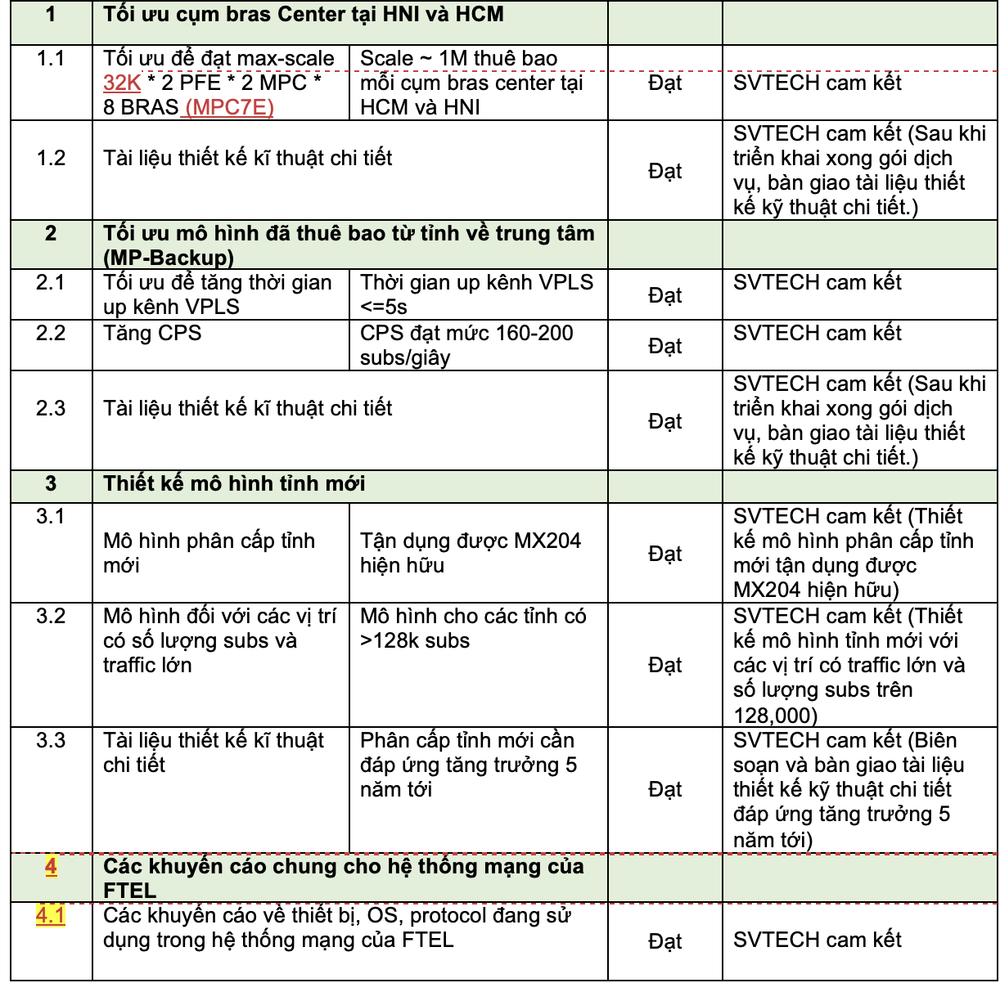
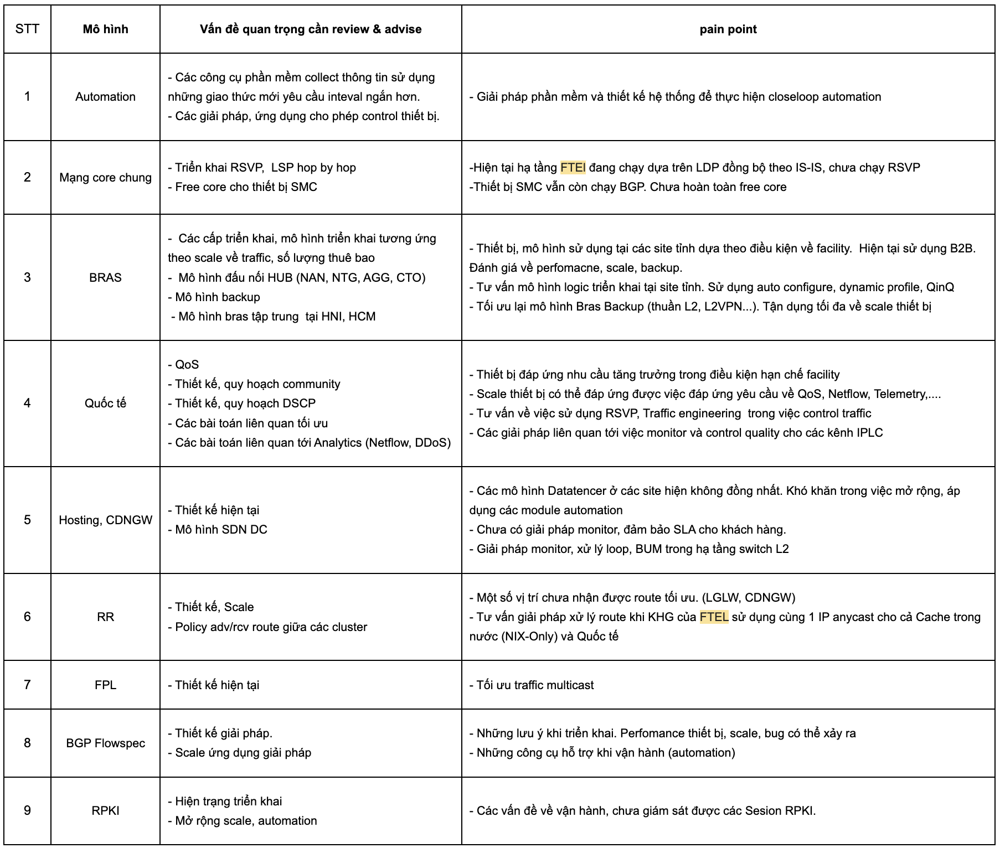

# Meeting FTEL 20230622

Khuyến nghị verion chỗ box MPC10 và SCBE3

```text
>>> Rà soát và cập nhật sau
```

Khuyến nghị verion chỗ box CGNAT: MS-SPC3 - (SCBE3 - linecard) >>> Chị Vân đang lab

```text
>>> Cần hỗ trợ sẽ báo lại
```

Khuyến nghị version các box ASBR

```text
>>> 17.3R3-Sx và 18.4R3-Sx thì sẽ lên lastest 18.4R3-S11 và 20.4R3-S7
```

```text
>>> Các PR là đang rà soát theo critical và số case liên quan mở ra nhiều (>= 5 case)
```

+ Với các box chạy ở quốc tế thì khó thực hiện sớm (19.3R1 mới cần nâng jfirmware 6.)

+ Trên quan điểm là các OS đang dùng cũng đang bị <<< lưu ý trong quá trình vận hành

Với QFX10K

```text
>>> Liên quan đến version:
```

+ 20.2-R3-S8  >>> nên lên Sx mới nhất

+ Bắt cặp là 20.4R3-S7 (mới nhất)

```text
>>> Case đang xử lý, hiện thông tin log chưa có thông tin, khó xác định được root cause
```

Tối ưu về log

Đồng bộ về tính năng, HW version

```text
>>> Các triển khai, bổ sung tính năng
```

```text
>>> Nâng cấp JunOS
```

Trao đổi nội dung công việc gói PS

Tài liệu LLD

```text
Test bằng máy đo - cho 1 box (128K)
```

Phạm vi: AGGSW và BNG - up link (phân bổ bị trí cho phù hợp với thay đổi mặt down link)

SVTECH thiết kế - FTEL triển khai

- --

Tại liệu LLD

```text
Test bằng máy đo - Thực hiện 3 lần lấy trung bình (up kênh và bắn 1 lượng thuê bao > do thời gian hội tụ)
```

Phạm vi: AGGSW và BNG - up link (phân bổ bị trí cho phù hợp với thay đổi mặt down link)

SVTECH thiết kế - FTEL triển khai

- --

VPLS

```text
>>> Áp dụng chung cho các tỉnh, thay thế cho mô hình hiện tại
```

độ hội tụ VPLS khai flap link <<< <5s

204 < 200cps: cps trên bras + học mac vpls

phạm từ dưới site tỉnh lênh site hub >>> nếu không đạt cps thì phối hợp chung



```text
>>> Mục 4 >>> mong muốn chạy PIIR cho các thiết bị biên (POP quóc tee (PE, GW)) (PIIR cho version 21.4-R3-S3
```


