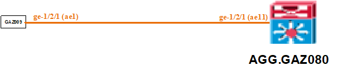
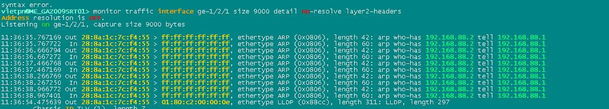
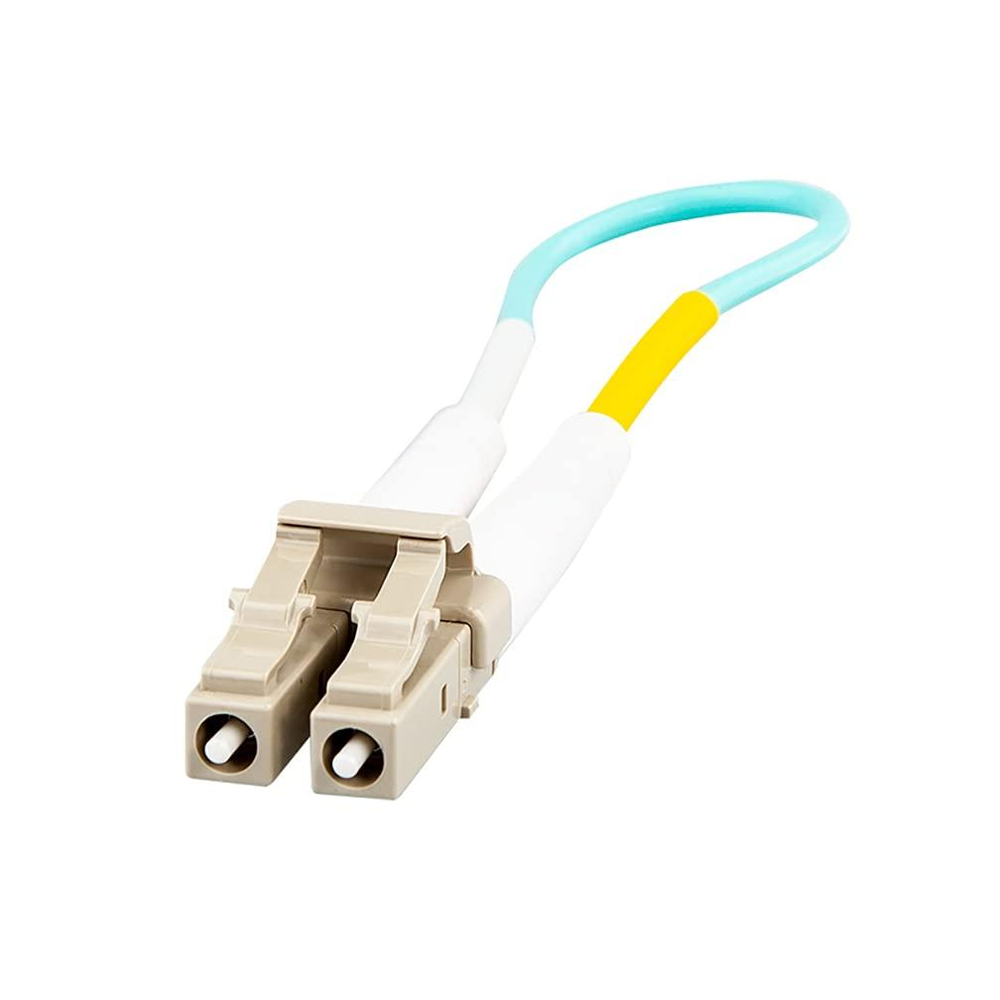

# SR-2021-1226-1945 - MVT/HĐ SLA 03/2020/ Hỗ trợ kiểm tra link kết nối giữa ME_AR03.GAZ080 và ME_GAZ009SRT01

- --

Phát sinh: Kết nối giữa ME\_AR03.GAZ080 và ME\_GAZ009SRT01 bị down (ae lacp down - interface vật lý vẫn up)

- --

Ghi nhận ban đầu

- Mô hình kết nối:



- Tình trạng kết nối:

- Port vật lý ge-1/2/1 trên cả 2 thiết bị đều ở trạng thái UP.

vietpn@ME\_GAZ009SRT01> show interfaces descriptions

Interface       Admin Link Description

……

ge-1/2/0        up    up   Connect to GAZ058 - Left ring

ge-1/2/1        up    up   Connect to AR.GAZ080 - Right ring

ae0             up    up   To GAZ058 AE1 - Right ring

ae1             up    down To AR03.GAZ080 AE21 - Right ring

- Port ae1 trên GAZ009SRT01 và ae11 trên AR03.GAZ080 đang bật LACP và ở  trạng thái DOWN.

[edit]

vietpn@ME\_GAZ009SRT01# run show lacp interfaces ae1

Dec 25 12:07:14

Aggregated interface: ae1

```text
LACP state:       Role   Exp   Def  Dist  Col  Syn  Aggr  Timeout  Activity
```
ge-1/2/1       Actor    No    No    No   No   No   Yes     Fast    Active

ge-1/2/1     Partner    No    No    No   No   No   Yes     Fast    Active

```text
LACP protocol:        Receive State  Transmit State          Mux State
```
ge-1/2/1                  Current   Fast periodic           Detached

- --

Các bước xử lý

- --

Kiểm tra sơ bộ

```text
IP MNS thiết bị 10.250.0.23
Show thông tin lldp neighbor trên mỗi thiết bị đều thấy thông tin neighbor là chính thiết bị đó.
```
vietpn@ME\_GAZ009SRT01# run show lldp neighbors

Dec 25 11:47:35

Local Interface    Parent Interface    Chassis Id          Port info          System Name

ge-1/0/3           -                   28:8a:1c:7c:f4:70   ge-1/0/3           ME\_GAZ009SRT01

ge-1/2/1           ae1                 28:8a:1c:7c:f4:70   ge-1/2/1           ME\_GAZ009SRT01

ge-1/2/0           ae0                 28:8a:1c:7d:a6:70   ge-1/2/1           ME\_GAZ058SRT01

ge-1/1/1           -                   28:8a:1c:7d:b5:70   ge-1/1/1           ME\_GAZ171SRT01

- Thực hiện disable  port vật lý ge-1/2/1 phía AR03.GAZ080 thì ở port ge-1/2/1 ở đầu GAZ009SRT01 vẫn ở trạng thái UP
- Ngắt port ge-1/2/1 trên GAZ009SRT01 khỏi ae1 và đặt ip test và monitor traffic trên port để theo dõi thì thấy có gói ARP từ GAZ009SRT01 gửi ra và nhận lại trên port ge-1/2/1



```text
>>> Nghi ngờ core quang bị hàn chưa đúng.
```


Thu thập các thông tin liên quan

```text
request support information | no-more | save /var/log/RSI\_ME\_AR03.GAZ080\_20211225
file archive source /var/log/\* destination /var/log/LOG\_ME\_AR03.GAZ080\_20211225
>>> Log session không có máy tính bị full ổ cứng
```
Hướng xử lý

- Hướng xử lý tiếp theo:

- Báo bộ phận xử lý cáp kiểm tra lại đấu nối core quang giữa ME\_AR03.GAZ080 và ME\_GAZ009SRT01.
- Hiện đang thực hiện disable cổng ae11 trên AR03.GAZ080. Sau khi hoàn tất kiểm tra core cáp thì sẽ kiểm tra và enable lại port này.

Kết quả sau khi xử lý cáp

- Xử lý ngày 27/12:

- Sau khi kiểm tra thì port ae11 trên ME\_AR03.GAZ080 và ae1 trên ME\_GAZ009SRT01 đã UP
- LLDP neighbor đã nhận đúng thiết bị đầu xa
- Anh LongNH đã vào kiểm tra và up lại kết nối lúc 7:28 (GMT+2) 27/12/2021

{master}

vietpn@ME\_AR03.GAZ080\_RE1> show interfaces descriptions

Interface       Admin Link Description

xe-0/0/0        up    up   TO\_AR.GAZ027\_xe-0/0/0

e1-0/0/2:50                2G\_INH010\_Link\_3

e1-0/0/2:51                2G\_INH010\_Link\_4

xe-0/1/0        up    up   Connect to PR01.GAZ020\_Xe-0/1/0

xe-1/0/0        up    up   ME\_AR02.GAZ185\_XE-1/0/0\_old-GAZ006

xe-1/1/0        up    up   ME\_AR02.INH080\_XE-0/0/0

ge-1/2/0        up    up   Connect to GAZ100SRT AE1 - Right ring

ge-1/2/1        up    up   Connect to GAZ009SRT AE1 - Right ring

ge-1/2/2        up    up   Connect to  GAZ080SRT AE1 - Right ring

ge-1/2/3        up    up   TO\_ME\_GAZ102SRT01

ge-1/2/4        up    up   TO\_GAZ016SRT02\_BACKUP\_UNDERGROUND

ge-1/2/9        down  down TO\_RRMP02\_GE-8/2/5\_Via\_SDH\_XDM300/I13/port8

ge-1/3/0        up    up   TO\_XDM300/I13/port4\_For\_Hub\_SWITCH

ge-1/3/1        up    up   TO\_GAZ092SRT01

ge-1/3/2        up    down TO\_SWITCH\_GAZ080\_P27\_shutdown

ge-1/3/5        up    up   TO GAZ088:Via\_TSS\_Cable

ae0             up    up   ME\_AR02.GAZ185\_AE1\_old-GAZ006

ae0.121         up    up   Interface run OSPF area 121-AR02.GAZ006-AR03.GAZ080

ae0.122         up    up   Interface run OSPF area 122-AR02.GAZ006-AR03.GAZ080

ae0.123         up    up   Interface run OSPF area 123-AR02.GAZ006-AR03.GAZ080

ae1             up    up   ME\_AR02.INH080\_XE-0/0/0

ae1.126         up    up   Interface run OSPF area 126-AR03.GAZ080-AR02.INH080

ae2             up    up   Connect to PR01.GAZ020-XE-1/0/0

ae4             up    up   To\_GAZ080SRT01

ae5             up    up   TO\_AR.GAZ027

ae5.0           up    up   ME\_AR.GAZ027\_AE0

ae5.127         up    up   Interface run OSPF area 127-AR03.GAZ080-AR.GAZ027

ae10            up    up   To GAZ100 AE1 - Left ring

ae11            up    up   To GAZ009 AE0 - Left ring

ae12            up    up   To GAZ080 AE1 - Right Ring

ae13            up    up   To\_GAZ092SRT01

ae15            up    up   TO\_ME\_GAZ102SRT01

ae16            up    up   TO\_ME\_GAZ016SRT02

{master}

vietpn@ME\_AR03.GAZ080\_RE1> show interfaces diagnostics optics ge-1/2/1

Physical interface: ge-1/2/1

Laser bias current                        :  19.368 mA

Laser output power                        :  0.2170 mW / -6.64 dBm

Module temperature                        :  32 degrees C / 90 degrees F

Module voltage                            :  3.2840 V

Laser receiver power                      :  0.1824 mW / -7.39 dBm

Laser bias current high alarm             :  Off

Laser bias current low alarm              :  Off

Laser bias current high warning           :  Off

Laser bias current low warning            :  Off

Laser output power high alarm             :  Off

Laser output power low alarm              :  Off

Laser output power high warning           :  Off

Laser output power low warning            :  Off

Module temperature high alarm             :  Off

Module temperature low alarm              :  Off

Module temperature high warning           :  Off

Module temperature low warning            :  Off

Module voltage high alarm                 :  Off

Module voltage low alarm                  :  Off

Module voltage high warning               :  Off

Module voltage low warning                :  Off

Laser rx power high alarm                 :  Off

Laser rx power low alarm                  :  Off

Laser rx power high warning               :  Off

Laser rx power low warning                :  Off

Laser bias current high alarm threshold   :  60.000 mA

Laser bias current low alarm threshold    :  3.000 mA

Laser bias current high warning threshold :  50.000 mA

Laser bias current low warning threshold  :  5.000 mA

Laser output power high alarm threshold   :  0.6300 mW / -2.01 dBm

Laser output power low alarm threshold    :  0.0890 mW / -10.51 dBm

Laser output power high warning threshold :  0.5010 mW / -3.00 dBm

Laser output power low warning threshold  :  0.1120 mW / -9.51 dBm

Module temperature high alarm threshold   :  75 degrees C / 167 degrees F

Module temperature low alarm threshold    :  -5 degrees C / 23 degrees F

Module temperature high warning threshold :  70 degrees C / 158 degrees F

Module temperature low warning threshold  :  0 degrees C / 32 degrees F

Module voltage high alarm threshold       :  3.600 V

Module voltage low alarm threshold        :  3.000 V

Module voltage high warning threshold     :  3.500 V

Module voltage low warning threshold      :  3.100 V

Laser rx power high alarm threshold       :  0.6309 mW / -2.00 dBm

Laser rx power low alarm threshold        :  0.0079 mW / -21.02 dBm

Laser rx power high warning threshold     :  0.5011 mW / -3.00 dBm

Laser rx power low warning threshold      :  0.0100 mW / -20.00 dBm

{master}

vietpn@ME\_AR03.GAZ080\_RE1> show lacp interfaces ae1

Aggregated interface: ae1

```text
LACP state:       Role   Exp   Def  Dist  Col  Syn  Aggr  Timeout  Activity
```
xe-1/1/0       Actor    No    No   Yes  Yes  Yes   Yes     Fast    Active

xe-1/1/0     Partner    No    No   Yes  Yes  Yes   Yes     Fast    Active

```text
LACP protocol:        Receive State  Transmit State          Mux State
```
xe-1/1/0                  Current   Fast periodic Collecting distributing

{master}

vietpn@ME\_AR03.GAZ080\_RE1> show lldp neighbors

Local Interface    Parent Interface    Chassis Id          Port info          System Name

ge-1/2/2           ae4                 1c:9c:8c:d3:66:70   ge-1/2/0           ME\_GAZ080SRT01

ge-1/2/1           ae11                28:8a:1c:7c:f4:70   ge-1/2/1           ME\_GAZ009SRT01

ge-1/2/0           ae10                28:8a:1c:7d:09:70   ge-1/2/1           ME\_GAZ100SRT01

ge-1/3/5           ae12                28:8a:1c:7d:3a:f0   ge-1/1/0           ME\_GAZ088SRT01

ge-1/2/3           ae15                3c:8c:93:b8:fc:f0   ge-1/2/0           ME\_GAZ102SRT01

ge-1/3/1           ae13                44:ec:ce:20:c1:70   ge-1/2/0           ME\_GAZ092SRT01

xe-1/1/0           ae1                 7c:e2:ca:be:17:cc   xe-0/0/0           ME\_AR02.INH080

xe-0/0/0           ae5                 b8:c2:53:18:37:c0   xe-0/0/0           AR.GAZ027

xe-0/1/0           ae2                 cc:e1:7f:08:e7:c0   xe-1/1/0           ME\_PR01.GAZ020\_RE0

xe-1/0/0           ae0                 cc:e1:7f:09:27:c0   xe-1/0/0           ME\_AR02.GAZ185\_RE0

ge-1/2/4           ae16                f4:bf:a8:a1:68:f0   ge-1/2/0           ME\_GAZ016SRT02

{master}

vietpn@ME\_AR03.GAZ080\_RE1> show log messages | match "ae11|ge-1/2/1"

Dec 27 07:17:05.822 2021  ME\_AR03.GAZ080\_RE1 mib2d[22376]: %DAEMON-4-SNMP\_TRAP\_LINK\_DOWN: ifIndex 524, ifAdminStatus up(1), ifOperStatus down(2), ifName ge-1/2/1

Dec 27 07:28:43.334 2021  ME\_AR03.GAZ080\_RE1 kernel: %KERN-4: lag\_bundlestate\_ifd\_change: bundle ae11 is now Up. uplinks 1 >= min\_links 1

Dec 27 07:28:43.405 2021  ME\_AR03.GAZ080\_RE1 rpd[15392]: %DAEMON-4-RPD\_RSVP\_NBRUP: RSVP neighbor 10.248.35.41 up on interface ae11.0 nbr-type Direct

{master}

vietpn@ME\_AR03.GAZ080\_RE1> show log interactive-commands | match "ae11|ge-1/2/1" | match "Dec 27 0"

Dec 27 06:39:09.932 2021  ME\_AR03.GAZ080\_RE1 mgd[30510]: UI\_CMDLINE\_READ\_LINE: User 'longnh', command 'delete interfaces ae11 disable '

Dec 27 06:39:27.322 2021  ME\_AR03.GAZ080\_RE1 mgd[30510]: UI\_CMDLINE\_READ\_LINE: User 'longnh', command 'run show interfaces diagnostics optics ge-1/2/1 '

Dec 27 06:41:18.898 2021  ME\_AR03.GAZ080\_RE1 mgd[30510]: UI\_CMDLINE\_READ\_LINE: User 'longnh', command 'run show interfaces diagnostics optics ge-1/2/1 '

Dec 27 06:41:39.299 2021  ME\_AR03.GAZ080\_RE1 mgd[30510]: UI\_CMDLINE\_READ\_LINE: User 'longnh', command 'show interfaces diagnostics optics ge-1/2/1 '

Dec 27 06:41:42.886 2021  ME\_AR03.GAZ080\_RE1 mgd[30510]: UI\_CMDLINE\_READ\_LINE: User 'longnh', command 'show interfaces diagnostics optics ge-1/2/1 '

Dec 27 06:41:43.747 2021  ME\_AR03.GAZ080\_RE1 mgd[30510]: UI\_CMDLINE\_READ\_LINE: User 'longnh', command 'show interfaces diagnostics optics ge-1/2/1 '

Dec 27 06:41:44.396 2021  ME\_AR03.GAZ080\_RE1 mgd[30510]: UI\_CMDLINE\_READ\_LINE: User 'longnh', command 'show interfaces diagnostics optics ge-1/2/1 '

Dec 27 06:41:45.004 2021  ME\_AR03.GAZ080\_RE1 mgd[30510]: UI\_CMDLINE\_READ\_LINE: User 'longnh', command 'show interfaces diagnostics optics ge-1/2/1 '

Dec 27 06:41:45.758 2021  ME\_AR03.GAZ080\_RE1 mgd[30510]: UI\_CMDLINE\_READ\_LINE: User 'longnh', command 'show interfaces diagnostics optics ge-1/2/1 '

Dec 27 06:41:47.599 2021  ME\_AR03.GAZ080\_RE1 mgd[30510]: UI\_CMDLINE\_READ\_LINE: User 'longnh', command 'show interfaces diagnostics optics ge-1/2/1 '

Dec 27 06:41:48.610 2021  ME\_AR03.GAZ080\_RE1 mgd[30510]: UI\_CMDLINE\_READ\_LINE: User 'longnh', command 'show interfaces diagnostics optics ge-1/2/1 '

Dec 27 06:41:49.301 2021  ME\_AR03.GAZ080\_RE1 mgd[30510]: UI\_CMDLINE\_READ\_LINE: User 'longnh', command 'show interfaces diagnostics optics ge-1/2/1 '

Dec 27 06:41:52.510 2021  ME\_AR03.GAZ080\_RE1 mgd[30510]: UI\_CMDLINE\_READ\_LINE: User 'longnh', command 'show interfaces diagnostics optics ge-1/2/1 '

Dec 27 06:41:55.150 2021  ME\_AR03.GAZ080\_RE1 mgd[30510]: UI\_CMDLINE\_READ\_LINE: User 'longnh', command 'show interfaces diagnostics optics ge-1/2/1 '

Dec 27 06:41:56.430 2021  ME\_AR03.GAZ080\_RE1 mgd[30510]: UI\_CMDLINE\_READ\_LINE: User 'longnh', command 'show interfaces diagnostics optics ge-1/2/1 '

Dec 27 06:41:59.845 2021  ME\_AR03.GAZ080\_RE1 mgd[30510]: UI\_CMDLINE\_READ\_LINE: User 'longnh', command 'show interfaces diagnostics optics ge-1/2/1 '

Dec 27 06:42:01.355 2021  ME\_AR03.GAZ080\_RE1 mgd[30510]: UI\_CMDLINE\_READ\_LINE: User 'longnh', command 'show interfaces diagnostics optics ge-1/2/1 '

Dec 27 06:43:48.641 2021  ME\_AR03.GAZ080\_RE1 mgd[30510]: UI\_CMDLINE\_READ\_LINE: User 'longnh', command 'run show interfaces diagnostics optics ge-1/2/1 '

Dec 27 06:43:52.289 2021  ME\_AR03.GAZ080\_RE1 mgd[30510]: UI\_CMDLINE\_READ\_LINE: User 'longnh', command 'run show interfaces diagnostics optics ge-1/2/1 '

Dec 27 06:44:07.005 2021  ME\_AR03.GAZ080\_RE1 mgd[30510]: UI\_CMDLINE\_READ\_LINE: User 'longnh', command 'run show interfaces diagnostics optics ge-1/2/1 '

Dec 27 06:44:11.489 2021  ME\_AR03.GAZ080\_RE1 mgd[30510]: UI\_CMDLINE\_READ\_LINE: User 'longnh', command 'run show interfaces diagnostics optics ge-1/2/1 '

Dec 27 06:44:13.992 2021  ME\_AR03.GAZ080\_RE1 mgd[30510]: UI\_CMDLINE\_READ\_LINE: User 'longnh', command 'run show interfaces diagnostics optics ge-1/2/1 '

Dec 27 06:47:33.331 2021  ME\_AR03.GAZ080\_RE1 mgd[30746]: UI\_CMDLINE\_READ\_LINE: User 'longnh', command 'run show interfaces diagnostics optics ge-1/2/1 '

Dec 27 07:19:42.435 2021  ME\_AR03.GAZ080\_RE1 mgd[30746]: UI\_CMDLINE\_READ\_LINE: User 'longnh', command 'set interfaces ge-1/2/1 disable '

Dec 27 07:20:02.791 2021  ME\_AR03.GAZ080\_RE1 mgd[30746]: UI\_CMDLINE\_READ\_LINE: User 'longnh', command 'run show interfaces diagnostics optics ge-1/2/1 '

Dec 27 07:28:43.931 2021  ME\_AR03.GAZ080\_RE1 mgd[31417]: UI\_JUNOSCRIPT\_CMD: User 'root' used JUNOScript client to run command 'get-interface-information interface-name=ae11'

Dec 27 07:30:21.841 2021  ME\_AR03.GAZ080\_RE1 mgd[30746]: UI\_CMDLINE\_READ\_LINE: User 'longnh', command 'show interfaces ae11 '

Dec 27 07:30:41.419 2021  ME\_AR03.GAZ080\_RE1 mgd[30746]: UI\_CMDLINE\_READ\_LINE: User 'longnh', command 'show interfaces ae11 '

Dec 27 07:30:48.245 2021  ME\_AR03.GAZ080\_RE1 mgd[30746]: UI\_CMDLINE\_READ\_LINE: User 'longnh', command 'show interfaces ae11 '

Dec 27 07:33:38.468 2021  ME\_AR03.GAZ080\_RE1 mgd[20015]: UI\_CMDLINE\_READ\_LINE: User 'antoniosd', command 'show interfaces diagnostics optics ge-1/2/1 '

Dec 27 07:33:43.958 2021  ME\_AR03.GAZ080\_RE1 mgd[31417]: UI\_JUNOSCRIPT\_CMD: User 'root' used JUNOScript client to run command 'get-interface-information interface-name=ae11'

Dec 27 07:33:44.301 2021  ME\_AR03.GAZ080\_RE1 mgd[31417]: UI\_CMDLINE\_READ\_LINE: User 'root', command 'rpc get-ospf-neighbor-information area 0.0.0.0 area get-ospf-neighbor-information rpc rpc get-interface-information interface-name ae11 interface-name get-interface-information rpc rpc get-interface-information interface-name ae11 interface-name get-interface-information rpc rpc command show interface lo0 terse '

Dec 27 07:33:49.780 2021  ME\_AR03.GAZ080\_RE1 mgd[20015]: UI\_CMDLINE\_READ\_LINE: User 'antoniosd', command 'show interfaces diagnostics optics ge-1/2/1 '

vietpn@ME\_GAZ009SRT01> show interfaces ge-1/2/1

Physical interface: ge-1/2/1, Enabled, Physical link is Up

Interface index: 167, SNMP ifIndex: 526

Description: Connect to AR.GAZ080 - Right ring

```text
Link-level type: Ethernet, Media type: Fiber, MTU: 9000, LAN-PHY mode, Speed: 1000mbps, BPDU Error: None, Loop Detect PDU Error: None,
Ethernet-Switching Error: None, MAC-REWRITE Error: None, Loopback: Disabled, Source filtering: Disabled, Flow control: Disabled,
```
Auto-negotiation: Enabled, Remote fault: Online

Device flags   : Present Running

Interface flags: SNMP-Traps Internal: 0x0

Link flags     : None

CoS queues     : 8 supported, 8 maximum usable queues

Current address: 28:8a:1c:7c:f4:71, Hardware address: 28:8a:1c:7c:f4:55

Last flapped   : 2021-12-27 07:28:40 CAT (02:22:37 ago)

```text
Input rate     : 81450096 bps (18979 pps)
Output rate    : 33000944 bps (24294 pps)
```
Active alarms  : None

Active defects : None

PCS statistics                      Seconds

Bit errors                             0

Errored blocks                         0

Ethernet FEC statistics              Errors

FEC Corrected Errors                    0

FEC Uncorrected Errors                  0

```text
FEC Corrected Errors Rate               0
FEC Uncorrected Errors Rate             0
```
Interface transmit statistics: Disabled

Logical interface ge-1/2/1.0 (Index 369) (SNMP ifIndex 586)

Flags: Up SNMP-Traps 0x0 Encapsulation: ENET2

Input packets : 169739

Output packets: 78124

Protocol aenet, AE bundle: ae1.0

vietpn@ME\_GAZ009SRT01> show interfaces descriptions

Interface       Admin Link Description

e1-0/0/0        up    up   BTS\_2G\_GAZ009\_Link\_0

e1-0/0/1        up    down BTS\_2G\_GAZ009\_Link\_1

ge-1/0/0        up    up   NodeB\_UGAZ009

ge-1/0/3        up    up   PTP for 2G

ge-1/1/0        up    up   LGAZ009

ge-1/1/0.20     up    up   LGAZ009\_CPUP

ge-1/1/0.21     up    up   LGAZ009\_CPUP\_OAM

ge-1/1/1        up    up   TO GAZ171 Via:TSS\_Backup

ge-1/1/2        up    down FTTH\_3909010116364\_Cruz\_Vermelha\_De\_Mocambique\_Delegacao\_De\_Gaza

ge-1/1/2.1010   up    down FTTH

ge-1/1/3        up    up   SWT\_GAZ009\_33.206;

ge-1/1/3.1010   up    up   FTTH

ge-1/1/3.1062   up    up   OAM

ge-1/1/3.1163   up    up   PLC\_FIPAG\_GAZ

ge-1/1/3.1286   up    up   PLC\_DCPOWER\_MONITORING

ge-1/1/3.2644   up    up   L3LL\_RED\_CROSS

ge-1/1/3.2645   up    up   L3LL\_STAE

ge-1/2/0        up    up   Connect to GAZ058 - Left ring

ge-1/2/1        up    up   Connect to AR.GAZ080 - Right ring

ae0             up    up   To GAZ058 AE1 - Right ring

ae1             up    up   To AR03.GAZ080 AE21 - Right ring

vietpn@ME\_GAZ009SRT01> show lldp neighbors

Local Interface    Parent Interface    Chassis Id          Port info          System Name

ge-1/0/3           -                   28:8a:1c:7c:f4:70   ge-1/0/3           ME\_GAZ009SRT01

ge-1/2/0           ae0                 28:8a:1c:7d:a6:70   ge-1/2/1           ME\_GAZ058SRT01

ge-1/1/1           -                   28:8a:1c:7d:b5:70   ge-1/1/1           ME\_GAZ171SRT01

ge-1/2/1           ae1                 cc:e1:7f:08:ef:c0   ge-1/2/1           ME\_AR03.GAZ080\_RE1

vietpn@ME\_GAZ009SRT01> show interfaces diagnostics optics ge-1/2/1

Physical interface: ge-1/2/1

Laser bias current                        :  35.000 mA

Laser output power                        :  1.3440 mW / 1.28 dBm

Module temperature                        :  53 degrees C / 127 degrees F

Module voltage                            :  3.2040 V

Laser receiver power                      :  0.0330 mW / -14.81 dBm

Laser bias current high alarm             :  Off

Laser bias current low alarm              :  Off

Laser bias current high warning           :  Off

Laser bias current low warning            :  Off

Laser output power high alarm             :  Off

Laser output power low alarm              :  Off

Laser output power high warning           :  Off

Laser output power low warning            :  Off

Module temperature high alarm             :  Off

Module temperature low alarm              :  Off

Module temperature high warning           :  Off

Module temperature low warning            :  Off

Module voltage high alarm                 :  Off

Module voltage low alarm                  :  Off

Module voltage high warning               :  Off

Module voltage low warning                :  Off

Laser rx power high alarm                 :  Off

Laser rx power low alarm                  :  Off

Laser rx power high warning               :  Off

Laser rx power low warning                :  Off

Laser bias current high alarm threshold   :  85.000 mA

Laser bias current low alarm threshold    :  5.000 mA

Laser bias current high warning threshold :  80.000 mA

Laser bias current low warning threshold  :  7.000 mA

Laser output power high alarm threshold   :  3.1620 mW / 5.00 dBm

Laser output power low alarm threshold    :  0.4460 mW / -3.51 dBm

Laser output power high warning threshold :  2.5110 mW / 4.00 dBm

Laser output power low warning threshold  :  0.6300 mW / -2.01 dBm

Module temperature high alarm threshold   :  90 degrees C / 194 degrees F

Module temperature low alarm threshold    :  -40 degrees C / -40 degrees F

Module temperature high warning threshold :  85 degrees C / 185 degrees F

Module temperature low warning threshold  :  -35 degrees C / -31 degrees F

Module voltage high alarm threshold       :  3.799 V

Module voltage low alarm threshold        :  2.799 V

Module voltage high warning threshold     :  3.700 V

Module voltage low warning threshold      :  2.900 V

Laser rx power high alarm threshold       :  1.2589 mW / 1.00 dBm

Laser rx power low alarm threshold        :  0.0039 mW / -24.09 dBm

Laser rx power high warning threshold     :  1.0000 mW / 0.00 dBm

Laser rx power low warning threshold      :  0.0050 mW / -23.01 dBm

vietpn@ME\_GAZ009SRT01> show lacp interfaces ae1

Aggregated interface: ae1

```text
LACP state:       Role   Exp   Def  Dist  Col  Syn  Aggr  Timeout  Activity
```
ge-1/2/1       Actor    No    No   Yes  Yes  Yes   Yes     Fast    Active

ge-1/2/1     Partner    No    No   Yes  Yes  Yes   Yes     Fast    Active

```text
LACP protocol:        Receive State  Transmit State          Mux State
```
ge-1/2/1                  Current   Fast periodic Collecting distributing
