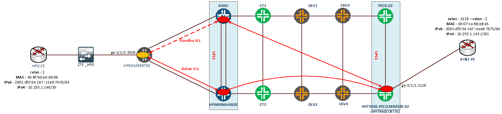
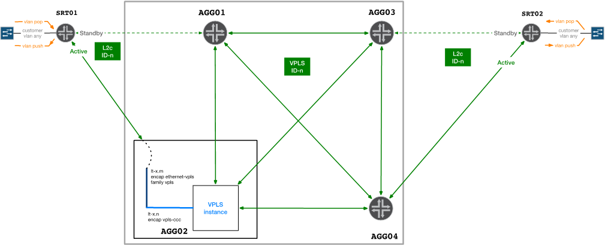
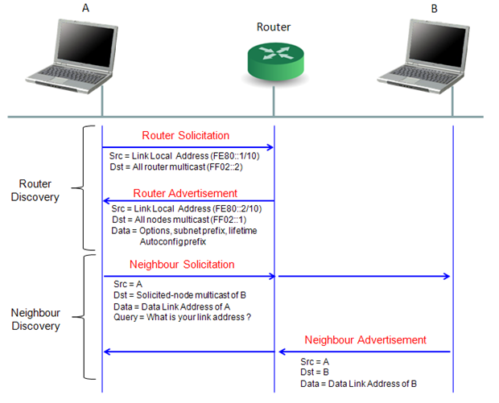
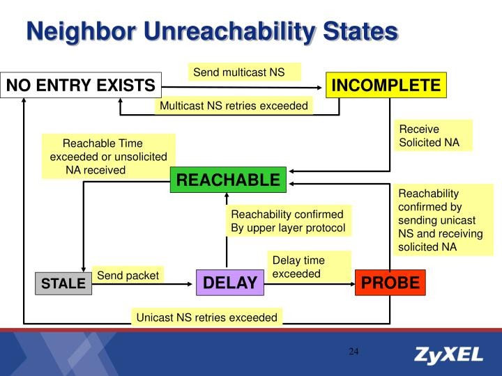

# SR-2022-0106-0928-IPv6 ping VPLS

HPG0149ASW02#show running-config interface gei\_1/24

Building configuration...

!

interface gei\_1/24

out\_index 31

description h031\_mwqt\_bridgestonevn1

no negotiation auto

optical-info monitor enable

speed 100

jumbo-frame enable

switchport access vlan 3506

switchport qinq customer

```text
traffic-limit rate-limit 7200 bucket-size 1000 in
```

```text
traffic-shape data-rate 7200 burst-size 1000
```

!

end

HPG0149ASW02#show mac vlan 3506

Total MAC address : 4

Max MAC num      : 757

Max MAC num time  : 2021-06-24 16:22:46

MAC start time    : 2020-09-11 11:24:05

Flags: vid--VLAN id,stc--static, per--permanent, toS--to-static,wtn--is written,

srF --source filter,dsF --destination filter, time --day:hour:min:sec

Frm --mac from where:0,drv; 1,config; 2,VPN; 3,802.1X; 4,micro;5,dhcp

MAC\_Address    vid  vpn        port  per stc toS wtn srF dsF Frm    Time

- -------------------------------------------------------------------------

408f.9ded.d691  3506    0      gei\_1/24 0  0  0  0  0  0  0    0:20:00:36

408f.9ded.d686  3506    0      gei\_1/24 0  0  0  0  0  0  0    0:20:00:50

408f.9ded.d6cf  3506    0      gei\_1/24 0  0  0  0  0  0  0    0:20:01:03

d007.ca86.e8a5  3506    0      gei\_1/1 0  0  0  0  0  0  0    16:23:35:03

pmgatepro@HHT9602.PECD.MX2020.02\_RE0> show vpls mac-table instance mwqt\_bridgestonevn

MAC flags      (S -static MAC, D -dynamic MAC, L -locally learned, C -Control MAC

O -OVSDB MAC, SE -Statistics enabled, NM -Non configured MAC, R -Remote PE MAC, P -Pinned MAC)

Routing instance : mwqt\_bridgestonevn

Bridging domain : \_mwqt\_bridgestonevn\_, VLAN : NA

MAC                MAC      Logical          NH    MAC        active

address            flags    interface        Index  property    source

```text
40:8f:9d:ed:d6:86  D        lsi.1050198
```

```text
d0:07:ca:86:e8:a5  D        ge-3/1/1.3128
```

```text
set firewall family vpls filter 6M\_VPLS interface-specific
```

```text
set firewall family vpls filter 6M\_VPLS term 1 then policer 6M
```

```text
set firewall policer 6M if-exceeding bandwidth-limit 6m
```

```text
set firewall policer 6M if-exceeding burst-size-limit 225k
```

```text
set firewall policer 6M then discard
```

HHT9602.PECD.MX2020.02\_RE0> show configuration | display set | match ge-3/1/1.3128

```text
set interfaces ge-3/1/1 unit 3128 description t008\_mwqt\_bridgestonevn
```

```text
set interfaces ge-3/1/1 unit 3128 encapsulation vlan-vpls
```

```text
set interfaces ge-3/1/1 unit 3128 vlan-id 3128
```

```text
set interfaces ge-3/1/1 unit 3128 input-vlan-map pop
```

```text
set interfaces ge-3/1/1 unit 3128 output-vlan-map push
```

```text
set interfaces ge-3/1/1 unit 3128 family vpls filter input 6M\_VPLS
```

```text
set interfaces ge-3/1/1 unit 3128 family vpls filter output 6M\_VPLS
```

```text
set routing-instances mwqt\_bridgestonevn instance-type vpls
```

```text
set routing-instances mwqt\_bridgestonevn interface ge-3/1/1.3128
```

```text
set routing-instances mwqt\_bridgestonevn route-distinguisher 7552:63508
```

```text
set routing-instances mwqt\_bridgestonevn l2vpn-id l2vpn-id:7552:63508
```

```text
set routing-instances mwqt\_bridgestonevn vrf-target target:7552:63508
```

```text
set routing-instances mwqt\_bridgestonevn protocols vpls encapsulation-type ethernet
```

```text
set routing-instances mwqt\_bridgestonevn protocols vpls no-tunnel-services
```

```text
set routing-instances mwqt\_bridgestonevn protocols vpls mtu 9000
```

AGG

mwqt\_bridgestonevn {

instance-type vpls;

interface lt-2/1/0.1039;

interface lt-4/0/0.1037;

route-distinguisher 7552:63508;

l2vpn-id l2vpn-id:7552:63508;

vrf-target target:7552:63508;

protocols {

vpls {

encapsulation-type ethernet;

no-tunnel-services;

mtu 9000;

}

}

}

DT

HHT9602.PECD.MX2020.02 (HHT9602CRT35)

DT

```text
ROLLBACK
```

```text
show configuration interfaces ge-3/3/5
```

```text
show configuration interfaces ge-3/3/5
```

```text
show interfaces ge-3/3/5
```

```text
show interfaces ge-3/3/5
```

```text
show configuration interfaces ge-3/3/5.3927 | display set
```

```text
show configuration routing-instances mwqt\_vietnamhs | display set
```

```text
show configuration routing-instances mwqt\_vietnamhs | display set
```

```text
show vpls connections instance mwqt\_vietnamhs
```

```text
show vpls connections instance mwqt\_vietnamhs
```

edit private

edit private

```text
delete routing-instances mwqt\_vietnamhs interface ge-3/3/5.3927
```

```text
delete routing-instances mwqt\_vietnamhs interface ge-3/3/5.0
```

```text
delete interfaces ge-3/3/5 unit 3927
```

```text
delete interfaces ge-3/3/5 unit 0
```

```text
delete interfaces ge-3/3/5 flexible-vlan-tagging
```

```text
delete interfaces ge-3/3/5 encapsulation ethernet-vpls
```

```text
delete interfaces ge-3/3/5 encapsulation flexible-ethernet-services
```

```text
set interfaces ge-3/3/5 flexible-vlan-tagging
```

```text
set interfaces ge-3/3/5 encapsulation ethernet-vpls
```

```text
set interfaces ge-3/3/5 encapsulation flexible-ethernet-services
```

```text
set interfaces ge-3/3/5 unit 3927 description t008\_mwqt\_vietnamhs
```

```text
set interfaces ge-3/3/5 unit 3927 encapsulation vlan-vpls
```

```text
set interfaces ge-3/3/5 unit 0 description t008\_mwqt\_vietnamhs
```

```text
set interfaces ge-3/3/5 unit 3927 vlan-id 3927
```

```text
set interfaces ge-3/3/5 unit 0 family vpls filter input 100M\_VPLS
```

```text
set interfaces ge-3/3/5 unit 3927 input-vlan-map pop
```

```text
set interfaces ge-3/3/5 unit 0 family vpls filter output 100M\_VPLS
```

```text
set interfaces ge-3/3/5 unit 3927 output-vlan-map push
```

```text
set interfaces ge-3/3/5 unit 3927 family vpls filter input 100M\_VPLS
```

```text
set interfaces ge-3/3/5 unit 3927 family vpls filter output 100M\_VPLS
```

```text
set routing-instances mwqt\_vietnamhs interface ge-3/3/5.0
```

```text
set routing-instances mwqt\_vietnamhs interface ge-3/3/5.3927
```

```text
commit check
```

```text
commit check
```

```text
show | compare
```

```text
show | compare
```

```text
commit
```

```text
commit
```

```text
show configuration interfaces ge-3/3/5.0 | display set
```

```text
show configuration interfaces ge-3/3/5
```

```text
show configuration interfaces ge-3/3/5
```

```text
show configuration interfaces ge-3/3/5.3927 | display set
```

```text
show interfaces ge-3/3/5
```

```text
show configuration routing-instances mwqt\_vietnamhs | display set
```

```text
show configuration routing-instances mwqt\_vietnamhs | display set
```

```text
show vpls connections instance mwqt\_vietnamhs
```

```text
show vpls connections instance mwqt\_vietnamhs
```

THực hiện capture traffic ở đầu PECD và đầu SRT: ghi nhận có packet vào interface đấu KH trên PE, có packet out ra cổng đấu KH trên SRT nhưng không có packet nhận trên cổng đấu KH trên SRT



NOTE:

Có thể thực hiện áp counter vào interface lt-\* tại vị trí AGG để counter và syslog  packet



Sau khi đổi switch ở phân đoạn SRT <-> HPG CE thì kênh đã ping thông IPv6 -> lỗi do switch HGP-ZTE

|  |  |
| --- | --- |
| **HHT9602.PECD.MX2020.02 (HHT9602CRT35)** | |
| **DT** | **ROLLBACK** |
| show configuration interfaces ge-3/3/5 | show configuration interfaces ge-3/3/5 |
| show interfaces ge-3/3/5 | show interfaces ge-3/3/5 |
| show configuration interfaces ge-3/3/5.3927 | display set | show configuration routing-instances mwqt\_vietnamhs | display set |
| show configuration routing-instances mwqt\_vietnamhs | display set | show vpls connections instance mwqt\_vietnamhs |
| show vpls connections instance mwqt\_vietnamhs |  |
|  |  |
| edit private | **edit private** |
|  |  |
| **delete** routing-instances mwqt\_vietnamhs interface ge-3/3/5.3927 | delete routing-instances mwqt\_vietnamhs interface ge-3/3/5.0 |
| **delete** interfaces ge-3/3/5 unit 3927 | delete interfaces ge-3/3/5 unit 0 |
|  |  |
| **delete** interfaces ge-3/3/5 flexible-vlan-tagging | delete interfaces ge-3/3/5 encapsulation ethernet-vpls |
| **delete** interfaces ge-3/3/5 encapsulation flexible-ethernet-services | set interfaces ge-3/3/5 flexible-vlan-tagging |
| set interfaces ge-3/3/5 encapsulation ethernet-vpls | set interfaces ge-3/3/5 encapsulation flexible-ethernet-services |
|  |  |
|  | set interfaces ge-3/3/5 unit 3927 description t008\_mwqt\_vietnamhs |
|  | set interfaces ge-3/3/5 unit 3927 encapsulation vlan-vpls |
| set interfaces ge-3/3/5 unit 0 description t008\_mwqt\_vietnamhs | set interfaces ge-3/3/5 unit 3927 vlan-id 3927 |
| set interfaces ge-3/3/5 unit 0 family vpls filter input 100M\_VPLS | set interfaces ge-3/3/5 unit 3927 input-vlan-map pop |
| set interfaces ge-3/3/5 unit 0 family vpls filter output 100M\_VPLS | set interfaces ge-3/3/5 unit 3927 output-vlan-map push |
|  | set interfaces ge-3/3/5 unit 3927 family vpls filter input 100M\_VPLS |
|  | set interfaces ge-3/3/5 unit 3927 family vpls filter output 100M\_VPLS |
|  |  |
| set routing-instances mwqt\_vietnamhs interface ge-3/3/5.0 | set routing-instances mwqt\_vietnamhs interface ge-3/3/5.3927 |
|  |  |
| commit check | commit check |
| show | compare | show | compare |
| commit | commit |
| show configuration interfaces ge-3/3/5.0 | display set | show configuration interfaces ge-3/3/5 |
| show configuration interfaces ge-3/3/5 | show configuration interfaces ge-3/3/5.3927 | display set |
| show interfaces ge-3/3/5 | show configuration routing-instances mwqt\_vietnamhs | display set |
| show configuration routing-instances mwqt\_vietnamhs | display set | show vpls connections instance mwqt\_vietnamhs |
| show vpls connections instance mwqt\_vietnamhs |  |

```text
set firewall family vpls filter count\_vpls\_icmp6 interface-specific
```

```text
set firewall family vpls filter count\_vpls\_icmp6 term 1 from ipv6-next-header icmp6
```

```text
set firewall family vpls filter count\_vpls\_icmp6 term 1 then count icmp6\_packets
```

```text
set firewall family vpls filter count\_vpls\_icmp6 term 1 then accept
```

```text
set firewall family vpls filter count\_vpls\_icmp6 term FINAL then count FINAL
```

```text
set firewall family vpls filter count\_vpls\_icmp6 term FINAL then accept
```

```text
set interfaces ge-3/1/1 unit 3128 family vpls filter input count\_vpls\_icmp6
```

```text
set interfaces ge-3/1/1 unit 3128 family vpls filter output count\_vpls\_icmp6
```

##### Show output

```text
show configuration interfaces ge-3/1/1.3128 | display set
```

```text
show interfaces ge-3/1/1.3128
```

```text
show configuration routing-instances mwqt\_bridgestonevn | display set
```

```text
show vpls connections instance mwqt\_bridgestonevn
```

##### Lấy baseline các counter

```text
show firewall filter count\_vpls\_icmp6-ge-3/1/1.3128-o
```

```text
show firewall filter count\_vpls\_icmp6-ge-3/1/1.3128-i
```

##### thực hiện ping IPv6 10 gói từ site HPG sang site Quốc tế

```text
show firewall filter count\_vpls\_icmp6-ge-3/1/1.3128-o
```

```text
show firewall filter count\_vpls\_icmp6-ge-3/1/1.3128-i
```

##### thực hiện ping IPv6 10 gói từ site Quốc tế về site HPG

```text
show firewall filter count\_vpls\_icmp6-ge-3/1/1.3128-o
```

```text
show firewall filter count\_vpls\_icmp6-ge-3/1/1.3128-i
```

##### Rollback

```text
set interfaces ge-3/1/1 unit 3128 family vpls filter input 6M\_VPLS
```

```text
set interfaces ge-3/1/1 unit 3128 family vpls filter output 6M\_VPLS
```

```text
delete firewall family vpls filter count\_vpls\_icmp6
```


