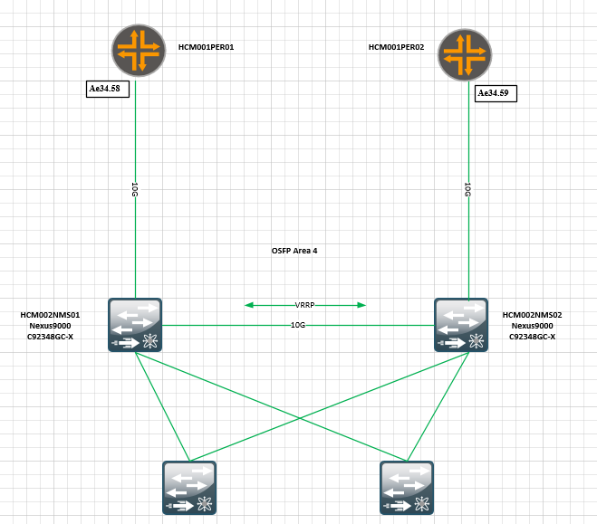

# SR-2022-0627-1622 - CMC/HĐ 050522/Hỗ trợ kiểm tra OSPF bị treo trạng thái Exchange khi flap link vật lý

- --

Phát sinh: OSPF bị treo trạng thái Exchange khi flap link vật lý

- --

Ghi nhận ban đầu

- Thiết bị HCM001PER02\_RE0 (MX960) ghi nhận tình trạng OSPF neighbor với thiết bị HCM002NMS02 (Cisco Nexus9000)bị treo ở trạng thái Exchange khi bị flap link vật lý
- Để up lại OSPF neighbor thì cần xoá đi và cấu hình lại OSPF trên thiết bị HCM002NMS02



Thu thập thông tin:

- SVTECH đã phối hợp để giải lập lại tình huống lỗi bằng cách down kết nối giữa HCM001PER02\_RE0 (Juniper MX960) - HCM002NMS02 (Cisco Nexus9000) thì lỗi lặp lại.
- Trong quá trình giả lập lại lỗi thì đã thực hiện bật traceoption protocol OSPF, bắt gói tin trên thiết bị HCM001PER02\_RE0 để
- Kết quả ghi nhận được sau khi thiết bị HCM001PER02\_RE0 gửi bản tin LS-Update cho HCM002NMS02 thì không nhận lại được bản tin LS-Ack ->> điều này dẫn đến trạng thái OSPF bị treo ở Exchange.

Line 498: 11:27:55.962770  In IP (tos 0xc0, ttl   1, id 35663, offset 0, flags [none], proto: OSPF (89), length: 116) 172.20.254.14 > 172.20.254.13: OSPFv2, LS-Request, length 96

Line 500:           Advertising Router: 172.20.251.2, Summary LSA (3), LSA-ID: 172.20.254.16

Line 501:           Advertising Router: 172.20.251.2, Summary LSA (3), LSA-ID: 172.28.34.129

Line 502:           Advertising Router: 172.20.251.2, Summary LSA (3), LSA-ID: 172.28.34.130

Line 503:           Advertising Router: 172.20.251.2, External LSA (5), LSA-ID: 10.196.1.0

Line 504:           Advertising Router: 172.20.251.2, External LSA (5), LSA-ID: 10.196.0.64

Line 505:           Advertising Router: 172.20.251.2, External LSA (5), LSA-ID: 10.10.82.0

Line 506: 11:27:55.997267 Out IP (tos 0xc0, ttl   1, id 62473, offset 0, flags [none], proto: OSPF (89), length: 240) 172.20.254.13 > 224.0.0.5: OSPFv2, LS-Update, length 220

Line 510:             Summary LSA (3), LSA-ID: 172.20.254.16

Line 516:             Summary LSA (3), LSA-ID: 172.28.34.129

Line 522:             Summary LSA (3), LSA-ID: 172.28.34.130

Line 528:             External LSA (5), LSA-ID: 10.196.1.0

Line 534:             External LSA (5), LSA-ID: 10.196.0.64

Line 540:             External LSA (5), LSA-ID: 10.10.82.0

Line 550: 11:27:58.839784  In IP (tos 0xc0, ttl   1, id 35667, offset 0, flags [none], proto: OSPF (89), length: 84) 172.20.254.14 > 172.20.254.13: OSPFv2, LS-Update, length 64

Line 554:             External LSA (5), LSA-ID: 172.20.228.64

Line 558: 11:27:58.841080 Out IP (tos 0xc0, ttl   1, id 1283, offset 0, flags [none], proto: OSPF (89), length: 64) 172.20.254.13 > 224.0.0.5: OSPFv2, LS-Ack, length 44

Line 561:             External LSA (5), LSA-ID: 172.20.228.64

Line 587: 11:28:06.216475 Out IP (tos 0xc0, ttl   1, id 12299, offset 0, flags [none], proto: OSPF (89), length: 84) 172.20.254.13 > 224.0.0.5: OSPFv2, LS-Update, length 64

Line 591:             External LSA (5), LSA-ID: 172.20.249.134

Line 604: 11:28:07.799596  In IP (tos 0xc0, ttl   1, id 35675, offset 0, flags [none], proto: OSPF (89), length: 84) 172.20.254.14 > 172.20.254.13: OSPFv2, LS-Update, length 64

Line 608:             External LSA (5), LSA-ID: 172.20.249.133

Line 612: 11:28:07.800960 Out IP (tos 0xc0, ttl   1, id 14558, offset 0, flags [none], proto: OSPF (89), length: 64) 172.20.254.13 > 224.0.0.5: OSPFv2, LS-Ack, length 44

Line 615:             External LSA (5), LSA-ID: 172.20.249.133

Line 617: 11:28:08.509878  In IP (tos 0xc0, ttl   1, id 35676, offset 0, flags [none], proto: OSPF (89), length: 64) 172.20.254.14 > 172.20.254.13: OSPFv2, LS-Ack, length 44

Line 620:             External LSA (5), LSA-ID: 172.20.249.134

Line 643: 11:28:15.066609 Out IP (tos 0xc0, ttl   1, id 26806, offset 0, flags [none], proto: OSPF (89), length: 84) 172.20.254.13 > 224.0.0.5: OSPFv2, LS-Update, length 64

Line 647:             External LSA (5), LSA-ID: 172.20.234.48

Line 651: 11:28:16.746313  In IP (tos 0xc0, ttl   1, id 35681, offset 0, flags [none], proto: OSPF (89), length: 84) 172.20.254.14 > 172.20.254.13: OSPFv2, LS-Update, length 64

Line 655:             External LSA (5), LSA-ID: 172.20.249.132

- Thực hiện ping để kiểm tra MTU giữa 2 thiết bị thì ghi nhận MTU lớn nhất có thể gửi thành công giữa 2 thiết bị là 1644 Bytes (IP header 20Bytes + ICMP header 8Bytes + payload 1616Bytes).

{master}

linh.ntd@HCM001PER02\_RE0> ping routing-instance NMS 172.20.254.14 source 172.20.254.13 size 1617 do-not-fragment

```text
PING 172.20.254.14 (172.20.254.14): 1617 data bytes
```
^C

- -- 172.20.254.14 ping statistics ---

```text
2 packets transmitted, 0 packets received, 100% packet loss
```
{master}

linh.ntd@HCM001PER02\_RE0> ping routing-instance NMS 172.20.254.14 source 172.20.254.13 size 1616 do-not-fragment

```text
PING 172.20.254.14 (172.20.254.14): 1616 data bytes
```
1624 bytes from 172.20.254.14: icmp\_seq=0 ttl=255 time=2.053 ms

1624 bytes from 172.20.254.14: icmp\_seq=1 ttl=255 time=1.900 ms

1624 bytes from 172.20.254.14: icmp\_seq=2 ttl=255 time=2.029 ms

1624 bytes from 172.20.254.14: icmp\_seq=3 ttl=255 time=2.073 ms

1624 bytes from 172.20.254.14: icmp\_seq=4 ttl=255 time=2.189 ms

^C

- -- 172.20.254.14 ping statistics ---

```text
5 packets transmitted, 5 packets received, 0% packet loss
```
round-trip min/avg/max/stddev = 1.900/2.049/2.189/0.093 ms

- Khi ping gói tin lớp hơn MTU 1644 thì ghi nhận gói tin đã gởi ra khỏi cổng thiết bị Juniper MX960 nhưng không nhận được lại phản hồi.

Line 16675: 12:00:37.110775 Out IP truncated-ip - 7560 bytes missing! (tos 0xc0, ttl  64, id 38352, offset 0, flags [DF], proto: ICMP (1), length: 9028) 172.20.254.13 > 172.20.254.14: ICMP echo request, id 49409, seq 0, length 9008

Line 16676: 12:00:38.111077 Out IP truncated-ip - 7560 bytes missing! (tos 0xc0, ttl  64, id 39121, offset 0, flags [DF], proto: ICMP (1), length: 9028) 172.20.254.13 > 172.20.254.14: ICMP echo request, id 49409, seq 1, length 9008

Line 16680: 12:00:39.121077 Out IP truncated-ip - 7560 bytes missing! (tos 0xc0, ttl  64, id 39791, offset 0, flags [DF], proto: ICMP (1), length: 9028) 172.20.254.13 > 172.20.254.14: ICMP echo request, id 49409, seq 2, length 9008

Line 16681: 12:00:40.121207 Out IP truncated-ip - 7560 bytes missing! (tos 0xc0, ttl  64, id 40638, offset 0, flags [DF], proto: ICMP (1), length: 9028) 172.20.254.13 > 172.20.254.14: ICMP echo request, id 49409, seq 3, length 9008

Line 16693: 12:00:41.131077 Out IP truncated-ip - 7560 bytes missing! (tos 0xc0, ttl  64, id 41715, offset 0, flags [DF], proto: ICMP (1), length: 9028) 172.20.254.13 > 172.20.254.14: ICMP echo request, id 49409, seq 4, length 9008

Line 16694: 12:00:42.138077 Out IP truncated-ip - 7560 bytes missing! (tos 0xc0, ttl  64, id 42747, offset 0, flags [DF], proto: ICMP (1), length: 9028) 172.20.254.13 > 172.20.254.14: ICMP echo request, id 49409, seq 5, length 9008

Phân tích

- Hiện vẫn chưa kiểm tra được thiết bị Cisco Nexus9000 chưa nhận được hoặc do không phản hồi được gói tin lớn hơn MTU 1644.
- Do ghi nhận việc tuyền gói tin có MTU lớn hơn 1644 hông thành công nên đã thực hiện WA bằng cách thay đổi MTU giữa HCM001PER02\_RE0 (Juniper MX960) - HCM002NMS02 (Cisco Nexus9000) về 1500. Sau đó tiến hành down/up lại kết nối thì không còn tình trạng ospf bị treo ở exchange nữa.

Phương án tạm thời

- Thực hiện điều chỉnh lại MTU về 1500.
- Hướng xử lý tiếp theo:

- Trả MTU kết nối HCM001PER02\_RE0 (Juniper MX960) - HCM002NMS02 (Cisco Nexus9000) về giá trị ban đầu và thực hiện:

- Kiểm tra xem thiết bị Cisco Nexus9000 có nhận được hoặc gửi ra được gói tin lớn hơn MTU 1644?
- Debug tiến trình OSPF trên Cisco Nexus9000 xem có phản hồi lại bản tin LS-Ack hay không?

Nếu còn thông tin nào chưa rõ, Linh báo lại giúp anh nhé.
