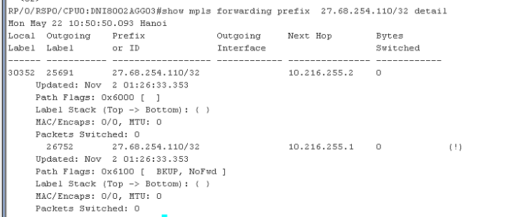

# SR-2023-0406-1052 - Viettel/HĐ SLA IP/Kiểm tra tốc độ upload của user LeaseLine trên box HHT9602.PECD.MX2020.02 (HHT9602CRT35)

* *1- Kiểm tra lại hướng đi giữa SRT-PECD**

SRT -> AGG02 -> CT02 -> CT01 -> CKV -> PECD

Kiểm tra xem trên CT và CKV có load-balance?

* *2- Trạng thái interface irb, vpls, l2circuit**

IRB không down, VPLS không down, l2circuit flap khi cắm/rút máy

* *3- Kết quả traceroute từ client tới server**

22/05

N6.PECD.01

```text
traceroute to 27.68.201.1 (27.68.201.1) from 27.68.254.109, 30 hops max, 52 byte packets
```
1  27.68.236.149 (27.68.236.149)  12.502 ms  14.063 ms  13.254 ms

MPLS Label=24193 CoS=0 TTL=1 S=1

2  27.68.255.86 (27.68.255.86)  11.419 ms  11.661 ms  12.421 ms

MPLS Label=24409 CoS=0 TTL=1 S=1

3  27.68.233.98 (27.68.233.98)  11.764 ms  11.640 ms  11.652 ms

4  \* \* \*

5  \* \* \*

N6.PECD.02

```text
traceroute to 27.68.201.1 (27.68.201.1) from 115.77.105.29, 30 hops max, 52 byte packets
```
1  27.68.236.157 (27.68.236.157)  12.170 ms  12.519 ms  12.848 ms

MPLS Label=24193 CoS=0 TTL=1 S=1

2  27.68.255.86 (27.68.255.86)  16.944 ms  14.922 ms  17.712 ms

MPLS Label=24409 CoS=0 TTL=1 S=1

3  27.68.233.98 (27.68.233.98)  11.288 ms  11.888 ms  12.206 ms

4  \* \* 27.68.201.1 (27.68.201.1)  11.679 ms

May 22 14:01:41

```text
traceroute to 27.68.201.1 (27.68.201.1) from 115.77.105.193, 30 hops max, 52 byte packets
```
1  27.68.236.157 (27.68.236.157)  11.958 ms  11.651 ms  13.128 ms

MPLS Label=24193 CoS=0 TTL=1 S=1

2  27.68.255.86 (27.68.255.86)  13.915 ms  11.900 ms  16.161 ms

MPLS Label=24409 CoS=0 TTL=1 S=1

3  27.68.233.98 (27.68.233.98)  11.626 ms  11.400 ms  11.410 ms

4  27.68.201.1 (27.68.201.1)  11.089 ms  11.152 ms  11.151 ms

May 22 14:06:12

```text
traceroute to 27.68.201.1 (27.68.201.1) from 27.68.254.110, 30 hops max, 52 byte packets
```
1  27.68.236.157 (27.68.236.157)  11.632 ms  13.545 ms  16.081 ms

MPLS Label=24193 CoS=0 TTL=1 S=1

2  27.68.255.86 (27.68.255.86)  17.121 ms  18.063 ms  14.072 ms

MPLS Label=24409 CoS=0 TTL=1 S=1

3  27.68.233.98 (27.68.233.98)  11.912 ms  12.211 ms  11.289 ms

4  \* \* \*

5  \* \* \*

6  \*

N4.PECD.01

May 22 14:06:12

```text
traceroute to 27.68.201.1 (27.68.201.1) from 27.68.254.107, 30 hops max, 52 byte packets
```
1  27.68.236.208 (27.68.236.208)  11.783 ms  12.886 ms  12.103 ms

MPLS Label=24193 CoS=0 TTL=1 S=1

2  27.68.255.86 (27.68.255.86)  11.167 ms  16.861 ms  17.327 ms

MPLS Label=24409 CoS=0 TTL=1 S=1

3  27.68.233.98 (27.68.233.98)  10.362 ms  10.154 ms  10.486 ms

4  27.68.201.1 (27.68.201.1)  9.858 ms  9.856 ms  9.916 ms

N4.PECD.02

May 22 14:06:12

```text
traceroute to 27.68.201.1 (27.68.201.1) from 27.68.254.108, 30 hops max, 52 byte packets
```
1  27.68.236.212 (27.68.236.212)  20.356 ms  12.672 ms  12.412 ms

MPLS Label=24193 CoS=0 TTL=1 S=1

2  27.68.255.86 (27.68.255.86)  13.519 ms  17.454 ms  17.505 ms

MPLS Label=24409 CoS=0 TTL=1 S=1

3  27.68.233.98 (27.68.233.98)  11.708 ms  11.314 ms  11.519 ms

4  27.68.201.1 (27.68.201.1)  11.099 ms  11.226 ms  11.107 ms

PC\_DNI\_test2 (đã check thời điểm OK thì out ra theo ae31 và ae32 đều OK)

Tháng 4

C:\Users\Admin>tracert -d 27.68.201.1

Tracing route to 27.68.201.1 over a maximum of 30 hops

1    24 ms    2 ms    2 ms  115.77.105.29

2    12 ms    12 ms    12 ms  27.68.236.161 >>> ae32

3    17 ms    12 ms    13 ms  27.68.255.90

4    11 ms    11 ms    11 ms  27.68.233.138

5    11 ms    10 ms    10 ms  27.68.201.1

Trace complete.

22/05

C:\Users\PC>tracert -d 27.68.201.1

Tracing route to 27.68.201.1 over a maximum of 30 hops

1    2 ms    2 ms    2 ms  115.77.105.193

2    14 ms    14 ms    15 ms  27.68.236.157 >>> ae31

3    20 ms    18 ms    15 ms  27.68.255.86

4    13 ms    13 ms    14 ms  27.68.233.98

5    13 ms    13 ms    13 ms  27.68.201.1

Trace complete.

* *4- show route forwarding route 27.68.201.1 extensive trên cả 2 PECD**

22/05

N6.PECD.01

Routing table: default.inet [Index 0]

Internet:

Enabled protocols: Bridging,

```text
Destination:  27.68.201.0/29
```
Route type: user

Route reference: 0                  Route interface-index: 0

Multicast RPF nh index: 0

```text
P2mpidx: 0
```
Flags: sent to PFE

Next-hop type: indirect              Index: 1053712  Reference: 10

Next-hop type: unilist              Index: 1052157  Reference: 3

```text
Nexthop: 27.68.236.149
```
Next-hop type: Push 24193            Index: 69802    Reference: 2

```text
Load Balance Label: None
```
Next-hop interface: ae31.0        Weight: 0x1

```text
Nexthop: 27.68.236.153
```
Next-hop type: Push 24193            Index: 114676  Reference: 2

```text
Load Balance Label: None
```
Next-hop interface: ae32.0        Weight: 0x1

N6.PECD.02

May 22 13:49:59

Routing table: default.inet [Index 0]

Internet:

Enabled protocols: Bridging,

```text
Destination:  27.68.201.0/29
```
Route type: user

Route reference: 0                  Route interface-index: 0

Multicast RPF nh index: 0

```text
P2mpidx: 0
```
Flags: sent to PFE

Next-hop type: indirect              Index: 1050359  Reference: 10

Next-hop type: unilist              Index: 1056017  Reference: 3

```text
Nexthop: 27.68.236.157
```
Next-hop type: Push 24193            Index: 91488    Reference: 2

```text
Load Balance Label: None
```
Next-hop interface: ae31.0        Weight: 0x1

```text
Nexthop: 27.68.236.161
```
Next-hop type: Push 24193            Index: 123341  Reference: 2

```text
Load Balance Label: None
```
Next-hop interface: ae32.0        Weight: 0x1

N4.PECD.01

Routing table: default.inet [Index 0]

Internet:

Enabled protocols: Bridging,

```text
Destination:  27.68.201.0/29
```
Route type: user

Route reference: 0                  Route interface-index: 0

Multicast RPF nh index: 0

```text
P2mpidx: 0
```
Flags: sent to PFE

Next-hop type: indirect              Index: 1054715  Reference: 10

Next-hop type: unilist              Index: 1053970  Reference: 3

```text
Nexthop: 27.68.236.208
```
Next-hop type: Push 24193            Index: 110697  Reference: 2

```text
Load Balance Label: None
```
Next-hop interface: ae41.0        Weight: 0x1

```text
Nexthop: 27.68.236.210
```
Next-hop type: Push 24193            Index: 130023  Reference: 2

```text
Load Balance Label: None
```
Next-hop interface: ae42.0        Weight: 0x1

N4.PECD.02

Routing table: default.inet [Index 0]

Internet:

Enabled protocols: Bridging,

```text
Destination:  27.68.201.0/29
```
Route type: user

Route reference: 0                  Route interface-index: 0

Multicast RPF nh index: 0

```text
P2mpidx: 0
```
Flags: sent to PFE

Next-hop type: indirect              Index: 1056543  Reference: 10

Next-hop type: unilist              Index: 1054600  Reference: 3

```text
Nexthop: 27.68.236.212
```
Next-hop type: Push 24193            Index: 111925  Reference: 2

```text
Load Balance Label: None
```
Next-hop interface: ae41.0        Weight: 0x1

```text
Nexthop: 27.68.236.214
```
Next-hop type: Push 24193            Index: 143132  Reference: 2

```text
Load Balance Label: None
```
Next-hop interface: ae42.0        Weight: 0x1

```text
>>> check trạng thái int có up/down
```
5- Lựa chọn nhiều server để control hashing uplink PECD

* *6- Kiểm tra lại kq wireshark mtu hiện tại**

MTU gói out vẫn lớn

```text
>>> có nên bỏ policer << check restransmit hoặc reorder?
```
* *7- Kiểm tra lại counter CRC giữa PECD và CKV**

```text
>>> File excel  >>> thiếu các port member trên CKV
```
8- switch AGG trong trường hợp xảy ra lỗi

9- **Kiểm tra scale irb up, firewall filter, số lượng term, kiem tra các linecard uplink**

```text
>>> File excel
```
10- Healthcheck resouce box giữa2 cặp PECD (N4 và N6)

11 - Làm rõ thời điểm bắt đầu lỗi

Kiểm tra các MOP đã thực hiện

- --

1. **Kiểm tra đường đi:**

* *SRT**

Thông tin 2 port đấu line test

DNI0512SRT02#show int description

Interface                      Status        Protocol Description

Gi0/3                          up            up      d061\_ll\_namcttth\_test2  ###Line bổ sung thêm

Gi0/5                          down          down    d061\_ll\_namcttth\_test  ###Line ban đầu <<< hiện đang down do không cắm PC

Cấu hình 2 port

DNI0512SRT02# show run int GigabitEthernet0/5

Building configuration...

Current configuration : 492 bytes

!

interface GigabitEthernet0/5

description d061\_ll\_namcttth\_test

no ip address

media-type auto-select

negotiation auto

storm-control broadcast level pps 10

storm-control unicast level pps 10

qos-config scheduling-mode min-bw-guarantee

no keepalive

service instance 2712 ethernet

encapsulation untagged

service-policy input d061\_ll\_namcttth\_test

xconnect 10.216.255.10 990001865 encapsulation mpls

backup peer 10.216.255.9 990001865

backup delay 0 120

mtu 9000

!

end

DNI0512SRT02# show run int GigabitEthernet0/3

Building configuration...

Current configuration : 470 bytes

!

interface GigabitEthernet0/3

description d061\_ll\_namcttth\_test2

no ip address

negotiation auto

storm-control broadcast level pps 10

storm-control unicast level pps 10

qos-config scheduling-mode min-bw-guarantee

no keepalive

service instance 2714 ethernet

encapsulation untagged

service-policy input d061\_ll\_namcttth\_test2

xconnect 10.216.255.10 990001892 encapsulation mpls

backup peer 10.216.255.9 990001892

backup delay 0 120

mtu 9000

!

```text
show ip route 10.216.255.9, 10.216.255.10
```
DNI0512SRT02#show ip route 10.216.255.9

Routing entry for 10.216.255.9/32

Known via "ospf 8", distance 110, metric 111, type inter area

Last update from 10.216.148.90 on Vlan200, 4w2d ago

Routing Descriptor Blocks:

\* 10.216.148.90, from 10.216.255.9, 4w2d ago, via Vlan200

Route metric is 111, traffic share count is 1

DNI0512SRT02#show ip route 10.216.255.10

Routing entry for 10.216.255.10/32

Known via "ospf 8", distance 110, metric 101, type inter area

Last update from 10.216.148.90 on Vlan200, 7w0d ago

Routing Descriptor Blocks:

\* 10.216.148.90, from 10.216.255.10, 7w0d ago, via Vlan200

Route metric is 101, traffic share count is 1

- -> via vlan200 --> Te0/1 (AGG02)

Trạng thái kênh l2circuit

DNI0512SRT02#show mpls l2transport vc 990001865

Local intf    Local circuit              Dest address    VC ID      Status

- ------------  -------------------------- --------------- ---------- ----------

Gi0/5          Ethernet:2712              10.216.255.9    990001865  DOWN

Gi0/5          Ethernet:2712              10.216.255.10  990001865  DOWN

DNI0512SRT02#show mpls l2transport vc 990001865 detail

Local interface: Gi0/5 down, line protocol down, Ethernet:2712 down

Destination address: 10.216.255.9, VC ID: 990001865, VC status: down

```text
Last error: Local peer access circuit is down
```
Output interface: Vl200, imposed label stack {24008 104839}

Preferred path: not configured

Default path: active

Next hop: 10.216.148.90

Create time: 5w5d, last status change time: 1y23w

```text
Last label FSM state change time: 5w5d
```
Last peer autosense occurred at: 5w5d

Signaling protocol: LDP, peer 10.216.255.9:0 up

Targeted Hello: 10.216.197.20(LDP Id) -> 10.216.255.9, LDP is UP

Graceful restart: configured and enabled

```text
Non stop routing: not configured and not enabled
```
Status TLV support (local/remote)  : enabled/supported

LDP route watch                  : enabled

```text
Label/status state machine        : established, LrdRru
```
Last local dataplane  status rcvd: No fault

Last BFD dataplane    status rcvd: Not sent

Last BFD peer monitor  status rcvd: No fault

Last local AC  circuit status rcvd: DOWN AC(rx/tx faults), (standby)

Last local AC  circuit status sent: No fault

Last local PW i/f circ status rcvd: No fault

Last local LDP TLV    status sent: DOWN AC(rx/tx faults), (standby)

Last remote LDP TLV    status rcvd: No fault

Last remote LDP ADJ    status rcvd: No fault

MPLS VC labels: local 86, remote 104839

```text
Group ID: local 0, remote 268
```
MTU: local 9000, remote 9000

Remote interface description: Access PW

Sequencing: receive disabled, send disabled

Control Word: Off (configured: autosense)

Dataplane:

SSM segment/switch IDs: 377002/204966 (used), PWID: 50

VC statistics:

transit packet totals: receive 0, send 0

transit byte totals:  receive 0, send 0

```text
transit packet drops:  receive 0, seq error 0, send 0
```
Local interface: Gi0/5 down, line protocol down, Ethernet:2712 down

Destination address: 10.216.255.10, VC ID: 990001865, VC status: down

```text
Last error: Local peer access circuit is down
```
Output interface: Vl200, imposed label stack {0 104875}

Preferred path: not configured

Default path: active

Next hop: 10.216.148.90

Create time: 5w5d, last status change time: 4d19h

```text
Last label FSM state change time: 5w5d
```
Last peer autosense occurred at: 5w5d

Signaling protocol: LDP, peer 10.216.255.10:0 up

Targeted Hello: 10.216.197.20(LDP Id) -> 10.216.255.10, LDP is UP

Graceful restart: configured and enabled

```text
Non stop routing: not configured and not enabled
```
Status TLV support (local/remote)  : enabled/supported

LDP route watch                  : enabled

```text
Label/status state machine        : established, LrdRru
```
Last local dataplane  status rcvd: No fault

Last BFD dataplane    status rcvd: Not sent

Last BFD peer monitor  status rcvd: No fault

Last local AC  circuit status rcvd: DOWN AC(rx/tx faults)

Last local AC  circuit status sent: No fault

Last local PW i/f circ status rcvd: No fault

Last local LDP TLV    status sent: DOWN AC(rx/tx faults)

Last remote LDP TLV    status rcvd: No fault

Last remote LDP ADJ    status rcvd: No fault

MPLS VC labels: local 93, remote 104875

```text
Group ID: local 0, remote 274
```
MTU: local 9000, remote 9000

Remote interface description: Access PW

Sequencing: receive disabled, send disabled

Control Word: Off (configured: autosense)

Dataplane:

SSM segment/switch IDs: 372905/200869 (used), PWID: 49

VC statistics:

transit packet totals: receive 0, send 0

transit byte totals:  receive 0, send 0

```text
transit packet drops:  receive 0, seq error 0, send 0
```
DNI0512SRT02#show mpls l2transport vc 990001892 detail

Local interface: Gi0/3 up, line protocol up, Ethernet:2714 up

Destination address: 10.216.255.9, VC ID: 990001892, VC status: standby

Output interface: Vl200, imposed label stack {24008 51485}

Preferred path: not configured

Default path: active

Next hop: 10.216.148.90

Create time: 3w6d, last status change time: 1y23w

```text
Last label FSM state change time: 3w6d
```
Last peer autosense occurred at: 3w6d

Signaling protocol: LDP, peer 10.216.255.9:0 up

Targeted Hello: 10.216.197.20(LDP Id) -> 10.216.255.9, LDP is UP

Graceful restart: configured and enabled

```text
Non stop routing: not configured and not enabled
```
Status TLV support (local/remote)  : enabled/supported

LDP route watch                  : enabled

```text
Label/status state machine        : established, LrdRru
```
Last local dataplane  status rcvd: No fault

Last BFD dataplane    status rcvd: Not sent

Last BFD peer monitor  status rcvd: No fault

Last local AC  circuit status rcvd: DOWN(standby)

Last local AC  circuit status sent: No fault

Last local PW i/f circ status rcvd: No fault

Last local LDP TLV    status sent: DOWN(standby)

Last remote LDP TLV    status rcvd: No fault

Last remote LDP ADJ    status rcvd: No fault

MPLS VC labels: local 34, remote 51485

```text
Group ID: local 0, remote 269
```
MTU: local 9000, remote 9000

Remote interface description: Access PW

Sequencing: receive disabled, send disabled

Control Word: Off (configured: autosense)

Dataplane:

SSM segment/switch IDs: 442574/237770 (used), PWID: 64

VC statistics:

transit packet totals: receive 0, send 0

transit byte totals:  receive 0, send 0

```text
transit packet drops:  receive 0, seq error 0, send 0
```
Local interface: Gi0/3 up, line protocol up, Ethernet:2714 up

Destination address: 10.216.255.10, VC ID: 990001892, VC status: up

Output interface: Vl200, imposed label stack {0 45558}

Preferred path: not configured

Default path: active

Next hop: 10.216.148.90

Create time: 3w6d, last status change time: 4d19h

```text
Last label FSM state change time: 3w6d
```
Last peer autosense occurred at: 3w6d

Signaling protocol: LDP, peer 10.216.255.10:0 up

Targeted Hello: 10.216.197.20(LDP Id) -> 10.216.255.10, LDP is UP

Graceful restart: configured and enabled

```text
Non stop routing: not configured and not enabled
```
Status TLV support (local/remote)  : enabled/supported

LDP route watch                  : enabled

```text
Label/status state machine        : established, LruRru
```
Last local dataplane  status rcvd: No fault

Last BFD dataplane    status rcvd: Not sent

Last BFD peer monitor  status rcvd: No fault

Last local AC  circuit status rcvd: No fault

Last local AC  circuit status sent: No fault

Last local PW i/f circ status rcvd: No fault

Last local LDP TLV    status sent: No fault

Last remote LDP TLV    status rcvd: No fault

Last remote LDP ADJ    status rcvd: No fault

MPLS VC labels: local 37, remote 45558

```text
Group ID: local 0, remote 275
```
MTU: local 9000, remote 9000

Remote interface description: Access PW

Sequencing: receive disabled, send disabled

Control Word: Off (configured: autosense)

Dataplane:

SSM segment/switch IDs: 438477/233673 (used), PWID: 63

VC statistics:

transit packet totals: receive 22862337, send 14726082

transit byte totals:  receive 14635203395, send 10643819032

```text
transit packet drops:  receive 0, seq error 0, send 0
```
Thông tin port gi0/3

DNI0512SRT02#show int gi0/3 detail

GigabitEthernet0/3 is up, line protocol is up (connected)

Hardware is Gigabit Ethernet, address is e00e.dae7.e1e3 (bia e00e.dae7.e1e3)

Description: d061\_ll\_namcttth\_test2

MTU 9216 bytes, BW 1000000 Kbit/sec, DLY 10 usec,

reliability 255/255, txload 1/255, rxload 1/255

Encapsulation ARPA, loopback not set

Keepalive not set

Full Duplex, 1000Mbps, link type is auto, media type is RJ45

output flow-control is unsupported, input flow-control is unsupported

ARP type: ARPA, ARP Timeout 04:00:00

Last input 3w5d, output never, output hang never

Last clearing of "show interface" counters never

Input queue: 0/200/0/0 (size/max/drops/flushes); Total output drops: 0

Queueing strategy: fifo

Output queue: 0/40 (size/max)

```text
5 minute input rate 0 bits/sec, 0 packets/sec
5 minute output rate 0 bits/sec, 0 packets/sec
```
23515032 packets input, 18507576490 bytes, 0 no buffer

```text
Received 93128 broadcasts (713736 IP multicasts)
```
0 runts, 0 giants, 0 throttles

0 input errors, 0 CRC, 0 frame, 0 overrun, 0 ignored

0 watchdog, 762641 multicast, 0 pause input

44856753 packets output, 56371179997 bytes, 0 underruns

0 output errors, 0 collisions, 2 interface resets

0 unknown protocol drops

0 babbles, 0 late collision, 0 deferred

0 lost carrier, 0 no carrier, 0 pause output

0 output buffer failures, 0 output buffers swapped out

Thông tin cấu hình 2 port uplink

DNI0512SRT02# show run int TenGigabitEthernet0/0

description To\_DNI0815SRT01

mtu 9000

no ip address

```text
load-interval 30
```
carrier-delay msec 0

qos-config scheduling-mode min-bw-guarantee

ethernet oam link-monitor receive-crc window 50

ethernet oam link-monitor receive-crc threshold high 250

ethernet oam link-monitor transmit-crc window 50

ethernet oam link-monitor transmit-crc threshold high 250

```text
ethernet oam link-monitor high-threshold action error-disable-interface
```
ethernet oam

service-policy input Trust\_Ingress

service-policy output Queuing\_Egress

service instance 11 ethernet

encapsulation dot1q 11

rewrite ingress tag pop 1 symmetric

bridge-domain 11

!

service instance 100 ethernet

encapsulation untagged

bridge-domain 100

!

!

interface TenGigabitEthernet0/1

description To\_DNI8001AGG02

mtu 9000

no ip address

```text
load-interval 30
```
carrier-delay msec 0

qos-config scheduling-mode min-bw-guarantee

ethernet oam link-monitor receive-crc window 50

ethernet oam link-monitor receive-crc threshold high 250

ethernet oam link-monitor transmit-crc window 50

ethernet oam link-monitor transmit-crc threshold high 250

```text
ethernet oam link-monitor high-threshold action error-disable-interface
```
ethernet oam

service-policy input Trust\_Ingress

service-policy output Queuing\_Egress

service instance 22 ethernet

encapsulation dot1q 11

rewrite ingress tag pop 1 symmetric

bridge-domain 22

!

service instance 200 ethernet

encapsulation untagged

bridge-domain 200

interface Vlan100

dampening 30 750 2000 120

mtu 9000

ip address 10.216.148.86 255.255.255.252

ip pim sparse-mode

ip pim bfd

ip ospf authentication message-digest

ip ospf message-digest-key 1 md5 7 071928495A1D1C09371F0E181625

ip ospf network point-to-point

ip ospf cost 100

carrier-delay 0

mpls ip

mpls ldp igp sync delay 25

bfd interval 100 min\_rx 100 multiplier 3

no bfd echo

!

interface Vlan200

dampening 30 750 2000 120

mtu 9000

ip address 10.216.148.89 255.255.255.252

ip pim sparse-mode

ip pim bfd

ip ospf authentication message-digest

ip ospf message-digest-key 1 md5 7 02100D5E1F120A2D6C430C0D1718

ip ospf network point-to-point

ip ospf cost 100

carrier-delay 0

mpls ip

mpls ldp igp sync delay 25

bfd interval 100 min\_rx 100 multiplier 3

no bfd echo

* *AGG**

Thông tin route đến PECD

RP/0/RSP0/CPU0:DNI8002AGG03#show route 27.68.254.110

Mon May 22 10:34:15.074 Hanoi

Routing entry for 27.68.254.110/32

Known via "bgp 7552", distance 200, metric 0, [ei]-bgp

Number of pic paths 1 , type internal

Installed Nov 20 00:02:50.805 for 1y26w

Routing Descriptor Blocks

10. 216.255.1, from 10.216.255.1, BGP backup path

Route metric is 0

10. 216.255.2, from 10.216.255.2

Route metric is 0

No advertising protos.

RP/0/RSP0/CPU0:DNI8002AGG03#show route 27.68.254.109

Mon May 22 10:34:18.891 Hanoi

Routing entry for 27.68.254.109/32

Known via "bgp 7552", distance 200, metric 0, [ei]-bgp

Number of pic paths 1 , type internal

Installed Nov 22 00:18:17.357 for 1y25w

Routing Descriptor Blocks

10. 216.255.1, from 10.216.255.1, BGP backup path

Route metric is 0

10. 216.255.2, from 10.216.255.2

Route metric is 0

No advertising protos.

110 >>> Installed Nov 20 00:02:50.805 for 1y26w

109 >>> Installed Nov 22 00:18:17.357 for 1y25w

RP/0/RSP0/CPU0:DNI8002AGG03#show mpls forwarding prefix  27.68.254.110/32 detail

Mon May 22 10:50:50.093 Hanoi

Local  Outgoing    Prefix            Outgoing    Next Hop        Bytes

Label  Label      or ID              Interface                    Switched

- ----- ----------- ------------------ ------------ --------------- ------------

30352  25691      27.68.254.110/32                10.216.255.2    0

Updated: Nov  2 01:26:33.353

Path Flags: 0x6000 [  ]

Label Stack (Top -> Bottom): { }

MAC/Encaps: 0/0, MTU: 0

Packets Switched: 0

26752      27.68.254.110/32                10.216.255.1    0            (!)

Updated: Nov  2 01:26:33.353

Path Flags: 0x6100 [  BKUP, NoFwd ]

Label Stack (Top -> Bottom): { }

MAC/Encaps: 0/0, MTU: 0

Packets Switched: 0

RP/0/RSP0/CPU0:DNI8002AGG03#show mpls traffic-eng tunnels brief

Mon May 22 10:37:38.344 Hanoi

```text
TUNNEL NAME        DESTINATION      STATUS  STATE
```
tunnel-te1        10.216.255.1          up  up

tunnel-te2        10.216.255.2          up  up

DNI8001AGG01\_TO\_CTDNI8001        10.216.255.1          up  up

DNI8001AGG01\_TO\_CTDNI8002        10.216.255.2          up  up

RP/0/RSP0/CPU0:DNI8002AGG03#show mpls traffic-eng tunnels  name  tunnel-te1

Mon May 22 10:47:00.076 Hanoi

Name: tunnel-te1  Destination: 10.216.255.1  Ifhandle:0x8000120

Signalled-Name: DNI8002AGG01\_TO\_CTDNI8001

Status:

Admin:    up Oper:  up  Path:  valid  Signalling: connected

path option 1,  type explicit DNI8002AGG01\_TO\_CTDNI8001 (Basis for Setup, path weight 10500)

Protected-by PO index: 2

```text
Last Signalled Error : Tue Nov  5 01:09:46 2019
```
Info: [7] PathErr(24,5)-(routing, no route to dest) at 10.216.240.42

path option 2,  type explicit DNI8002AGG01\_TO\_CTDNI8001\_BACKUP (Basis for Standby, path weight 12000)

```text
G-PID: 0x0800 (derived from egress interface properties)
```
Bandwidth Requested: 0 kbps  CT0

Creation Time: Tue Jul  9 00:35:53 2019 (3y45w ago)

Config Parameters:

```text
Bandwidth:        0 kbps (CT0) Priority:  7  7 Affinity: 0x0/0xffff
```
Metric Type: TE (global)

Path Selection:

Tiebreaker: Min-fill (default)

Hop-limit: disabled

Cost-limit: disabled

Path-invalidation timeout: 10000 msec (default), Action: Tear (default)

AutoRoute:  enabled  LockDown: disabled  Policy class: not set

Forward class: 0 (default)

Forwarding-Adjacency: disabled

Autoroute Destinations: 0

```text
Loadshare:          0 equal loadshares
```
Auto-bw: disabled

Fast Reroute: Disabled, Protection Desired: None

Path Protection: Enabled

BFD Fast Detection: Disabled

Reoptimization after affinity failure: Enabled

Soft Preemption: Disabled

History:

Tunnel has been up for: 3y28w (since Tue Nov 05 01:42:34 Hanoi 2019)

Current LSP:

```text
Uptime: 1y15w (since Mon Jan 31 14:05:16 Hanoi 2022)
```
Reopt. LSP:

Last Failure:

LSP not signalled, identical to the [CURRENT] LSP

Date/Time: Fri May 19 03:30:16 Hanoi 2023 [3d07h ago]

Standby Reopt LSP:

Last Failure:

LSP not signalled, identical to the [STANDBY] LSP

Date/Time: Fri May 19 03:30:16 Hanoi 2023 [3d07h ago]

```text
First Destination Failed: 10.216.255.1
```
Prior LSP:

```text
ID: 24 Path Option: 1
Removal Trigger: path error
```
Standby LSP:

```text
Uptime: 4w2d (since Fri Apr 21 11:08:56 Hanoi 2023)
```
Path info (OSPF 8 area 0):

Node hop count: 2

```text
Hop0: 10.216.240.42
Hop1: 10.216.240.1
Hop2: 10.216.255.1
Standby LSP Path info (OSPF 8 area 0), Oper State: Up :
```
Node hop count: 2

```text
Hop0: 10.216.240.37
Hop1: 10.216.240.33
Hop2: 10.216.255.1
```
Displayed 1 (of 2) heads, 0 (of 2) midpoints, 0 (of 0) tails

Displayed 1 up, 0 down, 0 recovering, 0 recovered heads

RP/0/RSP0/CPU0:DNI8002AGG03#show mpls traffic-eng tunnels  name  tunnel-te1 2

Mon May 22 10:47:55.907 Hanoi

Name: tunnel-te2  Destination: 10.216.255.2  Ifhandle:0x8000160

Signalled-Name: DNI8002AGG01\_TO\_CTDNI8002

Status:

Admin:    up Oper:  up  Path:  valid  Signalling: connected

path option 1,  type explicit DNI8002AGG01\_TO\_CTDNI8002 (Basis for Setup, path weight 10000)

Protected-by PO index: 2

path option 2,  type explicit DNI8002AGG01\_TO\_CTDNI8002\_BACKUP (Basis for Standby, path weight 12500)

```text
G-PID: 0x0800 (derived from egress interface properties)
```
Bandwidth Requested: 0 kbps  CT0

Creation Time: Tue Jul  9 00:35:53 2019 (3y45w ago)

Config Parameters:

```text
Bandwidth:        0 kbps (CT0) Priority:  7  7 Affinity: 0x0/0xffff
```
Metric Type: TE (global)

Path Selection:

Tiebreaker: Min-fill (default)

Hop-limit: disabled

Cost-limit: disabled

Path-invalidation timeout: 10000 msec (default), Action: Tear (default)

AutoRoute:  enabled  LockDown: disabled  Policy class: not set

Forward class: 0 (default)

Forwarding-Adjacency: disabled

Autoroute Destinations: 0

```text
Loadshare:          0 equal loadshares
```
Auto-bw: disabled

Fast Reroute: Disabled, Protection Desired: None

Path Protection: Enabled

BFD Fast Detection: Disabled

Reoptimization after affinity failure: Enabled

Soft Preemption: Disabled

History:

Tunnel has been up for: 2y00w (since Tue May 18 04:34:59 Hanoi 2021)

Current LSP:

```text
Uptime: 1y15w (since Mon Jan 31 14:05:16 Hanoi 2022)
```
Reopt. LSP:

Last Failure:

LSP not signalled, identical to the [CURRENT] LSP

Date/Time: Fri May 19 03:30:16 Hanoi 2023 [3d07h ago]

Standby Reopt LSP:

Last Failure:

LSP not signalled, identical to the [STANDBY] LSP

Date/Time: Fri May 19 03:30:16 Hanoi 2023 [3d07h ago]

```text
First Destination Failed: 10.216.255.2
```
Prior LSP:

```text
ID: 23 Path Option: 1
Removal Trigger: path error
```
Standby LSP:

```text
Uptime: 4w2d (since Fri Apr 21 11:08:56 Hanoi 2023)
```
Path info (OSPF 8 area 0):

Node hop count: 1

```text
Hop0: 10.216.240.42
Hop1: 10.216.255.2
Standby LSP Path info (OSPF 8 area 0), Oper State: Up :
```
Node hop count: 3

```text
Hop0: 10.216.240.37
Hop1: 10.216.240.33
Hop2: 10.216.240.2
Hop3: 10.216.255.2
```
Displayed 1 (of 2) heads, 0 (of 2) midpoints, 0 (of 0) tails

Displayed 1 up, 0 down, 0 recovering, 0 recovered heads

RP/0/RSP0/CPU0:DNI8002AGG03#show mpls forwarding prefix  27.68.254.110/32

Mon May 22 10:50:21.916 Hanoi

Local  Outgoing    Prefix            Outgoing    Next Hop        Bytes

Label  Label      or ID              Interface                    Switched

- ----- ----------- ------------------ ------------ --------------- ------------

30352  25691      27.68.254.110/32                10.216.255.2    0

26752      27.68.254.110/32                10.216.255.1    0            (!)

RP/0/RSP0/CPU0:DNI8002AGG03#show mpls forwarding prefix  27.68.254.110/32 detail

Mon May 22 10:50:50.093 Hanoi

Local  Outgoing    Prefix            Outgoing    Next Hop        Bytes

Label  Label      or ID              Interface                    Switched

- ----- ----------- ------------------ ------------ --------------- ------------

30352  25691      27.68.254.110/32                10.216.255.2    0

Updated: Nov  2 01:26:33.353

Path Flags: 0x6000 [  ]

Label Stack (Top -> Bottom): { }

MAC/Encaps: 0/0, MTU: 0

Packets Switched: 0

26752      27.68.254.110/32                10.216.255.1    0            (!)

Updated: Nov  2 01:26:33.353

Path Flags: 0x6100 [  BKUP, NoFwd ]

Label Stack (Top -> Bottom): { }

MAC/Encaps: 0/0, MTU: 0

Packets Switched: 0

RP/0/RSP0/CPU0:DNI8002AGG03#show route 10.216.255.2

Mon May 22 10:55:11.266 Hanoi

Routing entry for 10.216.255.2/32

Known via "ospf 8", distance 110, metric 10001, type intra area

Installed Jan 31 13:56:13.172 for 1y15w

Routing Descriptor Blocks

10. 216.255.2, from 10.216.255.2, via tunnel-te2

Route metric is 10001

No advertising protos.

RP/0/RSP0/CPU0:DNI8002AGG03# show ip int br | i 10.216.240.4

Mon May 22 11:01:22.688 Hanoi

Bundle-Ether2                  10.216.240.41  Up              Up      default

RP/0/RSP0/CPU0:DNI8002AGG03#show int Bundle-Ether2

Mon May 22 11:02:30.757 Hanoi

Bundle-Ether2 is up, line protocol is up

```text
Interface state transitions: 9
```
Hardware is Aggregated Ethernet interface(s), address is 00c1.6433.e30a

Description: CTDNI8002\_BE12

Internet address is 10.216.240.41/30

MTU 9014 bytes, BW 100000000 Kbit (Max: 100000000 Kbit)

reliability 255/255, txload 9/255, rxload 91/255

Encapsulation ARPA,

Full-duplex, 100000Mb/s

loopback not set,

Last link flapped 1y15w

ARP type ARPA, ARP timeout 04:00:00

No. of members in this bundle: 1

HundredGigE0/6/0/0          Full-duplex  100000Mb/s  Active

Last input 00:00:00, output 00:00:00

Last clearing of "show interface" counters never

```text
5 minute input rate 35987738000 bits/sec, 3536964 packets/sec
5 minute output rate 3572909000 bits/sec, 1321151 packets/sec
```
309061305180760 packets input, 397000924300248465 bytes, 31172608 total input drops

0 drops for unrecognized upper-level protocol

```text
Received 10 broadcast packets, 18278201347210 multicast packets
```
1 runts, 0 giants, 0 throttles, 0 parity

1 input errors, 0 CRC, 0 frame, 0 overrun, 0 ignored, 0 abort

116020282080507 packets output, 35761199800471770 bytes, 14 total output drops

Output 10 broadcast packets, 97982031831 multicast packets

0 output errors, 0 underruns, 0 applique, 0 resets

0 output buffer failures, 0 output buffers swapped out

0 carrier transitions

RP/0/RSP0/CPU0:DNI8002AGG03#show run | b Bundle-Ether2

Mon May 22 11:03:08.955 Hanoi

Building configuration...

interface Bundle-Ether2

description CTDNI8002\_BE12

bfd address-family ipv4 multiplier 3

bfd address-family ipv4 destination 10.216.240.42

bfd address-family ipv4 fast-detect

bfd address-family ipv4 minimum-interval 100

mtu 9014

service-policy input Trust\_Ingress

service-policy output Queuing\_Egress

ipv4 address 10.216.240.41 255.255.255.252

!

RP/0/RSP0/CPU0:DNI8002AGG03#show run | b test

Mon May 22 11:30:59.449 Hanoi

Building configuration...

bridge-domain d061\_ll\_namcttth\_test

mac

secure

action none

logging

!

!

mtu 9000

neighbor 10.216.197.20 pw-id 990001865

split-horizon group

!

neighbor 27.68.254.110 pw-id 990001865

pw-class L3LL

backup neighbor 27.68.254.109 pw-id 990001865

pw-class L3LL

!

!

!

RP/0/RSP0/CPU0:DNI8002AGG03#show run | b test2

Mon May 22 11:31:11.213 Hanoi

Building configuration...

bridge-domain d061\_ll\_namcttth\_test2

mac

secure

action none

logging

!

!

mtu 9000

neighbor 10.216.197.20 pw-id 990001892

split-horizon group

!

neighbor 27.68.254.110 pw-id 990001892

pw-class L3LL

backup neighbor 27.68.254.109 pw-id 990001892

pw-class L3LL

!

!

!

RP/0/RSP0/CPU0:DNI8002AGG03#show l2vpn bridge-domain brief

Mon May 22 11:36:14.203 Hanoi

Legend: pp = Partially Programmed.

```text
Bridge Group:Bridge-Domain Name  ID    State          Num ACs/up  Num PWs/up    Num PBBs/up Num VNIs/up
```
- ------------------------------- ----- -------------- ------------ ------------- ----------- -----------

L3LL:d061\_ll\_namcttth\_test      274  up            0/0          3/1          0/0        0/0

L3LL:d061\_ll\_namcttth\_test2      275  up            0/0          3/2          0/0        0/0

RP/0/RSP0/CPU0:DNI8002AGG03#show l2vpn bridge-domain detail | begin d061\_ll\_namcttth\_test2

Mon May 22 11:42:39.887 Hanoi

```text
Bridge group: L3LL, bridge-domain: d061\_ll\_namcttth\_test2, id: 275, state: up, ShgId: 0, MSTi: 0
Coupled state: disabled
VINE state: Default
```
MAC learning: enabled

MAC withdraw: enabled

MAC withdraw for Access PW: enabled

MAC withdraw sent on: bridge port up

MAC withdraw relaying (access to access): disabled

Flooding:

Broadcast & Multicast: enabled

Unknown unicast: enabled

MAC aging time: 300 s, Type: inactivity

MAC limit: 4000, Action: none, Notification: syslog

MAC limit reached: no, threshold: 75%

MAC port down flush: enabled

MAC Secure: enabled, Logging: enabled, Action: none

Split Horizon Group: none

Dynamic ARP Inspection: disabled, Logging: disabled

IP Source Guard: disabled, Logging: disabled

DHCPv4 Snooping: disabled

DHCPv4 Snooping profile: none

IGMP Snooping: disabled

IGMP Snooping profile: none

MLD Snooping profile: none

Storm Control: disabled

Bridge MTU: 9000

MIB cvplsConfigIndex: 276

Filter MAC addresses:

```text
Load Balance Hashing: src-dst-mac
```
P2MP PW: disabled

Create time: 24/04/2023 17:25:53 (3w6d ago)

No status change since creation

```text
ACs: 0 (0 up), VFIs: 0, PWs: 3 (2 up), PBBs: 0 (0 up), VNIs: 0 (0 up)
```
List of ACs:

List of Access PWs:

```text
PW: neighbor 10.216.197.20, PW ID 990001892, state is up ( established )
```
PW class not set, XC ID 0xa0000f97

Encapsulation MPLS, protocol LDP

Source address 10.216.255.10

PW type Ethernet, control word disabled, interworking none

PW backup disable delay 0 sec

Sequencing not set

```text
Load Balance Hashing: src-dst-mac
```
PW Status TLV in use

MPLS        Local                          Remote

- ----------- ------------------------------ ---------------------------

Label        45558                          37

```text
Group ID    0x113                          0x0
```
Interface    Access PW                      d061\_ll\_namcttth\_test2

MTU          9000                          9000

Control word disabled                      disabled

PW type      Ethernet                      Ethernet

VCCV CV type 0x2                            0x2

(LSP ping verification)        (LSP ping verification)

VCCV CC type 0x6                            0x2

(router alert label)          (router alert label)

(TTL expiry)

- ----------- ------------------------------ ---------------------------

Incoming Status (PW Status TLV):

Status code: 0x0 (Up) in Notification message

MIB cpwVcIndex: 2684358551

Create time: 24/04/2023 17:25:53 (3w6d ago)

Last time status changed: 17/05/2023 16:00:17 (4d19h ago)

Last time PW went down: 16/05/2023 13:32:53 (5d22h ago)

```text
MAC withdraw messages: sent 0, received 0
Forward-class: 0
```
Static MAC addresses:

Statistics:

```text
packets: received 23282386 (unicast 22475493), sent 45449291
bytes: received 18078059083 (unicast 18000146335), sent 57116381314
```
MAC move: 0

Storm control drop counters:

packets: broadcast 0, multicast 0, unknown unicast 0

bytes: broadcast 0, multicast 0, unknown unicast 0

MAC learning: enabled

Flooding:

Broadcast & Multicast: enabled

Unknown unicast: enabled

MAC aging time: 300 s, Type: inactivity

MAC limit: 4000, Action: none, Notification: syslog

MAC limit reached: no, threshold: 75%

MAC port down flush: enabled

MAC Secure: enabled, Logging: enabled, Action: none

Split Horizon Group: enabled

DHCPv4 Snooping: disabled

DHCPv4 Snooping profile: none

IGMP Snooping: disabled

IGMP Snooping profile: none

MLD Snooping profile: none

Storm Control: bridge-domain policer

```text
PW: neighbor 27.68.254.109, PW ID 990001892, state is standby ( all ready )
```
Backup for neighbor 27.68.254.110 PW ID 990001892 ( inactive )

PW class L3LL, XC ID 0xa0000f9b

Encapsulation MPLS, protocol LDP

Source address 10.216.255.10

PW type Ethernet, control word disabled, interworking none

Sequencing not set

```text
Load Balance Hashing: src-dst-mac
```
PW Status TLV in use

MPLS        Local                          Remote

- ----------- ------------------------------ ---------------------------

Label        53268                          95252

```text
Group ID    0x113                          0x0
```
Interface    Access PW                      unknown

MTU          9000                          9000

Control word disabled                      disabled

PW type      Ethernet                      Ethernet

VCCV CV type 0x2                            0x6

(LSP ping verification)        (LSP ping verification)

(BFD PW FD only)

VCCV CC type 0x6                            0x6

(router alert label)          (router alert label)

(TTL expiry)                  (TTL expiry)

- ----------- ------------------------------ ---------------------------

Incoming Status (PW Status TLV):

Status code: 0x0 (Up) in Notification message

MIB cpwVcIndex: 2684358555

Create time: 24/04/2023 17:25:53 (3w6d ago)

Last time status changed: 18/05/2023 14:07:17 (3d21h ago)

Last time PW went down: 18/05/2023 14:07:17 (3d21h ago)

```text
MAC withdraw messages: sent 0, received 0
Forward-class: 0
```
Static MAC addresses:

MAC learning: enabled

Flooding:

Broadcast & Multicast: enabled

Unknown unicast: enabled

MAC aging time: 300 s, Type: inactivity

MAC limit: 4000, Action: none, Notification: syslog

MAC limit reached: no, threshold: 75%

MAC port down flush: enabled

MAC Secure: enabled, Logging: enabled, Action: none

Split Horizon Group: none

DHCPv4 Snooping: disabled

DHCPv4 Snooping profile: none

IGMP Snooping: disabled

IGMP Snooping profile: none

MLD Snooping profile: none

Storm Control: bridge-domain policer

```text
PW: neighbor 27.68.254.110, PW ID 990001892, state is up ( established )
```
PW class L3LL, XC ID 0xa0000f99

Encapsulation MPLS, protocol LDP

Source address 10.216.255.10

PW type Ethernet, control word disabled, interworking none

PW backup disable delay 0 sec

Sequencing not set

```text
Load Balance Hashing: src-dst-mac
```
PW Status TLV in use

MPLS        Local                          Remote

- ----------- ------------------------------ ---------------------------

Label        51068                          88941

```text
Group ID    0x113                          0x0
```
Interface    Access PW                      unknown

MTU          9000                          9000

Control word disabled                      disabled

PW type      Ethernet                      Ethernet

VCCV CV type 0x2                            0x6

(LSP ping verification)        (LSP ping verification)

(BFD PW FD only)

VCCV CC type 0x6                            0x6

(router alert label)          (router alert label)

(TTL expiry)                  (TTL expiry)

- ----------- ------------------------------ ---------------------------

Incoming Status (PW Status TLV):

Status code: 0x0 (Up) in Notification message

MIB cpwVcIndex: 2684358553

Create time: 24/04/2023 17:25:53 (3w6d ago)

Last time status changed: 18/05/2023 14:07:17 (3d21h ago)

Last time PW went down: 25/04/2023 16:03:18 (3w5d ago)

```text
MAC withdraw messages: sent 0, received 0
Forward-class: 0
```
Static MAC addresses:

Statistics:

```text
packets: received 29712094 (unicast 29681752), sent 13271376
bytes: received 37237480591 (unicast 37236206227), sent 10092555726
```
MAC move: 0

Storm control drop counters:

packets: broadcast 0, multicast 0, unknown unicast 0

bytes: broadcast 0, multicast 0, unknown unicast 0

MAC learning: enabled

Flooding:

Broadcast & Multicast: enabled

Unknown unicast: enabled

MAC aging time: 300 s, Type: inactivity

MAC limit: 4000, Action: none, Notification: syslog

MAC limit reached: no, threshold: 75%

MAC port down flush: enabled

MAC Secure: enabled, Logging: enabled, Action: none

Split Horizon Group: none

DHCPv4 Snooping: disabled

DHCPv4 Snooping profile: none

IGMP Snooping: disabled

IGMP Snooping profile: none

MLD Snooping profile: none

Storm Control: bridge-domain policer

List of VFIs:

List of Access VFIs:

RP/0/RSP0/CPU0:DNI8002AGG03#show l2vpn bridge-domain detail | begin d061\_ll\_namcttth\_test

Mon May 22 11:58:16.985 Hanoi

```text
Bridge group: L3LL, bridge-domain: d061\_ll\_namcttth\_test, id: 274, state: up, ShgId: 0, MSTi: 0
Coupled state: disabled
VINE state: Default
```
MAC learning: enabled

MAC withdraw: enabled

MAC withdraw for Access PW: enabled

MAC withdraw sent on: bridge port up

MAC withdraw relaying (access to access): disabled

Flooding:

Broadcast & Multicast: enabled

Unknown unicast: enabled

MAC aging time: 300 s, Type: inactivity

MAC limit: 4000, Action: none, Notification: syslog

MAC limit reached: no, threshold: 75%

MAC port down flush: enabled

MAC Secure: enabled, Logging: enabled, Action: none

Split Horizon Group: none

Dynamic ARP Inspection: disabled, Logging: disabled

IP Source Guard: disabled, Logging: disabled

DHCPv4 Snooping: disabled

DHCPv4 Snooping profile: none

IGMP Snooping: disabled

IGMP Snooping profile: none

MLD Snooping profile: none

Storm Control: disabled

Bridge MTU: 9000

MIB cvplsConfigIndex: 275

Filter MAC addresses:

```text
Load Balance Hashing: src-dst-mac
```
P2MP PW: disabled

Create time: 11/04/2023 11:31:33 (5w6d ago)

No status change since creation

```text
ACs: 0 (0 up), VFIs: 0, PWs: 3 (1 up), PBBs: 0 (0 up), VNIs: 0 (0 up)
```
List of ACs:

List of Access PWs:

```text
PW: neighbor 10.216.197.20, PW ID 990001865, state is down ( all ready ) (Segment-down)
```
PW class not set, XC ID 0xa0000f8d

Encapsulation MPLS, protocol LDP

Source address 10.216.255.10

PW type Ethernet, control word disabled, interworking none

PW backup disable delay 0 sec

Sequencing not set

```text
Load Balance Hashing: src-dst-mac
```
PW Status TLV in use

MPLS        Local                          Remote

- ----------- ------------------------------ ---------------------------

Label        104875                        93

```text
Group ID    0x112                          0x0
```
Interface    Access PW                      d061\_ll\_namcttth\_test

MTU          9000                          9000

Control word disabled                      disabled

PW type      Ethernet                      Ethernet

VCCV CV type 0x2                            0x2

(LSP ping verification)        (LSP ping verification)

VCCV CC type 0x6                            0x2

(router alert label)          (router alert label)

(TTL expiry)

- ----------- ------------------------------ ---------------------------

Incoming Status (PW Status TLV):

Status code: 0x6 (AC Down) in Notification message

MIB cpwVcIndex: 2684358541

Create time: 11/04/2023 11:31:33 (5w6d ago)

Last time status changed: 17/05/2023 16:00:14 (4d19h ago)

Last time PW went down: 17/05/2023 16:00:14 (4d19h ago)

```text
MAC withdraw messages: sent 0, received 0
Forward-class: 0
```
Static MAC addresses:

MAC learning: enabled

Flooding:

Broadcast & Multicast: enabled

Unknown unicast: enabled

MAC aging time: 300 s, Type: inactivity

MAC limit: 4000, Action: none, Notification: syslog

MAC limit reached: no, threshold: 75%

MAC port down flush: enabled

MAC Secure: enabled, Logging: enabled, Action: none

Split Horizon Group: enabled

DHCPv4 Snooping: disabled

DHCPv4 Snooping profile: none

IGMP Snooping: disabled

IGMP Snooping profile: none

MLD Snooping profile: none

Storm Control: bridge-domain policer

```text
PW: neighbor 27.68.254.109, PW ID 990001865, state is standby ( all ready )
```
Backup for neighbor 27.68.254.110 PW ID 990001865 ( inactive )

PW class L3LL, XC ID 0xa0000f91

Encapsulation MPLS, protocol LDP

Source address 10.216.255.10

PW type Ethernet, control word disabled, interworking none

Sequencing not set

```text
Load Balance Hashing: src-dst-mac
```
PW Status TLV in use

MPLS        Local                          Remote

- ----------- ------------------------------ ---------------------------

Label        131824                        84184

```text
Group ID    0x112                          0x0
```
Interface    Access PW                      unknown

MTU          9000                          9000

Control word disabled                      disabled

PW type      Ethernet                      Ethernet

VCCV CV type 0x2                            0x6

(LSP ping verification)        (LSP ping verification)

(BFD PW FD only)

VCCV CC type 0x6                            0x6

(router alert label)          (router alert label)

(TTL expiry)                  (TTL expiry)

- ----------- ------------------------------ ---------------------------

Incoming Status (PW Status TLV):

Status code: 0x0 (Up) in Notification message

MIB cpwVcIndex: 2684358545

Create time: 11/04/2023 11:31:33 (5w6d ago)

Last time status changed: 11/04/2023 11:39:46 (5w6d ago)

```text
MAC withdraw messages: sent 0, received 0
Forward-class: 0
```
Static MAC addresses:

MAC learning: enabled

Flooding:

Broadcast & Multicast: enabled

Unknown unicast: enabled

MAC aging time: 300 s, Type: inactivity

MAC limit: 4000, Action: none, Notification: syslog

MAC limit reached: no, threshold: 75%

MAC port down flush: enabled

MAC Secure: enabled, Logging: enabled, Action: none

Split Horizon Group: none

DHCPv4 Snooping: disabled

DHCPv4 Snooping profile: none

IGMP Snooping: disabled

IGMP Snooping profile: none

MLD Snooping profile: none

Storm Control: bridge-domain policer

```text
PW: neighbor 27.68.254.110, PW ID 990001865, state is up ( established )
```
PW class L3LL, XC ID 0xa0000f8f

Encapsulation MPLS, protocol LDP

Source address 10.216.255.10

PW type Ethernet, control word disabled, interworking none

PW backup disable delay 0 sec

Sequencing not set

```text
Load Balance Hashing: src-dst-mac
```
PW Status TLV in use

MPLS        Local                          Remote

- ----------- ------------------------------ ---------------------------

Label        126409                        64488

```text
Group ID    0x112                          0x0
```
Interface    Access PW                      unknown

MTU          9000                          9000

Control word disabled                      disabled

PW type      Ethernet                      Ethernet

VCCV CV type 0x2                            0x6

(LSP ping verification)        (LSP ping verification)

(BFD PW FD only)

VCCV CC type 0x6                            0x6

(router alert label)          (router alert label)

(TTL expiry)                  (TTL expiry)

- ----------- ------------------------------ ---------------------------

Incoming Status (PW Status TLV):

Status code: 0x0 (Up) in Notification message

MIB cpwVcIndex: 2684358543

Create time: 11/04/2023 11:31:33 (5w6d ago)

Last time status changed: 11/04/2023 11:33:54 (5w6d ago)

```text
MAC withdraw messages: sent 0, received 0
Forward-class: 0
```
Static MAC addresses:

Statistics:

```text
packets: received 48078894 (unicast 46465329), sent 34977272
bytes: received 51613323228 (unicast 51545544414), sent 40859639044
```
MAC move: 0

Storm control drop counters:

packets: broadcast 0, multicast 0, unknown unicast 0

bytes: broadcast 0, multicast 0, unknown unicast 0

MAC learning: enabled

Flooding:

Broadcast & Multicast: enabled

Unknown unicast: enabled

MAC aging time: 300 s, Type: inactivity

MAC limit: 4000, Action: none, Notification: syslog

MAC limit reached: no, threshold: 75%

MAC port down flush: enabled

MAC Secure: enabled, Logging: enabled, Action: none

Split Horizon Group: none

DHCPv4 Snooping: disabled

DHCPv4 Snooping profile: none

IGMP Snooping: disabled

IGMP Snooping profile: none

MLD Snooping profile: none

Storm Control: bridge-domain policer

List of VFIs:

List of Access VFIs:

- --

# show mpls forwarding prefix  27.68.254.110/32



```text
show cef 27.68.254.110
```
2. **Trạng thái irb vpls circuit kênh đang test**

Trạng thái L2circuit, VPLS trên srt và agg là up 3 tuần

{master}

pmgatepro@HHT9602.PECD.MX2020.02\_RE0> show vpls connections instance d061\_ll\_namcttth\_test | no-more

Layer-2 VPN connections:

Legend for connection status (St)

EI -- encapsulation invalid      NC -- interface encapsulation not CCC/TCC/VPLS

EM -- encapsulation mismatch    WE -- interface and instance encaps not same

VC-Dn -- Virtual circuit down    NP -- interface hardware not present

CM -- control-word mismatch      -> -- only outbound connection is up

CN -- circuit not provisioned    <- -- only inbound connection is up

OR -- out of range              Up -- operational

OL -- no outgoing label          Dn -- down

LD -- local site signaled down  CF -- call admission control failure

RD -- remote site signaled down  SC -- local and remote site ID collision

LN -- local site not designated  LM -- local site ID not minimum designated

RN -- remote site not designated RM -- remote site ID not minimum designated

XX -- unknown connection status  IL -- no incoming label

MM -- MTU mismatch              MI -- Mesh-Group ID not available

BK -- Backup connection            ST -- Standby connection

PF -- Profile parse failure      PB -- Profile busy

RS -- remote site standby    SN -- Static Neighbor

LB -- Local site not best-site  RB -- Remote site not best-site

VM -- VLAN ID mismatch          HS -- Hot-standby Connection

Legend for interface status

Up -- operational

Dn -- down

Instance: d061\_ll\_namcttth\_test

```text
VPLS-id: 990001865
```
Mesh-group connections: AGGs

Neighbor                  Type  St    Time last up          # Up trans

10. 216.255.10(vpls-id 990001865) rmt Up Apr 11 11:35:09 2023          1

Remote PE: 10.216.255.10, Negotiated control-word: No

Incoming label: 64488, Outgoing label: 126409

Negotiated PW status TLV: Yes

local PW status code: 0x00000000, Neighbor PW status code: 0x00000000

Local interface: lsi.1068665, Status: Up, Encapsulation: ETHERNET

Description: Intf - vpls d061\_ll\_namcttth\_test neighbor 10.216.255.10 vpls-id 990001865

Flow Label Transmit: No, Flow Label Receive: No

10. 216.255.9(vpls-id 990001865) rmt Up Apr 11 11:35:09 2023          1

Remote PE: 10.216.255.9, Negotiated control-word: No

Incoming label: 64489, Outgoing label: 126349

Negotiated PW status TLV: Yes

local PW status code: 0x00000000, Neighbor PW status code: 0x00000000

Local interface: lsi.1068664, Status: Up, Encapsulation: ETHERNET

Description: Intf - vpls d061\_ll\_namcttth\_test neighbor 10.216.255.9 vpls-id 990001865

Flow Label Transmit: No, Flow Label Receive: No

pmgatepro@HHT9602.PECD.MX2020.02\_RE0> show vpls connections instance d061\_ll\_namcttth\_test2 | no-more

Layer-2 VPN connections:

Legend for connection status (St)

EI -- encapsulation invalid      NC -- interface encapsulation not CCC/TCC/VPLS

EM -- encapsulation mismatch    WE -- interface and instance encaps not same

VC-Dn -- Virtual circuit down    NP -- interface hardware not present

CM -- control-word mismatch      -> -- only outbound connection is up

CN -- circuit not provisioned    <- -- only inbound connection is up

OR -- out of range              Up -- operational

OL -- no outgoing label          Dn -- down

LD -- local site signaled down  CF -- call admission control failure

RD -- remote site signaled down  SC -- local and remote site ID collision

LN -- local site not designated  LM -- local site ID not minimum designated

RN -- remote site not designated RM -- remote site ID not minimum designated

XX -- unknown connection status  IL -- no incoming label

MM -- MTU mismatch              MI -- Mesh-Group ID not available

BK -- Backup connection            ST -- Standby connection

PF -- Profile parse failure      PB -- Profile busy

RS -- remote site standby    SN -- Static Neighbor

LB -- Local site not best-site  RB -- Remote site not best-site

VM -- VLAN ID mismatch          HS -- Hot-standby Connection

Legend for interface status

Up -- operational

Dn -- down

Instance: d061\_ll\_namcttth\_test2

```text
VPLS-id: 990001892
```
Mesh-group connections: AGGs

Neighbor                  Type  St    Time last up          # Up trans

10. 216.255.9(vpls-id 990001892) rmt Up May 18 14:07:21 2023          1

Remote PE: 10.216.255.9, Negotiated control-word: No

Incoming label: 88942, Outgoing label: 54193

Negotiated PW status TLV: Yes

local PW status code: 0x00000000, Neighbor PW status code: 0x00000000

Local interface: lsi.1068947, Status: Up, Encapsulation: ETHERNET

Description: Intf - vpls d061\_ll\_namcttth\_test2 neighbor 10.216.255.9 vpls-id 990001892

Flow Label Transmit: No, Flow Label Receive: No

10. 216.255.10(vpls-id 990001892) rmt Up May 18 14:07:21 2023          1

Remote PE: 10.216.255.10, Negotiated control-word: No

Incoming label: 88941, Outgoing label: 51068

Negotiated PW status TLV: Yes

local PW status code: 0x00000000, Neighbor PW status code: 0x00000000

Local interface: lsi.1068946, Status: Up, Encapsulation: ETHERNET

Description: Intf - vpls d061\_ll\_namcttth\_test2 neighbor 10.216.255.10 vpls-id 990001892

Flow Label Transmit: No, Flow Label Receive: No

{master}

pmgatepro@HHT9602.PECD.MX2020.02\_RE0> show vpls mac-table instance d061\_ll\_namcttth\_test | no-more

{master}

pmgatepro@HHT9602.PECD.MX2020.02\_RE0> show vpls mac-table instance d061\_ll\_namcttth\_test2 | no-more

MAC flags      (S -static MAC, D -dynamic MAC, L -locally learned, C -Control MAC

O -OVSDB MAC, SE -Statistics enabled, NM -Non configured MAC, R -Remote PE MAC, P -Pinned MAC)

Routing instance : d061\_ll\_namcttth\_test2

Bridging domain : \_\_d061\_ll\_namcttth\_test2\_\_, VLAN : none

MAC                MAC      Logical          NH    MAC        active

address            flags    interface        Index  property    source

d8:d0:90:5c:9b:5d  D        lsi.1068946

{master}

pmgatepro@HHT9602.PECD.MX2020.02\_RE0> show interfaces irb.4646

May 22 11:50:19

Logical interface irb.4646 (Index 12273) (SNMP ifIndex 20299)

Description: d061\_ll\_namcttth\_test2\_Master

Flags: Up SNMP-Traps 0x4000 Encapsulation: ENET2

```text
Bandwidth: 1Gbps
```
Routing Instance: d061\_ll\_namcttth\_test2 Bridging Domain: None

Input packets : 10086086

Output packets: 17631387

Protocol inet, MTU: 1514

Max nh cache: 75000, New hold nh limit: 75000, Curr nh cnt: 1, Curr new hold cnt: 0, NH drop cnt: 0

Flags: Sendbcast-pkt-to-re

Addresses, Flags: Is-Preferred Is-Primary

```text
Destination: 115.77.105.192/30, Local: 115.77.105.193, Broadcast: 115.77.105.195
```
Protocol multiservice, MTU: 1514

{master}

pmgatepro@HHT9602.PECD.MX2020.02\_RE0> show interfaces irb.4646 extensive

May 22 11:50:27

Logical interface irb.4646 (Index 12273) (SNMP ifIndex 20299) (Generation 27491)

Description: d061\_ll\_namcttth\_test2\_Master

Flags: Up SNMP-Traps 0x4000 Encapsulation: ENET2

```text
Bandwidth: 1Gbps
```
Routing Instance: d061\_ll\_namcttth\_test2 Bridging Domain: None

Traffic statistics:

Input  bytes  :          7092479350

Output bytes  :          20772239003

Input  packets:            10086087

Output packets:            17631388

Local statistics:

Input  bytes  :                2352

Output bytes  :                16604

Input  packets:                  28

Output packets:                  358

Transit statistics:

Input  bytes  :          7092476998                    0 bps

Output bytes  :          20772222399                    0 bps

Input  packets:            10086059                    0 pps

Output packets:            17631030                    0 pps

Protocol inet, MTU: 1514

Max nh cache: 75000, New hold nh limit: 75000, Curr nh cnt: 1, Curr new hold cnt: 0, NH drop cnt: 0

```text
Generation: 29576, Route table: 0
```
Flags: Sendbcast-pkt-to-re

Addresses, Flags: Is-Preferred Is-Primary

```text
Destination: 115.77.105.192/30, Local: 115.77.105.193, Broadcast: 115.77.105.195, Generation: 3402
```
Protocol multiservice, MTU: 1514, Generation: 29577, Route table: 0

Policer: Input: \_\_default\_arp\_policer\_\_

pmgatepro@HHT9602.PECD.MX2020.02\_RE0> show interfaces irb.4637

May 22 12:01:08

Logical interface irb.4637 (Index 12184) (SNMP ifIndex 20276)

Description: d061\_ll\_namcttth\_test\_Master

Flags: Up SNMP-Traps 0x4000 Encapsulation: ENET2

```text
Bandwidth: 1Gbps
```
Routing Instance: d061\_ll\_namcttth\_test Bridging Domain: None

Input packets : 34972166

Output packets: 48079213

Protocol inet, MTU: 1514

Max nh cache: 75000, New hold nh limit: 75000, Curr nh cnt: 0, Curr new hold cnt: 0, NH drop cnt: 0

Flags: Sendbcast-pkt-to-re

Addresses, Flags: Is-Preferred Is-Primary

```text
Destination: 115.77.105.28/30, Local: 115.77.105.29, Broadcast: 115.77.105.31
```
Protocol multiservice, MTU: 1514

{master}

pmgatepro@HHT9602.PECD.MX2020.02\_RE0> show interfaces irb.4637 detail

May 22 12:01:12

Logical interface irb.4637 (Index 12184) (SNMP ifIndex 20276) (Generation 27158)

Description: d061\_ll\_namcttth\_test\_Master

Flags: Up SNMP-Traps 0x4000 Encapsulation: ENET2

```text
Bandwidth: 1Gbps
```
Routing Instance: d061\_ll\_namcttth\_test Bridging Domain: None

Traffic statistics:

Input  bytes  :          40339952161

Output bytes  :          50963117178

Input  packets:            34972166

Output packets:            48079214

Local statistics:

Input  bytes  :                    0

Output bytes  :            67767504

Input  packets:                    0

Output packets:              1613512

Transit statistics:

Input  bytes  :          40339952161                    0 bps

Output bytes  :          50895349674                    0 bps

Input  packets:            34972166                    0 pps

Output packets:            46465702                    0 pps

Protocol inet, MTU: 1514

Max nh cache: 75000, New hold nh limit: 75000, Curr nh cnt: 1, Curr new hold cnt: 1, NH drop cnt: 0

```text
Generation: 29214, Route table: 0
```
Flags: Sendbcast-pkt-to-re

Input Filters: d061\_ll\_namcttth\_test\_UPLOAD-irb.4637-i

Output Filters: d061\_ll\_namcttth\_test\_DOWNLOAD-irb.4637-o

Addresses, Flags: Is-Preferred Is-Primary

```text
Destination: 115.77.105.28/30, Local: 115.77.105.29, Broadcast: 115.77.105.31, Generation: 3336
```
Protocol multiservice, MTU: 1514, Generation: 29215, Route table: 0

Policer: Input: ARP\_POLICER-irb.4637-inet-arp

{master}

pmgatepro@HHT9602.PECD.MX2020.02\_RE0> show interfaces irb.4637 extensive

May 22 12:01:16

Logical interface irb.4637 (Index 12184) (SNMP ifIndex 20276) (Generation 27158)

Description: d061\_ll\_namcttth\_test\_Master

Flags: Up SNMP-Traps 0x4000 Encapsulation: ENET2

```text
Bandwidth: 1Gbps
```
Routing Instance: d061\_ll\_namcttth\_test Bridging Domain: None

Traffic statistics:

Input  bytes  :          40339952161

Output bytes  :          50963117346

Input  packets:            34972166

Output packets:            48079218

Local statistics:

Input  bytes  :                    0

Output bytes  :            67767672

Input  packets:                    0

Output packets:              1613516

Transit statistics:

Input  bytes  :          40339952161                    0 bps

Output bytes  :          50895349674                    0 bps

Input  packets:            34972166                    0 pps

Output packets:            46465702                    0 pps

Protocol inet, MTU: 1514

Max nh cache: 75000, New hold nh limit: 75000, Curr nh cnt: 0, Curr new hold cnt: 0, NH drop cnt: 0

```text
Generation: 29214, Route table: 0
```
Flags: Sendbcast-pkt-to-re

Input Filters: d061\_ll\_namcttth\_test\_UPLOAD-irb.4637-i

Output Filters: d061\_ll\_namcttth\_test\_DOWNLOAD-irb.4637-o

Addresses, Flags: Is-Preferred Is-Primary

```text
Destination: 115.77.105.28/30, Local: 115.77.105.29, Broadcast: 115.77.105.31, Generation: 3336
```
Protocol multiservice, MTU: 1514, Generation: 29215, Route table: 0

Policer: Input: ARP\_POLICER-irb.4637-inet-arp

{master}

pmgatepro@HHT9602.PECD.MX2020.02\_RE0> show pfe statistics traffic

May 22 12:36:41

Packet Forwarding Engine traffic statistics:

Input  packets:    5137190720295687            145526710 pps

Output packets:    5137139482529781            143978926 pps

Fabric Input  :    5141052835250133            142818016 pps

Fabric Output :    5141052887731734            142833014 pps

Packet Forwarding Engine local traffic statistics:

Local packets input                :          28906902441

Local packets output                :          35107120085

Software input control plane drops  :                    0

Software input high drops          :                    0

Software input medium drops        :                    0

Software input low drops            :                    0

Software output drops              :                  27

Hardware input drops                :              8010856

Packet Forwarding Engine local protocol statistics:

HDLC keepalives            :                    0

ATM OAM                    :                    0

Frame Relay LMI            :                    0

PPP LCP/NCP                :                    0

OSPF hello                :          1431091469

OSPF3 hello                :          1130300259

RSVP hello                :            29640448

LDP hello                  :          2027324534

BFD                        :            147116771

IS-IS IIH                  :                    0

LACP                      :            655573349

ARP                        :          3428035597

ETHER OAM                  :                    0

Unknown                    :            385549807

Packet Forwarding Engine hardware discard statistics:

Timeout                    :                    0

Truncated key              :                    0

Bits to test              :                    0

```text
Data error                :                    0
TCP header length error    :                    0
```
Stack underflow            :                    0

Stack overflow            :                    0

Normal discard            :        1078967449595

Extended discard          :                    0

Invalid interface          :                    0

Info cell drops            :                    0

Fabric drops              :                10214

```text
Packet Forwarding Engine Input IPv4 Header Checksum Error and Output MTU Error statistics:
```
Input Checksum            :            18484174

Output MTU                :              4040272

pmgatepro@HHT9602.PECD.MX2020.02\_RE0> show pfe statistics traffic    | match "input|ouput|drop"

Packet Forwarding Engine traffic statistics:

Input  packets:    5137194215083346            144240682 pps

Output packets:    5137142980831689            143563273 pps

Fabric Input  :    5141056292863397            143260388 pps

Fabric Output :    5141056342096785            142798771 pps

Packet Forwarding Engine local traffic statistics:

Local packets input                :          28906918956

Local packets output                :          35107136301

Software input control plane drops  :                    0

Software input high drops          :                    0

Software input medium drops        :                    0

Software input low drops            :                    0

Software output drops              :                  27

Hardware input drops                :              8010856

Info cell drops            :                    0

Fabric drops              :                10214

```text
Packet Forwarding Engine Input IPv4 Header Checksum Error and Output MTU Error statistics:
```
Input Checksum            :            18484174

Output MTU                :              4040272

{master}

pmgatepro@HHT9602.PECD.MX2020.02\_RE0> show pfe statistics traffic detail | no-more

May 22 12:38:16

Packet Forwarding Engine Details:

```text
fpc:                    1
pfe:                    0
```
Packet Forwarding Engine traffic statistics:

Input  packets:      32292563309093                  83 pps

Output packets:      26530503381276              170038 pps

Fabric Input  :      28738197105937              216008 pps

Fabric Output :      34500507662381                45146 pps

Packet Forwarding Engine hardware discard statistics:

Timeout                    :                    0

Truncated key              :                    0

Bits to test              :                    0

```text
Data error                :                    0
TCP header length error    :                    0
```
Stack underflow            :                    0

Stack overflow            :                    0

Normal discard            :            39562303

Extended discard          :                    0

Invalid interface          :                    0

Info cell drops            :                    0

Fabric drops              :                    0

```text
Packet Forwarding Engine Input IPv4 Header Checksum Error and Output MTU Error statistics:
```
Input Checksum            :                    0

Output MTU                :                5264

Packet Forwarding Engine loopback statistics:

Forward packets :          8161772762                  166 pps

Forward bytes  :        163191407926                26640 bps

Drop packets    :                    0                    0 pps

Drop bytes      :                    0                    0 bps

Packet Forwarding Engine Details:

```text
fpc:                    1
pfe:                    1
```
Packet Forwarding Engine traffic statistics:

Input  packets:      40808599685907              181319 pps

Output packets:      34592336355732              720790 pps

Fabric Input  :      36420957006833              764186 pps

Fabric Output :      42677643229700              228450 pps

Packet Forwarding Engine hardware discard statistics:

Timeout                    :                    0

Truncated key              :                    0

Bits to test              :                    0

```text
Data error                :                    0
TCP header length error    :                    0
```
Stack underflow            :                    0

Stack overflow            :                    0

Normal discard            :          1634208026

Extended discard          :                    0

Invalid interface          :                    0

Info cell drops            :                    0

Fabric drops              :                    0

```text
Packet Forwarding Engine Input IPv4 Header Checksum Error and Output MTU Error statistics:
```
Input Checksum            :                    0

Output MTU                :                    0

Packet Forwarding Engine loopback statistics:

Forward packets :          8355199738                  166 pps

Forward bytes  :        212763079152                26640 bps

Drop packets    :                    0                    0 pps

Drop bytes      :                    0                    0 bps

Packet Forwarding Engine Details:

```text
fpc:                    1
pfe:                    2
```
Packet Forwarding Engine traffic statistics:

Input  packets:                    0                    0 pps

Output packets:                    0                    0 pps

Fabric Input  :                    0                    0 pps

Fabric Output :                    0                    0 pps

Packet Forwarding Engine hardware discard statistics:

Timeout                    :                    0

Truncated key              :                    0

Bits to test              :                    0

```text
Data error                :                    0
TCP header length error    :                    0
```
Stack underflow            :                    0

Stack overflow            :                    0

Normal discard            :                    0

Extended discard          :                    0

Invalid interface          :                    0

Info cell drops            :                    0

Fabric drops              :                    0

```text
Packet Forwarding Engine Input IPv4 Header Checksum Error and Output MTU Error statistics:
```
Input Checksum            :                    0

Output MTU                :                    0

Packet Forwarding Engine loopback statistics:

Forward packets :                    0                    0 pps

Forward bytes  :                    0                    0 bps

Drop packets    :                    0                    0 pps

Drop bytes      :                    0                    0 bps

Packet Forwarding Engine Details:

```text
fpc:                    1
pfe:                    3
```
Packet Forwarding Engine traffic statistics:

Input  packets:                    0                    0 pps

Output packets:                    0                    0 pps

Fabric Input  :                    0                    0 pps

Fabric Output :                    0                    0 pps

Packet Forwarding Engine hardware discard statistics:

Timeout                    :                    0

Truncated key              :                    0

Bits to test              :                    0

```text
Data error                :                    0
TCP header length error    :                    0
```
Stack underflow            :                    0

Stack overflow            :                    0

Normal discard            :                    0

Extended discard          :                    0

Invalid interface          :                    0

Info cell drops            :                    0

Fabric drops              :                    0

```text
Packet Forwarding Engine Input IPv4 Header Checksum Error and Output MTU Error statistics:
```
Input Checksum            :                    0

Output MTU                :                    0

Packet Forwarding Engine loopback statistics:

Forward packets :                    0                    0 pps

Forward bytes  :                    0                    0 bps

Drop packets    :                    0                    0 pps

Drop bytes      :                    0                    0 bps

Packet Forwarding Engine Details:

```text
fpc:                    2
pfe:                    0
```
Packet Forwarding Engine traffic statistics:

Input  packets:      55255145821125              1058082 pps

Output packets:      24803803984319              727933 pps

Fabric Input  :      27011340214303              778820 pps

Fabric Output :      57461082723892              1115391 pps

Packet Forwarding Engine hardware discard statistics:

Timeout                    :                    0

Truncated key              :                    0

Bits to test              :                    0

```text
Data error                :                    0
TCP header length error    :                    0
```
Stack underflow            :                    0

Stack overflow            :                    0

Normal discard            :              6948349

Extended discard          :                    0

Invalid interface          :                    0

Info cell drops            :                    0

Fabric drops              :                1117

```text
Packet Forwarding Engine Input IPv4 Header Checksum Error and Output MTU Error statistics:
```
Input Checksum            :                    0

Output MTU                :                2516

Packet Forwarding Engine loopback statistics:

Forward packets :          8161629885                  167 pps

Forward bytes  :        163190734978                26720 bps

Drop packets    :                    0                    0 pps

Drop bytes      :                    0                    0 bps

Packet Forwarding Engine Details:

```text
fpc:                    2
pfe:                    1
```
Packet Forwarding Engine traffic statistics:

Input  packets:      197540093002984              4957755 pps

Output packets:      102315372674877              1224005 pps

Fabric Input  :      104521954026782              1275049 pps

Fabric Output :      199796529556105              5030749 pps

Packet Forwarding Engine hardware discard statistics:

Timeout                    :                    0

Truncated key              :                    0

Bits to test              :                    0

```text
Data error                :                    0
TCP header length error    :                    0
```
Stack underflow            :                    0

Stack overflow            :                    0

Normal discard            :            163273795

Extended discard          :                    0

Invalid interface          :                    0

Info cell drops            :                    0

Fabric drops              :                    1

```text
Packet Forwarding Engine Input IPv4 Header Checksum Error and Output MTU Error statistics:
```
Input Checksum            :                    0

Output MTU                :                    0

Packet Forwarding Engine loopback statistics:

Forward packets :          58367351786                1327 pps

Forward bytes  :      21038269815298              3886128 bps

Drop packets    :                    0                    0 pps

Drop bytes      :                    0                    0 bps

Packet Forwarding Engine Details:

```text
fpc:                    2
pfe:                    2
```
Packet Forwarding Engine traffic statistics:

Input  packets:                    0                    0 pps

Output packets:                    0                    0 pps

Fabric Input  :                    0                    0 pps

Fabric Output :                    0                    0 pps

Packet Forwarding Engine hardware discard statistics:

Timeout                    :                    0

Truncated key              :                    0

Bits to test              :                    0

```text
Data error                :                    0
TCP header length error    :                    0
```
Stack underflow            :                    0

Stack overflow            :                    0

Normal discard            :                    0

Extended discard          :                    0

Invalid interface          :                    0

Info cell drops            :                    0

Fabric drops              :                    0

```text
Packet Forwarding Engine Input IPv4 Header Checksum Error and Output MTU Error statistics:
```
Input Checksum            :                    0

Output MTU                :                    0

Packet Forwarding Engine loopback statistics:

Forward packets :                    0                    0 pps

Forward bytes  :                    0                    0 bps

Drop packets    :                    0                    0 pps

Drop bytes      :                    0                    0 bps

Packet Forwarding Engine Details:

```text
fpc:                    2
pfe:                    3
```
Packet Forwarding Engine traffic statistics:

Input  packets:                    0                    0 pps

Output packets:                    0                    0 pps

Fabric Input  :                    0                    0 pps

Fabric Output :                    0                    0 pps

Packet Forwarding Engine hardware discard statistics:

Timeout                    :                    0

Truncated key              :                    0

Bits to test              :                    0

```text
Data error                :                    0
TCP header length error    :                    0
```
Stack underflow            :                    0

Stack overflow            :                    0

Normal discard            :                    0

Extended discard          :                    0

Invalid interface          :                    0

Info cell drops            :                    0

Fabric drops              :                    0

```text
Packet Forwarding Engine Input IPv4 Header Checksum Error and Output MTU Error statistics:
```
Input Checksum            :                    0

Output MTU                :                    0

Packet Forwarding Engine loopback statistics:

Forward packets :                    0                    0 pps

Forward bytes  :                    0                    0 bps

Drop packets    :                    0                    0 pps

Drop bytes      :                    0                    0 bps

Packet Forwarding Engine Details:

```text
fpc:                    3
pfe:                    0
```
Packet Forwarding Engine traffic statistics:

Input  packets:        3404576922873              111589 pps

Output packets:        7419394622905              195932 pps

Fabric Input  :        9646516642136              244294 pps

Fabric Output :        6206183908745              226523 pps

Packet Forwarding Engine hardware discard statistics:

Timeout                    :                    0

Truncated key              :                    0

Bits to test              :                    0

```text
Data error                :                    0
TCP header length error    :                    0
```
Stack underflow            :                    0

Stack overflow            :                    0

Normal discard            :            498654512

Extended discard          :                    0

Invalid interface          :                    0

Info cell drops            :                    0

Fabric drops              :                  207

```text
Packet Forwarding Engine Input IPv4 Header Checksum Error and Output MTU Error statistics:
```
Input Checksum            :                    0

Output MTU                :                    0

Packet Forwarding Engine loopback statistics:

Forward packets :                    0                    0 pps

Forward bytes  :                    0                    0 bps

Drop packets    :                    0                    0 pps

Drop bytes      :                    0                    0 bps

Packet Forwarding Engine Details:

```text
fpc:                    3
pfe:                    1
```
Packet Forwarding Engine traffic statistics:

Input  packets:                    0                    0 pps

Output packets:                    0                    0 pps

Fabric Input  :                    0                    0 pps

Fabric Output :                    0                    0 pps

Packet Forwarding Engine hardware discard statistics:

Timeout                    :                    0

Truncated key              :                    0

Bits to test              :                    0

```text
Data error                :                    0
TCP header length error    :                    0
```
Stack underflow            :                    0

Stack overflow            :                    0

Normal discard            :                    0

Extended discard          :                    0

Invalid interface          :                    0

Info cell drops            :                    0

Fabric drops              :                    0

```text
Packet Forwarding Engine Input IPv4 Header Checksum Error and Output MTU Error statistics:
```
Input Checksum            :                    0

Output MTU                :                    0

Packet Forwarding Engine loopback statistics:

Forward packets :                    0                    0 pps

Forward bytes  :                    0                    0 bps

Drop packets    :                    0                    0 pps

Drop bytes      :                    0                    0 bps

Packet Forwarding Engine Details:

```text
fpc:                    3
pfe:                    2
```
Packet Forwarding Engine traffic statistics:

Input  packets:                    0                    0 pps

Output packets:                    0                    0 pps

Fabric Input  :                    0                    0 pps

Fabric Output :                    0                    0 pps

Packet Forwarding Engine hardware discard statistics:

Timeout                    :                    0

Truncated key              :                    0

Bits to test              :                    0

```text
Data error                :                    0
TCP header length error    :                    0
```
Stack underflow            :                    0

Stack overflow            :                    0

Normal discard            :                    0

Extended discard          :                    0

Invalid interface          :                    0

Info cell drops            :                    0

Fabric drops              :                    0

```text
Packet Forwarding Engine Input IPv4 Header Checksum Error and Output MTU Error statistics:
```
Input Checksum            :                    0

Output MTU                :                    0

Packet Forwarding Engine loopback statistics:

Forward packets :                    0                    0 pps

Forward bytes  :                    0                    0 bps

Drop packets    :                    0                    0 pps

Drop bytes      :                    0                    0 bps

Packet Forwarding Engine Details:

```text
fpc:                    3
pfe:                    3
```
Packet Forwarding Engine traffic statistics:

Input  packets:                    0                    0 pps

Output packets:                    0                    0 pps

Fabric Input  :                    0                    0 pps

Fabric Output :                    0                    0 pps

Packet Forwarding Engine hardware discard statistics:

Timeout                    :                    0

Truncated key              :                    0

Bits to test              :                    0

```text
Data error                :                    0
TCP header length error    :                    0
```
Stack underflow            :                    0

Stack overflow            :                    0

Normal discard            :                    0

Extended discard          :                    0

Invalid interface          :                    0

Info cell drops            :                    0

Fabric drops              :                    0

```text
Packet Forwarding Engine Input IPv4 Header Checksum Error and Output MTU Error statistics:
```
Input Checksum            :                    0

Output MTU                :                    0

Packet Forwarding Engine loopback statistics:

Forward packets :                    0                    0 pps

Forward bytes  :                    0                    0 bps

Drop packets    :                    0                    0 pps

Drop bytes      :                    0                    0 bps

Packet Forwarding Engine Details:

```text
fpc:                    4
pfe:                    0
```
Packet Forwarding Engine traffic statistics:

Input  packets:          21996734906                  547 pps

Output packets:        772124700887                39768 pps

Fabric Input  :        2979396238019                85077 pps

Fabric Output :        2848568694691                83070 pps

Packet Forwarding Engine hardware discard statistics:

Timeout                    :                    0

Truncated key              :                    0

Bits to test              :                    0

```text
Data error                :                    0
TCP header length error    :                    0
```
Stack underflow            :                    0

Stack overflow            :                    0

Normal discard            :              1950700

Extended discard          :                    0

Invalid interface          :                    0

Info cell drops            :                    0

Fabric drops              :                  439

```text
Packet Forwarding Engine Input IPv4 Header Checksum Error and Output MTU Error statistics:
```
Input Checksum            :                    0

Output MTU                :                57603

Packet Forwarding Engine loopback statistics:

Forward packets :                    0                    0 pps

Forward bytes  :                    0                    0 bps

Drop packets    :                    0                    0 pps

Drop bytes      :                    0                    0 bps

Packet Forwarding Engine Details:

```text
fpc:                    4
pfe:                    1
```
Packet Forwarding Engine traffic statistics:

Input  packets:                    0                    0 pps

Output packets:                    0                    0 pps

Fabric Input  :                    0                    0 pps

Fabric Output :                    0                    0 pps

Packet Forwarding Engine hardware discard statistics:

Timeout                    :                    0

Truncated key              :                    0

Bits to test              :                    0

```text
Data error                :                    0
TCP header length error    :                    0
```
Stack underflow            :                    0

Stack overflow            :                    0

Normal discard            :                    0

Extended discard          :                    0

Invalid interface          :                    0

Info cell drops            :                    0

Fabric drops              :                    0

```text
Packet Forwarding Engine Input IPv4 Header Checksum Error and Output MTU Error statistics:
```
Input Checksum            :                    0

Output MTU                :                    0

Packet Forwarding Engine loopback statistics:

Forward packets :                    0                    0 pps

Forward bytes  :                    0                    0 bps

Drop packets    :                    0                    0 pps

Drop bytes      :                    0                    0 bps

Packet Forwarding Engine Details:

```text
fpc:                    4
pfe:                    2
```
Packet Forwarding Engine traffic statistics:

Input  packets:                    0                    0 pps

Output packets:                    0                    0 pps

Fabric Input  :                    0                    0 pps

Fabric Output :                    0                    0 pps

Packet Forwarding Engine hardware discard statistics:

Timeout                    :                    0

Truncated key              :                    0

Bits to test              :                    0

```text
Data error                :                    0
TCP header length error    :                    0
```
Stack underflow            :                    0

Stack overflow            :                    0

Normal discard            :                    0

Extended discard          :                    0

Invalid interface          :                    0

Info cell drops            :                    0

Fabric drops              :                    0

```text
Packet Forwarding Engine Input IPv4 Header Checksum Error and Output MTU Error statistics:
```
Input Checksum            :                    0

Output MTU                :                    0

Packet Forwarding Engine loopback statistics:

Forward packets :                    0                    0 pps

Forward bytes  :                    0                    0 bps

Drop packets    :                    0                    0 pps

Drop bytes      :                    0                    0 bps

Packet Forwarding Engine Details:

```text
fpc:                    4
pfe:                    3
```
Packet Forwarding Engine traffic statistics:

Input  packets:                    0                    0 pps

Output packets:                    0                    0 pps

Fabric Input  :                    0                    0 pps

Fabric Output :                    0                    0 pps

Packet Forwarding Engine hardware discard statistics:

Timeout                    :                    0

Truncated key              :                    0

Bits to test              :                    0

```text
Data error                :                    0
TCP header length error    :                    0
```
Stack underflow            :                    0

Stack overflow            :                    0

Normal discard            :                    0

Extended discard          :                    0

Invalid interface          :                    0

Info cell drops            :                    0

Fabric drops              :                    0

```text
Packet Forwarding Engine Input IPv4 Header Checksum Error and Output MTU Error statistics:
```
Input Checksum            :                    0

Output MTU                :                    0

Packet Forwarding Engine loopback statistics:

Forward packets :                    0                    0 pps

Forward bytes  :                    0                    0 bps

Drop packets    :                    0                    0 pps

Drop bytes      :                    0                    0 bps

Packet Forwarding Engine Details:

```text
fpc:                    5
pfe:                    0
```
Packet Forwarding Engine traffic statistics:

Input  packets:      173517578090182              1727094 pps

Output packets:      144824915701970              2332331 pps

Fabric Input  :      147018275961926              2391537 pps

Fabric Output :      88618974409189              902654 pps

Packet Forwarding Engine hardware discard statistics:

Timeout                    :                    0

Truncated key              :                    0

Bits to test              :                    0

```text
Data error                :                    0
TCP header length error    :                    0
```
Stack underflow            :                    0

Stack overflow            :                    0

Normal discard            :          63280193364

Extended discard          :                    0

Invalid interface          :                    0

Info cell drops            :                    0

Fabric drops              :                  347

```text
Packet Forwarding Engine Input IPv4 Header Checksum Error and Output MTU Error statistics:
```
Input Checksum            :              151618

Output MTU                :              160524

Packet Forwarding Engine loopback statistics:

Forward packets :                    0                    0 pps

Forward bytes  :                    0                    0 bps

Drop packets    :                    0                    0 pps

Drop bytes      :                    0                    0 bps

Packet Forwarding Engine Details:

```text
fpc:                    5
pfe:                    1
```
Packet Forwarding Engine traffic statistics:

Input  packets:      227823312763179              4787793 pps

Output packets:      145201251362094              2321495 pps

Fabric Input  :      147394028339094              2376301 pps

Fabric Output :      89185175121533              924943 pps

Packet Forwarding Engine hardware discard statistics:

Timeout                    :                    0

Truncated key              :                    0

Bits to test              :                    0

```text
Data error                :                    0
TCP header length error    :                    0
```
Stack underflow            :                    0

Stack overflow            :                    0

Normal discard            :          34624976642

Extended discard          :                    0

Invalid interface          :                    0

Info cell drops            :                    0

Fabric drops              :                    0

```text
Packet Forwarding Engine Input IPv4 Header Checksum Error and Output MTU Error statistics:
```
Input Checksum            :                16735

Output MTU                :              137325

Packet Forwarding Engine loopback statistics:

Forward packets :                    0                    0 pps

Forward bytes  :                    0                    0 bps

Drop packets    :                    0                    0 pps

Drop bytes      :                    0                    0 bps

Packet Forwarding Engine Details:

```text
fpc:                    5
pfe:                    2
```
Packet Forwarding Engine traffic statistics:

Input  packets:                    0                    0 pps

Output packets:      361959911079692              6190685 pps

Fabric Input  :      364166749852719              6265262 pps

Fabric Output :      142379372870520              3983959 pps

Packet Forwarding Engine hardware discard statistics:

Timeout                    :                    0

Truncated key              :                    0

Bits to test              :                    0

```text
Data error                :                    0
TCP header length error    :                    0
```
Stack underflow            :                    0

Stack overflow            :                    0

Normal discard            :                    0

Extended discard          :                    0

Invalid interface          :                    0

Info cell drops            :                    0

Fabric drops              :                    0

```text
Packet Forwarding Engine Input IPv4 Header Checksum Error and Output MTU Error statistics:
```
Input Checksum            :                    0

Output MTU                :                    0

Packet Forwarding Engine loopback statistics:

Forward packets :                    0                    0 pps

Forward bytes  :                    0                    0 bps

Drop packets    :                    0                    0 pps

Drop bytes      :                    0                    0 bps

Packet Forwarding Engine Details:

```text
fpc:                    5
pfe:                    3
```
Packet Forwarding Engine traffic statistics:

Input  packets:                    0                    0 pps

Output packets:      144782647274336              2301618 pps

Fabric Input  :      146970261412577              2360035 pps

Fabric Output :      89779570329834              900186 pps

Packet Forwarding Engine hardware discard statistics:

Timeout                    :                    0

Truncated key              :                    0

Bits to test              :                    0

```text
Data error                :                    0
TCP header length error    :                    0
```
Stack underflow            :                    0

Stack overflow            :                    0

Normal discard            :                    0

Extended discard          :                    0

Invalid interface          :                    0

Info cell drops            :                    0

Fabric drops              :                    0

```text
Packet Forwarding Engine Input IPv4 Header Checksum Error and Output MTU Error statistics:
```
Input Checksum            :                    0

Output MTU                :              145801

Packet Forwarding Engine loopback statistics:

Forward packets :                    0                    0 pps

Forward bytes  :                    0                    0 bps

Drop packets    :                    0                    0 pps

Drop bytes      :                    0                    0 bps

Packet Forwarding Engine Details:

```text
fpc:                    6
pfe:                    0
```
Packet Forwarding Engine traffic statistics:

Input  packets:      110691089611703              3929448 pps

Output packets:      88505342778158              3146888 pps

Fabric Input  :      90638063122304              3176431 pps

Fabric Output :      112813811042756              3976052 pps

Packet Forwarding Engine hardware discard statistics:

Timeout                    :                    0

Truncated key              :                    0

Bits to test              :                    0

```text
Data error                :                    0
TCP header length error    :                    0
```
Stack underflow            :                    0

Stack overflow            :                    0

Normal discard            :          15786335223

Extended discard          :                    0

Invalid interface          :                    0

Info cell drops            :                    0

Fabric drops              :                  406

```text
Packet Forwarding Engine Input IPv4 Header Checksum Error and Output MTU Error statistics:
```
Input Checksum            :                    0

Output MTU                :                25837

Packet Forwarding Engine loopback statistics:

Forward packets :                    0                    0 pps

Forward bytes  :                    0                    0 bps

Drop packets    :                    0                    0 pps

Drop bytes      :                    0                    0 bps

Packet Forwarding Engine Details:

```text
fpc:                    6
pfe:                    1
```
Packet Forwarding Engine traffic statistics:

Input  packets:      143124181198515              4458069 pps

Output packets:      88517139738534              3205883 pps

Fabric Input  :      90649079162938              3420173 pps

Fabric Output :      145234725829379              5507274 pps

Packet Forwarding Engine hardware discard statistics:

Timeout                    :                    0

Truncated key              :                    0

Bits to test              :                    0

```text
Data error                :                    0
TCP header length error    :                    0
```
Stack underflow            :                    0

Stack overflow            :                    0

Normal discard            :          15852376556

Extended discard          :                    0

Invalid interface          :                    0

Info cell drops            :                    0

Fabric drops              :                  11

```text
Packet Forwarding Engine Input IPv4 Header Checksum Error and Output MTU Error statistics:
```
Input Checksum            :                    0

Output MTU                :                25825

Packet Forwarding Engine loopback statistics:

Forward packets :                    0                    0 pps

Forward bytes  :                    0                    0 bps

Drop packets    :                    0                    0 pps

Drop bytes      :                    0                    0 bps

Packet Forwarding Engine Details:

```text
fpc:                    6
pfe:                    2
```
Packet Forwarding Engine traffic statistics:

Input  packets:      67563113404637              6106033 pps

Output packets:      61500622360554              7460100 pps

Fabric Input  :      63051768569985              7551534 pps

Fabric Output :      69076288304413              6230935 pps

Packet Forwarding Engine hardware discard statistics:

Timeout                    :                    0

Truncated key              :                    0

Bits to test              :                    0

```text
Data error                :                    0
TCP header length error    :                    0
```
Stack underflow            :                    0

Stack overflow            :                    0

Normal discard            :          37927115090

Extended discard          :                    0

Invalid interface          :                    0

Info cell drops            :                    0

Fabric drops              :                  15

```text
Packet Forwarding Engine Input IPv4 Header Checksum Error and Output MTU Error statistics:
```
Input Checksum            :              2211685

Output MTU                :                42201

Packet Forwarding Engine loopback statistics:

Forward packets :                    0                    0 pps

Forward bytes  :                    0                    0 bps

Drop packets    :                    0                    0 pps

Drop bytes      :                    0                    0 bps

Packet Forwarding Engine Details:

```text
fpc:                    6
pfe:                    3
```
Packet Forwarding Engine traffic statistics:

Input  packets:      283182779705561            16121974 pps

Output packets:      67120695608084              4851978 pps

Fabric Input  :      69037338287668              4904543 pps

Fabric Output :      285095433671150            16554768 pps

Packet Forwarding Engine hardware discard statistics:

Timeout                    :                    0

Truncated key              :                    0

Bits to test              :                    0

```text
Data error                :                    0
TCP header length error    :                    0
```
Stack underflow            :                    0

Stack overflow            :                    0

Normal discard            :          2451183358

Extended discard          :                    0

Invalid interface          :                    0

Info cell drops            :                    0

Fabric drops              :                  10

```text
Packet Forwarding Engine Input IPv4 Header Checksum Error and Output MTU Error statistics:
```
Input Checksum            :                    0

Output MTU                :                2424

Packet Forwarding Engine loopback statistics:

Forward packets :                    0                    0 pps

Forward bytes  :                    0                    0 bps

Drop packets    :                    0                    0 pps

Drop bytes      :                    0                    0 bps

Packet Forwarding Engine Details:

```text
fpc:                    7
pfe:                    0
```
Packet Forwarding Engine traffic statistics:

Input  packets:      456033854197463            11737515 pps

Output packets:      249549388403633              8753042 pps

Fabric Input  :      250947652540731              8852962 pps

Fabric Output :      457392194785354            12017586 pps

Packet Forwarding Engine hardware discard statistics:

Timeout                    :                    0

Truncated key              :                    0

Bits to test              :                    0

```text
Data error                :                    0
TCP header length error    :                    0
```
Stack underflow            :                    0

Stack overflow            :                    0

Normal discard            :          40422019037

Extended discard          :                    0

Invalid interface          :                    0

Info cell drops            :                    0

Fabric drops              :                  427

```text
Packet Forwarding Engine Input IPv4 Header Checksum Error and Output MTU Error statistics:
```
Input Checksum            :                    0

Output MTU                :                32147

Packet Forwarding Engine loopback statistics:

Forward packets :                    0                    0 pps

Forward bytes  :                    0                    0 bps

Drop packets    :                    0                    0 pps

Drop bytes      :                    0                    0 bps

Packet Forwarding Engine Details:

```text
fpc:                    7
pfe:                    1
```
Packet Forwarding Engine traffic statistics:

Input  packets:      279365610130926              3849716 pps

Output packets:      457303253440232              7911443 pps

Fabric Input  :      459294847161023              7991969 pps

Fabric Output :      281208958612571              3957924 pps

Packet Forwarding Engine hardware discard statistics:

Timeout                    :                    0

Truncated key              :                    0

Bits to test              :                    0

```text
Data error                :                    0
TCP header length error    :                    0
```
Stack underflow            :                    0

Stack overflow            :                    0

Normal discard            :        104011474821

Extended discard          :                    0

Invalid interface          :                    0

Info cell drops            :                    0

Fabric drops              :                  15

```text
Packet Forwarding Engine Input IPv4 Header Checksum Error and Output MTU Error statistics:
```
Input Checksum            :              192596

Output MTU                :              478665

Packet Forwarding Engine loopback statistics:

Forward packets :                    0                    0 pps

Forward bytes  :                    0                    0 bps

Drop packets    :                    0                    0 pps

Drop bytes      :                    0                    0 bps

Packet Forwarding Engine Details:

```text
fpc:                    7
pfe:                    2
```
Packet Forwarding Engine traffic statistics:

Input  packets:                    0                    0 pps

Output packets:                    6                    0 pps

Fabric Input  :        2206984950471                45056 pps

Fabric Output :        2206909442574                45065 pps

Packet Forwarding Engine hardware discard statistics:

Timeout                    :                    0

Truncated key              :                    0

Bits to test              :                    0

```text
Data error                :                    0
TCP header length error    :                    0
```
Stack underflow            :                    0

Stack overflow            :                    0

Normal discard            :                  21

Extended discard          :                    0

Invalid interface          :                    0

Info cell drops            :                    0

Fabric drops              :                    0

```text
Packet Forwarding Engine Input IPv4 Header Checksum Error and Output MTU Error statistics:
```
Input Checksum            :                    0

Output MTU                :                    0

Packet Forwarding Engine loopback statistics:

Forward packets :                    0                    0 pps

Forward bytes  :                    0                    0 bps

Drop packets    :                    0                    0 pps

Drop bytes      :                    0                    0 bps

Packet Forwarding Engine Details:

```text
fpc:                    7
pfe:                    3
```
Packet Forwarding Engine traffic statistics:

Input  packets:                    0                    0 pps

Output packets:                    7                    0 pps

Fabric Input  :        2206984949365                45010 pps

Fabric Output :        2206909443052                45019 pps

Packet Forwarding Engine hardware discard statistics:

Timeout                    :                    0

Truncated key              :                    0

Bits to test              :                    0

```text
Data error                :                    0
TCP header length error    :                    0
```
Stack underflow            :                    0

Stack overflow            :                    0

Normal discard            :                  21

Extended discard          :                    0

Invalid interface          :                    0

Info cell drops            :                    0

Fabric drops              :                    0

```text
Packet Forwarding Engine Input IPv4 Header Checksum Error and Output MTU Error statistics:
```
Input Checksum            :                    0

Output MTU                :                    0

Packet Forwarding Engine loopback statistics:

Forward packets :                    0                    0 pps

Forward bytes  :                    0                    0 bps

Drop packets    :                    0                    0 pps

Drop bytes      :                    0                    0 bps

Packet Forwarding Engine Details:

```text
fpc:                    8
pfe:                    0
```
Packet Forwarding Engine traffic statistics:

Input  packets:      452478169101977            15093036 pps

Output packets:      395030074911353            15600490 pps

Fabric Input  :      375204821366606            14725989 pps

Fabric Output :      432476143597038            14319445 pps

Packet Forwarding Engine hardware discard statistics:

Timeout                    :                    0

Truncated key              :                    0

Bits to test              :                    0

```text
Data error                :                    0
TCP header length error    :                    0
```
Stack underflow            :                    0

Stack overflow            :                    0

Normal discard            :        139157977460

Extended discard          :                    0

Invalid interface          :                    0

Info cell drops            :                    0

Fabric drops              :                  466

```text
Packet Forwarding Engine Input IPv4 Header Checksum Error and Output MTU Error statistics:
```
Input Checksum            :              4356746

Output MTU                :              696269

Packet Forwarding Engine loopback statistics:

Forward packets :                    0                    0 pps

Forward bytes  :                    0                    0 bps

Drop packets    :                    0                    0 pps

Drop bytes      :                    0                    0 bps

Packet Forwarding Engine Details:

```text
fpc:                    8
pfe:                    1
```
Packet Forwarding Engine traffic statistics:

Input  packets:      321435979408463              9480373 pps

Output packets:      290339158279626            13745222 pps

Fabric Input  :      285963328683093            13766859 pps

Fabric Output :      316939569106030              9416341 pps

Packet Forwarding Engine hardware discard statistics:

Timeout                    :                    0

Truncated key              :                    0

Bits to test              :                    0

```text
Data error                :                    0
TCP header length error    :                    0
```
Stack underflow            :                    0

Stack overflow            :                    0

Normal discard            :          97569278915

Extended discard          :                    0

Invalid interface          :                    0

Info cell drops            :                    0

Fabric drops              :                  14

```text
Packet Forwarding Engine Input IPv4 Header Checksum Error and Output MTU Error statistics:
```
Input Checksum            :              4146263

Output MTU                :              351368

Packet Forwarding Engine loopback statistics:

Forward packets :                    0                    0 pps

Forward bytes  :                    0                    0 bps

Drop packets    :                    0                    0 pps

Drop bytes      :                    0                    0 bps

Packet Forwarding Engine Details:

```text
fpc:                    8
pfe:                    2
```
Packet Forwarding Engine traffic statistics:

Input  packets:                    0                    0 pps

Output packets:                    6                    0 pps

Fabric Input  :        2206985180520                45012 pps

Fabric Output :        2206909596579                44975 pps

Packet Forwarding Engine hardware discard statistics:

Timeout                    :                    0

Truncated key              :                    0

Bits to test              :                    0

```text
Data error                :                    0
TCP header length error    :                    0
```
Stack underflow            :                    0

Stack overflow            :                    0

Normal discard            :                  21

Extended discard          :                    0

Invalid interface          :                    0

Info cell drops            :                    0

Fabric drops              :                    1

```text
Packet Forwarding Engine Input IPv4 Header Checksum Error and Output MTU Error statistics:
```
Input Checksum            :                    0

Output MTU                :                    0

Packet Forwarding Engine loopback statistics:

Forward packets :                    0                    0 pps

Forward bytes  :                    0                    0 bps

Drop packets    :                    0                    0 pps

Drop bytes      :                    0                    0 bps

Packet Forwarding Engine Details:

```text
fpc:                    8
pfe:                    3
```
Packet Forwarding Engine traffic statistics:

Input  packets:                    0                    0 pps

Output packets:                    6                    0 pps

Fabric Input  :        2206985177530                45014 pps

Fabric Output :        2206909596791                44974 pps

Packet Forwarding Engine hardware discard statistics:

Timeout                    :                    0

Truncated key              :                    0

Bits to test              :                    0

```text
Data error                :                    0
TCP header length error    :                    0
```
Stack underflow            :                    0

Stack overflow            :                    0

Normal discard            :                  21

Extended discard          :                    0

Invalid interface          :                    0

Info cell drops            :                    0

Fabric drops              :                    0

```text
Packet Forwarding Engine Input IPv4 Header Checksum Error and Output MTU Error statistics:
```
Input Checksum            :                    0

Output MTU                :                    0

Packet Forwarding Engine loopback statistics:

Forward packets :                    0                    0 pps

Forward bytes  :                    0                    0 bps

Drop packets    :                    0                    0 pps

Drop bytes      :                    0                    0 bps

Packet Forwarding Engine Details:

```text
fpc:                    9
pfe:                    0
```
Packet Forwarding Engine traffic statistics:

Input  packets:      128789477974735              5668555 pps

Output packets:      87631267884185              3092714 pps

Fabric Input  :      85697190478687              3082243 pps

Fabric Output :      126835055572510              5040893 pps

Packet Forwarding Engine hardware discard statistics:

Timeout                    :                    0

Truncated key              :                    0

Bits to test              :                    0

```text
Data error                :                    0
TCP header length error    :                    0
```
Stack underflow            :                    0

Stack overflow            :                    0

Normal discard            :          15328992651

Extended discard          :                    0

Invalid interface          :                    0

Info cell drops            :                    0

Fabric drops              :                  144

```text
Packet Forwarding Engine Input IPv4 Header Checksum Error and Output MTU Error statistics:
```
Input Checksum            :                49693

Output MTU                :              149342

Packet Forwarding Engine loopback statistics:

Forward packets :                    0                    0 pps

Forward bytes  :                    0                    0 bps

Drop packets    :                    0                    0 pps

Drop bytes      :                    0                    0 bps

Packet Forwarding Engine Details:

```text
fpc:                    9
pfe:                    1
```
Packet Forwarding Engine traffic statistics:

Input  packets:      100147835066410              3890879 pps

Output packets:      148440180916982              5737502 pps

Fabric Input  :      149672313483306              5791314 pps

Fabric Output :      101337178125687              3564911 pps

Packet Forwarding Engine hardware discard statistics:

Timeout                    :                    0

Truncated key              :                    0

Bits to test              :                    0

```text
Data error                :                    0
TCP header length error    :                    0
```
Stack underflow            :                    0

Stack overflow            :                    0

Normal discard            :          31654841432

Extended discard          :                    0

Invalid interface          :                    0

Info cell drops            :                    0

Fabric drops              :                  10

```text
Packet Forwarding Engine Input IPv4 Header Checksum Error and Output MTU Error statistics:
```
Input Checksum            :              134448

Output MTU                :              270219

Packet Forwarding Engine loopback statistics:

Forward packets :                    0                    0 pps

Forward bytes  :                    0                    0 bps

Drop packets    :                    0                    0 pps

Drop bytes      :                    0                    0 bps

Packet Forwarding Engine Details:

```text
fpc:                    9
pfe:                    2
```
Packet Forwarding Engine traffic statistics:

Input  packets:                    0                    0 pps

Output packets:                    7                    0 pps

Fabric Input  :        1323880979919                45017 pps

Fabric Output :        1323745665124                45020 pps

Packet Forwarding Engine hardware discard statistics:

Timeout                    :                    0

Truncated key              :                    0

Bits to test              :                    0

```text
Data error                :                    0
TCP header length error    :                    0
```
Stack underflow            :                    0

Stack overflow            :                    0

Normal discard            :                    0

Extended discard          :                    0

Invalid interface          :                    0

Info cell drops            :                    0

Fabric drops              :                    0

```text
Packet Forwarding Engine Input IPv4 Header Checksum Error and Output MTU Error statistics:
```
Input Checksum            :                    0

Output MTU                :                    0

Packet Forwarding Engine loopback statistics:

Forward packets :                    0                    0 pps

Forward bytes  :                    0                    0 bps

Drop packets    :                    0                    0 pps

Drop bytes      :                    0                    0 bps

Packet Forwarding Engine Details:

```text
fpc:                    9
pfe:                    3
```
Packet Forwarding Engine traffic statistics:

Input  packets:                    0                    0 pps

Output packets:                    7                    0 pps

Fabric Input  :        1323880960640                45024 pps

Fabric Output :        1323745645636                45020 pps

Packet Forwarding Engine hardware discard statistics:

Timeout                    :                    0

Truncated key              :                    0

Bits to test              :                    0

```text
Data error                :                    0
TCP header length error    :                    0
```
Stack underflow            :                    0

Stack overflow            :                    0

Normal discard            :                    0

Extended discard          :                    0

Invalid interface          :                    0

Info cell drops            :                    0

Fabric drops              :                    0

```text
Packet Forwarding Engine Input IPv4 Header Checksum Error and Output MTU Error statistics:
```
Input Checksum            :                    0

Output MTU                :                    0

Packet Forwarding Engine loopback statistics:

Forward packets :                    0                    0 pps

Forward bytes  :                    0                    0 bps

Drop packets    :                    0                    0 pps

Drop bytes      :                    0                    0 bps

Packet Forwarding Engine Details:

```text
fpc:                  11
pfe:                    0
```
Packet Forwarding Engine traffic statistics:

Input  packets:          3436168789                  80 pps

Output packets:        4276787720066                94097 pps

Fabric Input  :        6484505268176              139535 pps

Fabric Output :        2211173874962                45119 pps

Packet Forwarding Engine hardware discard statistics:

Timeout                    :                    0

Truncated key              :                    0

Bits to test              :                    0

```text
Data error                :                    0
TCP header length error    :                    0
```
Stack underflow            :                    0

Stack overflow            :                    0

Normal discard            :              6951793

Extended discard          :                    0

Invalid interface          :                    0

Info cell drops            :                    0

Fabric drops              :                1434

```text
Packet Forwarding Engine Input IPv4 Header Checksum Error and Output MTU Error statistics:
```
Input Checksum            :                    0

Output MTU                :                    0

Packet Forwarding Engine loopback statistics:

Forward packets :          8161722381                  167 pps

Forward bytes  :        163190400594                26720 bps

Drop packets    :                    0                    0 pps

Drop bytes      :                    0                    0 bps

Packet Forwarding Engine Details:

```text
fpc:                  11
pfe:                    1
```
Packet Forwarding Engine traffic statistics:

Input  packets:      35802842538124                5413 pps

Output packets:      19043424842446                79090 pps

Fabric Input  :      21248932924282              124471 pps

Fabric Output :      38010816288961                50281 pps

Packet Forwarding Engine hardware discard statistics:

Timeout                    :                    0

Truncated key              :                    0

Bits to test              :                    0

```text
Data error                :                    0
TCP header length error    :                    0
```
Stack underflow            :                    0

Stack overflow            :                    0

Normal discard            :            13737164

Extended discard          :                    0

Invalid interface          :                    0

Info cell drops            :                    0

Fabric drops              :                    0

```text
Packet Forwarding Engine Input IPv4 Header Checksum Error and Output MTU Error statistics:
```
Input Checksum            :                    0

Output MTU                :                    0

Packet Forwarding Engine loopback statistics:

Forward packets :          10787182452                  202 pps

Forward bytes  :        1056698844300                93528 bps

Drop packets    :                    0                    0 pps

Drop bytes      :                    0                    0 bps

Packet Forwarding Engine Details:

```text
fpc:                  11
pfe:                    2
```
Packet Forwarding Engine traffic statistics:

Input  packets:                    0                    0 pps

Output packets:                    0                    0 pps

Fabric Input  :                    0                    0 pps

Fabric Output :                    0                    0 pps

Packet Forwarding Engine hardware discard statistics:

Timeout                    :                    0

Truncated key              :                    0

Bits to test              :                    0

```text
Data error                :                    0
TCP header length error    :                    0
```
Stack underflow            :                    0

Stack overflow            :                    0

Normal discard            :                    0

Extended discard          :                    0

Invalid interface          :                    0

Info cell drops            :                    0

Fabric drops              :                    0

```text
Packet Forwarding Engine Input IPv4 Header Checksum Error and Output MTU Error statistics:
```
Input Checksum            :                    0

Output MTU                :                    0

Packet Forwarding Engine loopback statistics:

Forward packets :                    0                    0 pps

Forward bytes  :                    0                    0 bps

Drop packets    :                    0                    0 pps

Drop bytes      :                    0                    0 bps

Packet Forwarding Engine Details:

```text
fpc:                  11
pfe:                    3
```
Packet Forwarding Engine traffic statistics:

Input  packets:                    0                    0 pps

Output packets:                    0                    0 pps

Fabric Input  :                    0                    0 pps

Fabric Output :                    0                    0 pps

Packet Forwarding Engine hardware discard statistics:

Timeout                    :                    0

Truncated key              :                    0

Bits to test              :                    0

```text
Data error                :                    0
TCP header length error    :                    0
```
Stack underflow            :                    0

Stack overflow            :                    0

Normal discard            :                    0

Extended discard          :                    0

Invalid interface          :                    0

Info cell drops            :                    0

Fabric drops              :                    0

```text
Packet Forwarding Engine Input IPv4 Header Checksum Error and Output MTU Error statistics:
```
Input Checksum            :                    0

Output MTU                :                    0

Packet Forwarding Engine loopback statistics:

Forward packets :                    0                    0 pps

Forward bytes  :                    0                    0 bps

Drop packets    :                    0                    0 pps

Drop bytes      :                    0                    0 bps

Packet Forwarding Engine Details:

```text
fpc:                  12
pfe:                    0
```
Packet Forwarding Engine traffic statistics:

Input  packets:      46024740160170              897532 pps

Output packets:      20284974789816              422083 pps

Fabric Input  :      22492691428914              470298 pps

Fabric Output :      48232403254037              979258 pps

Packet Forwarding Engine hardware discard statistics:

Timeout                    :                    0

Truncated key              :                    0

Bits to test              :                    0

```text
Data error                :                    0
TCP header length error    :                    0
```
Stack underflow            :                    0

Stack overflow            :                    0

Normal discard            :            32965134

Extended discard          :                    0

Invalid interface          :                    0

Info cell drops            :                    0

Fabric drops              :                1459

```text
Packet Forwarding Engine Input IPv4 Header Checksum Error and Output MTU Error statistics:
```
Input Checksum            :                    0

Output MTU                :                  298

Packet Forwarding Engine loopback statistics:

Forward packets :          8161761820                  166 pps

Forward bytes  :        163192307176                26704 bps

Drop packets    :                    0                    0 pps

Drop bytes      :                    0                    0 bps

Packet Forwarding Engine Details:

```text
fpc:                  12
pfe:                    1
```
Packet Forwarding Engine traffic statistics:

Input  packets:      137774921827215              2945833 pps

Output packets:      109513166133460              3319712 pps

Fabric Input  :      111720258464690              3388123 pps

Fabric Output :      140024425594026              3003994 pps

Packet Forwarding Engine hardware discard statistics:

Timeout                    :                    0

Truncated key              :                    0

Bits to test              :                    0

```text
Data error                :                    0
TCP header length error    :                    0
```
Stack underflow            :                    0

Stack overflow            :                    0

Normal discard            :            197301565

Extended discard          :                    0

Invalid interface          :                    0

Info cell drops            :                    0

Fabric drops              :                    1

```text
Packet Forwarding Engine Input IPv4 Header Checksum Error and Output MTU Error statistics:
```
Input Checksum            :                    0

Output MTU                :                2768

Packet Forwarding Engine loopback statistics:

Forward packets :          50427609888                1367 pps

Forward bytes  :      17732114109357              4023512 bps

Drop packets    :                    0                    0 pps

Drop bytes      :                    0                    0 bps

Packet Forwarding Engine Details:

```text
fpc:                  12
pfe:                    2
```
Packet Forwarding Engine traffic statistics:

Input  packets:                    0                    0 pps

Output packets:                    0                    0 pps

Fabric Input  :                    0                    0 pps

Fabric Output :                    0                    0 pps

Packet Forwarding Engine hardware discard statistics:

Timeout                    :                    0

Truncated key              :                    0

Bits to test              :                    0

```text
Data error                :                    0
TCP header length error    :                    0
```
Stack underflow            :                    0

Stack overflow            :                    0

Normal discard            :                    0

Extended discard          :                    0

Invalid interface          :                    0

Info cell drops            :                    0

Fabric drops              :                    0

```text
Packet Forwarding Engine Input IPv4 Header Checksum Error and Output MTU Error statistics:
```
Input Checksum            :                    0

Output MTU                :                    0

Packet Forwarding Engine loopback statistics:

Forward packets :                    0                    0 pps

Forward bytes  :                    0                    0 bps

Drop packets    :                    0                    0 pps

Drop bytes      :                    0                    0 bps

Packet Forwarding Engine Details:

```text
fpc:                  12
pfe:                    3
```
Packet Forwarding Engine traffic statistics:

Input  packets:                    0                    0 pps

Output packets:                    0                    0 pps

Fabric Input  :                    0                    0 pps

Fabric Output :                    0                    0 pps

Packet Forwarding Engine hardware discard statistics:

Timeout                    :                    0

Truncated key              :                    0

Bits to test              :                    0

```text
Data error                :                    0
TCP header length error    :                    0
```
Stack underflow            :                    0

Stack overflow            :                    0

Normal discard            :                    0

Extended discard          :                    0

Invalid interface          :                    0

Info cell drops            :                    0

Fabric drops              :                    0

```text
Packet Forwarding Engine Input IPv4 Header Checksum Error and Output MTU Error statistics:
```
Input Checksum            :                    0

Output MTU                :                    0

Packet Forwarding Engine loopback statistics:

Forward packets :                    0                    0 pps

Forward bytes  :                    0                    0 bps

Drop packets    :                    0                    0 pps

Drop bytes      :                    0                    0 bps

Packet Forwarding Engine Details:

```text
fpc:                  13
pfe:                    0
```
Packet Forwarding Engine traffic statistics:

Input  packets:        572144305122                4582 pps

Output packets:        2489877779293                59000 pps

Fabric Input  :        4696609152148              104306 pps

Fabric Output :        2779675146951                49651 pps

Packet Forwarding Engine hardware discard statistics:

Timeout                    :                    0

Truncated key              :                    0

Bits to test              :                    0

```text
Data error                :                    0
TCP header length error    :                    0
```
Stack underflow            :                    0

Stack overflow            :                    0

Normal discard            :            226195290

Extended discard          :                    0

Invalid interface          :                    0

Info cell drops            :                    0

Fabric drops              :                  564

```text
Packet Forwarding Engine Input IPv4 Header Checksum Error and Output MTU Error statistics:
```
Input Checksum            :                    0

Output MTU                :                    0

Packet Forwarding Engine loopback statistics:

Forward packets :                    0                    0 pps

Forward bytes  :                    0                    0 bps

Drop packets    :                    0                    0 pps

Drop bytes      :                    0                    0 bps

Packet Forwarding Engine Details:

```text
fpc:                  13
pfe:                    1
```
Packet Forwarding Engine traffic statistics:

Input  packets:                    0                    0 pps

Output packets:                    0                    0 pps

Fabric Input  :                    0                    0 pps

Fabric Output :                    0                    0 pps

Packet Forwarding Engine hardware discard statistics:

Timeout                    :                    0

Truncated key              :                    0

Bits to test              :                    0

```text
Data error                :                    0
TCP header length error    :                    0
```
Stack underflow            :                    0

Stack overflow            :                    0

Normal discard            :                    0

Extended discard          :                    0

Invalid interface          :                    0

Info cell drops            :                    0

Fabric drops              :                    0

```text
Packet Forwarding Engine Input IPv4 Header Checksum Error and Output MTU Error statistics:
```
Input Checksum            :                    0

Output MTU                :                    0

Packet Forwarding Engine loopback statistics:

Forward packets :                    0                    0 pps

Forward bytes  :                    0                    0 bps

Drop packets    :                    0                    0 pps

Drop bytes      :                    0                    0 bps

Packet Forwarding Engine Details:

```text
fpc:                  13
pfe:                    2
```
Packet Forwarding Engine traffic statistics:

Input  packets:                    0                    0 pps

Output packets:                    0                    0 pps

Fabric Input  :                    0                    0 pps

Fabric Output :                    0                    0 pps

Packet Forwarding Engine hardware discard statistics:

Timeout                    :                    0

Truncated key              :                    0

Bits to test              :                    0

```text
Data error                :                    0
TCP header length error    :                    0
```
Stack underflow            :                    0

Stack overflow            :                    0

Normal discard            :                    0

Extended discard          :                    0

Invalid interface          :                    0

Info cell drops            :                    0

Fabric drops              :                    0

```text
Packet Forwarding Engine Input IPv4 Header Checksum Error and Output MTU Error statistics:
```
Input Checksum            :                    0

Output MTU                :                    0

Packet Forwarding Engine loopback statistics:

Forward packets :                    0                    0 pps

Forward bytes  :                    0                    0 bps

Drop packets    :                    0                    0 pps

Drop bytes      :                    0                    0 bps

Packet Forwarding Engine Details:

```text
fpc:                  13
pfe:                    3
```
Packet Forwarding Engine traffic statistics:

Input  packets:                    0                    0 pps

Output packets:                    0                    0 pps

Fabric Input  :                    0                    0 pps

Fabric Output :                    0                    0 pps

Packet Forwarding Engine hardware discard statistics:

Timeout                    :                    0

Truncated key              :                    0

Bits to test              :                    0

```text
Data error                :                    0
TCP header length error    :                    0
```
Stack underflow            :                    0

Stack overflow            :                    0

Normal discard            :                    0

Extended discard          :                    0

Invalid interface          :                    0

Info cell drops            :                    0

Fabric drops              :                    0

```text
Packet Forwarding Engine Input IPv4 Header Checksum Error and Output MTU Error statistics:
```
Input Checksum            :                    0

Output MTU                :                    0

Packet Forwarding Engine loopback statistics:

Forward packets :                    0                    0 pps

Forward bytes  :                    0                    0 bps

Drop packets    :                    0                    0 pps

Drop bytes      :                    0                    0 bps

Packet Forwarding Engine Details:

```text
fpc:                  14
pfe:                    0
```
Packet Forwarding Engine traffic statistics:

Input  packets:        2403841302654              442682 pps

Output packets:        7054021050671              356436 pps

Fabric Input  :        9261786496635              402351 pps

Fabric Output :        4610125799357              487255 pps

Packet Forwarding Engine hardware discard statistics:

Timeout                    :                    0

Truncated key              :                    0

Bits to test              :                    0

```text
Data error                :                    0
TCP header length error    :                    0
```
Stack underflow            :                    0

Stack overflow            :                    0

Normal discard            :          1459278354

Extended discard          :                    0

Invalid interface          :                    0

Info cell drops            :                    0

Fabric drops              :                  520

```text
Packet Forwarding Engine Input IPv4 Header Checksum Error and Output MTU Error statistics:
```
Input Checksum            :                    0

Output MTU                :                    0

Packet Forwarding Engine loopback statistics:

Forward packets :                    0                    0 pps

Forward bytes  :                    0                    0 bps

Drop packets    :                    0                    0 pps

Drop bytes      :                    0                    0 bps

Packet Forwarding Engine Details:

```text
fpc:                  14
pfe:                    1
```
Packet Forwarding Engine traffic statistics:

Input  packets:                    0                    0 pps

Output packets:                    0                    0 pps

Fabric Input  :        2206961999706                45017 pps

Fabric Output :        2207105625003                45020 pps

Packet Forwarding Engine hardware discard statistics:

Timeout                    :                    0

Truncated key              :                    0

Bits to test              :                    0

```text
Data error                :                    0
TCP header length error    :                    0
```
Stack underflow            :                    0

Stack overflow            :                    0

Normal discard            :                    0

Extended discard          :                    0

Invalid interface          :                    0

Info cell drops            :                    0

Fabric drops              :                    0

```text
Packet Forwarding Engine Input IPv4 Header Checksum Error and Output MTU Error statistics:
```
Input Checksum            :                    0

Output MTU                :                    0

Packet Forwarding Engine loopback statistics:

Forward packets :                    0                    0 pps

Forward bytes  :                    0                    0 bps

Drop packets    :                    0                    0 pps

Drop bytes      :                    0                    0 bps

Packet Forwarding Engine Details:

```text
fpc:                  14
pfe:                    2
```
Packet Forwarding Engine traffic statistics:

Input  packets:                    0                    0 pps

Output packets:                    0                    0 pps

Fabric Input  :                    0                    0 pps

Fabric Output :                    0                    0 pps

Packet Forwarding Engine hardware discard statistics:

Timeout                    :                    0

Truncated key              :                    0

Bits to test              :                    0

```text
Data error                :                    0
TCP header length error    :                    0
```
Stack underflow            :                    0

Stack overflow            :                    0

Normal discard            :                    0

Extended discard          :                    0

Invalid interface          :                    0

Info cell drops            :                    0

Fabric drops              :                    0

```text
Packet Forwarding Engine Input IPv4 Header Checksum Error and Output MTU Error statistics:
```
Input Checksum            :                    0

Output MTU                :                    0

Packet Forwarding Engine loopback statistics:

Forward packets :                    0                    0 pps

Forward bytes  :                    0                    0 bps

Drop packets    :                    0                    0 pps

Drop bytes      :                    0                    0 bps

Packet Forwarding Engine Details:

```text
fpc:                  14
pfe:                    3
```
Packet Forwarding Engine traffic statistics:

Input  packets:                    0                    0 pps

Output packets:                    0                    0 pps

Fabric Input  :                    0                    0 pps

Fabric Output :                    0                    0 pps

Packet Forwarding Engine hardware discard statistics:

Timeout                    :                    0

Truncated key              :                    0

Bits to test              :                    0

```text
Data error                :                    0
TCP header length error    :                    0
```
Stack underflow            :                    0

Stack overflow            :                    0

Normal discard            :                    0

Extended discard          :                    0

Invalid interface          :                    0

Info cell drops            :                    0

Fabric drops              :                    0

```text
Packet Forwarding Engine Input IPv4 Header Checksum Error and Output MTU Error statistics:
```
Input Checksum            :                    0

Output MTU                :                    0

Packet Forwarding Engine loopback statistics:

Forward packets :                    0                    0 pps

Forward bytes  :                    0                    0 bps

Drop packets    :                    0                    0 pps

Drop bytes      :                    0                    0 bps

Packet Forwarding Engine Details:

```text
fpc:                  15
pfe:                    0
```
Packet Forwarding Engine traffic statistics:

Input  packets:      180866800125584              3513984 pps

Output packets:      156105318864077              2911412 pps

Fabric Input  :      158292291729865              2960112 pps

Fabric Output :      92944854595036              1814027 pps

Packet Forwarding Engine hardware discard statistics:

Timeout                    :                    0

Truncated key              :                    0

Bits to test              :                    0

```text
Data error                :                    0
TCP header length error    :                    0
```
Stack underflow            :                    0

Stack overflow            :                    0

Normal discard            :          55956654842

Extended discard          :                    0

Invalid interface          :                    0

Info cell drops            :                    0

Fabric drops              :                  638

```text
Packet Forwarding Engine Input IPv4 Header Checksum Error and Output MTU Error statistics:
```
Input Checksum            :                78610

Output MTU                :              148068

Packet Forwarding Engine loopback statistics:

Forward packets :                    0                    0 pps

Forward bytes  :                    0                    0 bps

Drop packets    :                    0                    0 pps

Drop bytes      :                    0                    0 bps

Packet Forwarding Engine Details:

```text
fpc:                  15
pfe:                    1
```
Packet Forwarding Engine traffic statistics:

Input  packets:      230626980143211              5916200 pps

Output packets:      154907262793546              2799907 pps

Fabric Input  :      157092248815148              2873862 pps

Fabric Output :      92208177130649              1801171 pps

Packet Forwarding Engine hardware discard statistics:

Timeout                    :                    0

Truncated key              :                    0

Bits to test              :                    0

```text
Data error                :                    0
TCP header length error    :                    0
```
Stack underflow            :                    0

Stack overflow            :                    0

Normal discard            :          31564108429

Extended discard          :                    0

Invalid interface          :                    0

Info cell drops            :                    0

Fabric drops              :                    2

```text
Packet Forwarding Engine Input IPv4 Header Checksum Error and Output MTU Error statistics:
```
Input Checksum            :                19395

Output MTU                :              163121

Packet Forwarding Engine loopback statistics:

Forward packets :                    0                    0 pps

Forward bytes  :                    0                    0 bps

Drop packets    :                    0                    0 pps

Drop bytes      :                    0                    0 bps

Packet Forwarding Engine Details:

```text
fpc:                  15
pfe:                    2
```
Packet Forwarding Engine traffic statistics:

Input  packets:                    0                    0 pps

Output packets:      361867594532944              6232065 pps

Fabric Input  :      364074572385846              6292062 pps

Fabric Output :      142384901454244              3849457 pps

Packet Forwarding Engine hardware discard statistics:

Timeout                    :                    0

Truncated key              :                    0

Bits to test              :                    0

```text
Data error                :                    0
TCP header length error    :                    0
```
Stack underflow            :                    0

Stack overflow            :                    0

Normal discard            :                    0

Extended discard          :                    0

Invalid interface          :                    0

Info cell drops            :                    0

Fabric drops              :                    0

```text
Packet Forwarding Engine Input IPv4 Header Checksum Error and Output MTU Error statistics:
```
Input Checksum            :                    0

Output MTU                :                    0

Packet Forwarding Engine loopback statistics:

Forward packets :                    0                    0 pps

Forward bytes  :                    0                    0 bps

Drop packets    :                    0                    0 pps

Drop bytes      :                    0                    0 bps

Packet Forwarding Engine Details:

```text
fpc:                  15
pfe:                    3
```
Packet Forwarding Engine traffic statistics:

Input  packets:                    0                    0 pps

Output packets:      154879943460155              2863219 pps

Fabric Input  :      157063174490154              2916685 pps

Fabric Output :      92579067541231              2178464 pps

Packet Forwarding Engine hardware discard statistics:

Timeout                    :                    0

Truncated key              :                    0

Bits to test              :                    0

```text
Data error                :                    0
TCP header length error    :                    0
```
Stack underflow            :                    0

Stack overflow            :                    0

Normal discard            :                    0

Extended discard          :                    0

Invalid interface          :                    0

Info cell drops            :                    0

Fabric drops              :                    1

```text
Packet Forwarding Engine Input IPv4 Header Checksum Error and Output MTU Error statistics:
```
Input Checksum            :                    0

Output MTU                :              150684

Packet Forwarding Engine loopback statistics:

Forward packets :                    0                    0 pps

Forward bytes  :                    0                    0 bps

Drop packets    :                    0                    0 pps

Drop bytes      :                    0                    0 bps

Packet Forwarding Engine Details:

```text
fpc:                  16
pfe:                    0
```
Packet Forwarding Engine traffic statistics:

Input  packets:      227079285930730              8106370 pps

Output packets:      78925346087589              2975862 pps

Fabric Input  :      81054333918849              3035121 pps

Fabric Output :      112798791764462              3981543 pps

Packet Forwarding Engine hardware discard statistics:

Timeout                    :                    0

Truncated key              :                    0

Bits to test              :                    0

```text
Data error                :                    0
TCP header length error    :                    0
```
Stack underflow            :                    0

Stack overflow            :                    0

Normal discard            :          31581886307

Extended discard          :                    0

Invalid interface          :                    0

Info cell drops            :                    0

Fabric drops              :                  646

```text
Packet Forwarding Engine Input IPv4 Header Checksum Error and Output MTU Error statistics:
```
Input Checksum            :                    0

Output MTU                :                25958

Packet Forwarding Engine loopback statistics:

Forward packets :                    0                    0 pps

Forward bytes  :                    0                    0 bps

Drop packets    :                    0                    0 pps

Drop bytes      :                    0                    0 bps

Packet Forwarding Engine Details:

```text
fpc:                  16
pfe:                    1
```
Packet Forwarding Engine traffic statistics:

Input  packets:      14882987556721              410087 pps

Output packets:      78962835431500              2882278 pps

Fabric Input  :      81096722013141              2941979 pps

Fabric Output :      118511845253347              4226682 pps

Packet Forwarding Engine hardware discard statistics:

Timeout                    :                    0

Truncated key              :                    0

Bits to test              :                    0

```text
Data error                :                    0
TCP header length error    :                    0
```
Stack underflow            :                    0

Stack overflow            :                    0

Normal discard            :            347443582

Extended discard          :                    0

Invalid interface          :                    0

Info cell drops            :                    0

Fabric drops              :                    0

```text
Packet Forwarding Engine Input IPv4 Header Checksum Error and Output MTU Error statistics:
```
Input Checksum            :                    0

Output MTU                :                26122

Packet Forwarding Engine loopback statistics:

Forward packets :                    0                    0 pps

Forward bytes  :                    0                    0 bps

Drop packets    :                    0                    0 pps

Drop bytes      :                    0                    0 bps

Packet Forwarding Engine Details:

```text
fpc:                  16
pfe:                    2
```
Packet Forwarding Engine traffic statistics:

Input  packets:                    0                    0 pps

Output packets:        2886620639101                15762 pps

Fabric Input  :        5093663560323                60833 pps

Fabric Output :      16470241484142              469362 pps

Packet Forwarding Engine hardware discard statistics:

Timeout                    :                    0

Truncated key              :                    0

Bits to test              :                    0

```text
Data error                :                    0
TCP header length error    :                    0
```
Stack underflow            :                    0

Stack overflow            :                    0

Normal discard            :                    0

Extended discard          :                    0

Invalid interface          :                    0

Info cell drops            :                    0

Fabric drops              :                    0

```text
Packet Forwarding Engine Input IPv4 Header Checksum Error and Output MTU Error statistics:
```
Input Checksum            :                    0

Output MTU                :                  712

Packet Forwarding Engine loopback statistics:

Forward packets :                    0                    0 pps

Forward bytes  :                    0                    0 bps

Drop packets    :                    0                    0 pps

Drop bytes      :                    0                    0 bps

Packet Forwarding Engine Details:

```text
fpc:                  16
pfe:                    3
```
Packet Forwarding Engine traffic statistics:

Input  packets:                    0                    0 pps

Output packets:        427289928157                27316 pps

Fabric Input  :        2634271932884                72462 pps

Fabric Output :        2826305367441                49204 pps

Packet Forwarding Engine hardware discard statistics:

Timeout                    :                    0

Truncated key              :                    0

Bits to test              :                    0

```text
Data error                :                    0
TCP header length error    :                    0
```
Stack underflow            :                    0

Stack overflow            :                    0

Normal discard            :                    0

Extended discard          :                    0

Invalid interface          :                    0

Info cell drops            :                    0

Fabric drops              :                    0

```text
Packet Forwarding Engine Input IPv4 Header Checksum Error and Output MTU Error statistics:
```
Input Checksum            :                    0

Output MTU                :                    0

Packet Forwarding Engine loopback statistics:

Forward packets :                    0                    0 pps

Forward bytes  :                    0                    0 bps

Drop packets    :                    0                    0 pps

Drop bytes      :                    0                    0 bps

Packet Forwarding Engine Details:

```text
fpc:                  17
pfe:                    0
```
Packet Forwarding Engine traffic statistics:

Input  packets:      91369385449098                    0 pps

Output packets:      10484078476313                    0 pps

Fabric Input  :      11413902483063                    0 pps

Fabric Output :      51938450155502                    0 pps

Packet Forwarding Engine hardware discard statistics:

Timeout                    :                    0

Truncated key              :                    0

Bits to test              :                    0

```text
Data error                :                    0
TCP header length error    :                    0
```
Stack underflow            :                    0

Stack overflow            :                    0

Normal discard            :          4880596117

Extended discard          :                    0

Invalid interface          :                    0

Info cell drops            :                    0

Fabric drops              :                  650

```text
Packet Forwarding Engine Input IPv4 Header Checksum Error and Output MTU Error statistics:
```
Input Checksum            :                2886

Output MTU                :                    0

Packet Forwarding Engine loopback statistics:

Forward packets :                    0                    0 pps

Forward bytes  :                    0                    0 bps

Drop packets    :                    0                    0 pps

Drop bytes      :                    0                    0 bps

Packet Forwarding Engine Details:

```text
fpc:                  17
pfe:                    1
```
Packet Forwarding Engine traffic statistics:

Input  packets:      82156679868717                    0 pps

Output packets:      43793319700729                    0 pps

Fabric Input  :      44721255251583                    0 pps

Fabric Output :      41277822374986                    0 pps

Packet Forwarding Engine hardware discard statistics:

Timeout                    :                    0

Truncated key              :                    0

Bits to test              :                    0

```text
Data error                :                    0
TCP header length error    :                    0
```
Stack underflow            :                    0

Stack overflow            :                    0

Normal discard            :          12794115463

Extended discard          :                    0

Invalid interface          :                    0

Info cell drops            :                    0

Fabric drops              :                    1

```text
Packet Forwarding Engine Input IPv4 Header Checksum Error and Output MTU Error statistics:
```
Input Checksum            :                6296

Output MTU                :                1962

Packet Forwarding Engine loopback statistics:

Forward packets :                    0                    0 pps

Forward bytes  :                    0                    0 bps

Drop packets    :                    0                    0 pps

Drop bytes      :                    0                    0 bps

Packet Forwarding Engine Details:

```text
fpc:                  17
pfe:                    2
```
Packet Forwarding Engine traffic statistics:

Input  packets:                    0                    0 pps

Output packets:      46267234584544                    0 pps

Fabric Input  :      47195922682574                    0 pps

Fabric Output :      41998930982789                    0 pps

Packet Forwarding Engine hardware discard statistics:

Timeout                    :                    0

Truncated key              :                    0

Bits to test              :                    0

```text
Data error                :                    0
TCP header length error    :                    0
```
Stack underflow            :                    0

Stack overflow            :                    0

Normal discard            :                    0

Extended discard          :                    0

Invalid interface          :                    0

Info cell drops            :                    0

Fabric drops              :                    2

```text
Packet Forwarding Engine Input IPv4 Header Checksum Error and Output MTU Error statistics:
```
Input Checksum            :                    0

Output MTU                :                1814

Packet Forwarding Engine loopback statistics:

Forward packets :                    0                    0 pps

Forward bytes  :                    0                    0 bps

Drop packets    :                    0                    0 pps

Drop bytes      :                    0                    0 bps

Packet Forwarding Engine Details:

```text
fpc:                  17
pfe:                    3
```
Packet Forwarding Engine traffic statistics:

Input  packets:                    0                    0 pps

Output packets:      46275057450973                    0 pps

Fabric Input  :      47203665310458                    0 pps

Fabric Output :      41992440590423                    0 pps

Packet Forwarding Engine hardware discard statistics:

Timeout                    :                    0

Truncated key              :                    0

Bits to test              :                    0

```text
Data error                :                    0
TCP header length error    :                    0
```
Stack underflow            :                    0

Stack overflow            :                    0

Normal discard            :                    0

Extended discard          :                    0

Invalid interface          :                    0

Info cell drops            :                    0

Fabric drops              :                    0

```text
Packet Forwarding Engine Input IPv4 Header Checksum Error and Output MTU Error statistics:
```
Input Checksum            :                    0

Output MTU                :                2135

Packet Forwarding Engine loopback statistics:

Forward packets :                    0                    0 pps

Forward bytes  :                    0                    0 bps

Drop packets    :                    0                    0 pps

Drop bytes      :                    0                    0 bps

Packet Forwarding Engine Details:

```text
fpc:                  18
pfe:                    0
```
Packet Forwarding Engine traffic statistics:

Input  packets:      512761847456372            14146564 pps

Output packets:      535729463656982            17656682 pps

Fabric Input  :      505099315963260            16571228 pps

Fabric Output :      481884126102620            13004572 pps

Packet Forwarding Engine hardware discard statistics:

Timeout                    :                    0

Truncated key              :                    0

Bits to test              :                    0

```text
Data error                :                    0
TCP header length error    :                    0
```
Stack underflow            :                    0

Stack overflow            :                    0

Normal discard            :        227931630912

Extended discard          :                    0

Invalid interface          :                    0

Info cell drops            :                    0

Fabric drops              :                  653

```text
Packet Forwarding Engine Input IPv4 Header Checksum Error and Output MTU Error statistics:
```
Input Checksum            :              4847941

Output MTU                :              572156

Packet Forwarding Engine loopback statistics:

Forward packets :                    0                    0 pps

Forward bytes  :                    0                    0 bps

Drop packets    :                    0                    0 pps

Drop bytes      :                    0                    0 bps

Packet Forwarding Engine Details:

```text
fpc:                  18
pfe:                    1
```
Packet Forwarding Engine traffic statistics:

Input  packets:      501402648761403            14683132 pps

Output packets:      375840365631965            12062274 pps

Fabric Input  :      350005759103623            11118337 pps

Fabric Output :      475423020568460            13594073 pps

Packet Forwarding Engine hardware discard statistics:

Timeout                    :                    0

Truncated key              :                    0

Bits to test              :                    0

```text
Data error                :                    0
TCP header length error    :                    0
```
Stack underflow            :                    0

Stack overflow            :                    0

Normal discard            :        111565078833

Extended discard          :                    0

Invalid interface          :                    0

Info cell drops            :                    0

Fabric drops              :                  12

```text
Packet Forwarding Engine Input IPv4 Header Checksum Error and Output MTU Error statistics:
```
Input Checksum            :              2269874

Output MTU                :              361144

Packet Forwarding Engine loopback statistics:

Forward packets :                    0                    0 pps

Forward bytes  :                    0                    0 bps

Drop packets    :                    0                    0 pps

Drop bytes      :                    0                    0 bps

Packet Forwarding Engine Details:

```text
fpc:                  18
pfe:                    2
```
Packet Forwarding Engine traffic statistics:

Input  packets:                    0                    0 pps

Output packets:                    6                    0 pps

Fabric Input  :        2206985076317                45004 pps

Fabric Output :        2206909685373                44975 pps

Packet Forwarding Engine hardware discard statistics:

Timeout                    :                    0

Truncated key              :                    0

Bits to test              :                    0

```text
Data error                :                    0
TCP header length error    :                    0
```
Stack underflow            :                    0

Stack overflow            :                    0

Normal discard            :                  21

Extended discard          :                    0

Invalid interface          :                    0

Info cell drops            :                    0

Fabric drops              :                    0

```text
Packet Forwarding Engine Input IPv4 Header Checksum Error and Output MTU Error statistics:
```
Input Checksum            :                    0

Output MTU                :                    0

Packet Forwarding Engine loopback statistics:

Forward packets :                    0                    0 pps

Forward bytes  :                    0                    0 bps

Drop packets    :                    0                    0 pps

Drop bytes      :                    0                    0 bps

Packet Forwarding Engine Details:

```text
fpc:                  18
pfe:                    3
```
Packet Forwarding Engine traffic statistics:

Input  packets:                    0                    0 pps

Output packets:                    6                    0 pps

Fabric Input  :        2206985073133                45050 pps

Fabric Output :        2206909684368                45065 pps

Packet Forwarding Engine hardware discard statistics:

Timeout                    :                    0

Truncated key              :                    0

Bits to test              :                    0

```text
Data error                :                    0
TCP header length error    :                    0
```
Stack underflow            :                    0

Stack overflow            :                    0

Normal discard            :                  21

Extended discard          :                    0

Invalid interface          :                    0

Info cell drops            :                    0

Fabric drops              :                    1

```text
Packet Forwarding Engine Input IPv4 Header Checksum Error and Output MTU Error statistics:
```
Input Checksum            :                    0

Output MTU                :                    0

Packet Forwarding Engine loopback statistics:

Forward packets :                    0                    0 pps

Forward bytes  :                    0                    0 bps

Drop packets    :                    0                    0 pps

Drop bytes      :                    0                    0 bps

pmgatepro@HHT9602.PECD.MX2020.02\_RE0> show chassis fpc

May 22 12:39:47

Temp  CPU Utilization (%)  CPU Utilization (%)  Memory    Utilization (%)

```text
Slot State            (C)  Total  Interrupt      1min  5min  15min  DRAM (MB) Heap    Buffer
```
0  Empty

1  Online            35    25          0      27    28    30    2048      71        22

2  Online            36    25          0      28    30    31    2048      83        22

3  Online            38    23          0      24    24    24    2048      67        22

4  Online            40    20          0      20    21    21    2048      77        22

5  Online            44    28          1      31    32    33    3584      41        30

6  Online            63    29          3      34    36    37    3136      47        29

7  Online            61    27          1      27    29    30    3136      47        29

8  Online            62    28          1      28    31    32    3136      47        29

9  Online            59    22          0      25    27    28    3136      47        29

10  Empty

11  Online            44    27          0      29    30    31    2048      83        22

12  Online            46    27          0      31    31    32    2048      83        22

13  Online            39    20          0      19    20    21    2048      66        21

14  Online            38    19          0      24    24    24    2048      68        22

15  Online            45    27          1      29    32    33    3584      41        26

16  Online            47    51          6      39    37    38    3584      41        26

17  Empty

18  Online            69    32          4      32    35    36    3136      47        29

19  Empty

```text
show class-of-service fabric statistics source 0 destination 11    ###show được traffic đi qua fabric từ FPC0 đến FPC11
```
3. **Kết quả traceroute từ client đến server speedtest đang test**

```text
Show route forwarding **27.68.201.1 trên cả 2 PECD**
```
9. Kiểm tra scale irb up, firewall filter, số lượng term, kiem tra các linecard uplink

irb up: N6 208/846; N4: /1771230

firewall: PE01: filter/term: 2165/8542;

PE02: filter/term: 2164/8507;

PE N4:

- -- 2825/10970

2823/10966

9. Healthcheck resouce box giữa2 cặp PECD (N4 và N6)
