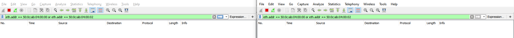
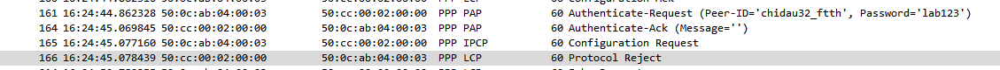
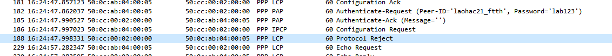

# LAB BRAS_service_lab_01

- --

* *LAB BRAS (advanced)**

- --

* *Task 1:**

```
Task information:
Fail users:
50:0c:ab:04:00:00
50:0c:ab:04:00:02
```

- **LAN8003BRA01_RE0**:

```
root@LAN8003BRA01_RE0> show system subscriber-management statistics
subscriber-management not enabled
command not supported
```

On a fresh install of the Junos Subscriber Management build, the system must be rebooted according to Juniper's documentation on Configuring Junos OS Enhanced Subscriber Management.

=>

- Reboot **LAN8003BRA01�**�after enabling Enhanced Subscriber Management.

- --

- **Không ghi nhận gói tin từ 2 sub lỗi gửi lên BRAS**



- **LAN8003BRA01_RE0**:

```
lab@LAN8003BRA01_RE0> monitor traffic interface ge-0/0/0 matching "(ether host 50:0c:ab:04:00:00) or (ether host 50:0c:ab:04:00:02)"
verbose output suppressed, use <detail> or <extensive> for full protocol decode
Address resolution is ON. Use <no-resolve> to avoid any reverse lookup delay.
Address resolution timeout is 4s.
Listening on ge-0/0/0, capture size 96 bytes

^C
108 packets received by filter
0 packets dropped by kernel

lab@LAN8003BRA01_RE0> monitor traffic interface ge-0/0/1 matching "(ether host 50:0c:ab:04:00:00) or (ether host 50:0c:ab:04:00:02)"
verbose output suppressed, use <detail> or <extensive> for full protocol decode
Address resolution is ON. Use <no-resolve> to avoid any reverse lookup delay.
Address resolution timeout is 4s.
Listening on ge-0/0/1, capture size 96 bytes

# ^C
188 packets received by filter
0 packets dropped by kernel

```

- **Không thấy nhận gói PADI từ sub lên**

```
lab@LAN8003BRA01_RE0> show pppoe statistics
Aug 23 13:45:34
Active PPPoE sessions: 6
  PacketType                       Sent         Received
    PADI                              0                6
    PADO                              6                0
    PADR                              0                6
    PADS                              6                0
    PADT                              0                0
    Service name error                0                0
    AC system error                   0                0
    Generic error                     0                0
    Malformed packets                 0                0
    Unknown packets                   0                0

lab@LAN8003BRA01_RE0> show pppoe statistics
Aug 23 13:47:54
Active PPPoE sessions: 6
  PacketType                       Sent         Received
    PADI                              0                6
    PADO                              6                0
    PADR                              0                6
    PADS                              6                0
    PADT                              0                0
    Service name error                0                0
    AC system error                   0                0
    Generic error                     0                0
    Malformed packets                 0                0
    Unknown packets                   0                0
```

<span style="background-color: #ffaaaa">

</span>

- **Radius không có bất thường**

```
lab@LAN8003BRA01_RE0> show network-access aaa statistics authentication
Aug 23 13:48:34
Authentication module statistics
  Requests received: 6
  Accepts: 6
  Rejects: 0
  Challenges: 0
  Timed out requests: 0

lab@LAN8003BRA01_RE0> show network-access aaa statistics authentication
Aug 23 13:48:42
Authentication module statistics
  Requests received: 6
  Accepts: 6
  Rejects: 0
  Challenges: 0
  Timed out requests: 0
```

<span style="background-color: #ffaaaa">

</span>

- **Không có user bị lockout**

```
lab@LAN8003BRA01_RE0> show pppoe lockout | match "lockout:"
    Total clients in lockout: 0
    Total clients in lockout: 0
    Total clients in lockout: 0
    Total clients in lockout: 0
    Total clients in lockout: 0
    Total clients in lockout: 0
```

- **Không bị drop bởi DDoS-protection**

```
lab@LAN8003BRA01_RE0> show ddos-protection protocols pppoe statistics brief
Aug 23 13:50:42
Packet types: 8, Received traffic: 3, Currently violated: 0

Protocol    Packet      Received        Dropped        Rate     Violation State
group       type        (packets)       (packets)      (pps)    counts
pppoe       aggregate   12              0              0        0         ok
pppoe       padi        6               0              0        0         ok
pppoe       pado        0               0              0        0         ok
pppoe       padr        6               0              0        0         ok
pppoe       pads        0               0              0        0         ok
pppoe       padt        0               0              0        0         ok
pppoe       padm        0               0              0        0         ok
pppoe       padn        0               0              0        0         ok

lab@LAN8003BRA01_RE0> show ddos-protection protocols pppoe statistics brief
Aug 23 13:50:44
Packet types: 8, Received traffic: 3, Currently violated: 0

Protocol    Packet      Received        Dropped        Rate     Violation State
group       type        (packets)       (packets)      (pps)    counts
pppoe       aggregate   12              0              0        0         ok
pppoe       padi        6               0              0        0         ok
pppoe       pado        0               0              0        0         ok
pppoe       padr        6               0              0        0         ok
pppoe       pads        0               0              0        0         ok
pppoe       padt        0               0              0        0         ok
pppoe       padm        0               0              0        0         ok
pppoe       padn        0               0              0        0         ok
```

<span style="background-color: #ffaaaa">

</span>

- **Không có alarm, core-dumps**

```
lab@LAN8003BRA01_RE0> show chassis alarms
Aug 23 13:51:55
No alarms currently active

lab@LAN8003BRA01_RE0> show system alarms
Aug 23 13:52:01
1 alarms currently active
Alarm time               Class  Description
2022-08-23 10:49:49 ICT  Minor  Rescue configuration is not set

lab@LAN8003BRA01_RE0> show system core-dumps
Aug 23 13:52:07
/var/crash/*core*: No such file or directory
/var/tmp/*core*: No such file or directory
/var/tmp/pics/*core*: No such file or directory
/var/crash/kernel.*: No such file or directory
/var/jails/rest-api/tmp/*core*: No such file or directory
/tftpboot/corefiles/*core*: No such file or directory
```

<span style="background-color: #ffaaaa">

</span>

<span style="background-color: #ffaaaa">=> Lỗi dưới metro access hoặc thuê bao cấu hình sai</span>

* *Task 2:**

* *Task 3:**

- XPORT_OSPF_C2_S1;

* *Task 4:**

- **R1:**

```
lab@LAN8003BRA01_RE0> show network-access aaa terminate-code brief
Aug 25 15:52:37

Terminate-code:
  RADIUS     Custom Usage-Count Type Code
  10         no     4           ppp  lcp-negotiation-timeout

lab@LAN8003BRA01_RE0> show network-access aaa terminate-code brief
Aug 25 16:13:21

Terminate-code:
  RADIUS     Custom Usage-Count Type Code
  10         no     20          ppp  lcp-negotiation-timeout

```





- **R2:**

```
[edit]
lab@LAN8003BRA01_RE0# run show network-access aaa statistics address-assignment pool ftth
Aug 25 16:36:04
Address assignment statistics
  Pool Name: ftth
    Out of Memory: 0
    Out of Addresses: 82
    Address total: 4
    Addresses in use: 4
    Address Usage (percent): 100
    Pool drain configured: no
```

* *Task 7:**

* *Task 8:**

* *Task 9:**

- done in Task 1

* *Task 10:**
