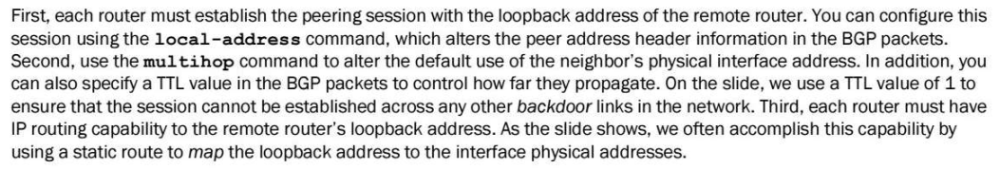
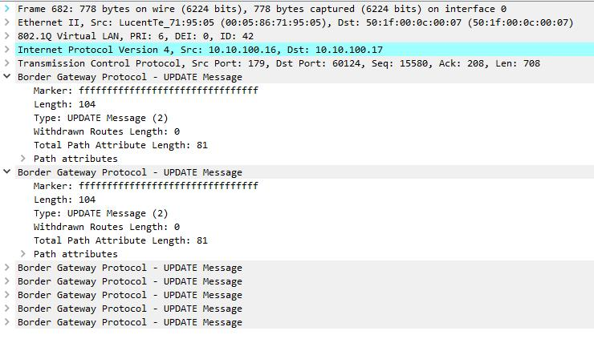
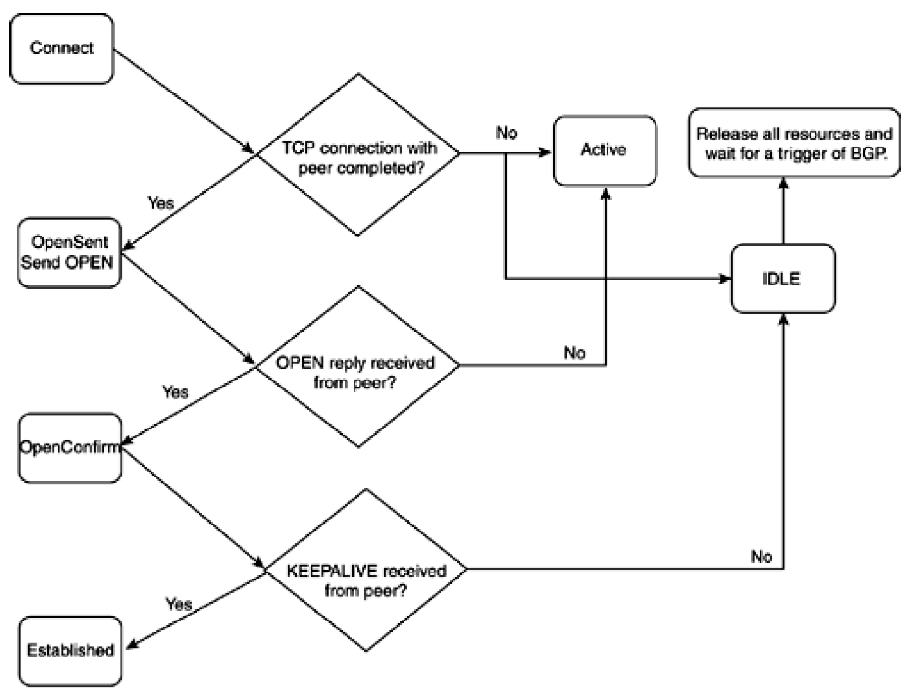
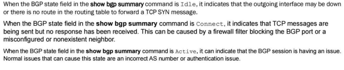
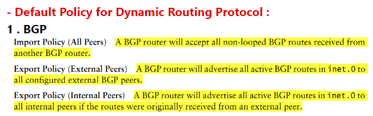

# BGP notes

BGP uses TCP as its transport protocol, using port 179 for establishing connections. Running over a reliable transport protocol eliminates the need for BGP to implement update fragmentation, retransmission, acknowledgment, and sequencing.

AS path, which is a list of numbers of the ASs that a route passes through to reach the local router. The first number in the path is that of the last AS in the path—the AS closest to the local router. The last number in the path is the AS farthest from the local router, which is generally the origin of the path.

For each prefix in the routing table, the routing protocol process selects a single best path, called the active path. Unless you configure BGP to advertise multiple paths to the same destination, BGP advertises only the active path.

The BGP router that first advertises a route assigns it one of the following values to identify its origin. During route selection, the lowest origin value is preferred.

0—The router originally learned the route through an IGP (OSPF, IS-IS, or a static route).

1—The router originally learned the route through an EGP (most likely BGP).

2—The route's origin is unknown.

Routes that are not eligible to be used for forwarding (for example, because they were rejected by routing policy or because a next hop is inaccessible) have a preference of –1 and are never chosen.

Depending on whether nondeterministic routing table path selection behavior is configured, there are two possible cases:

If nondeterministic routing table path selection behavior is not configured (that is, if the path-selection cisco-nondeterministic statement is not included in the BGP configuration), for paths with the same neighboring AS numbers at the front of the AS path, prefer the path with the lowest MED metric. To always compare MEDs whether or not the peer ASs of the compared routes are the same, include the path-selection always-compare-med statement.

If nondeterministic routing table path selection behavior is configured (that is, the path-selection cisco-nondeterministic statement is included in the BGP configuration), prefer the path with the lowest MED metric.

The routing process path selection takes place before BGP hands off the path to the routing table to makes its decision. To configure routing table path selection behavior, include the path-selection statement:

path-selection {

(always-compare-med | cisco-non-deterministic | external-router-id);

as-path-ignore;

l2vpn-use-bgp-rules;

med-plus-igp {

igp-multiplier number;

med-multiplier number;

}

}

Routing table path selection can be configured in one of the following ways:

```text
Emulate the Cisco IOS default behavior (cisco-non-deterministic). This mode evaluates routes in the order that they are received and does not group them according to their neighboring AS. With cisco-non-deterministic mode, the active path is always first. All inactive, but eligible, paths follow the active path and are maintained in the order in which they were received, with the most recent path first. Ineligible paths remain at the end of the list.
```

As an example, suppose you have three path advertisements for the 192.168.1.0 /24 route:

Path 1—learned through EBGP; AS Path of 65010; MED of 200

Path 2—learned through IBGP; AS Path of 65020; MED of 150; IGP cost of 5

Path 3—learned through IBGP; AS Path of 65010; MED of 100; IGP cost of 10

```text
These advertisements are received in quick succession, within a second, in the order listed. Path 3 is received most recently, so the routing device compares it against path 2, the next most recent advertisement. The cost to the IBGP peer is better for path 2, so the routing device eliminates path 3 from contention. When comparing paths 1 and 2, the routing device prefers path 1 because it is received from an EBGP peer. This allows the routing device to install path 1 as the active path for the route.
```

Always comparing MEDs whether or not the peer ASs of the compared routes are the same (always-compare-med).

Override the rule that If both paths are external, the currently active path is preferred (external-router-id). Continue with the next step (Step 12) in the path-selection process.

Adding the IGP cost to the next-hop destination to the MED value before comparing MED values for path selection (med-plus-igp).

BGP multipath does not apply to paths that share the same MED-plus-IGP cost, yet differ in IGP cost. Multipath path selection is based on the IGP cost metric, even if two paths have the same MED-plus-IGP cost.

You can specify a number from 1 through 4,294,967,295 in plain-number format.

4-byte AS numbers as defined in RFC 4893, BGP Support for Four-octet AS Number Space. In Junos OS Release 9.3 and later, you can also configure a 4-byte AS number using the AS-dot notation format of two integer values joined by a period: <16-bit high-order value in decimal>.<16-bit low-order value in decimal>. For example, the 4-byte AS number of 65,546 in plain-number format is represented as 1.10 in the AS-dot notation format. You can specify a value from 0.0 through 65535.65535 in AS-dot notation format. Junos OS continues to support 2-byte AS numbers. The 2-byte AS number range is 1 through 65,535 (this is a subset of the 4-byte range).

###### ####################################

ttl-value

TTL value for BGP packets.

```text
Default: 64 (for multihop EBGP sessions, confederations, and IBGP sessions)
```

```text
Default: 1 (for single-hop EBGP sessions)
```

A TTL value of 1 is sufficient to enable an EBGP session to the loopback address of a directly connected neighbor.

###### ####################################

Autonomous system

ASs are identified by a number that is assigned by the Network Information Center (NIC) in the United States (http://www.isi.edu)

AS-dot notation format of two integer values joined by a period: <16-bit high-order value in decimal>.<16-bit low-order value in decimal>.

RFC 4893, BGP Support for Four-octet AS Number Space. RFC 4893 introduces two new optional transitive BGP attributes, AS4\_PATH and AS4\_AGGREGATOR. These new attributes are used to propagate 4-byte AS path information across BGP speakers that do not support 4-byte AS numbers. RFC 4893 also introduces a reserved, well-known, 2-byte AS number, AS 23456. This reserved AS number is called AS\_TRANS in RFC 4893

autonomous-system—AS number. Use a number assigned to you by the NIC.

```text
Range: 1 through 4,294,967,295 (232 – 1) in plain-number format for 4-byte AS numbers
```

```text
Range: 0.0 through 65535.65535 in AS-dot notation format for 4-byte numbers
```

65,546 in plain-number format is represented as 1.10 in the AS-dot notation format.

The set of reserved AS numbers is in the range from 64,512 through 65,535.

The 32-bit private ASN scope is in the range from 4,200,000,000 through 4,294,967,294.

###### ####################################

loops number

Specify the number of times detection of the AS number in the AS\_PATH attribute causes the route to be discarded or hidden.

```text
Range: 1 through 10
```

```text
Default: 1
```

For example, if you configure loops 1, the route is hidden if the AS number is detected in the path one or more times. This is the default behavior. If you configure loops 2, the route is hidden if the AS number is detected in the path two or more times.

###### #########################################

Hành xử mặc định trên Junos về BGP next-hop sẽ như sau:

- Đối với EBGP: Next-hop là địa chỉ IP của neighbor đã quảng bá các route đó.
- Đối với IBGP: sẽ có 3 trường hợp, cụ thể:

- Các routes xuất phát bên trong AS đã có sẵn forwarding next-hop thì next-hop của các route đó khi quảng bá qua BGP sẽ lấy forwarding next-hop này (third-party next-hop)
- Các routes xuất phát bên trong AS với next-hop là reject hoặc discard, khi đó next-hop được quảng bá vào BGP sẽ là địa chỉ IP đang dùng để kết nối phiên BGP.
- Các routes được quảng bá vào AS từ EBGP thì next-hop sẽ không bị thay đổi khi route này được quảng bá tiếp (propagate) vào IBGP.[1]

  AE đọc xem diễn tả như thế này có bị khó hiểu không. Nếu cần điêu chỉnh gì thì comment thêm nhé.

###### ########################################

eBGP:

- mặc định ttl =1
- Chỉ accept trên interface đấu nối
- Trường hợp peer bằng ip loopback thì phải bật multihop (Khi đó TTL=64). Nếu set TTL=1 cũng có thể thiết lập neighbor



Update Massage

- 1 packet bgp update có thể có nhiều msg

- khác att thì khác message
- cùng att thì goom chung trong 1 message



- mỗi AFI SAFI tách thành riêng packet
- ipv4 unicast thì không thấy có afi safi

- cũng không thấy att gọi là Reachable NLRI và unreachable NLRI

- còn của family khác (ipv6 unicast) thì có afi safi

- lúc này mới có Reachable NLRI và unreachable NLRI

BGP holdown timer

- Deactive bgp neighbor -> down ngay
- Mất link -> down port trên thiết bị -> down ebgp peer ngay
- Mất link -> không down port trên thiết bị -> hết holdown mới down

```text
BGP state transition
```





To summarize:

```text
Active state - local router has just sent a TCP SYN
Connect state - local router has just received a TCP SYN from it's peer
```

```text
The "initiating" BGP speaker's state transitions to form the adjacency will be: Idle, Active, Open Sent, Open Received, Established
```

```text
The "responding" BGP speaker's state transitions to form the adjacency will be: Idle, Connect, Open Sent, Open Received, Established
```

```text
Notice, only the peer which Initiated the TCP handshake passes through Active state. And only the peer which did NOT initiate the TCP handshake passes through the Connect state.
```

https://networkengineering.stackexchange.com/questions/63219/what-is-the-difference-between-connect-and-active-states-of-bgp

It is the default \*BSD TCP behaviour... 512 is the default for non-connected links. If directly connected the mtu is used.

- --

First of all a bit of a theory: if an incoming IP packet is to be forwarded to another next hop and the MTU of this new path is smaller than the packet to be transmitted, we must find a way to forward the packet. If the packet has DF (Don’t Fragment) bit on i.e we are instructed not to fragment the packet most probably by the source, then normally we are expected to send an ICMP packet with type “Fragmentation needed” and pray that on the way back to the source no devices block all ICMP type of traffic. Second scenario is that what if the source lets us fragment the packet. Then we need to fragment it and story from now on is about this part of the scenario and the topology we will use is something like below.

- --

add-path feature

- Quảng bá
- Có thể dùng cho tất cả route hoặc cho một số route

With the add-path send path-count 6 configuration, Router R1 is configured to send up to six paths (per destination) to Router R4.

With the add-path receive configuration, Router R4 is configured to receive multiple paths from Router R1.

With the add-path send path-count 6 configuration, Router R4 is configured to send up to six paths to Router R8.

With the add-path receive configuration, Router R8 is configured to receive multiple paths from Router R4.

The add-path send prefix-policy allow\_199 policy configuration (along with the corresponding route filter) limits Router R4 to sending multiple paths for only the 172.16.199.1/32 route.

- --

Kiểm tra được BGP dùng bao nhiêu bộ nhớ dành cho BGP route

- rpd process là 32-bit dùng khoảng 4G

- JunOS 32-bit chắc chắn rpd 32-bit

- rpd process là 64-bit dùng nhiều hơn

- JunOS 64-bit thì rpd có thể là 32-bit hoặc 64-bit

Route bị AS-PATH loop thì sẽ không có trong bản RIB-IN

- Route nhận từ neighbor sẽ qua bước sanity-check (AS-PATH loop) mới được đưa vào bản RIB-IN

- --

Default policy for BGP


