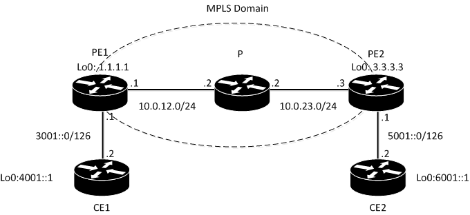
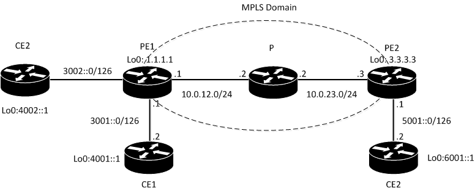

# IPv6 Free Core: Configuring IPv6 Labeled Unicast on Juniper MX

# **<https://www.ghostwire.me/2017/11/ipv6-free-core-configuring-ipv6-labeled.html>**

Here's just a short note on IPv6 Labeled Unicast - an elegant solution to the case where you need to connect two IPv6 sites through your IPv4-only network. (The other option would, of course, be to enable IPv6 on all of your core routers, which is not always convenient).

So here I'm going to show you the minimal configuration to get this lab up and running, a trick that would make the configuration more optimal and elegant (why would you need "explicit-null"?), and take a quick look on what's going on behind the scene.

That's what my topology looks like:

I have OSPF running between PEs and CEs. The configuration on CEs is extremely simple, so I won't list it here. Here's BGP configuration of core routers:

PE1:

root@PE1# show protocols bgp

export OSPF\_2\_BGP;

group VPN\_BGP {

type internal;

local-address 1.1.1.1;

family inet6 {

labeled-unicast;

}

neighbor 3.3.3.3;

}

root@PE1# show policy-options policy-statement OSPF\_2\_BGP

term 1 {

from protocol ospf3;

then accept;

}

And a similar configuration on PE2:

root@PE2# show protocols bgp

export OSPF\_2\_BGP;

group VPN\_BGP {

type internal;

local-address 3.3.3.3;

family inet6 {

labeled-unicast;

}

neighbor 1.1.1.1;

}

That's what full configuration of PE1 looks like.

interfaces {

ge-0/0/0 {

unit 0 {

family inet {

address 10.0.12.1/24;

}

family mpls;

}

}

ge-0/0/1 {

unit 0 {

family inet6 {

address 3001::1/126;

}

}

}

lo0 {

unit 0 {

family inet {

address 1.1.1.1/32;

}

}

}

}

routing-options {

router-id 1.1.1.1;

autonomous-system 64500;

}

protocols {

mpls {

interface all;

interface ge-0/0/1.0 {

disable;

}

}

bgp {

export OSPF\_2\_BGP;

group VPN\_BGP {

type internal;

local-address 1.1.1.1;

family inet6 {

labeled-unicast;

}

neighbor 3.3.3.3;

}

}

ospf {

area 0.0.0.0 {

interface all;

interface ge-0/0/1.0 {

disable;

}

}

}

ospf3 {

export BGP\_2\_OSPF;

area 0.0.0.0 {

interface ge-0/0/1.0;

}

}

ldp {

transport-address router-id;

interface ge-0/0/1.0 {

disable;

}

interface all;

}

}

policy-options {

policy-statement BGP\_2\_OSPF {

term 1 {

from {

family inet6;

protocol bgp;

}

then accept;

}

}

policy-statement OSPF\_2\_BGP {

term 1 {

from protocol ospf3;

then accept;

}

}

}

Let's make a check for received routes on PE2:

root@PE2# run show route receive-protocol bgp 1.1.1.1 table inet6.0

inet6.0: 7 destinations, 7 routes (6 active, 0 holddown, 1 hidden)

Oh.

Let's find out why it's hidden:

root@PE2# run show route 4001::1/128 hidden

inet6.0: 7 destinations, 7 routes (6 active, 0 holddown, 1 hidden)

+ = Active Route, - = Last Active, \* = Both

4001::1/128         [BGP/170] 00:08:58, MED 1, localpref 100, from 1.1.1.1

AS path: I, validation-state: unverified

Unusable

root@PE2# run show route 4001::1/128 extensive hidden | match "next hop"

Next hop type: Unusable

Indirect next hops: 1

Protocol next hop: ::ffff:1.1.1.1

Indirect next hop: 0x0 - INH Session ID: 0x0

So, we have unusable next hop. Where did it come from, anyway? We have not configured anything like this on PE1, right? We won't see it in show int terse.

The thing is that next-hop address family needs to be the same as the address family of the route itself, so we need some IPv6 address..and what PE1 uses for it is so-called IPv4-mapped IPv6 address (which format is  0:0:0:0:0:FFFF:IPv4address), simply converting the IPv4 address that it uses for establishing BGP session to IPv6.

Now, PE2 is not aware of all these tricky operations and just sees some weird IPv6 address as next-hop which is not found in any of PE2's tables, so it legitimately puts that route in hidden.

Basically we need to do two things:

1) we need PE2 to perform the same trick: convert IPv4 prefixes to IPv6

2) we need to put this prefix in inet6.3 table

So what we're doing in fact is telling "Associate this IPv4 prefix with that IPv6 prefix and use the same MPLS label you use for this IPv4 prefix".

This is done with set protocols mpls ipv6-tunneling. Let's configure it and see what happens:

root@PE2# set protocols mpls ipv6-tunneling

root@PE2# commit

commit complete

root@PE2# run show route 4001::1

inet6.0: 7 destinations, 7 routes (7 active, 0 holddown, 0 hidden)

+ = Active Route, - = Last Active, \* = Both

4001::1/128        \*[BGP/170] 02:03:38, MED 1, localpref 100, from 1.1.1.1

AS path: I, validation-state: unverified

> to 10.0.23.2 via ge-0/0/1.0, Push 300032, Push 299856(top)

root@PE2# run show route table inet6.3

inet6.3: 2 destinations, 2 routes (2 active, 0 holddown, 0 hidden)

+ = Active Route, - = Last Active, \* = Both

::ffff:1.1.1.1/128 \*[LDP/9] 01:46:17, metric 1

> to 10.0.23.2 via ge-0/0/1.0, Push **299856**

::ffff:2.2.2.2/128 \*[LDP/9] 01:46:17, metric 1

> to 10.0.23.2 via ge-0/0/1.0

Cool. We can confirm that label used to reach ::ffff:1.1.1.1/128 is the same label that is used to reach 1.1.1.1:

root@PE2# run show route table inet.3 1.1.1.1

inet.3: 2 destinations, 2 routes (2 active, 0 holddown, 0 hidden)

+ = Active Route, - = Last Active, \* = Both

1. 1.1.1/32         \*[LDP/9] 01:59:20, metric 1

> to 10.0.23.2 via ge-0/0/1.0, Push **299856**

Let's confirm everything is fine now:

Client2#ping 4001::1 so 6001::1

Type escape sequence to abort.

Sending 5, 100-byte ICMP Echos to 4001::1, timeout is 2 seconds:

Packet sent with a source address of 6001::1

!!!!!

Success rate is 100 percent (5/5), round-trip min/avg/max = 7/19/61 ms

We could've stopped here. But what if we want to add another client on PE1 side? Let's assume this client advertises 4002::1/32 to us. Like that:

That's what we'll see on PE2 then:

root@PE2# run show route protocol bgp table inet6.0

inet6.0: 8 destinations, 8 routes (8 active, 0 holddown, 0 hidden)

+ = Active Route, - = Last Active, \* = Both

4001::1/128        \*[BGP/170] 02:25:05, MED 1, localpref 100, from 1.1.1.1

AS path: I, validation-state: unverified

> to 10.0.23.2 via ge-0/0/1.0, Push **300032**, Push 299856(top)

4002::1/128        \*[BGP/170] 00:01:19, MED 1, localpref 100, from 1.1.1.1

AS path: I, validation-state: unverified

> to 10.0.23.2 via ge-0/0/1.0, Push **300048**, Push 299856(top)

See? We still use 299856 to reach PE1, that's label advertised to us via LDP. But there's also bottom label advertised via BGP-LU - and it's different for these two destinations. Let's check PE1:

root@PE1# run show route table mpls.0 label **300032**

mpls.0: 11 destinations, 11 routes (11 active, 0 holddown, 0 hidden)

+ = Active Route, - = Last Active, \* = Both

300032             \*[VPN/170] 02:29:01

> to fe80::a8bb:ccff:fe00:510 via **ge-0/0/1.0**, Pop

root@PE1# run show route table mpls.0 label **300048**

mpls.0: 11 destinations, 11 routes (11 active, 0 holddown, 0 hidden)

+ = Active Route, - = Last Active, \* = Both

300048             \*[VPN/170] 00:05:27

> to fe80::a8bb:ccff:fe00:620 via **ge-0/0/2.0**, Pop

At the moment PE1 assigns prefixes per next-hop. So we'll end up having as many labels as many connected client links we have.

Are there any reasons to worry ~~apart from being greedy~~? Well, this will look a bit burdensome if you have sufficient amount of clients..and that's just not right from the logical point of view. Why use extra label if this is not a L3VPN? Why don't just use only one label to reach PE1 which then will figure out what to do with this packet by the means of IP header and not MPLS label?

That's where "explicit null" comes in.

Let's just configure on PE1:

set protocols bgp group VPN\_BGP family inet6 labeled-unicast explicit-null

and see what happens on PE2:

root@PE2# run show route protocol bgp table inet6.0

inet6.0: 8 destinations, 8 routes (8 active, 0 holddown, 0 hidden)

+ = Active Route, - = Last Active, \* = Both

4001::1/128        \*[BGP/170] 00:00:05, MED 1, localpref 100, from 1.1.1.1

AS path: I, validation-state: unverified

> to 10.0.23.2 via ge-0/0/1.0, Push 2, Push 299856(top)

4002::1/128        \*[BGP/170] 00:00:05, MED 1, localpref 100, from 1.1.1.1

AS path: I, validation-state: unverified

> to 10.0.23.2 via ge-0/0/1.0, Push 2, Push 299856(top)

Perfect. Let's check what's going on PE1:

root@PE1# run show route table mpls.0 label 2

mpls.0: 9 destinations, 9 routes (9 active, 0 holddown, 0 hidden)

+ = Active Route, - = Last Active, \* = Both

2                  \*[MPLS/0] 16:08:48, metric 1

to table inet6.0

Note there's no outgoing interfaces listed, unlike the previous output - there's just inet6.0.

Now let's check connectivity once again:

Client2#ping 4001::1 so 6001::1

Type escape sequence to abort.

Sending 5, 100-byte ICMP Echos to 4001::1, timeout is 2 seconds:

Packet sent with a source address of 6001::1

.....

Oh, no. We ruined everything.

It can be fixed easily, however, with assigning inet6 address-family to core-facing PEs interfaces:

root@PE1# set interfaces ge-0/0/0 unit 0 family inet6

root@PE2# set interfaces ge-0/0/1 unit 0 family inet6

Client2#ping 4001::1 so 6001::1

Type escape sequence to abort.

Sending 5, 100-byte ICMP Echos to 4001::1, timeout is 2 seconds:

Packet sent with a source address of 6001::1

!!!!!

Success rate is 100 percent (5/5), round-trip min/avg/max = 7/8/13 ms

Why do we need to do this? Well, that's just a guess, but note once again that what when we had a per-next-hop label assignment, there was **no ip lookup performed at all** - when packet arrived to PE1, PE1 only looked up MPLS label in mpls.0 table and forwarded the packet to the interface that label was bound to. Remember, we had a different label per each outgoing interface.

Now, when we receive packet with label of 2 we only know it belongs to IPv6 table - we don't know where we shoul forward exactly, so we'll have to **additionally perform ip lookup**.

(Can't really tell why we need inet6 on interface, cause we still receive packet with MPLS label of 2, not a naked IPv6 packet..but I'm sure it has something to do with what I've explained above. Maybe in cases when Junos has to perform ip lookup, it has to check if the interface the packet arrived to has corresponding address family on it. Feel free to comment if you know more about it).

- --

<https://www.inetzero.com/blog/6pe-and-6vpe/>
