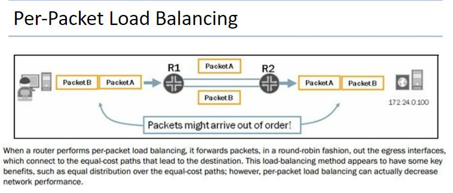
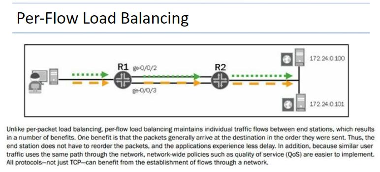
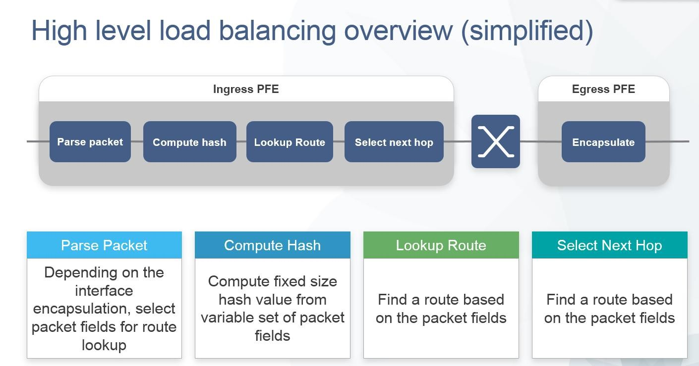
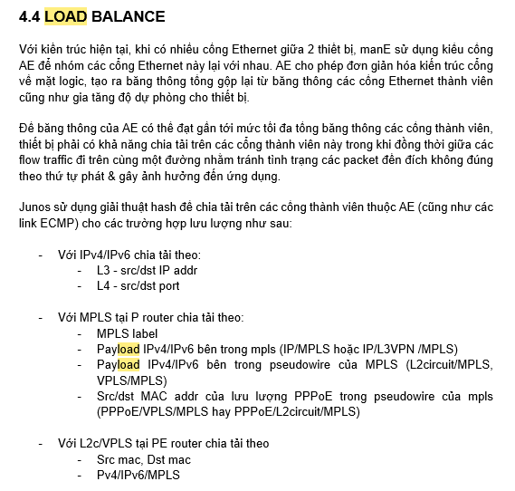
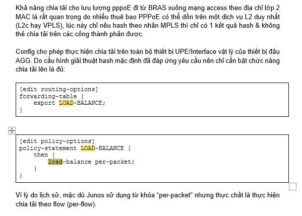
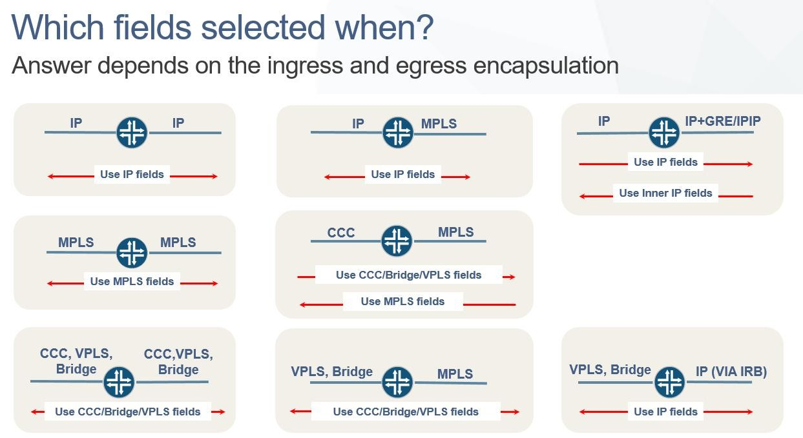
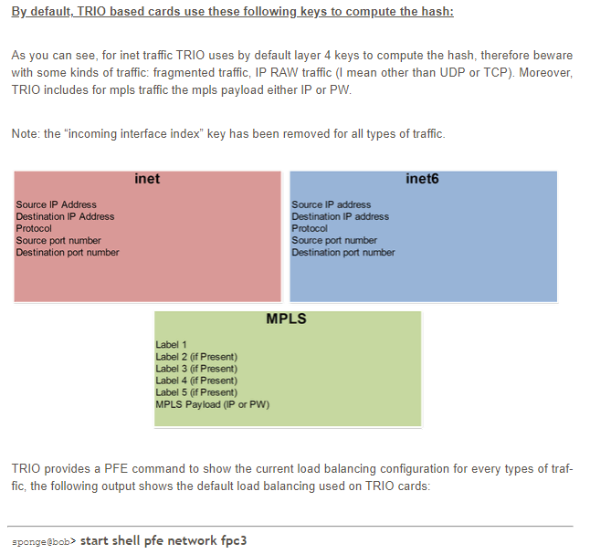

# Juniper load balance

* *### Document file jnpr-trio-lb-overview.pptx**

* *### From Routing Fundamentals JNCIA-JUNOS Foryanto Jaya Wiguna**

* *### From A.Thái**

* *### From ACT HLD**

* *### From TA**

* *### From internet: <http://junosandme.over-blog.com/article-junos-load-balancing-part-1-introduction-105738134.html>**

