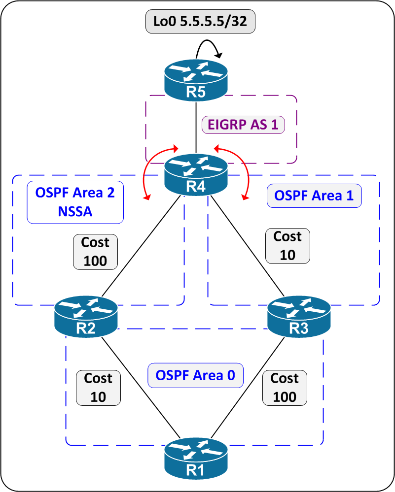

# OSPF Path Selection Challenge



## Task

- Given the above topology, where R4 mutually redistributes between EIGRP and OSPF, which path(s) will R1 choose to reach the network 5.5.5.5/32, and why?
- What will R2's path selection to 5.5.5.5/32 be, and why?
- What will R3's path selection to 5.5.5.5/32 be, and why?
- Assume R3's link to R1 is lost. Does this affect R1's path selection to 5.5.5.5/32? If so, how?

## Configuration

Given the above topology, where R4 mutually redistributes between EIGRP and OSPF, which path(s) will R1 choose to reach the network 5.5.5.5/32?

Path R1 > R3 > R4 > R5

R1#show ip route 5.5.5.5

Routing entry for 5.5.5.5/32

Known via "ospf 1", distance 110, metric 20, type extern 2, forward metric 110

Last update from 13.0.0.3 on GigabitEthernet1.13, 14:34:15 ago

Routing Descriptor Blocks:

\* 13.0.0.3, from 4.4.4.4, 14:34:15 ago, via GigabitEthernet1.13

Route metric is 20, traffic share count is 1

R1#traceroute 5.5.5.5

Type escape sequence to abort.

Tracing the route to 5.5.5.5

VRF info: (vrf in name/id, vrf out name/id)

1 13.0.0.3 3 msec 1 msec 1 msec

2 34.0.0.4 2 msec 1 msec 1 msec

3 45.0.0.5 4 msec \* 2 msec

Why?

R1 only learns one path to 5.5.5.5/32, which is via R3. This is because R4 prevents R2 from translating the Type-7 NSSA External LSA from Area 2 to a Type-5 External LSA into Area 0. This behavior is per [RFC 3101 The OSPF Not-So-Stubby Area (NSSA) Option](https://www.ietf.org/rfc/rfc3101.txt):

2. 4 Originating Type-7 LSAs

NSSA AS boundary routers may only originate Type-7 LSAs into NSSAs.

An NSSA internal AS boundary router must set the P-bit in the LSA

header's option field of any Type-7 LSA whose network it wants

advertised into the OSPF domain's full transit topology. The LSAs of

these networks must have a valid non-zero forwarding address. If the

P-bit is clear the LSA is not translated into a Type-5 LSA by NSSA

border routers.

When an NSSA border router originates both a Type-5 LSA and a Type-7

LSA for the same network, then the P-bit must be clear in the Type-7

LSA so that it isn't translated into a Type-5 LSA by another NSSA

border router.

R2 cannot translate the LSA from 7 to 5, per the below output:

R2#show ip ospf database nssa-external 5.5.5.5

OSPF Router with ID (2.2.2.2) (Process ID 1)

Type-7 AS External Link States (Area 2)

LS age: 1976

Options: (No TOS-capability, No Type 7/5 translation, DC, Upward)

LS Type: AS External Link

```text
Link State ID: 5.5.5.5 (External Network Number )
```
Advertising Router: 4.4.4.4

LS Seq Number: 80000019

```text
Checksum: 0x3C26
Length: 36
```
Network Mask: /32

```text
Metric Type: 2 (Larger than any link state path)
MTID: 0
Metric: 20
```
Forward Address: 0.0.0.0

External Route Tag: 0

R1 only has one path to the external route, per the below output:

R1#show ip ospf database external 5.5.5.5

OSPF Router with ID (1.1.1.1) (Process ID 1)

Type-5 AS External Link States

LS age: 485

Options: (No TOS-capability, DC, Upward)

LS Type: AS External Link

```text
Link State ID: 5.5.5.5 (External Network Number )
```
Advertising Router: 4.4.4.4

LS Seq Number: 8000001B

```text
Checksum: 0x540E
Length: 36
```
Network Mask: /32

```text
Metric Type: 2 (Larger than any link state path)
MTID: 0
Metric: 20
```
Forward Address: 0.0.0.0

External Route Tag: 0

R1#show ip ospf database asbr-summary 4.4.4.4

OSPF Router with ID (1.1.1.1) (Process ID 1)

Summary ASB Link States (Area 0)

LS age: 148

Options: (No TOS-capability, DC, Upward)

LS Type: Summary Links(AS Boundary Router)

```text
Link State ID: 4.4.4.4 (AS Boundary Router address)
```
Advertising Router: 3.3.3.3

LS Seq Number: 8000001C

```text
Checksum: 0x9664
Length: 28
```
Network Mask: /0

```text
MTID: 0 Metric: 10
```
Bonus Questions:

What will R2's path selection to 5.5.5.5/32 be?

Path R2 > R4 > R5

R2#traceroute 5.5.5.5

Type escape sequence to abort.

Tracing the route to 5.5.5.5

VRF info: (vrf in name/id, vrf out name/id)

1 24.0.0.4 3 msec 1 msec 0 msec

2 45.0.0.5 2 msec \* 2 msec

Why?

External routes to an ASBR within your area will always be preferred over external routes to an ASBR in a different area, regardless of cost.

Per the below output, R1 routes through R3 with a metric of 20 and a forward metric of 110.

R1#show ip route 5.5.5.5

Routing entry for 5.5.5.5/32

Known via "ospf 1", distance 110, metric 20, type extern 2, forward metric 110

Last update from 13.0.0.3 on GigabitEthernet1.13, 14:41:21 ago

Routing Descriptor Blocks:

\* 13.0.0.3, from 4.4.4.4, 14:41:21 ago, via GigabitEthernet1.13

Route metric is 20, traffic share count is 1

R2 routes through R4 with a metric of 20 and a forward metric of 100.

R2#show ip route 5.5.5.5

Routing entry for 5.5.5.5/32

Known via "ospf 1", distance 110, metric 20, type NSSA extern 2, forward metric 100

Last update from 24.0.0.4 on GigabitEthernet1.24, 14:42:11 ago

Routing Descriptor Blocks:

\* 24.0.0.4, from 4.4.4.4, 14:42:11 ago, via GigabitEthernet1.24

Route metric is 20, traffic share count is 1

Even with a modified forward metric of a higher value, R2 will not choose to route through Area 0 to reach an External route with an originator address that is reachable via an Intra-Area path.

R2#config t

Enter configuration commands, one per line. End with CNTL/Z.

R2(config)#int gig1.24R2(config-subif)#ip ospf cost 65535

R2(config-subif)#end

R2#

R2#show ip route 5.5.5.5

Routing entry for 5.5.5.5/32

Known via "ospf 1", distance 110, metric 20, type NSSA extern 2, forward metric 65535

Last update from 24.0.0.4 on GigabitEthernet1.24, 14:44:24 ago

Routing Descriptor Blocks:

\* 24.0.0.4, from 4.4.4.4, 14:44:24 ago, via GigabitEthernet1.24

Route metric is 20, traffic share count is 1

What will R3's path selection to 5.5.5.5/32 be?

Path R3 > R4 > R5

Why?

Similar to R1, R3 will only learn one Type-5 External, as R2 is not allowed to translate it's Type-7 LSA to Type-5.

Assume R3's link to R1 is lost. Does this affect R1's path selection to 5.5.5.5/32? If so, how?

Yes, reachability from R1 to R5 is lost if R3 becomes disconnected from Area 0. This is because R4 still does not set the P-Bit in the Type-7 LSA it orginates, which prevents R2 from translating it into Area 0.

R1#show ip route 5.5.5.5

Routing entry for 5.5.5.5/32

Known via "ospf 1", distance 110, metric 20, type extern 2, forward metric 110

Last update from 13.0.0.3 on GigabitEthernet1.13, 14:47:49 ago

Routing Descriptor Blocks:

\* 13.0.0.3, from 4.4.4.4, 14:47:49 ago, via GigabitEthernet1.13

Route metric is 20, traffic share count is 1

R3#config t

Enter configuration commands, one per line. End with CNTL/Z.

R3(config)#int gig1.13R3(config-subif)#shutdown

R3(config-subif)#

```text
%OSPF-5-ADJCHG: Process 1, Nbr 1.1.1.1 on GigabitEthernet1.13 from FULL to DOWN, Neighbor Down: Interface down or detached
```
R1#

```text
%OSPF-5-ADJCHG: Process 1, Nbr 3.3.3.3 on GigabitEthernet1.13 from FULL to DOWN, Neighbor Down: Dead timer expired
```
R1#show ip route 5.5.5.5 % Network not in table
