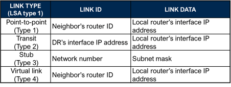
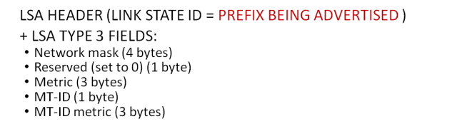
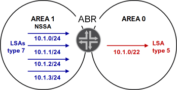
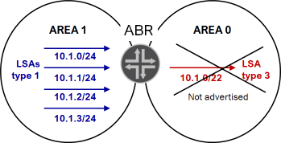
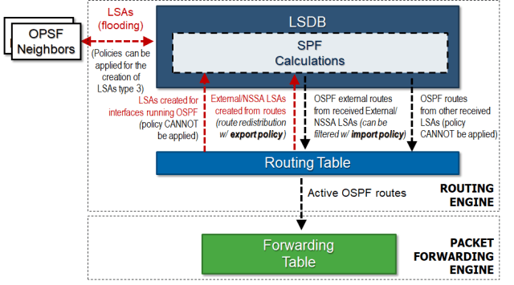
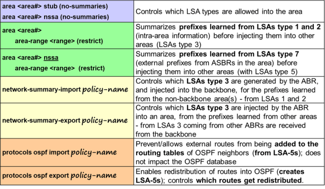

# OSPF SUMMARY

Source: <https://momcanfixanything.com/ospf-summary/>

* *OSPF PACKET TYPES**


* *HELLO PACKETS**


* *Adjacencies formation:**

An adjacency could fail if there is a mismatch of any of the following parameters:

- MTU (stuck in exstart)
- Network address
- Subnet mask
- Hello interval and/or dead interval
- Area type
- Authentication
- Area id
- Interface type (broadcast, ptp, ptmp…)

OR if there is a Duplicate RID or IP address

* *DR ELECTION**

- Highest priority wins
- Default priority is 128
- Priority = 0 means ineligible
- Highest RID if same priority
- Election NOT deterministic

- Election occurs within the first 40 sec of OSPF coming up

- No preemption
- point-to-point link (**set protocols ospf area  interface  interface-type p2p**) => no DR

* *LSA TYPES:**


- **ONLY LSA with domain scope = LSA type 5!!!**


* *LSA TYPES AND AREA TYPE:**


* *LSAs HEADER:**


```text
*LINK STATE TYPE AND LINK STATE ID:**
Meaning of **LINK STATE ID** field in the **LSA HEADER** depends on the LSA type:
```


* *LSA TYPE 1**


Meaning of **LINK ID** and **LINK DATA** fields, within the **ROUTER LSA** (TYPE 1), depends on the **LINK TYPE**:



How to remember? For Link Types 1, 2, and 4 Link ID = neighbors info, Link Data = Local info.

* *NOTE**: A point to point link is advertised with TWO LSAs Type 1 (Link type 1 and link type 3):


* *LSA TYPE 2**


Network LSA does NOT contain any prefix information, though it advertises the subnet mask for the network.

* *LSA TYPE 3**



```text
For **LSAs type 3**, the **advertised prefix** is in the **LINK STATE ID** (in the **LSA HEADER**).
```
* *LSA TYPE 4**


```text
For **LSAs type** **4,** the **advertised ASBR RID** is in the **LINK STATE ID** (in the **LSA HEADER**).
```
* *LSA TYPE 5**


External LSAs header E-bit:


* *LSA TYPE 7**

Same format as LSA Type 5

Translated into an AS external LSA (Type 5) by the ABR at the NSSA border. This CANNOT be disabled!

If more than one ABR exists the one with the highest RID does the translation.

* *Other LSAs supported by Junos:**

- Type 9: used for graceful restart capability
- Type 10: used for MPLS traffic engineering

* *ADVERTISEMENT OF DEFAULT ROUTE INTO AREAS**

* *Default route not advertised into NSSA area or stub area by default**. Use **default-metric** command.


* *Default-route** advertised as an **LSA type 3 for a STUB area**; as an **LSA type 7 or type 3 on NSSA** depending on configuration.


* *ROUTE SUMMARIZATION**

Only an ABR can summarize prefixes.

You **CANNOT summarize LSAs type 1 and type 2**, but an ABR can summarize prefixes learned from LSAs type 1 and type 2 and place the summary into LSAs type 3, instead of the specific prefixes.


This is NOT possible!


Default behavior.


Also, just like LSAs type 1 and type 2 cannot be summarized, LSAs type 5 cannot be summarize. However, an ABR that is translating LSAs type 7 into LSAs type 5 can summarize prefixes, within the LSA type 5.



* *Regular area:**

* *set area  area-range**  **[restrict]**

- Configured on the ABR only!!!
- Summarizes prefixes injected by the ABR, into an area (within LSAs type 3.
- ABR learns about these prefixes from **LSAs type 1 and type 2**.
- Specific prefixes are suppressed automatically
- Restrict option can be used to filter prefixes.

* *EXAMPLE:**

* *set area 1 area-range 10.1.0/22**

Summarizes all prefixes within the 10.1.0/22 range.


* *set area 1 area-range 10.1.0/22** **[restrict]**



Because all specific prefixes are suppressed automatically, and the restrict suppresses the summary, this effectively filters LSAs type 3.

The example summarizes all prefixes within the 10.1.0/22 range, but the restrict action suppresses the update.

* *NSSA area:**

* *set area  nssa default-lsa** **area-range**  **[restrict]**

- Configured on the ABR only!!!
- Summarizes prefixes injected by the ABR, into an area (within LSAs type 5) when translating from LSAs type 7 into LSAs type 5..
- ABR learns about these prefixes from **LSAs type 7**
- Specific prefixes are suppressed automatically
- Restrict option can be used to filter prefixes.

* *EXAMPLE:**

* *set area 1 nssa default-lsa** **area-range 10.1.0/22**


Summarizes all prefixes within the 10.1.0/22 range.

* *set area 1 area-range 10.1.0/22** **[restrict]**


Because all specific prefixes are suppressed automatically, and the restrict suppresses the summary, this effectively filters LSAs type 5 (translated from type 7) within the range.

The example summarizes all prefixes within the 10.1.0/22 range, but the restrict action suppresses the update.

* *OSPF ROUTE FILTERING / ROUTING POLICIES and REDISTRIBUTION**

LSAs filtering is NOT possible. The database of ALL routers within an area must be identical. You can limit propagation of some LSAs by converting the area into a stub, nssa, or stub/nssa no-summaries.

Routing policies can be used to control creation and propagation of LSAs type 3 and LSAs type 5.

LSAs 1 and 2 cannot controlled with any routing policies policies.



* *JUNOS <=> IOS**


- --

As we can see in the above output, R1 prefers LSAs Type-7 from R2. This is because we are following RFC 3101, which has the following path calculation preference

1. A Type-7 LSA with the P-bit set.

2. A Type-5 LSA.

3. The LSA with the higher router ID.

Note: Please be aware that the following path calculation preference is applicable if the current LSA is functionally the same as an installed LSA. We can verify that the forwarding metric for both LSAs are the same looking at Type-1 LSA of R1.
