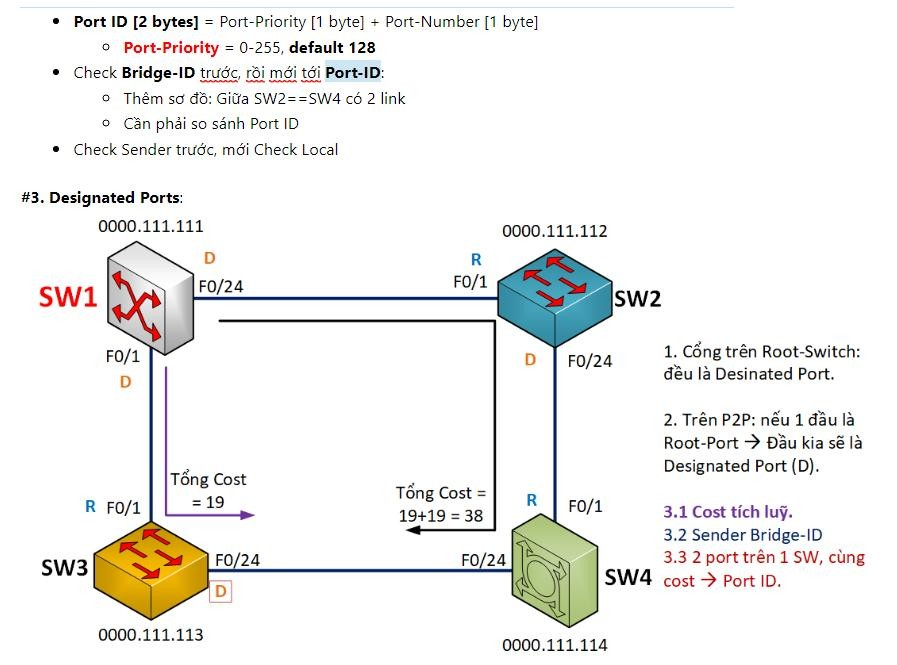

# Spanning tree protocol (STP)

#

Khi tính designated port, ta dựa vào gói BPDU out ra của cổng đang xét và gói BPDU nhận được từ đầu xa (không cộng cost của port nhận trên switch đang xét)

* ***
