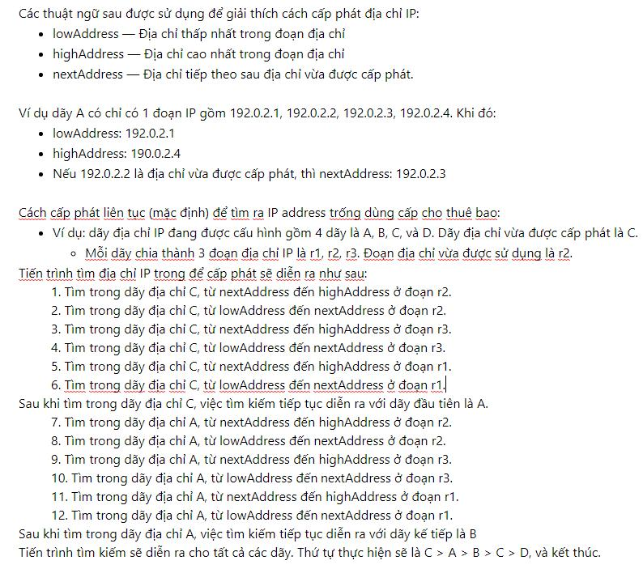

# Untitled Note

# Address-Assignment Pools for Subscriber Management



- -----------------

[ Friday, February 25, 2022 1:06 PM ] ⁨SVT.Tùng.NT⁩: này là đang test giữa linked-pool với aggregated-pool à @⁨SVT.Anh.VT⁩

[ Friday, February 25, 2022 1:10 PM ] ⁨SVT.Tùng.NT⁩: linked-pool-aggregation: If no free address is found, the search proceeds like this: C > D > A > B > C > D, then stops.

[ Friday, February 25, 2022 1:10 PM ] ⁨SVT.Tùng.NT⁩: by default: the search proceeds like this: C > A > B > C > D, then stops.

[ Friday, February 25, 2022 1:13 PM ] ⁨SVT.Tùng.NT⁩: nếu theo tài liệu thì chỗ kết quả @⁨SVT.Anh.VT⁩ share thì hơi khác xíu nhỉ?

- ------------------

<<< Thông tin như bên dưới được hiểu sẽ là so sánh giữa link-pool và không link-pool.

Hi Tuan,

WITH LINKED POOL AGGREGATION: <<< này không biết có phải là gộp nhiều pool bằng tính băng link-pool hay không?

The pool assignment would be Linearly filled, the logged out subscribers from first pool (primary pool) would fill up the ips from the second pool (from where the pool assignment has previously stopped)

Please check the comments:

{master}[edit]

```text
labroot@jtac-mx960-r2024-re0# run show subscribers summary
Subscribers by State
Active: 983
Total: 983
```
Subscribers by Client Type

```text
DHCP: 490
VLAN: 3
PPPoE: 490
Total: 983
```
{master}[edit]

```text
labroot@jtac-mx960-r2024-re0# run show network-access aaa statistics address-assignment pool ftth\_private routing-instance VRF\_CGNAT
```
Address assignment statistics

Pool Name: ftth\_private

Link Name: ftth\_private\_1

Out of Memory: 0

Out of Addresses: 0

Address total: 253

Addresses in use: 253

Address Usage (percent): 100

Pool drain configured: no

Pool Name: ftth\_private\_1

Out of Memory: 0

Out of Addresses: 0

Address total: 253

Addresses in use: 237

Address Usage (percent): 93

Pool drain configured: no

Pool Name: (all pools in chain)

Out of Memory: 0

Out of Addresses: 0

Address total: 506

Addresses in use: 490

Address Usage (percent): 96

Pool drain configured: no

{master}[edit]

```text
labroot@jtac-mx960-r2024-re0#
```
{master}[edit]

```text
labroot@jtac-mx960-r2024-re0#
```
{master}[edit]

```text
labroot@jtac-mx960-r2024-re0# # NOW LOGOUT THE SUBSCRIBERS FROM FIRST POOL
```
{master}[edit]

```text
labroot@jtac-mx960-r2024-re0#
```
{master}[edit]

```text
labroot@jtac-mx960-r2024-re0#
```
{master}[edit]

```text
labroot@jtac-mx960-r2024-re0#
```
{master}[edit]

```text
labroot@jtac-mx960-r2024-re0#
```
{master}[edit]

```text
labroot@jtac-mx960-r2024-re0#
```
{master}[edit]

```text
labroot@jtac-mx960-r2024-re0# RUN
```
^

unknown command.

```text
labroot@jtac-mx960-r2024-re0# run show subscribers summary
Subscribers by State
Active: 971
Terminated: 6
Total: 977
```
Subscribers by Client Type

```text
DHCP: 484
VLAN: 3
PPPoE: 490
Total: 977
```
{master}[edit]

```text
labroot@jtac-mx960-r2024-re0# run show network-access aaa statistics address-assignment pool ftth\_private routing-instance VRF\_CGNAT
```
Address assignment statistics

Pool Name: ftth\_private

Link Name: ftth\_private\_1

Out of Memory: 0

Out of Addresses: 0

Address total: 253

Addresses in use: 247

Address Usage (percent): 97

Pool drain configured: no

Pool Name: ftth\_private\_1

Out of Memory: 0

Out of Addresses: 0

Address total: 253

Addresses in use: 237

Address Usage (percent): 93

Pool drain configured: no

Pool Name: (all pools in chain)

Out of Memory: 0

Out of Addresses: 0

Address total: 506

Addresses in use: 484

Address Usage (percent): 95

Pool drain configured: no

{master}[edit]

```text
labroot@jtac-mx960-r2024-re0#
```
{master}[edit]

```text
labroot@jtac-mx960-r2024-re0# #LOGIN 5 SUBSCRIBERS
```
{master}[edit]

```text
labroot@jtac-mx960-r2024-re0#
```
{master}[edit]

```text
labroot@jtac-mx960-r2024-re0#
```
{master}[edit]

```text
labroot@jtac-mx960-r2024-re0#
```
{master}[edit]

```text
labroot@jtac-mx960-r2024-re0# run show subscribers summary
Subscribers by State
Init: 1
Active: 974
Total: 975
```
Subscribers by Client Type

```text
DHCP: 484
VLAN: 3
PPPoE: 488
Total: 975
```
{master}[edit]

```text
labroot@jtac-mx960-r2024-re0# run show subscribers summary
Subscribers by State
Active: 976
Total: 976
```
Subscribers by Client Type

```text
DHCP: 484
VLAN: 3
PPPoE: 489
Total: 976
```
{master}[edit]

```text
labroot@jtac-mx960-r2024-re0# run show subscribers summary all
Subscribers by State
Active: 976
Total: 976
```
Subscribers by Client Type

```text
DHCP: 484
VLAN: 3
PPPoE: 489
Total: 976
```
Subscribers by LS:RI

```text
default: 3
```
default:VRF\_CGNAT: 973

```text
Total: 976
```
{master}[edit]

```text
labroot@jtac-mx960-r2024-re0# run show network-access aaa statistics address-assignment pool ftth\_private routing-instance VRF\_CGNAT
```
Address assignment statistics

Pool Name: ftth\_private

Link Name: ftth\_private\_1

Out of Memory: 0

Out of Addresses: 0

Address total: 253

Addresses in use: 247

Address Usage (percent): 97

Pool drain configured: no

Pool Name: ftth\_private\_1

Out of Memory: 0

Out of Addresses: 0

Address total: 253

Addresses in use: 242

Address Usage (percent): 95

Pool drain configured: no

Pool Name: (all pools in chain)

Out of Memory: 0

Out of Addresses: 0

Address total: 506

Addresses in use: 489

Address Usage (percent): 96

Pool drain configured: no

{master}[edit]

```text
labroot@jtac-mx960-r2024-re0#
```
WITHOUT LINKED POOL :

The Ips are always reverted to first pool even if Ips/pool is not exhausted in second pool.

{master}[edit]

```text
labroot@jtac-mx960-r2024-re0# run show subscribers summary all
Subscribers by State
Active: 983
Total: 983
```
Subscribers by Client Type

```text
DHCP: 490
VLAN: 3
PPPoE: 490
Total: 983
```
Subscribers by LS:RI

```text
default: 3
```
default:VRF\_CGNAT: 980

```text
Total: 983
```
{master}[edit]

```text
labroot@jtac-mx960-r2024-re0# run show network-access aaa statistics address-assignment pool ftth\_private routing-instance VRF\_CGNAT
```
Address assignment statistics

Pool Name: ftth\_private

Link Name: ftth\_private\_1

Out of Memory: 0

Out of Addresses: 0

Address total: 253

Addresses in use: 253

Address Usage (percent): 100

Pool drain configured: no

Pool Name: ftth\_private\_1

Out of Memory: 0

Out of Addresses: 0

Address total: 253

Addresses in use: 237

Address Usage (percent): 93

Pool drain configured: no

Pool Name: (all pools in chain)

Out of Memory: 0

Out of Addresses: 0

Address total: 506

Addresses in use: 490

Address Usage (percent): 96

Pool drain configured: no

{master}[edit]

```text
labroot@jtac-mx960-r2024-re0#
```
{master}[edit]

```text
labroot@jtac-mx960-r2024-re0#
```
{master}[edit]

```text
labroot@jtac-mx960-r2024-re0# #LOGOUT SUBSCRIBERS FROM FIRST POOL
```
{master}[edit]

```text
labroot@jtac-mx960-r2024-re0#
```
{master}[edit]

```text
labroot@jtac-mx960-r2024-re0# run show subscribers summary all
Subscribers by State
Active: 973
Terminated: 5
Total: 978
```
Subscribers by Client Type

```text
DHCP: 485
VLAN: 3
PPPoE: 490
Total: 978
```
Subscribers by LS:RI

```text
default: 3
```
default:VRF\_CGNAT: 975

```text
Total: 978
```
{master}[edit]

```text
labroot@jtac-mx960-r2024-re0# run show network-access aaa statistics address-assignment pool ftth\_private routing-instance VRF\_CGNAT
```
Address assignment statistics

Pool Name: ftth\_private

Link Name: ftth\_private\_1

Out of Memory: 0

Out of Addresses: 0

Address total: 253

Addresses in use: 248

Address Usage (percent): 98

Pool drain configured: no

Pool Name: ftth\_private\_1

Out of Memory: 0

Out of Addresses: 0

Address total: 253

Addresses in use: 237

Address Usage (percent): 93

Pool drain configured: no

Pool Name: (all pools in chain)

Out of Memory: 0

Out of Addresses: 0

Address total: 506

Addresses in use: 485

Address Usage (percent): 95

Pool drain configured: no

{master}[edit]

```text
labroot@jtac-mx960-r2024-re0#
```
{master}[edit]

```text
labroot@jtac-mx960-r2024-re0# #LOGIN 5 SUBSCRIBERS BACK IN
```
{master}[edit]

```text
labroot@jtac-mx960-r2024-re0# run show subscribers summary all
Subscribers by State
Active: 978
Total: 978
```
Subscribers by Client Type

```text
DHCP: 485
VLAN: 3
PPPoE: 490
Total: 978
```
Subscribers by LS:RI

```text
default: 3
```
default:VRF\_CGNAT: 975

```text
Total: 978
```
{master}[edit]

```text
labroot@jtac-mx960-r2024-re0# run show network-access aaa statistics address-assignment pool ftth\_private routing-instance VRF\_CGNAT
```
Address assignment statistics

Pool Name: ftth\_private

Link Name: ftth\_private\_1

Out of Memory: 0

Out of Addresses: 0

Address total: 253

Addresses in use: 253

Address Usage (percent): 100

Pool drain configured: no

Pool Name: ftth\_private\_1

Out of Memory: 0

Out of Addresses: 0

Address total: 253

Addresses in use: 237

Address Usage (percent): 93

Pool drain configured: no

Pool Name: (all pools in chain)

Out of Memory: 0

Out of Addresses: 0

Address total: 506

Addresses in use: 490

Address Usage (percent): 96

Pool drain configured: no

Rrgards,

Vikash.S
