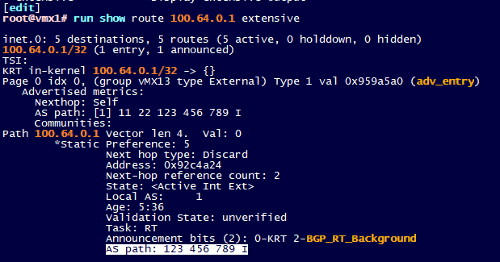
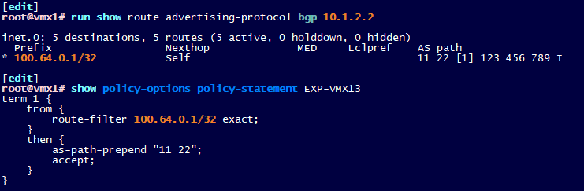
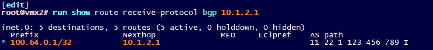
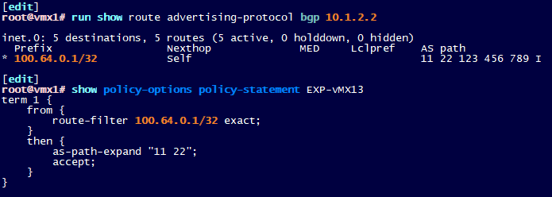
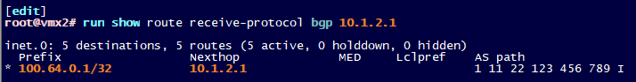

# Untitled Note

as-path-expand vs as-path-prepend

as-path-prepend là nó thêm as vào trước khi thực hiện thêm as của nó, còn as-path-expand là ngược lại nó thêm as vào sau khi đã thêm as của nó vào cái AS-path.

local-as 123 prepend 234: 234 123 345 I

local-as 123 expand 234 : 123 234 345 I

- Route được quảng bá:

- as-path-prepend: prepends given AS number after performing default own AS prepend. Recommended to use own AS only.

- Adverstise side: **local-AS 1**

- Receive side:

- as-path-expand: prepends given AS number before performing default own AS prepend.

- Adverstise side:  local-AS 1

- Receive side:

