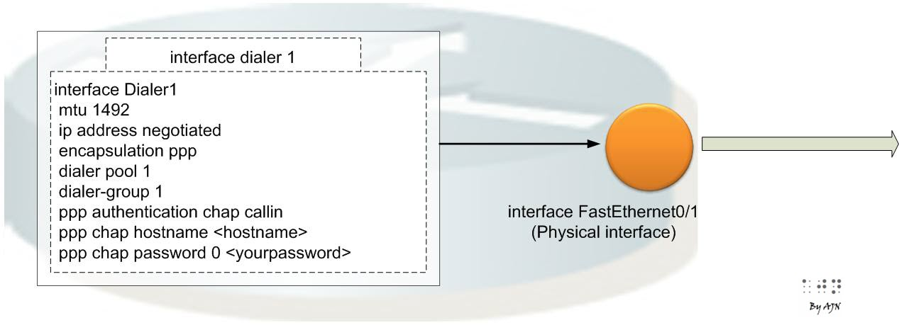

# config template Cisco PPPoE IPv4 and PPPoE IPv6 client

<https://cciethebeginning.wordpress.com/2014/03/13/ipv4-and-ipv6-dual-stack-pppoe/>

* *PPPoE for IPv4**

* *pppoe-client WAN address assignment**

* *pppoe-client**

interface Ethernet0/0

```text
pppoe enable group global
```
pppoe-client dial-pool-number 1

!

interface Ethernet0/1

ip address 192.168.0.201 255.255.255.0

!

interface Dialer1

mtu 1492

ip address negotiated

encapsulation ppp

dialer pool 1

dialer-group 1

ppp authentication chap callin

ppp chap hostname pppoe-client

ppp chap password 0 cisco



* *Address translation**

interface Dialer1

ip address negotiated

ip nat outside

!

interface FastEthernet0/0

ip address 192.168.4.1 255.255.255.224

ip nat inside

!

ip nat inside source list NAT\_ACL interface Dialer1 overload

!

ip access-list standard NAT\_ACL

permit any

* *pppoe-client LAN IPv4 address assignment**

* *pppoe-client**

ip dhcp excluded-address 192.168.4.1

!

ip dhcp pool LAN\_POOL

network 192.168.4.0 255.255.255.0

default-router 192.168.4.1

!

interface FastEthernet0/0

ip address 192.168.4.1 255.255.255.0

* *PPPoE for IPv6**

## pppoe-client WAN address assignment

* *pppoe-client**

interface FastEthernet0/1

```text
pppoe enable group global
```
pppoe-client dial-pool-number 1

!

interface Dialer1

mtu 1492

dialer pool 1

dialer-group 1

ipv6 address FE80::10 link-local

ipv6 address autoconfig default

ipv6 enable

ppp authentication chap callin

ppp chap hostname pppoe-client

ppp chap password 0 cisco

The CPE (PPPoE client) is assigned an IPv6 address through SLAAC along with a static default route: **ipv6 address autoconfig default**

# check command

pppoe-client#sh ipv6 interface dialer 1

Dialer1 is up, line protocol is up

IPv6 is enabled, link-local address is FE80::10

No Virtual link-local address(es):

Stateless address autoconfig enabled

Global unicast address(es):

2001:DB8:5AB:10::10, subnet is 2001:DB8:5AB:10::/64 [EUI/CAL/PRE]

valid lifetime 2587443 preferred lifetime 600243

## pppoe-client LAN IPv6 assignment

The advantage of using DHCPv6 PD (Prefix Delegation is that the PPPoE will automatically add a static route to the assigned prefix, very handy!

* *pppoe-client**

# check command

pppoe-client#sh ipv6 dhcp

This device’s DHCPv6 unique identifier(DUID): 00030001CA00075C0008

pppoe-client#

interface Dialer1

ipv6 dhcp client pd PREFIX\_FROM\_ISP

!

interface Ethernet0/0

ipv6 address FE80::2000:1 link-local

ipv6 address PREFIX\_FROM\_ISP ::1/64

ipv6 enable

# check command

pppoe-client#sh ipv6 dhcp interface

Dialer1 is in client mode

```text
Prefix State is OPEN
```
Renew will be sent in 3d11h

```text
Address State is IDLE
```
List of known servers:

Reachable via address: FE80::22

```text
DUID: 00030001CA011F780008
Preference: 0
```
Configuration parameters:

IA PD: IA ID 0x00090001, T1 302400, T2 483840

```text
Prefix: 2001:DB8:5AB:2000::/56
```
preferred lifetime INFINITY, valid lifetime INFINITY

Information refresh time: 0

Prefix name: PREFIX\_FROM\_ISP

Prefix Rapid-Commit: disabled

Address Rapid-Commit: disabled

* *client-LAN**

Now the customer LAN is assigned globally available IPv6 from the CPE (PPPoE client).

client-LAN#sh ipv6 interface fa0/0

FastEthernet0/0 is up, line protocol is up

IPv6 is enabled, link-local address is FE80::2000:F

No Virtual link-local address(es):

Stateless address autoconfig enabled

Global unicast address(es):

2001:DB8:5AB:2000::2000:F, subnet is 2001:DB8:5AB:2000::/64 [EUI/CAL/PRE]

client-LAN#sh ipv6 route

…

S ::/0 [2/0]

via FE80::2000:1, FastEthernet0/0

C 2001:DB8:5AB:2000::/64 [0/0]

via FastEthernet0/0, directly connected

L 2001:DB8:5AB:2000::2000:F/128 [0/0]

via FastEthernet0/0, receive

L FF00::/8 [0/0]

via Null0, receive

client-LAN#

I assigned PREFIX\_FROM\_ISP as locally significant name for the delegated prefix, no need to match the name on the DHCPv6 server side.
