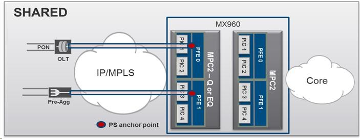
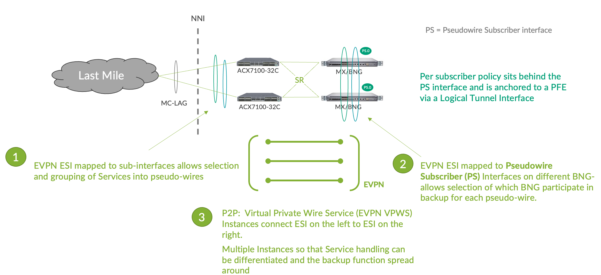

# PWEs scaling for pppoe DS

max PWEs scaling for pppoe DS - chassis level

mx204 32K

mx480/960 256K

max inline tunnel bw per PFE:

mpc5/7 120G

mpc10e 400G

mpc3-ng 120G

Các thông số này đưa ra từ Junos 15.1R4

giải pháp chạy evpn-vpws từ acx7100 nối vào vpls thì phải dùng ps interface trên pe-bras. Tức sẽ mất thêm pfe capacity cho cái ps này!

Thật ra anh thấy dùng physical loopback tốn ít optics & cáp nhưng an toàn hơn là bật PWHT (smiley)

Ko tốn port ngoài nhưng lại mất capacity pfe do inline tunneling cũng vậy

Nếu giải pháp sử dụng evpn - anh em bàn thêm xem có nên đưa thêm option này cho FTel?

=========================

- không cần pe

- bras chạy evpn + pwht

- 7100 chạy evpn vpws

- topo sẽ là Act/Stb & cần 50% capacity dự phòng cho tỉnh trên bras vùng

Ưu điểm:

- no mac learning, no L2 loop

- giảm được chassis pe-bras

Nhược điểm:

- pwht trên bras. Bugs

- cần thêm  pfe capacity cho ps

- cần đầu tư nhiều hơn để dự phòng (chỉ cụm 2 box 1:1)

Cân nhắc:

- có 2 khách hàng lớn ở Asia đang xem xét, chưa có production

- cần tìm thêm info ww
