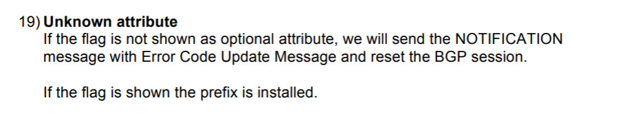

# 10GbE LAN-PHY/40GbE/100GbE LFS (Link fault signalling)

10GbE LAN-PHY/40GbE/100GbE LFS operates between remote Reconciliation Sublayers (RS) and local RS. Link faults detected between remote RSs and local RSs are received by local RSs. Only the RS originates Remote Fault signals. When this Local Fault status reaches an RS, the RS stops sending MAC data, and continuously generates a Remote Fault status on the transmit data path. When Remote Fault status is received by an RS, the RS stops sending MAC data, and continuously generates Idle control characters. When the RS no longer receives fault status messages, it returns to normal operation, sending MAC data

