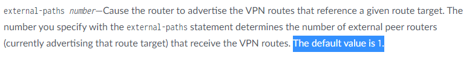

# 2021-1228-388762, [Mobifone-IPBB]Behaviour Route-target Family eBGP Session

Please go through the details and let me know if I am wrong.

Your concerns:

- You have configured route-target family in bgp to reduce the size of the bgp table.
- However, this configuration is causing RR to send the routes to only one peer router even though there are others sending the target.
- Configuration:

bgp {

precision-timers;

mtu-discovery;

log-updown;

```text
group iBGP-RR-HCM {
```

type internal;

description iBGP-to-RR-HCM;

local-address 10.51.142.116;

import IM-iBGP-RR\_HCM;

family inet {

labeled-unicast {

rib {

inet.3;

}

}

}

family inet-vpn {

unicast;

}

family inet6-vpn {

unicast;

}

family l2vpn {

signaling;

}

family inet-mvpn {

signaling;

}

neighbor 10.53.96.254;

neighbor 10.53.96.255;

}

```text
group RR\_TO\_MC\_HNI {
```

type external;

import import\_RAN\_MLMB;

family inet-vpn {

unicast;

}

family inet6-vpn {

unicast;

}

family l2vpn {

signaling;

}

family route-target {

advertise-default;

}

peer-as 65300;

bfd-liveness-detection {

minimum-interval 1000;

multiplier 3;

}

neighbor 10.248.0.3 {

multihop {

no-nexthop-change;

}

}

neighbor 10.248.0.2 {

multihop {

no-nexthop-change;

}

}

}

```text
group iBGP-VPN-ASBR-Option-A {
```

type internal;

local-address 10.51.142.116;

family inet {

unicast;

}

family inet-vpn {

unicast;

}

family route-target;

cluster 1.1.1.2;

bfd-liveness-detection {

minimum-interval 150;

multiplier 3;

```text
group iBGP-VPN-ASBR-Option-A {
```

type internal;

local-address 10.51.142.116;

family inet {

unicast;

}

family inet-vpn {

unicast;

}

family route-target;

cluster 1.1.1.2;

bfd-liveness-detection {

minimum-interval 150;

multiplier 3;

}

neighbor 10.51.149.41 {

family inet {

labeled-unicast {

rib {

inet.3;

}

}

}

family inet-vpn {

unicast;

}

family route-target;

}

```text
group iBGP-VPN-ASBR-Option-A {
```

type internal;

local-address 10.51.142.116;

family inet {

unicast;

}

family inet-vpn {

unicast;

}

family route-target;

cluster 1.1.1.2;

bfd-liveness-detection {

minimum-interval 150;

multiplier 3;

}

neighbor 10.51.149.41 {

family inet {

labeled-unicast {

rib {

inet.3;

}

}

}

family inet-vpn {

unicast;

}

family route-target;

}

neighbor 10.51.149.40 {

family inet {

labeled-unicast {

rib {

inet.3;

}

}

}

family inet-vpn {

unicast;

}

family route-target;

- By default Route Reflector sends update to only 1 Peer.
- In this scenario to send route advertisements to multiple Peers number of Peers needs to be configured.

```text
set protocols bgp group  family route-target external-paths 2
```

Please help check below link for more details.

[https://www.juniper.net/documentation/en\_US/junos/topics/reference/configuration-statement/family-edit-protocols-bgp-route-target-vp.html](https://www.juniper.net/documentation/en_US/junos/topics/reference/configuration-statement/family-edit-protocols-bgp-route-target-vp.html%20%5Ct%20_blank)

As per the above link,



Action plan:

- It is working as per design
- Add this knob “external-paths” and check if it meets your requirement.

Please let me know if you have any other concerns.
