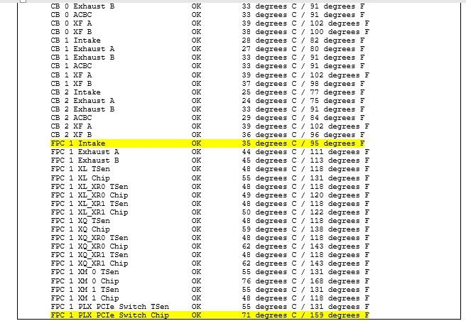

# Attribute DNS IPv6 từ Radius cho Bras Juniper

Dear anh Hiền!

Như đã trao đổi qua điện thoại, hiện tại juniper hỗ trợ kiểm cấu hình dnsv6 từ radius đẩy xuống theo IPv6-WAN theo cơ chế hiện tại đang cấp trên bras là NDRA với 2 attribute ở dưới đây:

[https://www.juniper.net/documentation/us/en/software/junos/subscriber-mgmt-sessions/topics/topic-map/dns-address-subscriber-management.html#id-dns-resolver-for-ipv6-dns-overview](https://www.juniper.net/documentation/us/en/software/junos/subscriber-mgmt-sessions/topics/topic-map/dns-address-subscriber-management.html%20%5Cl%20id-dns-resolver-for-ipv6-dns-overview)

Trên radius juniper có thể hỗ trợ 2 attribute cho DNSv6 theo 2 format

1. Format hexadecimal:

|#JUNOS and JUNOSe

ATTRIBUTE Unisphere-Ipv6-Primary-Dns               ERX-VSA(47, hexadecimal) r

# JUNOS and JUNOSe

ATTRIBUTE Unisphere-Ipv6-Secondary-Dns             ERX-VSA(48, hexadecimal) r
 |
|----------------------------------------------------------------------------------------------------------------------------------------------------------------------------------------------|

Với format này thì mình cần convert DNSv6 sang dạng hexa rồi mới điền nội dung vào profile của khách hàng. Ví dụ 2001:ee0:23::23 convert thành **0x20010ee0002300000000000000000023**

1. Format ipv6:

|#JUNOS and JUNOSe

ATTRIBUTE Unisphere-Ipv6-Primary-Dns               ERX-VSA(47, ipv6addr) r

# JUNOS and JUNOSe

ATTRIBUTE Unisphere-Ipv6-Secondary-Dns             ERX-VSA(48, ipv6addr) r
 |
|----------------------------------------------------------------------------------------------------------------------------------------------------------------------------------------|

Kết quả test:

Log bras nhận được:

|Nov 25 13:55:24.257865 radius-access-accept: IPv6-Delegated-Pool-Name (Juniper-ERX-VSA) received: FTTH-V6-LAN

Nov 25 13:55:24.257926 radius-access-accept: **IPv6-Primary-DNS (Juniper-ERX-VSA) received: 2001:ee0:23::23**

Nov 25 13:55:24.257978 radius-access-accept: **IPv6-Secondary-DNS (Juniper-ERX-VSA) received: 2001:ee0:26::26**
Nov 25 13:55:24.257825 radius-access-accept: Class received: 53 42 52 32 43 4c 89 ae f4 86 9f 94 90 c9 d6 80 11 80 21 01 80 02 81 98 80 02 80 05 81 aa 91 aa b5 a0 12 80 0e 81 89 ae f4 86 9f 94 90 c9 d6 80 80 80 89 c8|
|-----------------------------------------------------------------------------------------------------------------------------------------------------------------------------------------------------------------------------------------------------------------------------------------------------------------------------------------------------------------------------------------------------------------------------------------------------------------------------------------------------------------------------------------------------------------|

Vậy anh xem lựa chọn và thực hiện cấu hình thử nghiệm 1 trong 2 kiểu trên nhé anh.

Trân trọng cám ơn!
