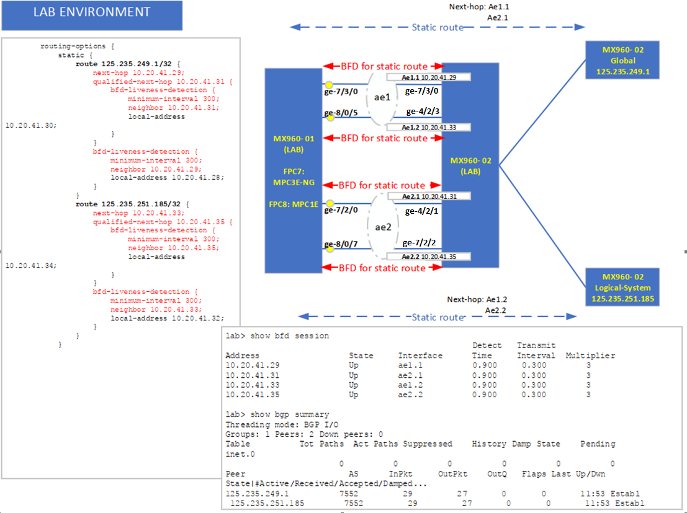

# BFD anchorship PFE

Như đã trao đổi qua phone:

- Theo anh hiểu khi thiết kế anchor BFD thì Juniper đã không xét đến trường hợp PFE bị disable, chỉ xét đến trường hợp MPC bị offline

- Mình có thể cân nhắc 2 giải pháp:

1. dùng (micro-bfd + dynamic routing) thay vì multihop-bfd cho bgp. Lúc này không cần quan tâm đến vụ anchor nữa vì BFD chạy trên từng AE member. Nếu mất cả 2 AE thì BGP sẽ down ngay vì không còn route nữa (hy vọng ko có 0/0).

2. sửa lại pfe\_disable\_script thành ra là offline cả mpc thay vì chỉ disable PFE (number 0)

Còn việc yêu cầu ER (Enhanced Request) thì sẽ cần:

- giải thích chi tiết scenario sử dụng, tốt nhất là dạng ppt. Bao gồm cả platform, hardware yêu cầu.

- việc này sẽ mất nhiều thời gian để thực hiện, Thái có thể làm rõ thêm với Cương nhé.

- --

Hi Tân, case nhiều session BFD đều ăn theo duy nhất 1 Anchor PFE lúc trước. sau thời gian JTAC verify behavior và hỏi thông tin từ engineering.

JTAC nói không có câu lệnh manual nào để ép các BFD sessions ăn theo các Anchor PFE khác nhau nhé.

Here are the final comments from Engineering on this matter.

(1)     BFD anchorship will not change when PFE disable action is taken on any of the instance of anchor FPC.

(2)     When PFE disable action is taken, Non-Inline BFD session (e.g. multihop) may go down and come up again if there is another PFE instance on the anchor FPC and the peer router is still reachable.

(3)     Inline BFD session may remain down if the anchor PFE instance is disabled.

Is there other way to force 4 BFD sessions distributed to 2 FPC equally, no need to reboot the FPC?

JTAC : There is no way to delegate anchor ship manually

- --

Chào a.Đăng, a.Hưng, a.Cương Juniper và anh em SVTech,

Gần đây trên mạng Viettel có case như sau:

- Trên thiết bị có 4 phiên Inline-BFD và cả 4 phiên này đang được xử lý in-line trên cùng 1 FPC.
- Thời điểm lỗi thiết bị xuất hiện Major Alarm trên FPC làm disable PFE, dẫn đến cả 4 phiên inline-BFD này stuck ở trạng thái Init/Down làm ảnh hưởng dịch vụ.

SVTech có test các action disable PFE/reboot FPC (bằng câu lệnh request lẫn trigger major alarm) thì ghi nhận các behavior BFD tóm gọn ở một số ý như sau: *(**Chi tiết test case xem luồng email bên dưới**)*

- Từ TC10 có thể thấy, việc xóa đi tạo lại cấu hình session BFD thì Junos vẫn hành xử ăn theo 1 FPC đã được dedicated từ trước. Chỉ có việc reboot FPC thì session BFD mới ăn theo 1 FPC khác.
- Từ TC5 & TC6 có thể thấy, khi reboot chassis, card FPC nào online trước thì BFD session sẽ ăn theo FPC đó. *Note: ghi nhận trên lab thì FPC8 online trước FPC7 khoảng 1 phút 30 giây đến 2 phút.*
- *Note: test với junos* *17.4R3-S2 và 18.4R3-S7 đều có behavior tương tự.*

Do đó, SVTech có mở case với JTAC làm rõ cách các phiên inline-BFD lựa chọn Anchor FPC nào để xử lý in-line, cũng như hỏi JTAC/engineering xem có cách nào để ép các BFD sessions ăn theo các Anchor PFE khác nhau hay không?

* Case ID: 2021-1007-335833*

Câu trả lời của JTAC như sau:

\*\*\*\*\*\*\*\*\*\*\*\*\*\*\*\*\*\*\*\*\*\*\*\*\*\*\*\*\*\*\*\*\*\*\*\*\*\*

Here are the final comments from Engineering on this matter.

(1)     BFD anchorship will not change when PFE disable action is taken on any of the instance of anchor FPC.

(2)     When PFE disable action is taken, **Non-Inline** BFD session (e.g. multihop) may go down and come up again if there is another PFE instance on the anchor FPC and the peer router is still reachable.

(3)     Inline BFD session may remain down if the anchor **PFE instance** is disabled.

Is there other way to force 4 BFD sessions distributed to 2 FPC equally, no need to reboot the FPC?

- JTAC : There is no way to delegate anchor ship manually

* *[SVTech]:**

As per your JTAC & engineering comment:

1. May I know this kind of behavior is as per design or not ?
2. Juniper has any plan to change this behavior on any upcoming release ? That’s because of point (3): Inline BFD session may remain down if the anchor **PFE instance** is disabled.

* *[JTAC]:**

Hello Thai

I too have tested in different release then only we went to engineering .

As I mentioned this behaviour is as per design , I am not aware of any plan to change this behaviour .

If you have any requirement you can try raising ER through accounts team.

\*\*\*\*\*\*\*\*\*\*\*\*\*\*\*\*\*\*\*\*\*\*\*\*\*\*\*\*\*\*\*\*\*\*\*\*\*\*

Nhờ các anh Juniper xem giúp SVTech behavior BFD này và có cân nhắc hay escalate nội bộ để thay đổi behavior không mong muốn như point (3) được không ạ?

Em xin cảm ơn.

- --

Hi Nirosh,

Here are the final comments from Engineering on this matter.

(1)     BFD anchorship will not change when PFE disable action is taken on any of the instance of anchor FPC.

(2)     When PFE disable action is taken, **Non-Inline** BFD session (e.g. multihop) may go down and come up again if there is another PFE instance on the anchor FPC and the peer router is still reachable.

(3)  **Inline BFD** session may remain down if the anchor **PFE instance** is disabled.

I am discussing with Juniper SE about the point (3) regarding to Inline BFD.

Meanwhile, I performed some test cases regarding to point (2) – Try to configure Non-Inline BFD. Below are my observations:

1. / TC 1: Configure “set routing-options ppm no-inline-processing” . That means BFD sessions is still distributed to FPC but No-Inline BFD.

|  |
| --- |
| {master}[edit groups test-BFD routing-options]  lab@test# show  ppm {  no-inline-processing;  }  static {  route 125.235.249.1/32 {  next-hop 10.20.41.29;  qualified-next-hop 10.20.41.31 {  bfd-liveness-detection {  minimum-interval 300;  neighbor 10.20.41.31;  local-address 10.20.41.30;  }  }  bfd-liveness-detection {  minimum-interval 300;  neighbor 10.20.41.29;  local-address 10.20.41.28;  }  }  route 125.235.251.185/32 {  next-hop 10.20.41.33;  qualified-next-hop 10.20.41.35 {  bfd-liveness-detection {  minimum-interval 300;  neighbor 10.20.41.35;  local-address 10.20.41.34;  }  }  bfd-liveness-detection {  minimum-interval 300;  neighbor 10.20.41.33;  local-address 10.20.41.32;  }  }  }  autonomous-system 7552;  lab@test# run show bfd session  Detect   Transmit  Address                  State     Interface      Time     Interval  Multiplier  10.20.41.29              Up        ae1.1          0.900     0.300        3  10.20.41.31              Up        ae2.1          0.900     0.300        3  10.20.41.33              Up        ae1.2          0.900     0.300        3  10.20.41.35              Up        ae2.2          0.900     0.300        3  4 sessions, 4 clients  Cumulative transmit rate 13.3 pps, cumulative receive rate 13.3 pps  {master}[edit]  lab@test# run show bfd session detail  Detect   Transmit  Address                  State     Interface      Time     Interval  Multiplier  10.20.41.29              Up        ae1.1          0.900     0.300        3  Client Static, TX interval 0.300, RX interval 0.300  Session up time 00:03:08, previous down time 00:00:03  Local diagnostic None, remote diagnostic None  Remote state Up, version 1  Replicated  Session type: Single hop BFD  Detect   Transmit  Address                  State     Interface      Time     Interval  Multiplier  10.20.41.31              Up        ae2.1          0.900     0.300        3  Client Static, TX interval 0.300, RX interval 0.300  Session up time 00:03:08, previous down time 00:00:03  Local diagnostic None, remote diagnostic None  Remote state Up, version 1  Replicated  Session type: Single hop BFD  Detect   Transmit  Address                  State     Interface      Time     Interval  Multiplier  10.20.41.33              Up        ae1.2          0.900     0.300        3  Client Static, TX interval 0.300, RX interval 0.300  Session up time 00:03:08, previous down time 00:00:03  Local diagnostic None, remote diagnostic None  Remote state Up, version 1  Replicated  Session type: Single hop BFD  Detect   Transmit  Address                  State     Interface      Time     Interval  Multiplier  10.20.41.35              Up        ae2.2          0.900     0.300        3  Client Static, TX interval 0.300, RX interval 0.300  Session up time 00:03:08, previous down time 00:00:03  Local diagnostic None, remote diagnostic None  Remote state Up, version 1  Replicated  Session type: Single hop BFD  4 sessions, 4 clients  Cumulative transmit rate 13.3 pps, cumulative receive rate 13.3 pps  {master}[edit]  lab@test# run show ppm adjacencies protocol bfd detail  Protocol: BFD, Hold time: 900, IFL-index: 329  Distributed: TRUE  Replicated  BFD discriminator: 28, BFD routing table index: 0  Redirection Type: DYNAMIC\_FILTER, Rule Term Src: 10.20.41.29, Rule Term Port: 3784, Rule Term Action: 605  Num Packets: 16, Absorbed Packets: 0, Rx Packet: 20 C8 03 18 00 00 00 36 00 00 00 1C 00 04 93 E0 00 04 93 E0 00 00 00 00  Distribution handle: 99, Distribution address: fpc7  Protocol: BFD, Hold time: 900, IFL-index: 330  Distributed: TRUE  Replicated  BFD discriminator: 29, BFD routing table index: 0  Redirection Type: DYNAMIC\_FILTER, Rule Term Src: 10.20.41.33, Rule Term Port: 3784, Rule Term Action: 605  Num Packets: 16, Absorbed Packets: 0, Rx Packet: 20 C8 03 18 00 00 00 34 00 00 00 1D 00 04 93 E0 00 04 93 E0 00 00 00 00  Distribution handle: 97, Distribution address: fpc7  Protocol: BFD, Hold time: 900, IFL-index: 333  Distributed: TRUE  Replicated  BFD discriminator: 32, BFD routing table index: 0  Redirection Type: DYNAMIC\_FILTER, Rule Term Src: 10.20.41.35, Rule Term Port: 3784, Rule Term Action: 605  Num Packets: 15, Absorbed Packets: 0, Rx Packet: 20 C8 03 18 00 00 00 39 00 00 00 20 00 04 93 E0 00 04 93 E0 00 00 00 00  Distribution handle: 95, Distribution address: fpc7  Protocol: BFD, Hold time: 900, IFL-index: 332  Distributed: TRUE  Replicated  BFD discriminator: 33, BFD routing table index: 0  Redirection Type: DYNAMIC\_FILTER, Rule Term Src: 10.20.41.31, Rule Term Port: 3784, Rule Term Action: 605  Num Packets: 16, Absorbed Packets: 0, Rx Packet: 20 C8 03 18 00 00 00 38 00 00 00 21 00 04 93 E0 00 04 93 E0 00 00 00 00  Distribution handle: 96, Distribution address: fpc7  Adjacencies: 4, Remote adjacencies: 4  lab@test# run request pfe execute command "show ppm adjacencies protocol bfd" target fpc7  SENT: Ukern command: show ppm adjacencies protocol bfd  PPM Adjacency information for BFD  IFL-index  Holdtime  PPM handle   Discr  Absorbed   Packets   Length  Dist  Do-dist HadExpired  ExpCount  LargeDiff  LastRx Leaked Leak timer Inline Session State  Rx-Packet  329        900       14              28  811        826       24      no-dist no-do-dist FALSE      0     320        300    0      FALSE       NO     UP  20 C8 03 18 00 00 00 36 00 00 00 1C 00 04 93 E0 00 04 93 E0 00 00 00 00  330        900       12              29  811        826       24      no-dist no-do-dist FALSE      0     320        300    0      FALSE       NO     UP  20 C8 03 18 00 00 00 34 00 00 00 1D 00 04 93 E0 00 04 93 E0 00 00 00 00  333        900       10              32  811        826       24      no-dist no-do-dist FALSE      0     320        300    0      FALSE       NO     UP  20 C8 03 18 00 00 00 39 00 00 00 20 00 04 93 E0 00 04 93 E0 00 00 00 00  332        900       11              33  811        827       24      no-dist no-do-dist FALSE      0     320        300    0      FALSE       NO     UP  20 C8 03 18 00 00 00 38 00 00 00 21 00 04 93 E0 00 04 93 E0 00 00 00 00  lab@test# run show chassis hardware | match fpc  FPC 2            REV 20   750-038489   CAEA0979          MPCE Type 1 3D  FPC 7            REV 06   750-063744   CAGZ6743          MPCE Type 2 3D  FPC 8            REV 06   750-063747   CAJW8640          MPCE Type 1 3D  {master}[edit]  lab@test# run show chassis fabric fpcs  Fabric management FPC state:  FPC 2  PFE #0  Plane 0: Plane enabled  Plane 1: Plane enabled  Plane 2: Plane enabled  Plane 3: Plane enabled  Plane 4: Links ok  Plane 5: Links ok  FPC 7  PFE #0  Plane 0: Plane enabled  Plane 1: Plane enabled  Plane 2: Plane enabled  Plane 3: Plane enabled  Plane 4: Links ok  Plane 5: Links ok  PFE #1  Plane 0: Plane enabled  Plane 1: Plane enabled  Plane 2: Plane enabled  Plane 3: Plane enabled  Plane 4: Links ok  Plane 5: Links ok  FPC 8  PFE #0  Plane 0: Plane enabled  Plane 1: Plane enabled  Plane 2: Plane enabled  Plane 3: Plane enabled  Plane 4: Links ok  Plane 5: Links ok |

1. 1/ TC 1.1: FPC slot 7 has 2 PFE instances (PFE #0 and PFE #1). I bring down PFE #0 on FPC7 (PFE #1 is still available).

* However, BFD sessions got stuck to Init/Down state, they did not* *come up again if there is another PFE instance on the anchor FPC and the peer router is still reachable.*

|  |
| --- |
| lab@test# run **request chassis fabric pfe 0 fpc 7 offline**  PFE Fabric offline initiated, use "show chassis fabric fpcs/plane" to verify  lab@test# run show chassis fabric fpcs  Fabric management FPC state:  FPC 2  PFE #0  Plane 0: Plane enabled  Plane 1: Plane enabled  Plane 2: Plane enabled  Plane 3: Plane enabled  Plane 4: Links ok  Plane 5: Links ok  **FPC 7**  **PFE #0**  **: Fabric Disabled**  PFE #1  Plane 0: Plane enabled  Plane 1: Plane enabled  Plane 2: Plane enabled  Plane 3: Plane enabled  Plane 4: Links ok  Plane 5: Links ok  FPC 8  PFE #0  Plane 0: Plane enabled  Plane 1: Plane enabled  Plane 2: Plane enabled  Plane 3: Plane enabled  Plane 4: Links ok  lab@test# run show bfd session  Detect   Transmit  Address                  State     Interface      Time     Interval  Multiplier  10.20.41.29              **Init**      ae1.1          6.000     2.000        3  10.20.41.31              **Init**      ae2.1          6.000     2.000        3  10.20.41.33              **Init**      ae1.2          6.000     2.000        3  10.20.41.35              **Init**      ae2.2          6.000     2.000        3  4 sessions, 4 clients  Cumulative transmit rate 2.0 pps, cumulative receive rate 2.0 pps  {master}[edit]  lab@test# run show bgp summary  Groups: 1 Peers: 2 Down peers: 2  Table          Tot Paths  Act Paths Suppressed    History Damp State    Pending  inet.0  0          0          0          0          0          0  Peer                     AS      InPkt     OutPkt    OutQ   Flaps Last Up/Dwn State|#Active/Received/Accepted/Damped...  125.235.249.1          7552          0          0       0       1        5:22 Connect  125.235.251.185        7552          0          0       0       1        5:41 Active  lab@test# run show ppm adjacencies protocol bfd detail  Protocol: BFD, Hold time: 6000, IFL-index: 329  **No-absorb, No-refresh, Do-not-age, Distributed: TRUE**  Replicated  BFD discriminator: 28, BFD routing table index: 0  Redirection Type: DYNAMIC\_FILTER, Rule Term Src: 10.20.41.29, Rule Term Port: 3784, Rule Term Action: 605  Num Packets: 16, Absorbed Packets: 0, Rx Packet: 20 C8 03 18 00 00 00 36 00 00 00 1C 00 04 93 E0 00 04 93 E0 00 00 00 00  Distribution handle: 99, Distribution address: fpc7  Protocol: BFD, Hold time: 6000, IFL-index: 330  No-absorb, No-refresh, Do-not-age, Distributed: TRUE  Replicated  BFD discriminator: 29, BFD routing table index: 0  Redirection Type: DYNAMIC\_FILTER, Rule Term Src: 10.20.41.33, Rule Term Port: 3784, Rule Term Action: 605  Num Packets: 16, Absorbed Packets: 0, Rx Packet: 20 C8 03 18 00 00 00 34 00 00 00 1D 00 04 93 E0 00 04 93 E0 00 00 00 00  Distribution handle: 97, Distribution address: fpc7  Protocol: BFD, Hold time: 6000, IFL-index: 333  No-absorb, No-refresh, Do-not-age, Distributed: TRUE  Replicated  BFD discriminator: 32, BFD routing table index: 0  Redirection Type: DYNAMIC\_FILTER, Rule Term Src: 10.20.41.35, Rule Term Port: 3784, Rule Term Action: 605  Num Packets: 15, Absorbed Packets: 0, Rx Packet: 20 C8 03 18 00 00 00 39 00 00 00 20 00 04 93 E0 00 04 93 E0 00 00 00 00  Distribution handle: 95, Distribution address: fpc7  Protocol: BFD, Hold time: 6000, IFL-index: 332  No-absorb, No-refresh, Do-not-age, Distributed: TRUE  Replicated  BFD discriminator: 33, BFD routing table index: 0  Redirection Type: DYNAMIC\_FILTER, Rule Term Src: 10.20.41.31, Rule Term Port: 3784, Rule Term Action: 605  Num Packets: 16, Absorbed Packets: 0, Rx Packet: 20 C8 03 18 00 00 00 38 00 00 00 21 00 04 93 E0 00 04 93 E0 00 00 00 00  Distribution handle: 96, Distribution address: fpc7  Adjacencies: 4, Remote adjacencies: 4  lab@test# run request pfe execute command "show ppm adjacencies protocol bfd" target fpc7  SENT: Ukern command: show ppm adjacencies protocol bfd  PPM Adjacency information for BFD  IFL-index  Holdtime  PPM handle   Discr  Absorbed   Packets   Length  Dist  Do-dist HadExpired  ExpCount  LargeDiff  LastRx Leaked Leak timer Inline Session State  Rx-Packet  329        6000      14              28  2468       2483      24      no-dist no-do-dist FALSE      0     320        300    0      FALSE       NO     DOWN  20 C8 03 18 00 00 00 36 00 00 00 1C 00 04 93 E0 00 04 93 E0 00 00 00 00  330        6000      12              29  2468       2483      24      no-dist no-do-dist FALSE      0     320        300    0      FALSE       NO     DOWN  20 C8 03 18 00 00 00 34 00 00 00 1D 00 04 93 E0 00 04 93 E0 00 00 00 00  333        6000      10              32  2468       2483      24      no-dist no-do-dist FALSE      0     320        300    0      FALSE       NO     DOWN  20 C8 03 18 00 00 00 39 00 00 00 20 00 04 93 E0 00 04 93 E0 00 00 00 00  332        6000      11              33  2467       2483      24      no-dist no-do-dist FALSE      0     320        300    0      FALSE       NO     DOWN   20. 8 03 18 00 00 00 38 00 00 00 21 00 04 93 E0 00 04 93 E0 00 00 00 00 |

1. 2/ TC 1.2: FPC slot 7 has 2 PFE instances (PFE #0 and PFE #1). I bring down PFE #1 on FPC7 (PFE #0 is still available). BFD session still remain Up.

* Note: I tried to bring down PFE #1 many times and can see there is no affected when shutting down PFE#1.*

|  |
| --- |
| lab@test# run show bfd session  Detect   Transmit  Address                  State     Interface      Time     Interval  Multiplier  10.20.41.29              Up        ae1.1          0.900     0.300        3  10.20.41.31              Up        ae2.1          0.900     0.300        3  10.20.41.33              Up        ae1.2          0.900     0.300        3  10.20.41.35              Up        ae2.2          0.900     0.300        3  4 sessions, 4 clients  Cumulative transmit rate 13.3 pps, cumulative receive rate 13.3 pps  {master}[edit]  lab@test# run show ppm adjacencies protocol bfd detail  Protocol: BFD, Hold time: 900, IFL-index: 329  Distributed: TRUE  Replicated  BFD discriminator: 28, BFD routing table index: 0  Redirection Type: DYNAMIC\_FILTER, Rule Term Src: 10.20.41.29, Rule Term Port: 3784, Rule Term Action: 605  Num Packets: 28, Absorbed Packets: 0, Rx Packet: 20 C8 03 18 00 00 00 36 00 00 00 1C 00 04 93 E0 00 04 93 E0 00 00 00 00  Distribution handle: 139, Distribution address: fpc7  Protocol: BFD, Hold time: 900, IFL-index: 330  Distributed: TRUE  Replicated  BFD discriminator: 29, BFD routing table index: 0  Redirection Type: DYNAMIC\_FILTER, Rule Term Src: 10.20.41.33, Rule Term Port: 3784, Rule Term Action: 605  Num Packets: 27, Absorbed Packets: 0, Rx Packet: 20 C8 03 18 00 00 00 34 00 00 00 1D 00 04 93 E0 00 04 93 E0 00 00 00 00  Distribution handle: 138, Distribution address: fpc7  Protocol: BFD, Hold time: 900, IFL-index: 333  Distributed: TRUE  Replicated  BFD discriminator: 32, BFD routing table index: 0  Redirection Type: DYNAMIC\_FILTER, Rule Term Src: 10.20.41.35, Rule Term Port: 3784, Rule Term Action: 605  Num Packets: 27, Absorbed Packets: 0, Rx Packet: 20 C8 03 18 00 00 00 39 00 00 00 20 00 04 93 E0 00 04 93 E0 00 00 00 00  Distribution handle: 136, Distribution address: fpc7  Protocol: BFD, Hold time: 900, IFL-index: 332  Distributed: TRUE  Replicated  BFD discriminator: 33, BFD routing table index: 0  Redirection Type: DYNAMIC\_FILTER, Rule Term Src: 10.20.41.31, Rule Term Port: 3784, Rule Term Action: 605  Num Packets: 27, Absorbed Packets: 0, Rx Packet: 20 C8 03 18 00 00 00 38 00 00 00 21 00 04 93 E0 00 04 93 E0 00 00 00 00  Distribution handle: 137, Distribution address: fpc7  Adjacencies: 4, Remote adjacencies: 4  lab@test# run **request chassis fabric pfe 1 fpc 7 offline**  PFE Fabric offline initiated, use "show chassis fabric fpcs/plane" to verify  {master}[edit]  lab@test# run show chassis fabric fpcs  Fabric management FPC state:  FPC 2  PFE #0  Plane 0: Plane enabled  Plane 1: Plane enabled  Plane 2: Plane enabled  Plane 3: Plane enabled  Plane 4: Links ok  Plane 5: Links ok  FPC 7  PFE #0  Plane 0: Plane enabled  Plane 1: Plane enabled  Plane 2: Plane enabled  Plane 3: Plane enabled  Plane 4: Links ok  Plane 5: Links ok  PFE #1  : Fabric Disabled  FPC 8  PFE #0  Plane 0: Plane enabled  Plane 1: Plane enabled  Plane 2: Plane enabled  Plane 3: Plane enabled  Plane 4: Links ok  Plane 5: Links ok  lab@test# run show bfd session  Detect   Transmit  Address                  State     Interface      Time     Interval  Multiplier  10.20.41.29              Up        ae1.1          0.900     0.300        3  10.20.41.31              Up        ae2.1          0.900     0.300        3  10.20.41.33              Up        ae1.2          0.900     0.300        3  10.20.41.35              Up        ae2.2          0.900     0.300        3 |

2. / TC 2: Configure “set routing-options ppm no-inline-processing” and configure “no-delegate-processing” .

That means BFD sessions is processed in centralized mode – Routing Engine based. No distribution to FPC anymore. In case of one of PFE/FPC disabled/offline, BFD sessions still remain UP.

|  |
| --- |
| {master}[edit groups test-BFD routing-options]  lab@test# show  ppm {  no-delegate-processing;  no-inline-processing;  }  static {  route 125.235.249.1/32 {  next-hop 10.20.41.29;  qualified-next-hop 10.20.41.31 {  bfd-liveness-detection {  minimum-interval 300;  neighbor 10.20.41.31;  local-address 10.20.41.30;  }  }  bfd-liveness-detection {  minimum-interval 300;  neighbor 10.20.41.29;  local-address 10.20.41.28;  }  }  route 125.235.251.185/32 {  next-hop 10.20.41.33;  qualified-next-hop 10.20.41.35 {  bfd-liveness-detection {  minimum-interval 300;  neighbor 10.20.41.35;  local-address 10.20.41.34;  }  }  bfd-liveness-detection {  minimum-interval 300;  neighbor 10.20.41.33;  local-address 10.20.41.32;  }  }  }  autonomous-system 7552;  lab@test# run show bfd session  Detect   Transmit  Address                  State     Interface      Time     Interval  Multiplier  10.20.41.29              Up        ae1.1          0.900     0.300        3  10.20.41.31              Up        ae2.1          0.900     0.300        3  10.20.41.33              Up        ae1.2          0.900     0.300        3  10.20.41.35              Up        ae2.2          0.900     0.300        3  4 sessions, 4 clients  Cumulative transmit rate 13.3 pps, cumulative receive rate 13.3 pps  {master}[edit]  lab@test# run show bfd session detail  Detect   Transmit  Address                  State     Interface      Time     Interval  Multiplier  10.20.41.29              Up        ae1.1          0.900     0.300        3  Client Static, TX interval 0.300, RX interval 0.300  Session up time 00:07:32, previous down time 00:00:03  Local diagnostic None, remote diagnostic None  Remote state Up, version 1  Replicated  Session type: Single hop BFD  Detect   Transmit  Address                  State     Interface      Time     Interval  Multiplier  10.20.41.31              Up        ae2.1          0.900     0.300        3  Client Static, TX interval 0.300, RX interval 0.300  Session up time 00:07:32, previous down time 00:00:03  Local diagnostic None, remote diagnostic None  Remote state Up, version 1  Replicated  Session type: Single hop BFD  Detect   Transmit  Address                  State     Interface      Time     Interval  Multiplier  10.20.41.33              Up        ae1.2          0.900     0.300        3  Client Static, TX interval 0.300, RX interval 0.300  Session up time 00:07:32, previous down time 00:00:03  Local diagnostic None, remote diagnostic None  Remote state Up, version 1  Replicated  Session type: Single hop BFD  Detect   Transmit  Address                  State     Interface      Time     Interval  Multiplier  10.20.41.35              Up        ae2.2          0.900     0.300        3  Client Static, TX interval 0.300, RX interval 0.300  Session up time 00:07:32, previous down time 00:00:03  Local diagnostic None, remote diagnostic None  Remote state Up, version 1  Replicated  Session type: Single hop BFD  4 sessions, 4 clients  lab@test# run show ppm adjacencies protocol bfd detail  Protocol: BFD, Hold time: 900, IFL-index: 329  Distributed: FALSE  Replicated  In Do-Dist thread:  BFD discriminator: 28, BFD routing table index: 0  HadExpired: FALSE, Expired-Count: 0, Largest-Interval: 326, Last Rx Interval: 300, Num Packets: 1572, Absorbed Packets: 1568, Rx Packet: 20 C8 03 18 00 00 00 36 00 00 00 1C 00 04 93 E0 00 04 93 E0 00 00 00 00  Protocol: BFD, Hold time: 900, IFL-index: 330  Distributed: FALSE  Replicated  In Do-Dist thread:  BFD discriminator: 29, BFD routing table index: 0  HadExpired: FALSE, Expired-Count: 0, Largest-Interval: 349, Last Rx Interval: 299, Num Packets: 1573, Absorbed Packets: 1568, Rx Packet: 20 C8 03 18 00 00 00 34 00 00 00 1D 00 04 93 E0 00 04 93 E0 00 00 00 00  Protocol: BFD, Hold time: 900, IFL-index: 333  Distributed: FALSE  Replicated  In Do-Dist thread:  BFD discriminator: 32, BFD routing table index: 0  HadExpired: FALSE, Expired-Count: 0, Largest-Interval: 349, Last Rx Interval: 299, Num Packets: 1574, Absorbed Packets: 1568, Rx Packet: 20 C8 03 18 00 00 00 39 00 00 00 20 00 04 93 E0 00 04 93 E0 00 00 00 00  Protocol: BFD, Hold time: 900, IFL-index: 332  Distributed: FALSE  Replicated  In Do-Dist thread:  BFD discriminator: 33, BFD routing table index: 0  HadExpired: FALSE, Expired-Count: 0, Largest-Interval: 326, Last Rx Interval: 299, Num Packets: 1573, Absorbed Packets: 1568, Rx Packet: 20 C8 03 18 00 00 00 38 00 00 00 21 00 04 93 E0 00 04 93 E0 00 00 00 00  Adjacencies: 4, Remote adjacencies: 0  ### BFD sessions based Routing Engine ###  lab@test# show interfaces lo0 | display inheritance no-comments  **unit 0 {**  **family inet {**  **filter {**  **output protect-re;**  }  address 125.235.249.147/32 {  primary;  lab@test# show firewall family inet filter protect-re | display inheritance no-comments  term 1 {  **from {**  **protocol udp;**  **destination-port 3784;**  **}**  **then {**  **count Singlehop-BFD-based-RE;**  accept;  }  }  term final {  then accept;  }  lab@test# run show bfd session  Detect   Transmit  Address                  State     Interface      Time     Interval  Multiplier  10.20.41.29              Up        ae1.1          0.900     0.300        3  10.20.41.31              Up        ae2.1          0.900     0.300        3  10.20.41.33              Up        ae1.2          0.900     0.300        3  10.20.41.35              Up        ae2.2          0.900     0.300        3  4 sessions, 4 clients  Cumulative transmit rate 13.3 pps, cumulative receive rate 13.3 pps  {master}[edit]  lab@test# run show firewall filter protect-re  Filter: protect-re  Counters:  Name                                                Bytes              Packets  Singlehop-BFD-based-RE                             100204                 1927 |

As per JTAC/Engineering comments so far:

(2)     When PFE disable action is taken, **Non-Inline** BFD session (e.g. multihop) may go down and come up again if there is another PFE instance on the anchor FPC and the peer router is still reachable.

Can you clarify and answer observations from test case 1.1 and 1.2:

- From the test case TC1.1, I can see BFD session did not come up when shutting down PFE #0 while PFE#1 is available.
- From the test case TC1.2, I can see shutting down PFE #1 not affecting BFD sessions anymore. It seems like BFD sessions is associated with PFE#0.
