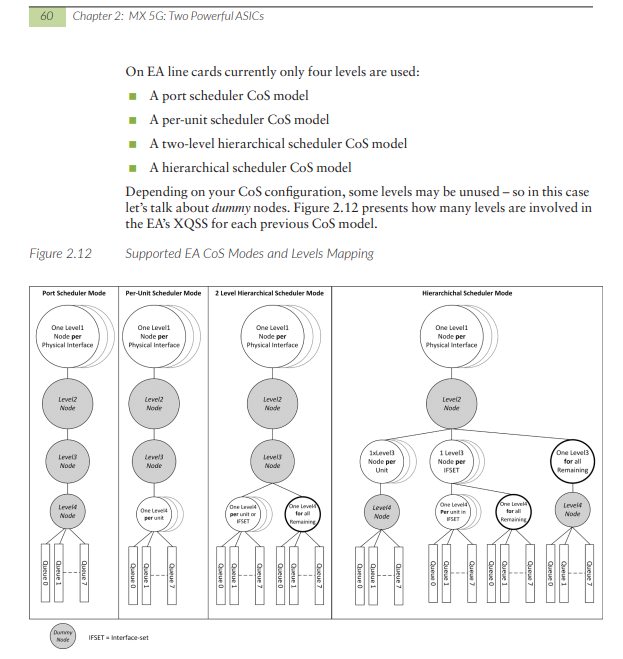

# Class of Services - CoS shell cmd on MPC7E (EA chip)

* *lvcuong@mx240-12> show class-of-service classifier name DSCP-CL-2FC-1Q**

Classifier: DSCP-CL-2FC-1Q, Code point type: dscp, Index: 20364

Code point        Forwarding class                    Loss priority

000000            BE                                  low

000011            BE\_1                                low

000110            BE\_2                                low

001000            BRONZE                              low

001011            BRONZE\_1                            low

001110            BRONZE\_2                            low

010000            SILVER                              low

010011            SILVER\_1                            low

010110            SILVER\_2                            low

011000            GOLD                                low

011011            GOLD\_1                              low

011110            GOLD\_2                              low

100000            PLATINUM                            low

101000            DIAMOND                            low

110000            CONTROL                            low

111000            Analyzer                            low

* *SMPC1(mx240-12 vty)#   show  cos classifier 20364**

classifier id: 20364    type: DSCP owners: 0x1

CP  Q  PLP    CP  Q  PLP    CP  Q  PLP    CP  Q  PLP

- ----------    -----------    -----------    -----------

0x00  0  0    0x03  5  0    0x06  6  0    0x08  7  0

0x0b  8  0    0x0e  9  0    0x10  13  0    0x13  14  0

0x16  15  0    0x18  1  0    0x1b  11  0    0x1e  12  0

0x20  2  0    0x28  10  0    0x30  3  0    0x38  4  0

* *SMPC1(mx240-12 vty)# show cos forwarding-class table**

Forwarding-Class  Queue  Restricted-Queue

0 0 0

1 1 1

2 2 2

3 3 3

4 6 2

5 0 0

6 0 0

7 4 0

8 4 0

9 4 0

10 7 3

11 1 1

12 1 1

13 5 1

14 5 1

15 5 1

* *SMPC1(mx240-12 vty)# show cos scheduler-hierarchy**

class-of-service egress scheduler hierarchy - rates in kbps

- ------------------------------------------------------------------------------------

shaping guarntd delaybf  excess

```text
interface name                  index    rate    rate    rate    rate      other
```

- --------------------------- ---------  ------- ------- ------- ------- -------------

pd-1/0/0                          150        0      0      0      0

q 0 - pri 0/1                      4        0    25%    25%      0

q 1 - pri 0/1                      4        0    25%    25%      0

q 2 - pri 0/1                      4        0    25%    25%      0

q 3 - pri 0/1                      4        0    25%    25%      0

et-1/0/0                          162        0      0      0      0

et-1/0/2                          163        0      0      0      0

et-1/0/5                          164        0      0      0      0

et-1/1/0                          165        0      0      0      0

et-1/1/2                          166  10215000      0      0      0

q 0 - pri 0/0                  7936        0      0      0      0

q 1 - pri 0/0                  7936        0    20%    20%      0

q 2 - pri 0/0                  7936        0      1%      1%      0

q 3 - pri 0/0                  7936        0      1%      1%      0

q 6 - pri 0/0                  7936        0      1%      1%      0

q 4 - pri 0/0                  7936        0      3%      3%      0

q 7 - pri 4/0                  7936        0    50%    50%      0

q 5 - pri 0/0                  7936        0      1%      1%      0

et-1/1/5                          167        0      0      0      0

* *SMPC1(mx240-12 vty)#  show cos halp ifd 166**

- -------------------------------------------------------------------------------

rich queueing enabled: 1

Q chip present: 1

IFD name: et-1/1/2  (Index 166) egress information

XQSS chip id: 1

XQSS : chip Scheduler: 0

XQSS chip L1 index: 6

XQSS chip dummy L2 index: 1990

XQSS chip dummy L3 index: 6

XQSS chip dummy L4 index: 2

Number of queues: 8

XQSS chip base Q index: 16

```text
Queue    State        Max      Guaranteed  Burst  Weight Priorities Drop-Rules  Scaling-profile
```

```text
Index                rate        rate      size            G    E  Wred  Tail      ID
```

- ----- ----------- ----------- ------------ ------- ------ ---------- ----------  ----------------

16  Configured 10215000000  2349450000 67108864    23  GL    EL    4  1034        3

17  Configured 10215000000  2043000000 67108864    20  GL    EL    4  1027        3

18  Configured 10215000000    102150000 67108864      1  GL    EL    4  720        3

19  Configured 10215000000    102150000 67108864      1  GL    EL    4  720        3

20  Configured 10215000000    306450000 67108864      3  GL    EL    4  849        3

21  Configured 10215000000    102150000 67108864      1  GL    EL    4  720        3

22  Configured 10215000000    102150000 67108864      1  GL    EL    4  720        3

23  Configured 10215000000    Disabled 67108864    50  GH    EH    4  1088        1

We have now the Level 1 node scheduler index (5) and the XQSS base queue index (16 means index for queue 0, 17 is the index for queue 1, 18 for queue 2, etc.).

```text
display the scheduler parameters attached to our physical interface with the following command:
```

* *SMPC1(mx240-12 vty)# show xqss** **1** **sched** **l1 6**

L1 node configuration  : 6

```text
state          : Configured
```

child\_l2\_nodes  : 1

scheduler\_pool  : 0

gh\_max\_rate    : 0

gm\_max\_rate    : 0

gl\_max\_rate    : 0

eh\_max\_rate    : 0

el\_max\_rate    : 0

max\_rate        : 10215000000

burst\_size      : 67108864 (adjusted burst\_size : 67108864)

byte\_adjust    : 22

cell\_mode      : FALSE

min\_pkt\_adjust  : 0

```text
Rate wheel information:
```

Instruction: valid:1 pool\_id:0 page\_id:0 page\_offset:16

Instruction        :

: valid:1 index:6 clip: 4194304 (m:0x100 e:14)

: max\_rate: 6384.000 (m:0x18f e:22)

: gh\_rate: 0.000 (m:0x0 e:0)

: gm\_rate: 0.000 (m:0x0 e:0)

: gl\_rate: 0.000 (m:0x0 e:0)

: eh\_rate: 0.000 (m:0x0 e:0)

: el\_rate: 0.000 (m:0x0 e:0)

check a given WAN queue of a given interface.  Hereafter the queue 0 (queue index 16)

classic CLI commands usually give enough information such as, for CoS interface:

* *show interface** **queue** **egress**

* *show class-of-service interface** **comprehensive**

- --

* *SMPC1(mx240-12 vty)#  show cos scheduling-policy bindings ifd**

scheduler map id: 7936

- -------------------------------

egress physical interface stream bindings:

- -------------------------------

```text
IFDs: 166
```

scheduler map id: 2

- -------------------------------

egress physical interface stream bindings:

- -------------------------------

```text
IFDs: 162, 163, 164, 165, 167
```

scheduler map id: 4294967298

- -------------------------------

egress physical interface stream bindings:

- -------------------------------

IFDs:

scheduler map id: 4

- -------------------------------

egress physical interface stream bindings:

- -------------------------------

```text
IFDs: 150
```

scheduler map id: 4294967300

- -------------------------------

egress physical interface stream bindings:

- -------------------------------

IFDs:

scheduler map id: 7936

- -------------------------------

ingress physical interface stream bindings:

- -------------------------------

IFDs:

scheduler map id: 2

- -------------------------------

ingress physical interface stream bindings:

- -------------------------------

IFDs:

scheduler map id: 4294967298

- -------------------------------

ingress physical interface stream bindings:

- -------------------------------

IFDs:

scheduler map id: 4

- -------------------------------

ingress physical interface stream bindings:

- -------------------------------

IFDs:

scheduler map id: 4294967300

- -------------------------------

ingress physical interface stream bindings:

- -------------------------------

IFDs:

SMPC1(mx240-12 vty)#  show cos scheduling-policy 7936

- ---------- --- --- --- ------- ------- ------- -------- ---------- ---------- ------- ------- ------- ------- -------- ---------

```text
smap      Q  fc  RQ  transmt shaping excess  delay-BW priorities    rate    nontcp/ nontcp/  tcp/  tcp/    ECN      shaping
```

```text
index      num id  num  rate    rate  rate              G    E    control    LOW      MH      ML    HIGH              burst
```

(0/0)  (0/1)  (1/0)  (1/1)

- ---------- --- --- --- ------- ------- ------- -------- ---------- ---------- ------- ------- ------- ------- -------- ---------

7936  0  0  0    255    -N.A-  -N.A-  255      0  NA          off      1      1      1      1      off      0

1  1  1    20%  -N.A-  -N.A-    20(%)  0  NA          off      1      1      1      1      off      0

2  2  2      1%  -N.A-  -N.A-    1(%)  0  NA          off      1      1      1      1      off      0

3  3  3      1%  -N.A-  -N.A-    1(%)  0  NA          off      1      1      1      1      off      0

6  4  2      1%  -N.A-  -N.A-    1(%)  0  NA          off      1      1      1      1      off      0

4  7  0      3%  -N.A-  -N.A-    3(%)  0  NA          off      1      1      1      1      off      0

7  10  3    50%  -N.A-  -N.A-    50(%)  4  NA          off      1      1      1      1      off      0

5  13  1      1%  -N.A-  -N.A-    1(%)  0  NA          off      1      1      1      1      off      0

```text
wrr\_mode = Use Transmit Rate
```

<https://www.juniper.net/documentation/en_US/day-one-books/DO_MX5G.pdf>


