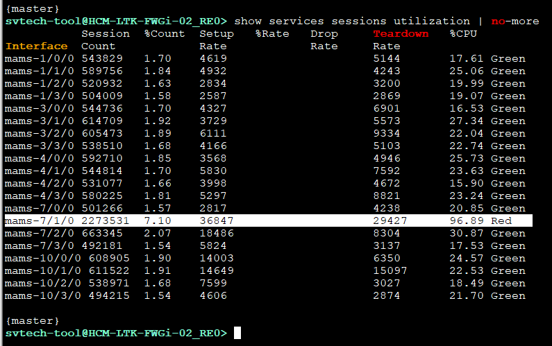
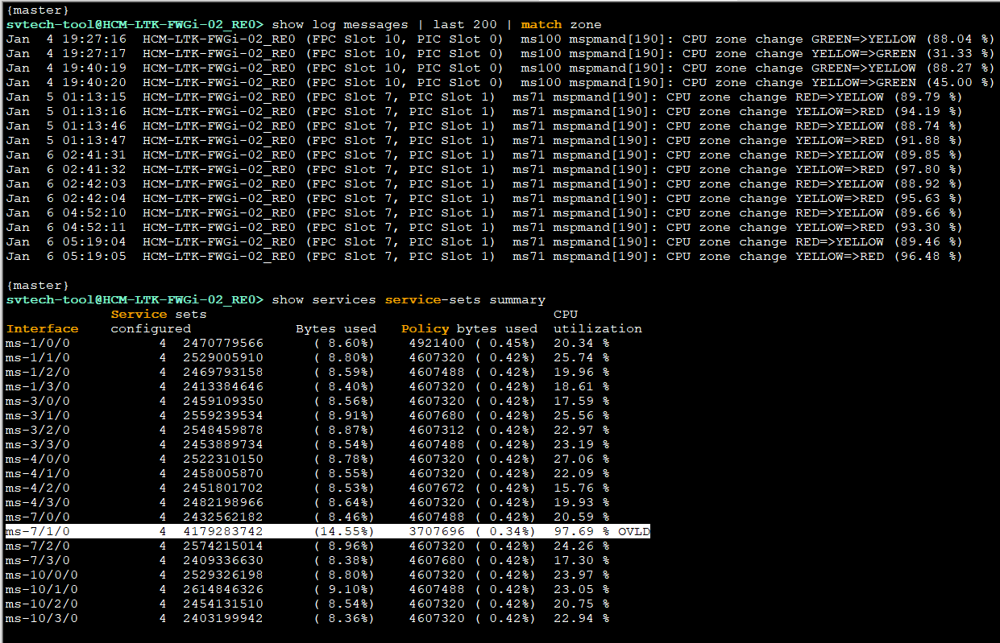
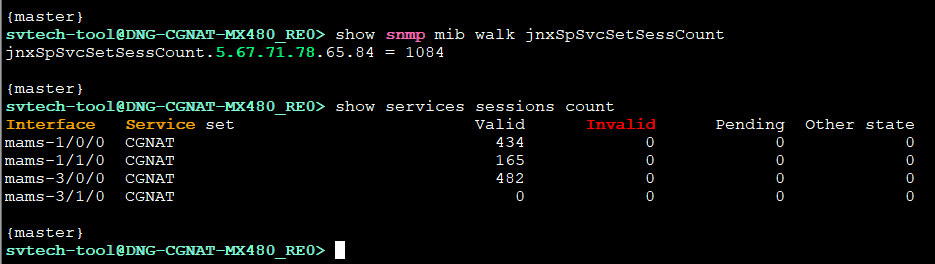
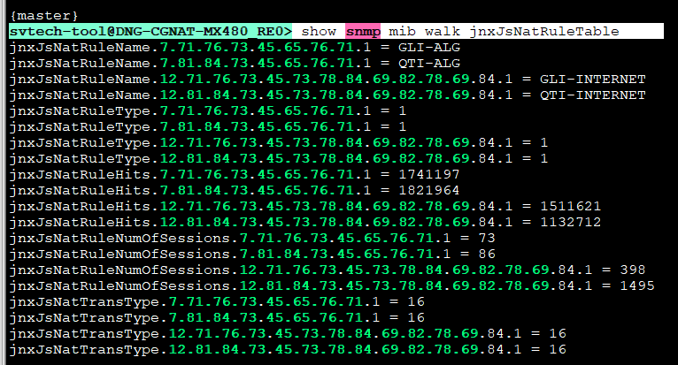
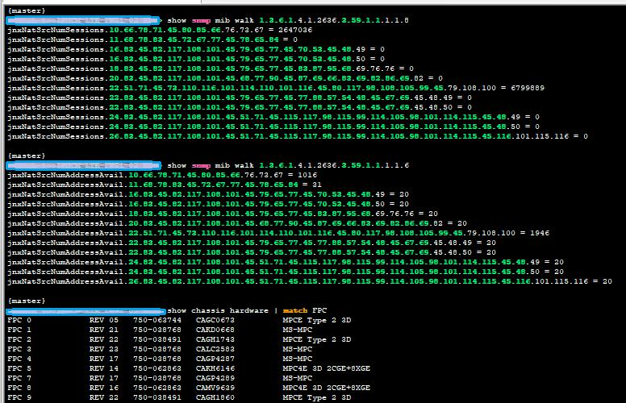

# Command check liên quan đến CGNAT services

@ 1 số lệnh check liên quan đến CGNAT services:

- Card MS-MPC:

* *## === NAT Services ===**

show services stateful-firewall flows count | no-more

show services nat pool detail | no-more

show services nat mappings summary | no-more

show services service-sets memory-usage | no-more

show services service-sets cpu-usage | no-more

show services service-set summary | no-more

show service sessions count | no-more

show services nat mappings address-pooling-paired private *21.81.226.73*

# -------------

show service sessions analysis | no-more

show services sessions utilization | no-more

show services service-sets cpu-usage | no-more

show services service-sets summary | no-more

show log messages | last 100 | match "cpu zone" | no-more

> show interface mams-\* | match rate

> monitor interface ams0 no-resolve

# ==========================

- Check more with **MX-SPC3**:

* *## === NAT Services ===**

show services stateful-firewall flows count | no-more

show services nat source pool all | no-more

show services nat source mappings summary | no-more

show services service-sets memory-usage | no-more

show services service-sets cpu-usage | no-more

show services service-set summary | no-more

show service sessions count | no-more

# -------------

show service sessions analysis | no-more

show services sessions utilization | no-more

show services service-sets cpu-usage | no-more

show services service-sets summary | no-more

show log messages | last 100 | match "cpu zone" | no-more

show interface mams-\* | match rate

# --------------

Case lỗi điển hình bên INOC2:

- Delay cao đột biến.

[ Thursday, January 6, 2022 11:39 PM ] ⁨INOC2-Phuoc [Trinh Van]⁩: show services sessions interface mams-7/1/0 service-set 3G

[ Thursday, January 6, 2022 11:40 PM ] ⁨INOC2-Phuoc [Trinh Van]⁩: anh show cái này thấy thuê bao bên trong request tới cái IP **113.185.56.173**

[ Thursday, January 6, 2022 11:40 PM ] ⁨INOC2-Phuoc [Trinh Van]⁩: route discard 113.185.56.160/27 trong vrf VR-NAT thì giảm

* *show services sessions source-prefix 14.172.216.224**

* *OID:**

[https://apps.juniper.net/mib-explorer/search.jsp#object=jnxJsNatIfSrcPoolTotalSinglePorts&product=Junos](https://apps.juniper.net/mib-explorer/search.jsp%20%5Cl%20object=jnxJsNatIfSrcPoolTotalSinglePorts&product=Junos) OS&release=19.4R3

Case liên quan:

RE: Case Updated - P2 - High - 2022-0117-398960 - SV TECHNOLOGIES JSC - [VNPT] MX-SPC3 can not NAT with 2nd services-set

show snmp mib walk 1.3.6.1.4.1.2636.3.59.1.1.1.1.8

show snmp mib walk 1.3.6.1.4.1.2636.3.59.1.1.1.1.6

show snmp mib walk 1.3.6.1.4.1.2636.3.59.1.1.3.1.3

show snmp mib walk **jnxSpSvcSetSessCount**

show snmp mib walk **jnxJsNatRuleTable**

* **svtech-tool@DNG-CGNAT-MX480\_RE0> show services sessions count***

Interface   Service set                        Valid      Invalid      Pending  Other state

mams-1/0/0  CGNAT                             359160            0            0            0

mams-1/1/0  CGNAT                             354534            0            0            0

mams-3/0/0  CGNAT                             358151            0            0            0

mams-3/1/0  CGNAT                             359261            0            0            0

{master}

* **svtech-tool@DNG-CGNAT-MX480\_RE0> show snmp mib walk*** ***1.3.6.1.4.1.2636.3.32.1.1.1.16***

jnxSpSvcSetSessCount.5.67.71.78.65.84 = 1432309

* **svtech-tool@DNG-CGNAT-01\_RE0> show snmp mib walk*** **jnxFWCounterByteCount** ***| display xml***

http://xml.juniper.net/junos/19.4R0/junos">

http://xml.juniper.net/junos/19.4R0/junos-snmp">

jnxFWCounterByteCount.2.51.48.13.66.68.72.45.67.71.78.65.84.45.73.88.80.2

jnxFWCounterFilterName

30

jnxFWCounterName

BDH-CGNAT-IXP

jnxFWCounterType

2

counter64

11660040352

1. 3.6.1.4.1.2636.3.5.2.1.5.2.51.48.13.66.68.72.45.67.71.78.65.84.45.73.88.80.2

jnxFWCounterByteCount.2.51.48.13.66.68.72.45.67.71.78.65.84.45.78.73.88.2

jnxFWCounterFilterName

30

jnxFWCounterName

BDH-CGNAT-NIX

jnxFWCounterType

2

counter64

416057986093

1. 3.6.1.4.1.2636.3.5.2.1.5.2.51.48.13.66.68.72.45.67.71.78.65.84.45.78.73.88.2

[https://apps.juniper.net/mib-explorer/search.jsp#object=jnxFWCounterByteCount&product=Junos%20OS&release=19.4R3](https://apps.juniper.net/mib-explorer/search.jsp%20%5Cl%20object=jnxFWCounterByteCount&product=Junos%20OS&release=19.4R3)

* *# Lỗi chập chờn CGNAT (case HNI)**:

- Liên quan phần cứng của MX-SPC3
- Fabric drop của MPC7E

Một số lệnh để check:

show log messages | match mqss

show snmp mib walk 1.3.6.1.4.1.2636.3.81.1.1.1.1.1.11 | match 65535

show snmp mib walk 1.3.6.1.4.1.2636.3.81.1.1.1.1.1.15 | match 65535

và lệnh này để show trafic Fabric in/out card

đơn vị Bps, lấy giá trị kia x8 = bps

xem có over **170Gbps** ko nhé? --> MPC7E oversubscription

show pfe statistics traffic | match fabric

1. 3.6.1.4.1.2636.3.81.1.1.1.1.1.10 mib này check pps

1. 3.6.1.4.1.2636.3.81.1.1.1.1.1.15 check packet drop

INOC3 FTP vào 123.29.0.59 lấy file nhé

* *guest/svtech@123**
