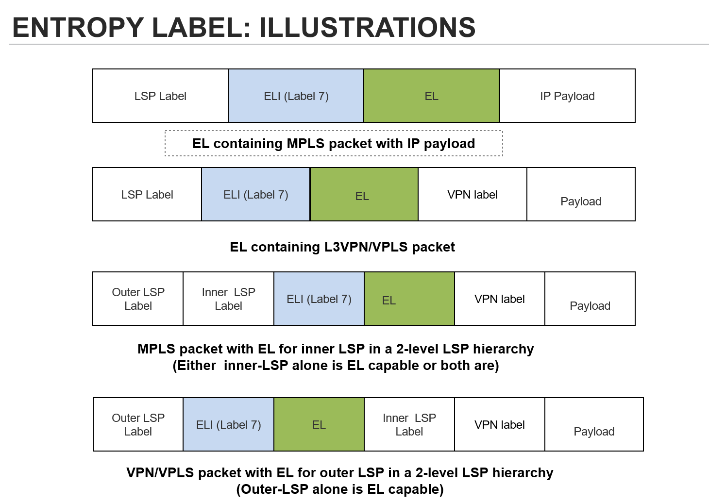
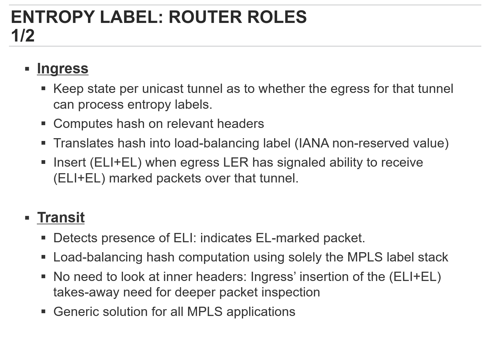
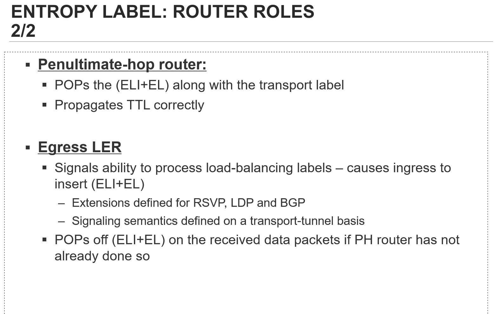
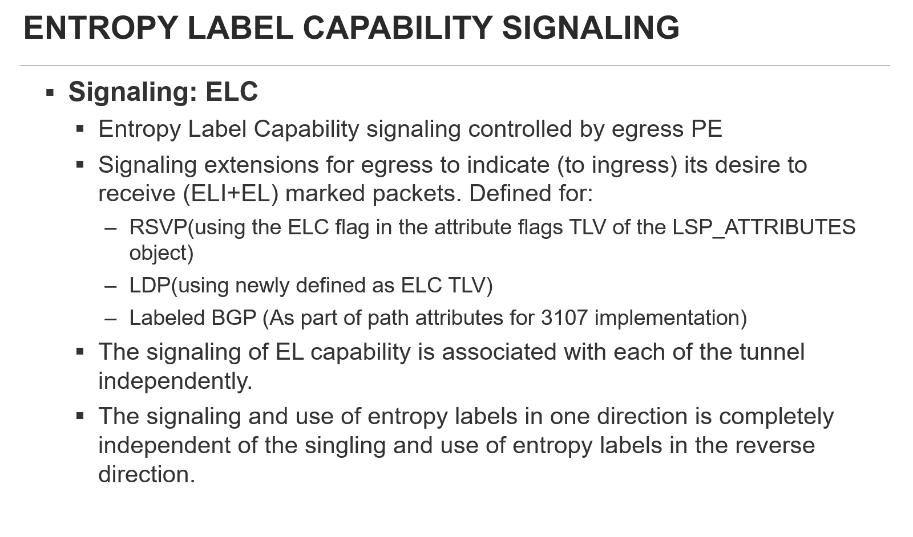
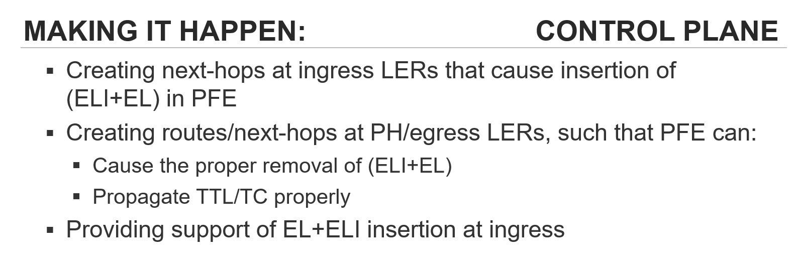
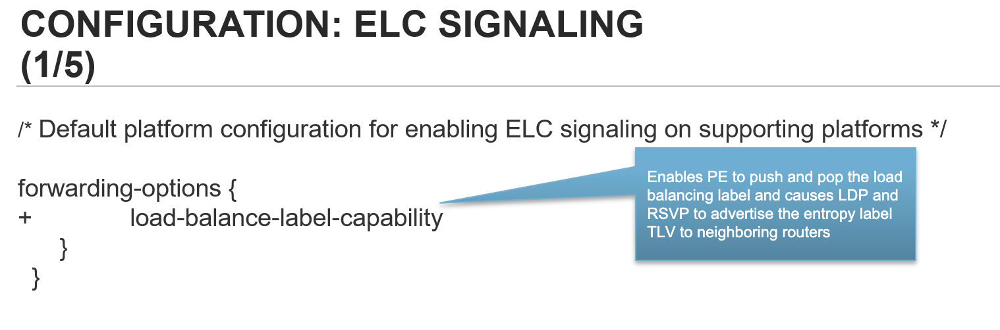
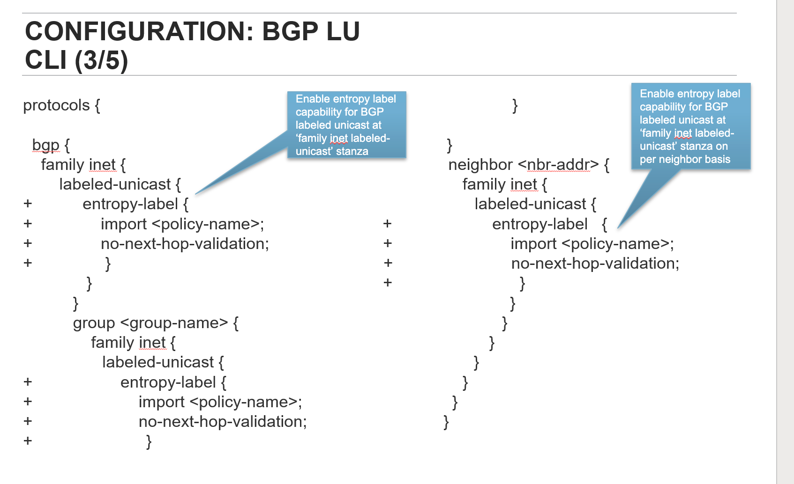

# Entropy label capable

[ June 30, 2023 15:48 ] ⁨SVT.Hoà.Nguyễn⁩: juniper@AGG-TNNTNN11-RE0> show route advertising-protocol bgp 10.249.35.1 table inet.3 detail

```text
inet.3: 1668 destinations, 3275 routes (1504 active, 0 holddown, 300 hidden)
```
10. 249.34.254/32 (4 entries, 2 announced)

BGP group AGG-TO-CSG-RIGHT-TO-AGG1.4 type Internal

Route Label: 128473

Nexthop: Self

Flags: Nexthop Change

```text
MED: 0
Localpref: 100
```
AS path: [65324] I  (Originator)

Cluster list:  10.249.34.1

Originator ID: 10.249.34.254

Cluster ID: 10.249.34.6

\*Entropy label capable\*

[ June 30, 2023 15:52 ] ⁨Hung Le⁩: forwarding-options {

```text
load-balance-label-capability;
```
no-load-balance-label-capability;

}

[ June 30, 2023 15:52 ] ⁨SVT.Hoà.Nguyễn⁩: root@PE> show route advertising-protocol bgp 190.10.10.255 detail

```text
inet.3: 4 destinations, 4 routes (4 active, 0 holddown, 0 hidden)
```
\* 190.10.10.10/32 (1 entry, 1 announced)

BGP group iBGP type Internal

Route Label: 3

Nexthop: Self

Flags: Nexthop Change

```text
Localpref: 100
```
AS path: [7552] I

[ June 30, 2023 15:54 ] ⁨Hung Le⁩: For platforms which have entropy label capability (see section 8), the

configuration is defaulted to "load-balance-label-capability". For platforms

which do not have entropy label capability, the configuration is defaulted

to "no-load-balance-label-capability".

[ June 30, 2023 15:54 ] ⁨Hung Le⁩: Usually BGP-LU can originate an UPDATE message in 2 cases:

1) Advertise its own loopback address as BGP LSP egress. In this case we will

attach ELC attribute if this node support entropy labels.

Tóm tắt:

- elc mặc định adv ra trên bgp khi bật LU. Có thể off đi bằng knob

- Sẽ lab để làm rõ thêm hành vi

- cần cân nhắc nếu có thay đổi về attr policy trên production


