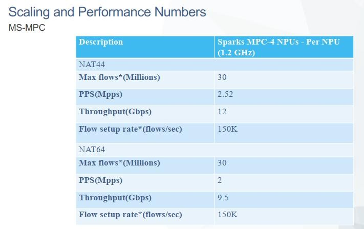

# MS-MPC throughput

- --

thông tin throughput card MS-MPC CGNAT

Dạ các anh,

Em xin thông tin lại throughput của card MS-MPC như sau:

+ Trước version 17.1: 32Gb/linecard

+ Từ version 17.1 trở đi: 52GB/linecard.

Do đó trong trường hợp này, box chạy version 16.1R7-S4.1, như nên throughput của linecard sẽ là 32Gb/linecard.

Em xin báo để các anh nắm.

- --

Dear chị Yến,

Em xin phép trả lời và bổ sung thêm một chút chỗ email của Tuấn Anh:

- Version 15.1 có thể chạy được 52Gbps tuy nhiên chưa có official test nội bộ của Juniper nên bên em vẫn khuyến nghị chạy ở mức 32Gbps cho an toàn.
- Kể từ Junos 17.1 trở đi thì Junos đã tối ưu code để hỗ trợ + official test để đảm bảo mức 52Gbps cho lưu lượng thực tế.
- Riêng Junos 16.1R7-S4.1 thì hơi đặc biệt do có một nhóm khách hàng yêu cầu hỗ trợ code trước để có thể hỗ trợ > 24 \* NPU trên 1 interface bundle amsx và việc code tối ưu phục vụ test để đảm bảo hỗ trợ 52Gbps/MS-MPC.

Vậy chị Yến sizing mức 52Gbps/MS-MPC cho version 16.1R7-S4.1 và >=17.1 trở đi nhé.

- --

Đối với card CGNAT MS-MPC như bên mình đang sử dụng thì anh Dũng sizing giúp 1 MS-MPC = 4 \* NPU = 4 \* 13Gbps (traffic thực tế) = 52Gbps.

Như vậy thiết bị CGNAT HLC có 8 \* MS-MPC à thì sizing lưu lượng thực tế : 8\*52Gpbs ~ 416Gbps anh nhé. Em gửi thêm attach mail là mail trước bên em cũng có note với chị Yến khi hỏi cho scale CGNAT trong KV3.

Note: Ngoài ra số liệu như anh Dũng gửi ở dưới thì đúng rồi nhé, tuy nhiên nó test ko dựa vào packet size thực tế nên chỉ là con số để tham khảo.

- --

Hi Team,

Về scaling throughput của card MS-MPC, Juniper trước giờ chỉ công bố giá trị 32Gbps trên mỗi linecard (4xNPU) - do đó, trước đây mình cũng công bố giá trị scaling cho Viettel.

Thực tế đã có một số nhà mạng như Viettel, FPT đang chạy throughput mỗi card MS-MPC lên đến 52Gbps. Năm ngoái, phía Cisco khi tham gia đấu thầu ở Viettel, họ dùng thông số scaling thực tế trên 50Gbps/linecard, để cạnh tranh thầu này, phía Juniper VN đã quyết định nâng giá trị scaling lên từ con số khuyến nghị 32Gbps lên con số thực tế 52Gbps với lý do thay đổi version.

Do đó, AE cần nắm thông tin này để hiểu rõ và truyền thông đồng nhất cho phía Viettel như mail của a.Quang bên dưới.

Note: về mặt kỹ thuật, Junos version không ảnh hưởng đến scaling throughput của card MS-MPC, đây chỉ là cách mà SVTECH chúng ta đang thống nhất với các anh Juniper VN để truyền thông ra cho Viettel.
