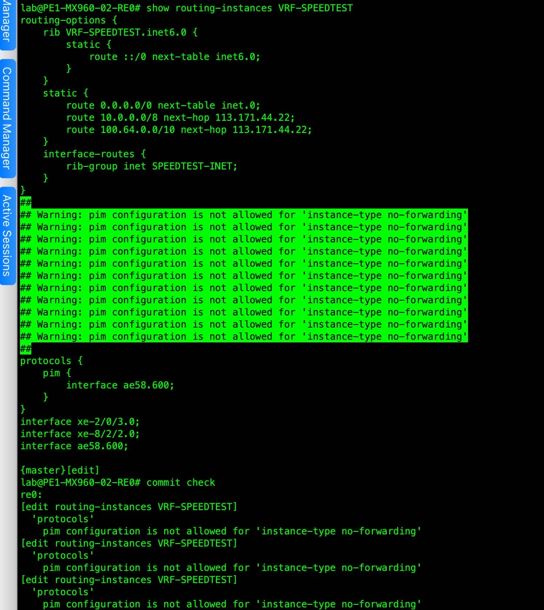

# PIM instances

[ December 1, 2022 16:37 ] ⁨SVT.Ngọc.NĐ⁩: *PIM instances are supported only for VRF instance types.*

[ December 1, 2022 16:58 ] ⁨SVT.Ngọc.NĐ⁩: no-forwarding—This is the default routing instance. Do not create a corresponding forwarding instance. Use this routing instance type when a separation of routing table information is required. There is no corresponding forwarding table. *All routes are installed into the default forwarding table.* IS-IS instances are strictly nonforwarding instance types.

