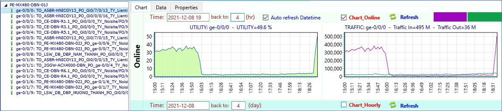
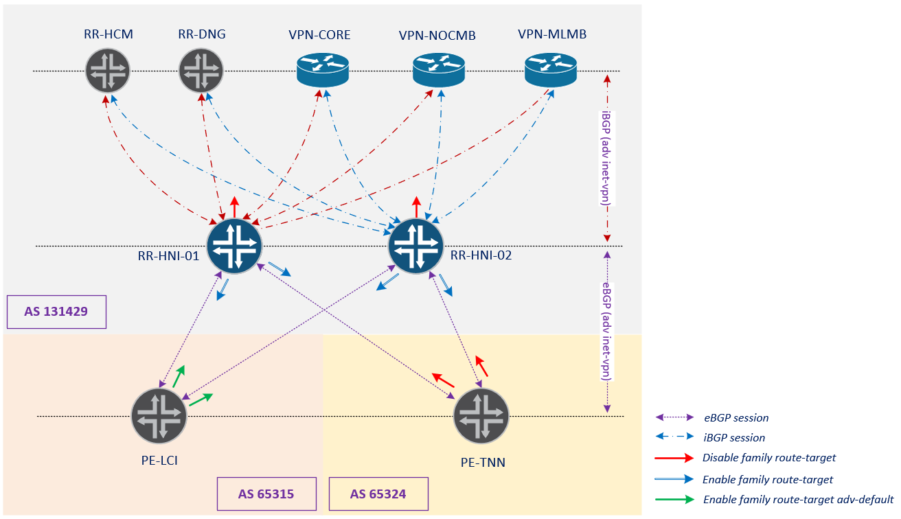

# RR không nhận được route từ các PE tỉnh - SR-2021-1208-1924

Em xin phép update KQ phân tích case này như sau a nhé:

* *Tóm tắt issue xảy ra lúc 16h00 ngày 8-Dec-2021:**

Từ việc monitor traffic, NOC phát hiện hiện hiện tượng lệch tải lưu lượng xảy ra trên nhiều PE tỉnh lên ASBR xảy ra đồng thời vào lúc 16h00 ngày 8/12.

Sau khi check, NOC tìm thấy rằng nguyên nhân do các PE tỉnh chỉ quảng bá route service (vpnv4) lên một trong 2 RR. Tuy nhiên vẫn chưa biết lý do/trigger nào dẫn đến việc chỉ quảng bá một mặt này?



* *Phân tích issue:**



- Lúc issue xảy ra, trên 2 RR chỉ quảng bá xuống cho PE tỉnh các route-target detail (không có route-target default 0:0:0/0), do vậy trên PE sẽ chỉ lựa chọn một route-target tốt nhất học được từ một hướng (ưu tiên route-target nhận sớm hơn), nên sau đó PE chỉ quảng bá route vpnv4 cho một RR được ưu tiên là behavior bình thường.
- Vậy tại sao các chuỗi ngày trước đó PE vẫn quảng bá đủ route lên cả 2 RR?
- Dựa vào messages log, có thể thấy rằng ngay trước thời điểm issue có phiên eBGP từ RR xuống PE-TNN bị down.
- Check thêm cấu hình peering thì thấy rằng đầu RR đang enable family route-target nhưng đầu xa PE-TNN thì không. Cho nên behavior default RR sẽ tự động generate và quảng bá thêm một route-target default (0:0:0/0) xuống cho hướng các PE tỉnh còn lại (có enable family route-target 2 đầu). Điều này giải thích tại sao trước đó các PE tỉnh vẫn quảng bá routes vpnv4 lên 2 RR bình thường (do chúng vẫn nhận được route-target default này từ 2 RR). Chỉ khi phiên eBGP từ RR xuống PE-TNN bị down, route-target default được withdraw thì issue trên mới xảy ra.
- Qua việc audit log, cũng có thể thấy rằng chỉ có 2 trường hợp là PE-TNN & PE-PTO có cấu hình kiểu này (đầu RR bật route-target, đầu PE không). Tuy nhiên do PE-PTO đã bị remove/down trước đó từ lâu. Nên khi PE-TNN down thì route-target default cũng được withdraw theo ngay lập tức.

* *Khuyến nghị:**

Trên RR, bật thêm cấu hình route-target advertise-default hướng xuống các PE tỉnh để đảm bảo RR luôn quảng bá route-target default 0:0:0/0 (thay vì chỉ quảng bá các route-target detail).

* *Log chi tiết:**

```
/* Trước lúc issue, có log triger down phiên eBGP giữa 2RR và PE_TNN down */
Dec  8 15:59:48.541 2021  RR_MX240_YHA_01J_RE0 rpd[7549]: %DAEMON-4: task_connect: task BGP_65324.10.44.225.3 addr 10.44.225.3+179: No route to host
Dec  8 15:59:48.541 2021  RR_MX240_YHA_01J_RE0 rpd[7549]: %DAEMON-3-BGP_CONNECT_FAILED: bgp_connect_start: connect 10.44.225.3 (External AS 65324): No route to host
Dec  8 15:59:53.665 2021  RR_MX240_YHA_01J_RE0 rpd[7549]: %DAEMON-4: task_connect: task BGP_65324.10.44.225.4 addr 10.44.225.4+179: No route to host
Dec  8 15:59:53.665 2021  RR_MX240_YHA_01J_RE0 rpd[7549]: %DAEMON-3-BGP_CONNECT_FAILED: bgp_connect_start: connect 10.44.225.4 (External AS 65324): No route to host
Dec  8 15:59:15  RR_MX240_GBT_01J_RE0 bfdd[7549]: %DAEMON-4-BFDD_STATE_UP_TO_DOWN: BFD Session 10.44.225.3 (IFL 0) state Up -> Down LD/RD(36/16390) Up time:1w5d 17:21 Local diag: CtlExpire Remote diag: None Reason: Detect Timer Expiry.
Dec  8 15:59:15  RR_MX240_GBT_01J_RE0 bfdd[7549]: %DAEMON-4-BFDD_TRAP_MHOP_STATE_DOWN: local discriminator: 36, new state: down, peer addr: 10.44.225.3
Dec  8 15:59:15  RR_MX240_GBT_01J_RE0 rpd[7538]: %DAEMON-4: bgp_bfd_callback:190: NOTIFICATION sent to 10.44.225.3 (External AS 65324): code 6 (Cease) subcode 9 (Hard Reset), Reason: BFD Session Down
Dec  8 15:59:15  RR_MX240_GBT_01J_RE0 rpd[7538]: %DAEMON-4-RPD_BGP_NEIGHBOR_STATE_CHANGED: BGP peer 10.44.225.3 (External AS 65324) changed state from Established to Idle (event BfdDown) (instance master)
Dec  8 15:59:20  RR_MX240_GBT_01J_RE0 bfdd[7549]: %DAEMON-4-BFDD_STATE_UP_TO_DOWN: BFD Session 10.44.225.4 (IFL 0) state Up -> Down LD/RD(37/16387) Up time:1w5d 17:21 Local diag: CtlExpire Remote diag: None Reason: Detect Timer Expiry.
Dec  8 15:59:20  RR_MX240_GBT_01J_RE0 bfdd[7549]: %DAEMON-4-BFDD_TRAP_MHOP_STATE_DOWN: local discriminator: 37, new state: down, peer addr: 10.44.225.4
Dec  8 15:59:20  RR_MX240_GBT_01J_RE0 rpd[7538]: %DAEMON-4: bgp_bfd_callback:190: NOTIFICATION sent to 10.44.225.4 (External AS 65324): code 6 (Cease) subcode 9 (Hard Reset), Reason: BFD Session Down
Dec  8 15:59:20  RR_MX240_GBT_01J_RE0 rpd[7538]: %DAEMON-4-RPD_BGP_NEIGHBOR_STATE_CHANGED: BGP peer 10.44.225.4 (External AS 65324) changed state from Established to Idle (event BfdDown) (instance master)
/* Lúc issue, trên PE chỉ nhận được các route-target detail từ RR quảng bá */
juniper@PE_MX480_LCI_01J-RE0> show route receive-protocol bgp 10.51.142.116 table bgp.rtarget.0
Dec 08 18:24:45
bgp.rtarget.0: 82 destinations, 263 routes (82 active, 0 holddown, 0 hidden)
  Prefix                  Nexthop              MED     Lclpref    AS path
  131429:64803:1/96
                          10. 51.142.116                           131429 I
  131429:64803:110/96
                          10. 51.142.116                           131429 I
  131429:64803:120/96
                          10. 51.142.116                           131429 I
  131429:64803:199/96
                          10. 51.142.116                           131429 I
  131429:64803:400/96
                          10. 51.142.116                           131429 I
  131429:64803:410/96
                          10. 51.142.116                           131429 I
  131429:64803:500/96
                          10. 51.142.116                           131429 I
  131429:64803:501/96
                          10. 51.142.116                           131429 I
  131429:64803:508/96
                          10. 51.142.116                           131429 I
  131429:64803:509/96
                          10. 51.142.116                           131429 I
  131429:64803:10200/96
                          10. 51.142.116                           131429 I
  131429:65310:19998/96
                          10. 51.142.116                           131429 I
  131429:65321:19998/96
                          10. 51.142.116                           131429 I
  131429:65350:19998/96
                          10. 51.142.116                           131429 I
  131429:65359:19998/96
                          10. 51.142.116                           131429 I
  131429:65317L:12500/96
                          10. 51.142.116                           131429 I
  131429:65325L:12500/96
                          10. 51.142.116                           131429 I
  131429:131429L:11200/96
                          10. 51.142.116                           131429 I
  131429:131429L:11201/96
                          10. 51.142.116                           131429 I
  131429:131429L:11202/96
                          10. 51.142.116                           131429 I
  131429:131429L:11203/96
                          10. 51.142.116                           131429 I
  131429:131429L:11205/96
                          10. 51.142.116                           131429 I
  131429:131429L:12500/96
                          10. 51.142.116                           131429 I
  131429:131429L:17001/96
                          10. 51.142.116                           131429 I
  131429:131429L:19990/96
                          10. 51.142.116                           131429 I

{master}
juniper@PE_MX480_LCI_01J-RE0> show route receive-protocol bgp 10.51.142.117 table bgp.rtarget.0
bgp.rtarget.0: 82 destinations, 263 routes (82 active, 0 holddown, 0 hidden)
  Prefix                  Nexthop              MED     Lclpref    AS path
  131429:64803:1/96
* 10.51.142.117                           131429 I
  131429:64803:110/96
* 10.51.142.117                           131429 I
  131429:64803:120/96
* 10.51.142.117                           131429 I
  131429:64803:199/96
* 10.51.142.117                           131429 I
  131429:64803:400/96
* 10.51.142.117                           131429 I
  131429:64803:410/96
* 10.51.142.117                           131429 I
  131429:64803:500/96
* 10.51.142.117                           131429 I
  131429:64803:501/96
* 10.51.142.117                           131429 I
  131429:64803:508/96
* 10.51.142.117                           131429 I
  131429:64803:509/96
* 10.51.142.117                           131429 I
  131429:64803:10200/96
* 10.51.142.117                           131429 I
  131429:65310:19998/96
* 10.51.142.117                           131429 I
  131429:65321:19998/96
* 10.51.142.117                           131429 I
  131429:65350:19998/96
* 10.51.142.117                           131429 I
  131429:65359:19998/96
* 10.51.142.117                           131429 I
  131429:65317L:12500/96
* 10.51.142.117                           131429 I
  131429:65325L:12500/96
* 10.51.142.117                           131429 I
  131429:131429L:11200/96
* 10.51.142.117                           131429 I
  131429:131429L:11201/96
* 10.51.142.117                           131429 I
  131429:131429L:11202/96
* 10.51.142.117                           131429 I
  131429:131429L:11203/96
* 10.51.142.117                           131429 I
  131429:131429L:11205/96
* 10.51.142.117                           131429 I
  131429:131429L:12500/96
* 10.51.142.117                           131429 I
  131429:131429L:17001/96
* 10.51.142.117                           131429 I
  131429:131429L:19990/96
* 10.51.142.117                           131429 I

{master}
juniper@PE_MX480_LCI_01J-RE0>
/* Cấu hình bgp ngày 6/12 cho thấy trên RR có bật family route-target với 2 PE-TNN & PE-PTO */
group PE_RAN_TNN {
      type external;
      local-address 10.51.142.117;
      import import_RAN_MLMB;
      family inet-vpn {
            unicast;
      }
      family inet6-vpn {
            unicast;
      }
      family l2vpn {
            signaling;
      }
      family route-target {
            advertise-default;
      }
      cluster 1.1.1.2;
      peer-as 65324;
      bfd-liveness-detection {
            minimum-interval 150;
            multiplier 3;
      }
      neighbor 10.44.225.3 {
            multihop {
                  no-nexthop-change;
            }
      }
      neighbor 10.44.225.4 {
            multihop {
                  no-nexthop-change;
            }
      }
}
group PE_RAN_PTO {
      type external;
      local-address 10.51.142.117;
      import import_RAN_MLMB;
      family inet-vpn {
            unicast;
      }
      family inet6-vpn {
            unicast;
      }
      family route-target {
            advertise-default;
      }
      cluster 1.1.1.2;
      peer-as 65319;
      bfd-liveness-detection {
            minimum-interval 1000;
            multiplier 3;
      }
      neighbor 10.249.0.1 {
            multihop {
                  no-nexthop-change;
            }
      }
      neighbor 10.249.0.2 {
            multihop {
                  no-nexthop-change;
            }
      }
}
/* Phiên bgp ngày 6/12 cho thấy PE_PTO đã down trước đó từ lâu, còn PE_TNN đầu xa không enable family route-target (bgp.rtarget.0) */
Peer                     AS      InPkt     OutPkt    OutQ   Flaps Last Up/Dwn State|#Active/Received/Accepted/Damped...
10. 44.225.3           65324    2872718    3060784       0       1 1w3d 11:40:08 Establ
  bgp.l3vpn.0: 20/908/906/0
10. 44.225.4           65324    2877923    3061552       0       1 1w3d 11:40:20 Establ
  bgp.l3vpn.0: 630/908/906/0
10. 249.0.1            65319          0          0       0       1 2w3d 20:02:09 Active
10. 249.0.2            65319          0          0       0       1 2w3d 20:03:48 Connect
```

- --

Hi Long/Bảo.

Nguyên nhân dẫn đến case này thì Tân bên anh đã summarize chi tiết, ngoài ra SVT cũng đã có 1 hôm online meeting để giải thích và demo cụ thể. Liên quan đến ý có cần sử dụng family route-target cho phiên eBGP, phía Juniper VN cũng có nói, trước đây đã từng recommend cho Mobifone về việc này. Vai trò của box PE/MC như là RR cho toàn bộ phần Metro, do vậy nó phải nhận all routes VPN. Ở đây sẽ có 02 option

- Bật knob advertise-default trong cấu hình family route-target (Như cách mình đang làm)
- Không cần chạy họ địa chỉ family route-target cho phiên giữa PE/MC với RR

Anh có tham khảo một số mô hình của ISP khác, với vai trò tương tự như box PE, thì họ cũng không sử dụng họ địa chỉ route-target này. Vậy nên bên anh khuyến nghị mình bỏ họ địa chỉ route-target này ra khỏi phiên eBGP giữa các PE và RR nhé.
