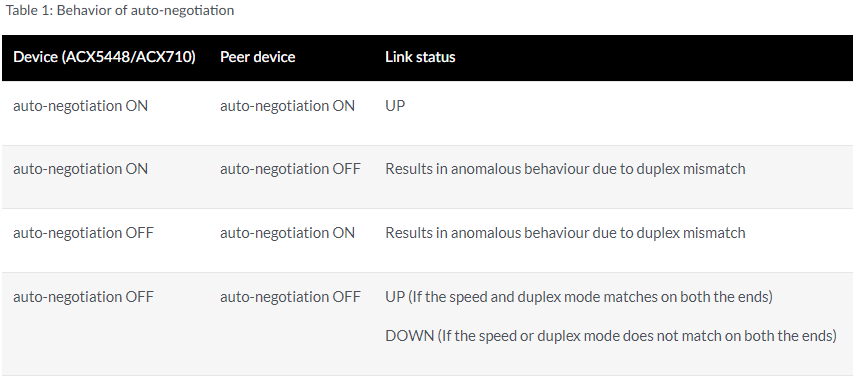

# auto-negotiation on ACX

## **Description**

For Gigabit Ethernet interfaces on M Series, MX Series, T Series, TX Matrix routers, and ACX Series routers explicitly enable autonegotiation and remote fault. For EX Series switches, explicitly enable autonegotiation only. You cannot disable autonegotiation on ACX5448 routers for Gigabit Ethernet interfaces by using the no-auto-negotiation command. The no-auto-negotiation command is not supported on ACX5448 routers.

- auto-negotiation—Enables autonegotiation. This is the default.
- no-auto-negotiation—Disable autonegotiation. When autonegotiation is disabled, you must explicitly configure the link mode and speed.

Starting in Junos OS Release 22.1R1, we support auto-negotiation for 1G interface on ACX5448, ACX5448-D, ACX5448-M and ACX710. Use the existing auto-negotiation | no-auto-negotiation statement at the [edit interfaces interface-name gigether-options] hierarchy level to enable and disable auto-negotiation for 1G interfaces.

* *No-auto-negotiation** configuration through CLI is supported from port 24 onwards on ACX5448 variants and **port 16 onwards on ACX710.**

[Table 1](https://www.juniper.net/documentation/us/en/software/junos/interfaces-ethernet/topics/ref/statement/auto-negotiation-edit-interfaces.html#auto-negotiation__table_smw_fqn_4sb) shows the behaviour of auto-negotiation in different combinations.

