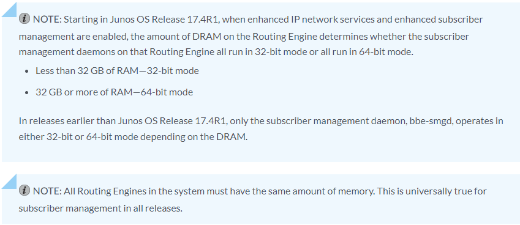
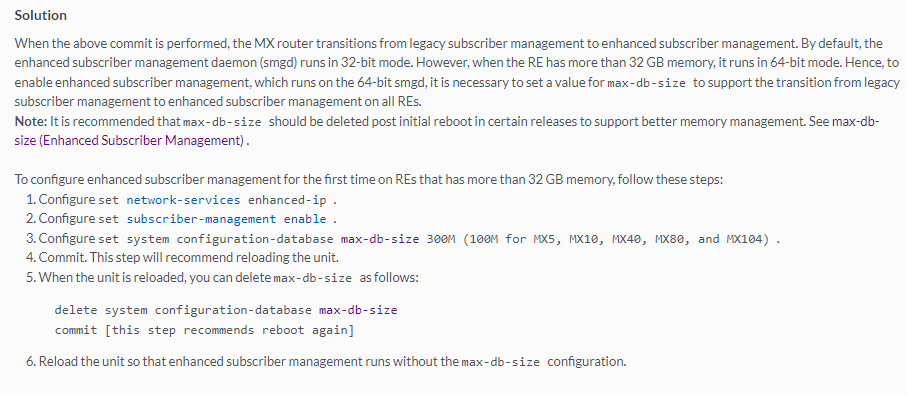
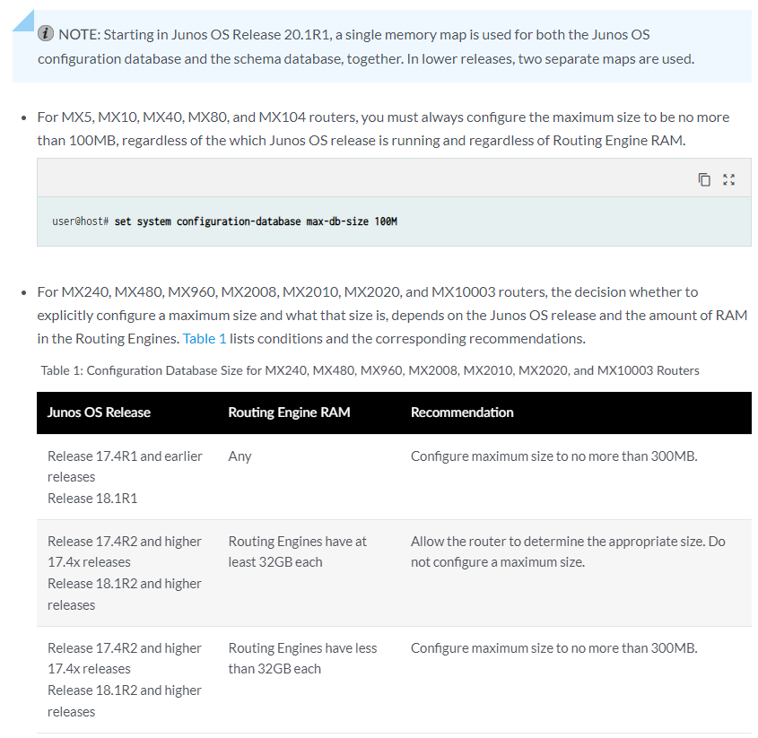

# enhanced subscriber management daemon runs in 64-bit/32-bit

<https://supportportal.juniper.net/s/article/Subscriber-Management-Enhanced-subscriber-management-failing-to-commit-when-configured-for-the-first-time?language=en_US>

