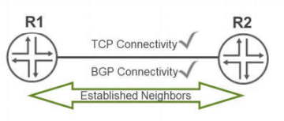

# Chapter 10: BGP

* *BGP Review**

- BGP is the core routing protocol within the Internet
- BGP is a path vector protocol

- • Distance is determined by the number of Autonomous Systems traffic must take to get to a destination.

- BGP supports two different methods of route exchange

- • EBGP used between Autonomous Systems
- • IBGP used between routers inside an Autonomous Systems

- BGP is about control

- • Many attributes available to use by policies to provide this control

* *BGP Peering**

- EBGP sessions are usually established using the IP addresses of the physically connected interfaces
- IBGP sessions are usually established between loopback addresses

- • Uses IGP to maintain sessions regardless of physical topology

* *BGP Message Types**

- BGP uses 5 different messages to establish and maintain BGP peering sessions

- • All BGP messages use a common header

- The maximum message size is 4096 bytes the smallest BGP message is a header without any data (Keepalive), which would be 19 bytes

- **BGP Message Types**

- Open
- Keepalive
- Update
- Notification
- Refresh (support depend on vendor)

* *BGP Peering Sessions**

- BGP peering sessions are manually defined and rely on TCP connections

- • No automatic neighbor discovery

- **BGP Neighbor States**

|  |  |
| --- | --- |
| **TCP Connectivity** | **BGP Connectivity** |
| Idle | OpenSent |
| Connect | OpenConfirm |
| Active | Established |

* *BGP Update Messages**

- BGP update messages include path advertisements and their associated attributes:

- • NLRI
- • Origin
- • AS Path
- • BGP next-hop
- • Additional attributes include: Local preference, MED, and communities
- • Can also list withdrawn routes that are no longer reachable

* *Other BGP Messages**

- Keepalives

- Used to maintain BGP sessions
- Configured using the holdtime option
- Holdtime is 3 times the keepalive interval
- Default holdtime is 90 seconds

- Notifications

- Sent when an error is detected with the BGP session such as a hold timer expiring, neighbor capabilities change

- Route Refresh

- Used to ask a BGP peer to resend all routes of a particular address family

- --

* *Default BGP Advertisement Rules**

- EBGP/IBGP routers advertise EBGP learned routes to EBGP and IBGP Peers
- EBGP routers advertise IBGP routes to EBGP peers
- EBGP/IBGP routers do not advertise IBGP learned routes to IBGP peers

Or

- IBGP peers advertise routes received from EBGP peers to other IBGP peers.
- EBGP peers advertise routes learned from IBGP or EBGP peers to other EBGP peers.
- IBGP peers do not advertise routes received from IBGP peers to other IBGP peers.

* *IBGP loop prevention requires a full mesh design. Using route reflectors or confederations can also alleviate this situation, both of which can reduce or alleviate the full-mesh requirement.**

* *BGP Route Update Forwarding Actions**

- IBGP does not change any information by default
- EBGP updates change AS-Path and BGP next-hop
- A BGP router will first verify next-hop reachability before adding to the route table.

* *Active BGP Route Selection Process**

- **Once BGP verifies next-hop reachability and that no loops exist**, it selects the active route as follows:

1. Prefer the path with the higher local-preference (default 100)

2. Prefer the route with the shortest AS-path length

3. Prefer the route with the lower origin code (default 0)

4. Prefer the path with the lowest MED metric (0 if absence)

5. Prefer routes learned from an EBGP peer over an IBGP peer, If only EBGP routes, prefer the current active route (If both EBGP then oldest route)

6. Prefer path whose next-hop is resolved by IGP route with lowest IGP metric

7. Prefer routes with the shortest cluster list length

8. Prefer routes from the peer with the lowest router ID

9. Prefer routes from the peer with the lowest peer IP address

- BGP can ignore both RID and peer ID comparisons when **multipath/multihop** is configured within BGP

* *BGP Multipath**

- BGP can ignore both RID and peer ID comparisons when **multipath** is configured within BGP

- • Two different peering sessions to the same router (A)
- • Two different peering sessions to different routers in the same AS (B)
- • Two different peering sessions to different routers in different ASs using multipath multiple-as (C)

- Two next hops per active route. However, by default, the forwarding table maintains a single next hop per route.

* *Multihop Peering**

- EBGP sessions can peer with nonphysical addresses

- A TTL value of 1 accommodates peering to a loopback address on a directly connected peer—higher values are needed for peers that are not directly connected.
- Note that when multihop is configured, the Junos OS sets the TTL value to 64, by default.

* *Multiple Hops with Per-Flow Load Balancing**

- You can alter the default behavior of the Junos OS to install a single next hop per route in the forwarding table with a routing policy.
- The policy should contain the action of **then load-balance per-packet** and be applied as an export policy to the forwarding table within the [edit routing-options] configuration hierarchy

- Traffic destined forthis route is now forwarded across both available nexthops using a microflow hashing algorithm.

- The default inputs to the microflow hash are the incoming router interface, the source IP address, and the destination IP address.
- You can modify the inputs to the hashing algorithm at the [edit forwarding-options hash-key family inet] configuration hierarchy.

- Specifying the **layer-4** command at this configuration hierarchy incorporates Layer 4 source and destination port information into the hash key.

* *Another Option for Secure Peering**

- BGP Generalized TTL Security Mechanism (GTSM): a BGP router sets the TTL of BGP packets to 255

- • Used in BGP single-hop
- • Requires that BGP session is only established with a directly connected router
- • Drops any BGP packets that do not have a maximum value TTL
- • Helps protect against DoS attacks

* *Peer Configuration Options**

* *passive** keeps **BGP** from sending an open message

* *allow** accepts open messages from any peer within the configured IP address range

* *prefix-limit** allows a specified amount of prefixes to be received

* *hold-time** alters the keepalive time used to maintain the **BGP** session

• Keepalive value is 1/3 of configured hold-time value

By default, Junos OS does not advertise the routes learned from an External BGP peer to another EBGP peer if that peers AS number appears in the AS-path

This forwarding suppression is not the default for all vendors

The **advertise-peer-as** statement overrides the default action on Junos BGP routers

* *Modifying AS Path: loops**

Required to accept routes with your own AS in the AS-path. Specify the number of times detection of the AS number in the AS\_PATH attribute causes the route to be discarded or hidden.

- Range: 1 through 10

- Default: 1

- For example, if you configure loops 1, the route is hidden if the AS number is detected in the path one or more times. This is the default behavior. If you configure loops 2, the route is hidden if the AS number is detected in the path two or more times.

* *Modifying AS Path: as-override**

- An alternative to advertise-peer-as
- Changes the peers AS number in the AS path to match the AS number of the sending AS

* *Modifying AS Path: remove-private**

- Eliminating Private AS Numbers

* *Modifying AS Path: local-as**

- The purpose of the **local-as** keyword is to aid an ISP in migrating BGP customers to a new AS number
- The **local-as 1 private** statement now has indeed removed AS path information
- Other options are the following:

- **• local-as autonomous-system alias:**A BGP peer considers any local AS to which it is assigned as equivalent to the primary AS number configured for the routing device. When you use the **alias** option, only the AS (global or local) used to establish the BGP session is prepended in the AS path sent to the BGP neighbor.
- **• local-as loops** ***number:*** Specify the maximum number of times that the local AS number can appear in an AS path received from a BGP peer. For number, include a value from1 through 10.
