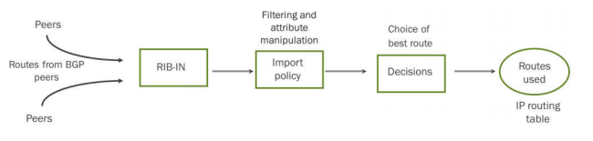
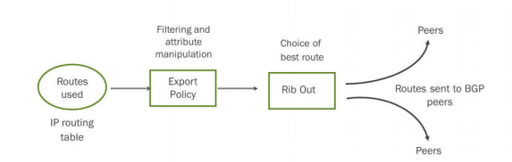
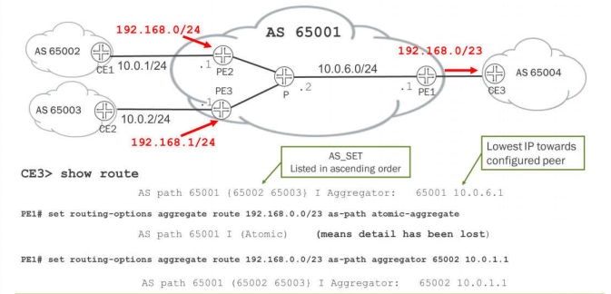

# Chapter 11: BGP Attributes and Policy - Part1

* *BGP Policy**

- BGP behavior can be influenced by policy

- BGP attributes can be matched or changed using import or export policies
- Can differentiate between IBGP or EBGP routes

- BGP stores routes in three main RIB memory tables

- RIB-IN: Stores all received routes
- RIB-LOCAL: Stores routes the local router uses to forward traffic
- RIB-OUT: Stores all advertised routes

- Only active BGP routes in the local routing table are advertised to peers

- Single best BGP path is advertised
- An overshadowed BGP route can be advertised if the **advertise-inactive** option is configured
- More than one BGP route can be advertised using the add-path option

* *BGP Import Policy**

- Import policies are enforced **between the RIB-IN and RIB-LOCAL tables**

- To view RIB-IN table: **show route receive-protocol bgp**
- To view results of import policy: **show route protocol bgp source-gateway**

* *BGP Export Policy**

- Export policies are enforced **between the RIB-LOCAL and RIB-OUT tables**

- To view RIB-OUT table: **show route advertising-protocol bgp**

* *BGP Attributes**

- Attributes are very important to the operation of the protocol
- Used to filter out undesirable advertisements from a neighbor or can be altered in an attempt to influence a routing decision of a neighbor
- Attributes must fall into one of four categories:

- **Well-known mandatory**: Must be supported by all BGP speakers and must be present in all BGP updates that contain a route
- **Well-known discretionary**: Must be supported by all BGP speakers and might or might not be present in a BGP update
- **Optional transitive**: Optional attribute that might not be understood by all speakers and is expected to transit even if it is not understood by the local speaker
- **Optional nontransitive**: Optional attribute that might not be understood by all speakers and is expected to be quietly ignored and not passed along to other BGP peers

* *Common BGP Attributes**

|  |  |  |
| --- | --- | --- |
| **Attribute Name** | **Attribute Type** | **Used in Route Decision** |
| Local Preference | Well-known discretionary | Yes |
| AS Path | Well-known mandatory | Yes |
| Origin | Well-known mandatory | Yes |
| Multiple Exit Discriminator (MED) | Optional nontransitive | Yes |
| Next Hop | Well-known mandatory | No |

* *The Power of Local Preference**

- Local preference is the first BGP attribute used to favor one route over another
- A route with higher local preference always wins—regardless of the AS-path length

* *Local-Preference Notes**

- Exchanged by IBGP peers only
- Usually used to set the exit point from an AS
- IBGP propagates information throughout the AS
- If you set no local preference for a route, a default value of 100 is used

* *Hot Potato Routing**

- Do not carry traffic in network any longer than necessary

* *Cold Potato Routing**

- Carry traffic in network for as long as possible

* *BGP Add-Path**

- Route reflectors hide information

- Only the “best” route is advertised to clients
- Backup routes are not sent
- Clients unable to make their own routing decisions

- The BGP **add-path** feature allows multiple advertisements

- Route reflector will send preconfigured number of routes
- Client can make its own decision on best route
- Client must be configured to receive multiple routes
- Downside: Multiple copies of a route means more control plane memory usage

* *Split Horizon for Local Preference**

- IBGP sessions implement split horizon, the router does not advertise those routes *back* to the neighbor from which they were learned.

* *AS Path Basics**

- BGP AS Path is a well-known, mandatory attribute
- Used to indicate path back to the route’s source and to prevent routing loops

- Each EBGP router prepends its AS number to the AS Path
- Routes with the receiving router’s AS number in the AS path are considered looped and not advertised
- Each router on the edge of the AS adds its AS number to the front of the path

* *Autonomous System Numbers**

- RFC 1930 defined ASNs as 16-bit integers

- 65536 ASNs available (some reserved by IANA)
- Private range is 64512-65534

- RFC 4893 defines 32-bit ASNs

- Can be entered as a single 4-byte integer
- Written as two 16-bit numbers: x.y
- Old ASNs written as O.y
- 1.y and 65535.65535 are reserved

- Single 4-byte AS numbers are displayed by default.
- Two 2-byte number format can be displayed instead using the **asdot-notation** option

* *Modifying AS-Path: Prepend**

- Manipulating the AS-path attribute is a major way to favor or disfavor BGP routes

* *Output of AS Path Information**

- *Brackets ([ ]):* Enclose the local AS number associated with the AS path if more than one AS number is configured on the router or if the AS number is being prepended.
- *Braces ({ }):* Enclose AS sets—groups of AS numbers in which the order does not matter. A set commonly results from route aggregation. The numbers in each AS set are displayed in ascending order.
- *Parentheses ( ( ) ):* Enclose a confederation.

* *BGP Route Aggregation**

- The route aggregation methodology helps minimize the number of routing tables in an IP network by consolidating selected multiple routes into a single route advertisement.
- an aggregator entry will appear that includes the AS number that aggregated the routes and the lowest IP address that faces the configured peer.
- By including the **as-path atomic-aggregate** option when creating the aggregate route, only the AS of the aggregating device is posted but the word (Atomic) is included to indicate that the detail has been suppressed.
- The **aggregator** option allows you to specify a different AS number than the AS that formed the aggregate route (encoded as two octets) followed by the IP address of the BGP system that contributed to the aggregate.

* *Null AS Path**

- Routes that originated in your own AS have no AS numbers in the path yet
- To reference the null AS path within a policy, use the parentheses “()” regular expression

* *Null AS Path to Stop Transit**

- You can use the null AS path to find routes advertised by BGP that originated within the local AS path. When would this be helpful? Usually, when one AS path does not want to carry transit traffic for another AS path.
