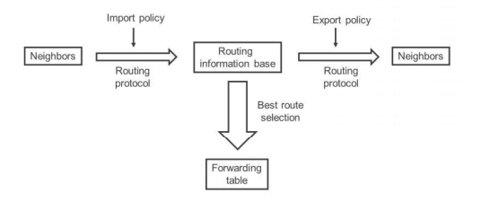
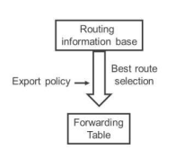

# Chapter 16: Policy Troubleshooting

* *Import and export protocol policies**

• The role of policies in the flow of routing information



* *Forwarding table export policy**



* *Default import and export policies**

|  |  |  |
| --- | --- | --- |
| **Protocol** | **Import** | **Export** |
| **BGP** | Accept all BGP IPv4 routes learned from configured neighbors. | Accept and export active BGP routes following BGP forwarding rules. |
| **IS-IS** | Accept all IS-IS LSPDUs and forward per IS-IS flooding rules. Import policies are not supported. | Used to redistribute routes into IS-IS  No routes are redistributed by default. |
| **OSPF** | Accept all OSPF LSAs and forward per OSPF flooding rules. Import policies are used to block external routes from being added to route tables. | Used to redistribute routes into OSPF  No routes are redistributed by default. |
| **RIP** | Accept all RIP routes learned from configured neighbors | Reject everything |
| **RIPng** | Accept all RIPng routes learned from configured neighbors | Reject everything |

* *Policy Subroutines and Expressions**

- Policy subroutines

- It is possible to use a policy as a condition in another policy

- Policy expressions

- It is possible to specify a logical expression as an export policy

- && logical AND
- || logical OR
- ! logical NOT

- The results can be unpredictable if the policies only modify the route attributes and do not accept or reject the routes

* *Policies: Useful Commands**

- **show route forwarding table**

- Allows you to verify the effects of forwarding table policies
- Especially useful to see if load-balancing per-packet is working as expected
- **ulst** is the list of unicast next hops among which traffic is load-balanced

- Tracing policies

- For hard-to-debug policy problems, it is possible to trace policy evaluation

```text
Configure **traceoptions flag policy** under **routing-options**
Use the **then trace** in the policy terms you want to trace
```
[edit routing-options]

```text
user@router# show
```
traceoptions {

```text
file policy size 10m;
```
flag policy;

}

policy-statement add-one {

term add-community {

from {

route-filter 10.0.0.0/8 exact;

}

then {

community add one;

trace;

accept;

}

}

```text
user@router> show log policy | match trace
```
- Use protocol-specific commands to test policy effect

```text
For OSPF and IS-IS redistribution policies, check the link-state database
```
- **show ospf database external advertising-router *router \* match *prefix***
- **show isis database *router*| match *prefix***

```text
For BGP, check received and advertised routes
```
- **show route advertise-protocol bgp *neighbor***
- **show route receive-protocol bgp *neighbor***
- To display routes filtered by import policies, add **hidden**

- For LDP, check the LDP database

- **show ldp database**

* *How JunOS matches route filters**

- First, Junos performs a prefix search for the most specific route filter
- Then, it checks the prefix-length operator
- There is no re-evaluation of route-filters if the prefix-length operator fails
