# Chapter 2: OSPF

- --

Chapter 2: OSPF

- --

OSPFv2 Review (1 of 3)

```text
OSPF is a link-state IGP used within an AS
Neighbors use hello packets to form adjacencies
```
- OSPF uses IP protocol number 89 and the AIISPFRouters multicast address of 224.0.0.5 to flood LSAs

- Routers on a broadcast segment elect a DR

- The criteria for electing the DR is the highest configured priority on the segment, which is set to 128 by default

- The second criteria for electing a DR is the highest router ID on the segment.

- The election of a DR on a broadcast segment is a nondeterministic event.
- Use interface-type p2p on a point-to-point Ethernet link to eliminate the need for this election

```text
This option can save up to 40 seconds of wait time to get the OSPF adjacency to a full state.
```
OSPFv2 Review (2 of 3)

- All OSPF routers maintain a copy of the database

- Database contents consist of information learned through LSAs and must match on all routers within an area
- SPF algorithm uses the contents of the LSDB as input data to calculate the best loop free paths

OSPFv2 Review (3 of 3)

```text
Packet Types
```
- Every OSPF router uses a specific set of packets to perform its functions. The packet types include the following:

```text
Hello: Sent by each router to form and maintain adjacencies with its neighbors.
Database description: Used by the router during the adjacency formation process. It contains the header information for the contents of the LSDB on the router.
Link-state request: Used by the router to request an updated copy of a neighbor’s LSA.
Link-state update: Used by the router to advertise LSAs into the network.
Link-state acknowledgment: Used by the router to ensure the reliable flooding of LSAs throughout the network
```
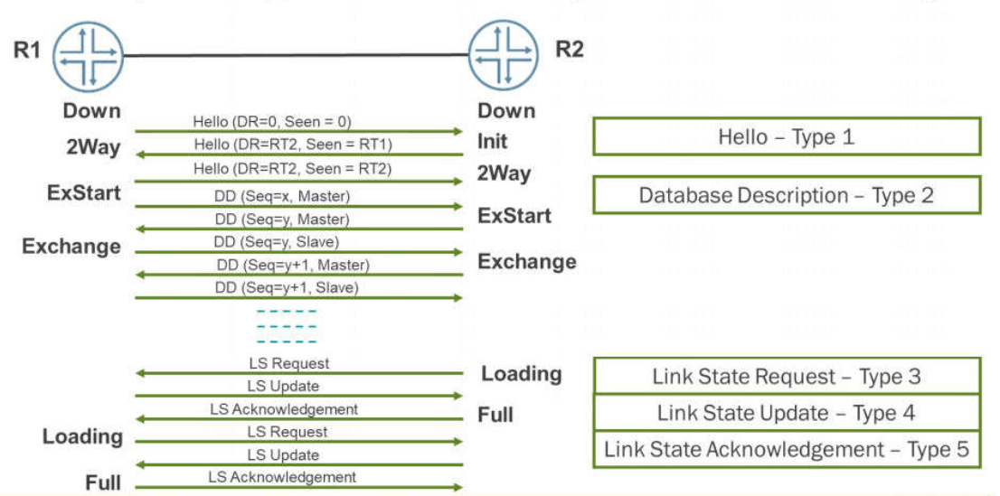


- On broadcast network, Hello packet is sent as multicast traffic, 4 packet types are sent as unicast traffic
- On P2P network type, all packet types are sent as unicast traffic

- Most implementations, including Junos, will use the IP precedence (DSCP) bits to allow for prioritization of OSPF messages over other traffic

- Junos sets all OSPF packets to IP Precedence 110 (Internetwork control, or CS6 for DSCP) by default

Hello Packets

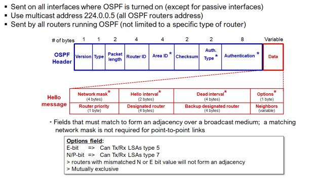

Hierarchical Design

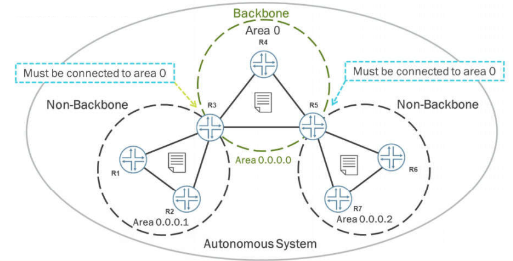

- Multi-area Design

- A backbone area (0.0.0.0) is the connecting point for all other areas.

- Each area must attach to the backbone in at least one location.

- Non-backbone areas (Area 1, Area 2, and Area 3) each contain routers internal to that area as well as a single area border router (ABR).

OSPF Routers

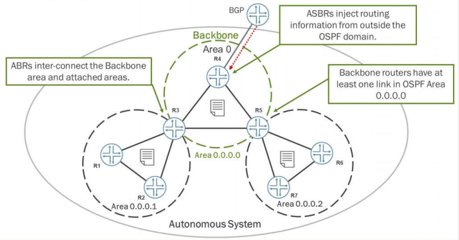

- OSPF routers can take on a number of different roles within an OSPF domain. The common types of OSPF routers:

- Area border router (ABR): An OSPF router with links in two or more areas, the ABR is responsible for connecting OSPF areas to the backbone.

- The ABR generates summary LSAs that represent the routes within its area and floods those to the backbone.
- The ABR is also responsible for generating summary LSAs that represent the backbone routes and injecting these LSAs into its attached area.

- Autonomous system boundary router (ASBR): An OSPF router that injects routing information from outside the OSPF autonomous system (AS), an ASBR is typically located in the backbone. However, the OSPF specification allows an ASBR to be in other areas as well.
- Backbone router: Defined as any OSPF router with a link to Area 0 (the backbone). This router can be completely internal to Area 0 or an ABR depending on whether it has links to other, non-backbone areas.
- Internal router: An internal router is an OSPF router with all its links within the same area.

OSPF RID

- Each OSPF router selects a 32-bit value to use as its RID

- Uniquely identifies the router within the network
- Populated within the LSAs sent out by each router
- Used by the LSDB to run SPF
- Two directly connected routers with the same RID will not form an adjacency
- Two routers with the same RID that are not directly connected will create problems

- You can set the RID explicitly within [edit routing-options]

[edit routing-options]

```text
user@router# set router-id 192.168.1.1
```
- If you do not configure a router ID explicitly, the IP address of the first interface to come online is used as the value of the RID.

- Normally this is the loopback interface address in case the smallest non-127/8 IP address configured.
- Otherwise, the first hardware interface with an IP address is used

- In a multi-area network, best practice is to put the loopback in area 0.0.0.0

What If...?

- ...you have multiple addresses configured on an interface, but do not want to advertise all of them into OSPF?

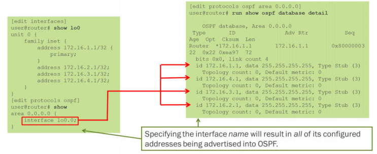

The Solution...

- Specify the interface address instead of the interface name

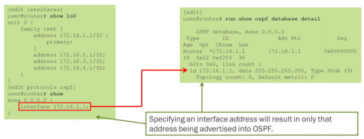

LSA Types

- LSA types

```text
Router LSAs                                            (Type 1)
Network LSAs                                         (Type 2)
Summary LSAs                                        (Type 3)
ASBRSummary LSAs                               (Type 4)
AS external LSAs                                    (Type 5)
Group membership LSAs                       (Type 6)
NSSA LSAs                                              (Type 7)
External attributes LSAs                         (Type 8)
Opaque LSAs                                          (Types 9, 10, and 11)
Each LSA type describes a portion of the OSPF routing domain
LSAs 6, 8, and 11 are not supported
```


```text
Link-State Update Packets
```
- Multiple LSAs in a Single Update
- Packets consist of the following:

- (24-byte) OSPF header
- (4-byte) Number of advertisements
- (Variable) LSAs

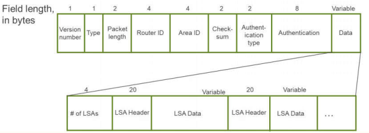

LSA Header

- 20 bytes of information that identify the LSA uniquely and consist of:

```text
Link-state age (2 bytes) - Count up timer
Options (1 bytes) - Indicates the optional capabilities support on this router
```
- P bit (position 5) set in all NSSA external LSAs
- E bit (position 7) set in all external LSAs

```text
Link-state type (1 bytes) - LSA Type
Link-state ID (4 bytes) - Varies based on LSA Type
For Router LSA, it will be equal to RID of the router.
For Network LSA, this field is set equal to the DR's IP address.
For ASBRSummary LSA, it is equal to ASBR’s RID.
For Summary, External and NSSA LSAs, link-state ID is set equal to the advertised IP subnet.
Advertising router (4 bytes) - Router ID of originating router
Link-state sequence number (4 bytes) - Determines if LSA has changed
```
- Values range from 0x80000000 to 0x7FFFFFFF (số nguyên có dấu)

```text
Link-state checksum (2 bytes) - LSA integrity check
Length (2 bytes)
```


Router LSA (Type 1)

- Originated by each router in an area

```text
Has area scope
Describes the state and cost of the router’s interfaces
```
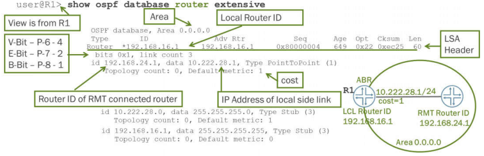

- In addition to the standard LSA header, the router LSA also contains the following fields:

- V, E, and B bits (1 byte): Following five bits set to a value of 0, the V, E, and B bits represent the characteristics of the originating router.

- The V bit is set when a virtual link is established.
- An ASBR sets the E bit.
- An ABR sets the B bit.

- Number of links (2 bytes): This value gives the total number of links represented by the following set of fields.
- Link ID (4 bytes): This field represents to what the far side of the link is connected. It is used in conjunction with the link type field.
- Link data (4 bytes): This field represents to what the nearside of the link is connected. It is used in conjunction with the link type field.
- Link type (1 byte): This field describes the type of link.
- Number of Multi Topology IDs (MT-IDs) (1 byte)
- Metric (2 bytes): This field provides the cost to transmit data out of the interface.
- MT-ID (1byte): Renamed TOS field to represent the multi topology ID.
- MT-ID metric (2 bytes): Renamed TOS metric field to represent the Multi Topology (MT) metric.
- Additional data (4 bytes): This field is unused.


Note:point-to-point interface will count as 2 links: 1 stub and 1 point-to-point


Link ID and Link Data Fields

- Interpretation depends on value of the link type field

|  |  |  |
| --- | --- | --- |
| Link Type | Link ID | Link Data |
| Point-to-point (Type1) | Neighbor’s RID | Local router’s interface IP address |
| Transit (Type 2) supports M/A network links | DR’s interface IP address | Local router’s interface IP address |
| Stub (Type 3) supports P2P, passive, and lookback Interfaces | Network number | Subnet mask |
| Virtual link (Type 4) | Neighbor’s RID | Local router’s interface IP address |

- The following link types are supported:

- Point-to-point (Type 1): On a point-to-point interface, an OSPF router always forms an adjacency with its peer over an unnumbered connection.
- Transit (Type 2): A connection to a broadcast segment is always noted as a transit link.
- Stub (Type 3): A router advertises a stub network when a subnet does not connect to any OSPF neighbors.

- Advertising a stub network occurs for the loopback interface and any passive interfaces.
- In addition, the IP subnet for any point-to-point interface is advertised as a stub because the adjacency was formed over an unnumbered interface.

- Virtual link (Type 4): A virtual link operates between an ABR connected to Area 0 and an ABR that is not connected to Area 0.

Network LSA (Type 2)

- Originated by designated routers

- Has area scope
- Describes all routers attached to a network segment

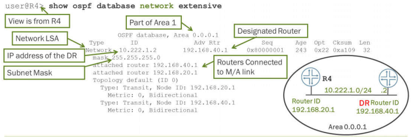

- In addition to the standard LSA header, the network LSA also contains the following fields:

- Network mask (4 bytes): This field denotes the IP subnet mask for the interface connected to the broadcast network.
- Attached router (4 bytes): This field is repeated for each router connected to the broadcast network. The value of each instance is the router ID of the attached routers.

Summary LSA (Type 3)

- Originated by ABRs

- Has area scope

- Therefore, it is not reflooded across the area boundary by another ABR.
- Instead, the receiving ABR generates a new Type 3 LSA describing the link and floods it into the adjacent area.

- Describes networks external to the area

- By default every IP subnet listed in every Router LSA or Network LSA will be translated into a separate Network Summary LSA

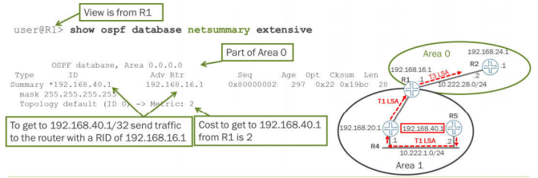

- In addition to the standard LSA header, the summary LSA also contains the following fields:

- Network mask (4 bytes): This field represents the subnet mask associated with the network advertised.

```text
It is used in conjunction with the link-state ID field, which encapsulates the network address in a Type 3 LSA.
```
- Metric (3 bytes): This field provides the cost of the route to the network destination.

- When the summary LSA is representing an aggregated route (using the area-range command), this field is set to the largest current metric of the contributing routes.

- MT-ID (1 byte): This field represents the MT-ID value used in a Multi Topology configuration.
- MT-ID metric (3 bytes): This field represents the MT-ID metric used in a Multi Topology configuration.

External LSA (Type 5)

- Originated by ASBRs

- Has domain scope - Forwarded unchanged by ABRs
- Describes networks external to the OSPF domain

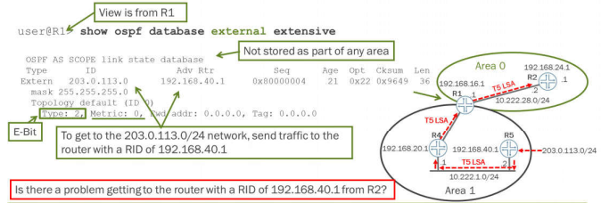

- In addition to the standard LSA header, the AS external LSA also contains the following fields:

- Network mask (4 bytes): This field represents the subnet mask associated with the network advertised.

```text
It is used in conjunction with the link-state ID field, which encapsulates the network address in a Type 5 LSA.
```
- E bit (1 byte): The E bit determines the type of external metric represented by the metric field.

- It is followed by 7 bits, all set to 0 to make up the entire byte.

- A value of 0, the default value, indicates that this is a Type 2 external metric.

- Any local router should use the encoded metric as the total cost for the route when performing an SPF calculation.

- A value of 1, indicates that this is a Type 1 external metric.

- The encoded metric of the route should be added to the cost to reach the advertising ASBR. This additive value then represents the total cost for the route.

- Metric (3 bytes): This field represents the cost of the network as set by the ASBR.
- Forwarding address (4 bytes): This field provides the address toward which packets should be sent to reach the network.

- A value of 0.0.0.0 represents the ASBR itself. (base on the E bit in LSA Type 1)

- External route tag (4 bytes): This 32-bit value field can be assigned to the external route.

- OSPF does not use this value, but it might be interpreted by other protocols.

- MT-ID and MT-ID metric fields (4 bytes): These fields represent the MT-ID and MT-ID metric values used in a Multi Topology configuration.

ASBR Summary LSA (Type 4)

- Originated by ASBRs

- Has area scope - Created by ABRs
- Describes networks external to the OSPF domain

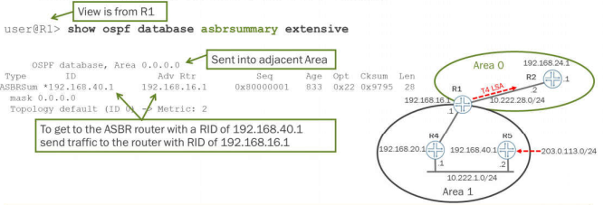

- In addition to the standard LSA header, the ASBR summary LSA also contains the following fields:

- Network mask (4 bytes): This field has no meaning in a Type 4 LSA and is set to 0.0.0.0.

```text
The address of the ASBR is encoded in the link-state ID field.
```
- Metric (3 bytes): This field provides the cost of the route to the ASBR.
- MT-ID (1 byte): This field represents the MT-ID value used in a Multi Topology configuration.
- MT-ID metric (3 bytes): This field represents the MT-ID metric used in a Multi Topology configuration.

- ASBR has an export policy configured within OSPF, which means that it has set the E bit in its router LSAs.
- Based on the E bit setting in the router LSAs, the ABR generates an ASBR summary LSA across the area boundaries.

NSSA LSA (Type 7) (1 of 2)

- Originated by an ASBR within the NSSA area

- Has same format as an AS external LSA (Type 5)

- The only difference between the two LSAs is in the use of the forwarding address field.

- The logic in selecting the Forwarding Address is as follows:

- 1. Walk all the interfaces enabled in the NSSA area
- 2. Choose the first active interface that has a non-zero IP (the biggest IP address if multiple IP addresses exist)

- To make the Forwarding Address decision predictable, configure a Loopback interface to belong to the NSSA area.

- Loopback interfaces will be the first interface on the list, so the router will always use the Loopback interface's IP as the Forwarding Address.

- Has area scope
- Describes networks external to the OSPF domain

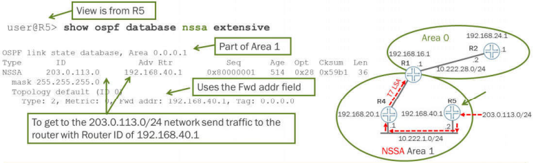

External LSA ( Translated Type 7) (2 of 2)

- Translated into an AS external LSA (Type 5) by the ABR at the NSSA border.

- When multiple ABRs exist, the ABR with the highest RID performs the translation.

- Does not require a Type 4 ASBR Summary from the translating ABR.
- When an ASBR is also an ABR with an NSSA area attached to it, a Type 7 LSA is exported into the NSSA area by default.

- If the ABR is attached to multiple NSSAs, a separate Type 7 LSA is exported into each NSSA by default.
- Use the no-nssa-abr command to disable the export.

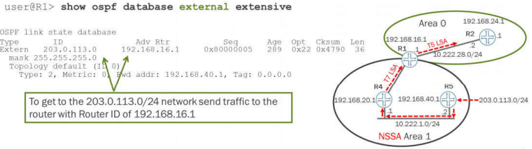

Opaque LSA (Types 9-11)

- Allows for the future extensibility of OSPF

```text
The Junos OS uses Type 9 for graceful restart capability -  a link-local scope
The Junos OS uses Type 10 for MPLS traffic engineering - an area scope
Type 11 is currently not supported -  domain scope
```
- Consist of a standard LSA header followed by application-specific information

- OSPF or other applications can use information field directly

OSPF Database Protection

- Limits the number of LSAs not generated by the local router in a given OSPF routing instance
- Protects the LSDB from being flooded with excessive LSAs
- Useful if VPN routing and forwarding is configured on your provider edge and customer edge routers are using OSPF as the routing protocol

```text
user@router# show protocols ospf
```
database-protection {

maximum-lsa 1000;

warning-only;

}

Shortest Path First Algorithm

- Based on the Dijkstra algorithm

```text
Link-state database
Candidate database
Tree database
Run on a per-area basis on each router
```
- Independent calculation of the topology

- Result is passed to the Junos OS routing table

- The route selection algorithm (route preference value) determines whether the route is marked active

Controlling SPF Calculations

- Three consecutive SPF runs can occur before a mandatory holddown occurs (succession = ???)

- Keeps the network stable during change
- 5-second timer is now configurable
- Possible values range from 2000 to 20,000 ms

- Default 200 ms delay between a topology change and running the SPF algorithm

- Altered with the spf-options delay command
- Possible values range from 50 to 8000 ms

[edit protocols ospf]

```text
user@router# set spf-options delay 100
```
- Now we are going to play with the timers and run the debugs, and examine the behavior. We will set the delay to 1 sec and the hold-down timer to 20 sec while keeping the rapid-runs as default.

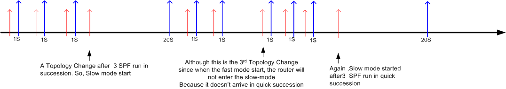

SPF Calculation Order

- The SPF calculations are performed per area in the following preference order.

- Intra-Area Links — First
- Inter-Area Links — Second
- External Type E1 — Third
- External Type E2 — Fourth

Reference Bandwidth

- Default OSPF cost for all links is 108/bandwidth (bps)

- Links with a bandwidth ≥ 100 Mbps have a cost of 1
- Cost calculation results in a value <1, so it is rounded up

- Use the reference-bandwidth command to change the 108 default within the [edit protocols ospf] hierarchy

OSPF Cost

- Cost is a measure of how desirable (or undesirable) it is for a link

- Cost is advertised as a 16 bit integer - 0 to 65535

- Cost of 0 is reserved only for connected networks

- Max cost of a route from end-point to end-point is practically limited to a 24 bit integer - 16,777,215
- Summary LSAs, External LSAs use 24 bit field for metric

Effects of Altering Metrics

- Metric values are advertised in Type 1 LSAs and populate LSDB
- As each router runs the SPF algorithm, each LSA is examined individually for the cost of the outgoing interface

- The final metric calculation uses that cost

- Routers can disagree about the cost on a network link

Overload Settings

- Used for transit traffic only if no other path is available

- Sets metric to 65,535 in router LSA on all transit links
- Flooding of changed LSA causes SPF calculations in network

- Can be set permanently or with a timeout value

- Timer is between 60 and 1800 seconds
- Timer only runs after RPD starts

- An ABR of stub area will not poison the default route metric after the ABR became overload.

OSPF Authentication

- Three types of authentication are supported: none, simple, and MD5. As of Junos Release 8.3, IP Security (IPsec) was added
- By default, the authentication type is set to none

- Effectively means no authentication is performed

- Type simple uses a plain-text password
- OSPF interface authentication configuration is the best practice.

- OSPF authentication at the area level should be avoided.

MD5 Authentication (1 of 2)

- Includes an encrypted checksum with all packets

- Provides better security than simple type

- Each interface requires an authentication key

- Multiple interfaces can use the same key
- Keys are always encrypted in the configuration

- Each key requires a key ID value ranging from 0-255

- The key-id must match on both routers and the highest key that is configured will win.

MD5 Authentication (2 of 2)

- MD5 authentication allows for multiple key ID values

- Highest value used by default
- For easy transition, assign each key ID a start time

Verifying Authentication

- Authentication information available with the show ospf interface detail command

OSPFv3

- OSPFv3

- Fundamental mechanics of OSPF unchanged

- Areas (Regular, Stub, Not-so-Stubby, Totally Stubby)
- LSA flooding
- DR elections
- Options
- Summarization
- Junos includes support for Virtual links, Graceful restart, External prefix limits, and Bidirectional Forwarding Detection.

- Significant changes to account for the difference between IPv4 and IPv6 addressing
- Configuration mainly requires substituting ospf3 for ospf

OSPF and OSPFv3 Configuration

- IPv4 OSPF

[edit protocols ospf]

area 0.0.0.0 {

interface ge-0/0/4.0;**\***

interface ge-0/0/5.0;**\***

interface lo0.0;**\***

}

area 0.0.0.1 {

nssa {

default-lsa default-metric 10;

}

interface ge-0/0/6.0;**\***

}

* *\* Must have a family inet address configured**

- IPv6 OSPF3

[edit protocols ospf**3**]

area 0.0.0.0 {

interface ge-0/0/4.0;**\*\***

interface ge-0/0/5.0;**\*\***

interface lo0.0;**\*\***

}

area 0.0.0.1 {

nssa {

default-lsa default-metric 10;

}

interface ge-0/0/6.0;**\*\***

}

* *\*\* Must have a family inet6 address configured**

- IPv4 OSPF3

[edit protocols ospf**3 realm ipv4-unicast**]

area 0.0.0.0 {

interface ge-0/0/4.0;**\*\*\***

interface ge-0/0/5.0;**\*\*\***

interface lo0.0;**\*\*\***

}

area 0.0.0.1 {

nssa {

default-lsa default-metric 10;

}

interface ge-0/0/6.0;**\*\*\***

}

* *\*\*\* Must have a family inet address configured**

* *Must also have family inet6 configured**

Note: that in order to implement IPv4 only using OSPFv3, you must configure family inet6 under the interfaces that will be part of the OSPFv3 network.This is because OSPFv3 uses IPv6 Link-Local addresses to pass messages between routers on the same network segment.

OSPFv3 Router ID

- Same as OSPF Router ID

```text
OSPFv3 maintains the 32-bit RID that represents the router in the link-state database
```
- This is not an IPv4 address, it just looks like one!

- The RID can’t be derived from an IPv6 address as it is possible with IPv4
- Requires explicit configuration (assuming no IPv4 addresses are present) Set the RID manually under routing-options

Differences from OSPFv2 (1 of 2)

- Differences between OSPFv2 and OSPFv3

- Use of link-local addresses (per-link adjacency)

- Used to originate packets

- Authentication removed (no authentication)

- Done at the IP (IPv6) layer

- LSA format changes to account for differences in address size

- New LSAs and renaming of old ones

- Type 3 -> Inter-area-prefix LSA
- Type 4 -> Inter-area-router LSA
- Intra-area-prefix LSA: carrying prefix information internal to areas that were previously carried inside router and network LSAs
- The link LSA is used to advertise to directly attached OSPF neighbors the link-local IPv6 address assigned to the interface.

- The link LSA is not flooded beyond the physical broadcast domain.

- Options field expanded

- V6 bit - Indicate if the link should be excluded from IPv6 route calculations
- R bit - "Router" bit - Used like the Overload bit. Indicates whether the originator is an active router

- If the R bit is clear (that is, 0) in the OSPF options field,the advertising router can participate in OSPF without being used for transit traffic.
- This would be a useful setting for hosts that are multihomed but never used to forward traffic between interfaces.

Differences from OSPFv2 (2 of 2)

- Differences between OSPFv2 and OSPFv3 (cont):

- Protocol processing per link, not per subnet
- Removal of addressing semantics

- Router and network LSAs have no addressing
- Uses intra-area-prefix LSA to carry addressing information

- Unknown LSA handling - Defines whether to keep unknown LSAs local or to forward them. This information is carried in the U bit of the LSA type field
- Flooding scope is encoded in the LSA type field using the S1 and S2 bits

OSPFv3 LSA Types

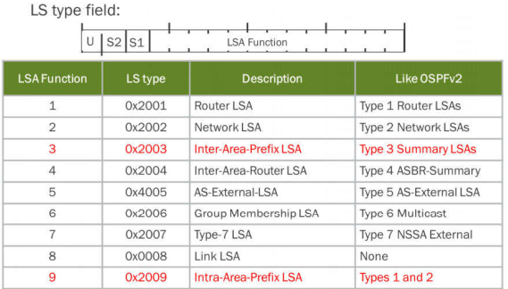

- LSA properties include:

- U bit: Used to indicate how a router that does not understand the LS function code should handle the LSA.

- When the code is 0, the router should treat the LSA as if it has link-local scope only.
- When the code is 1, the router should store and flood it as if it were understood.

- S-bits and flooding scope: Used to indicate the flooding scope for the LSA:

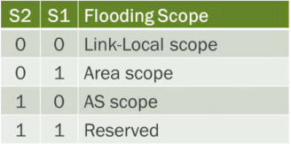

- --

Options Bits

Hello/DBD/LSA Options Bits

\* V6 bit: It should be set, unless the router will not participate in IPv6 topology calculation and IPv6 transit routing. If this bit is clear, the router/link should be excluded from any IPv6 routing calculations.

\* R bit: It should be set, unless the router will not participate in any transit routing. It allows the router to participate in the unicast topology, but does not allow transit traffic.

\* E bit: It should be set if the interface attaches to a regular area (i.e., not a stub or NSSA area).

\* N bit: It should be set if the interface attaches to an NSSA area.

\* DC bit: This bit describes the router's handling of demand circuits. It should be set in Hellos/DBDs if the router wishes to suppress the sending of future Hellos over the interface. It should be set in LSAs, if the router can correctly process the DoNotAge bit when it appears in the LS age field of LSAs.

IPv6 Prefix Options Bits

\* NU bit: The "No Unicast" capability bit. If set, the prefix should be excluded from IPv6 unicast calculations. If not set, it should be included.

\* LA bit: The "Local Address" capability bit. If set, the prefix is actually an IPv6 interface address of the Advertising Router.

\* P bit: The "Propagate" bit. Set on NSSA area prefixes that should be readvertised by the translating NSSA area border.

\* DN bit: The "Down" bit. This bit controls an inter-area-prefix-LSAs or AS-external-LSAs re-advertisement in a VPN environment. It is used for loop prevention in PE=>CE=>PE advertisements and should not be checked in CE multi-vrf (vrf-lite) scenarios.

root@R3\_RTR-D# show interfaces ge-0/0/0

unit 0 {

family inet {

address 10.3.4.3/24;

address 10.30.40.3/24;

}

family iso;

}

[edit]

root@R3\_RTR-D# run show ospf neighbor

```text
Address          Interface              State     ID               Pri  Dead
```
10. 3.4.4         ge-0/0/0.0             Full      10.4.4.4         128    36

10. 30.40.4       ge-0/0/0.0             Full      10.4.4.4         128    36

- --

[https://www.blackhole-networks.com/OSPF/](https://www.blackhole-networks.com/OSPF/#spf_tuning)
