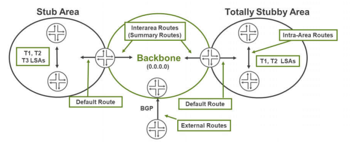
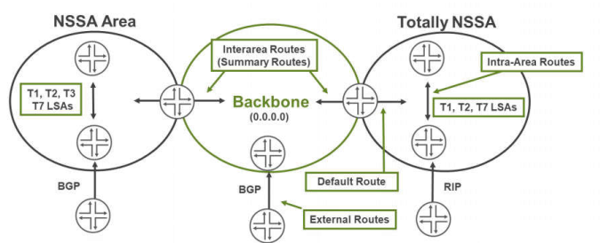
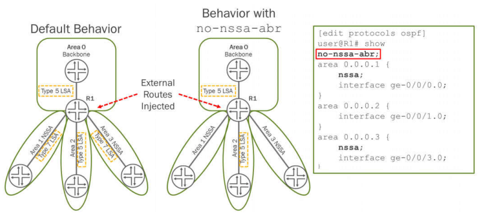
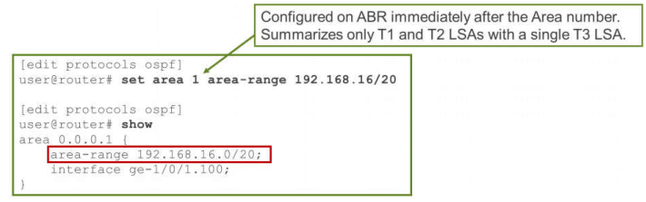
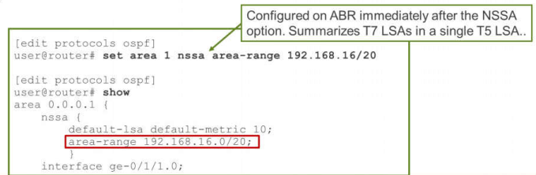
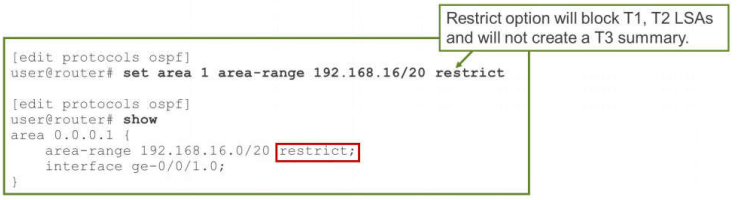
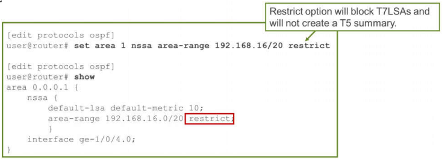

# Chapter 3: Advanced OSPF

- --

* *Chapter 3: Advanced OSPF**

- --

* *Scaling an OSPF Network**

```text
As OSPF networks grow, so does the size of the LSDB. Not normally an issue.
Common reasons to create OSPF areas is to control flooding or for Administrative purposes.
Multiple Areas means multiple link-state databases.
```
* *LSA Flooding: Default**

- OSPF Default Flooding Rules

- As OSPF interfaces are added into each router’s configuration, T1 and T2 LSAs are created.
- In this environment, routes from one area are unable to reach another area.

- To resolve this issue the ABR creates summary LSAs (T3) to represent the prefixes from one area and inject those T3 LSAs into the adjoining area.

- In order to achieve this inter-area communications the ABR connected to Area 0 has a special capability. An ABR connected to Area 0 is the only ABR that can take a T3 LSA from one area and create a new T3 LSA and forward it into another non-backbone area. In this way all areas are able to reach the networks in every other area.
- External routes injected into Area 0 become T5 LSAs. T5 LSAs have a domain scope so ABRs forward T5 LSAs into all areas.

- However the other areas will not know how to reach the advertising router.
- To overcome this issue, ABRs will create a supplemental T4 LSA to provide the SPF algorithm with information on how to forward the traffic towards the dvertising router.

- To manage the default flooding of LSA, special area type can be used.

* *OSPF Areas Types**

- OSPF has special designations that can be applied to areas that will automatically limit flooding into those areas. These special areas area classified as follows:

- **Stub**
- **Totally Stubby**
- **Not-so-Stubby (NSSA)**
- **Totally Not-so-Stubby**

* *OSPF Stub Areas**

- **OSPF Stub Areas**

- A Stub areas can contain:

- Intra-area route information if the form of T1, T2 LSAs
- Inter-area routing information in the form of T3 LSAs.

- **Totally Stubby Area**

- A Totally Stubby area only contains

- intra-area route information in the form of T1, T2 LSAs.
- A single T3 LSA is possible if a default route has been configured to be injected by the ABR.



* *OSPF Not-So-Stubby Areas**

- **OSPF Not-so-Stubby Areas (NSSA)**

- An NSSA will have

- intra-area route information in the form of T1 and T2 LSAs.
- Inter-area route information is carried in T3 LSAs
- A NSSA can also support external route information in the form of T7 LSAs.
- A default route injected into the NSSA will be a T7 LSA.

- **Totally Not-so-Stubby Area**

- A Totally NSSA will have intra-area route information in the form of T1 and T2 LSAs. A Totally NSSA can also support external route information in the form of a T7 LSA. A default route injected into the Totally NSSA as a T3 LSA, but can be changed back into a T7, if desired.



* *Advertisement Of Default Route Into Areas**

- Default route not advertised into NSSA area or stub area by default.

- Use **default-metric** command.

* *Stub Areas**

- Reduces the size of the LSDB

- ABR does not inject Type 4 LSA into area
- ABR does not flood Type 5 LSA into area

- Reachability for routes external to OSPF is achieved using a 0/0 default route injected by the ABR

- Manual configuration step for added administrator control
- OSPF ABR will not generate default LSA to stub area when area 0 has only one router

- there is a hidden command which will change this behavior. You can configure following command on ABR.

```text
root@MX960# set protocols ospf no-active-backbone  ####Hidden Command ####
```
- ASBR in a stub area cannot flood LSAs for external routes
- Virtual links cannot transit a stub area

* *Totally Stubby Area**

- Stub area configured with the **no-summaries** option
- Further reduces the size of the LSDB

- ABR does not inject Type 3 LSA into area
- ABR does not inject Type 4 LSA into area
- ABR does not flood Type 5 LSA into area

- Reachability for external routes is available using a 0/0 default route injected by the ABR

- Again, a manual configuration step exists for administrator control

- ASBR in a **no-summaries** area cannot flood LSAs for external routes
- Virtual links cannot transit a **no-summaries** area

* *Stub Area Configuration**

- All routers in a stub area must be configured as stub routers

- This configuration turns on the E-bit (sets it to one) in the options field of the OSPF hello packet

- This notifies all neighbors that the local router does not support external LSAs

- The ABR injects a default route when the default-metric statement is added

- **A default route is not automatically generated!**

* *Stub Area with** **no-summaries** **Configuration**

- Only ABRs are configured to support stub areas with no summaries
- The ABR can inject a default route when the **default-metric** statement is included

- **Like a conventional stub area, the default route is not generated automatically**

* *Not-So-Stubby Areas**

- Allows a stub area to contain external routing information from a local ASBR

- ASBR injects Type 7 LSAs into NSSA
- ABR converts Type 7 LSAs into Type 5 LSAs and forwards them into the backbone

- Reachability for other external routes is available through a 0/0 default route injected by the ABR

- Manual configuration step for administrator control
- Advertised in a Type 7 LSA or a Type 3 if **no-summaries** is used

- **Virtual links cannot transit an NSSA**

* *LSA Flooding: ASBR and ABR for NSSA**

- Disabling Export of LSAs into NSSAs Attached to ASBR ABRs

- When an ASBR is also an ABR with an NSSA area attached to it, a Type 7 LSA is exported into the NSSA area by default.

- If the ABR is attached to multiple NSSA areas, a separate Type 7 LSA is exported into each NSSA area by default.

- To disable exporting Type 7 LSAs into NSSAs, include the **no-nssa-abr** statement.

- This statement is needed on the ABR only



* *Totally NSSA**

- Behaves like a stub area with **no-summaries**

- ABR does not inject Type 3 LSA from backbone into area
- ASBR injects Type 7 LSAs into NSSA
- ABR converts Type 7 to Type 5 and forwards into backbone

- Reachability for other external routes is available through a 0/0 default route injected by the ABR

- Again, a manual configuration step for administrator control
- A Type 3 summary LSA is the default

- Virtual links cannot transit an NSSA with **no-summaries**

* *NSSA Configuration**

- You must configure each router in the area as an NSSA router
- The ABR can inject a default route when the **default-metric** statement is added

- Specified within the **default-lsa** configuration hierarchy

* *NSSA Route Configuration Options**

- Can import routing information from a local ASBR

- ASBR injects Type 7 LSAs into NSSA
- ABR with the highest RID converts Type 7 LSAs into Type 5 LSAs and forwards them into the backbone

- A default route injected by the ABR which must be configured

- An LSA type 7 or type 3 on NSSA depending on configuration.

- Type 7 LSA is advertised using a Type 1 metric

- 

* *Summarizing Routes (Type 1 and Type 2 LSAs)**

- By default, all local area routes are forwarded to the backbone

- Stub setting changes only what enters an area, not what leaves that area

- Use the **area-range** command to summarize routing information

- Can result in a single Type 3 LSA injected into the backbone
- Configured on the ABRs only



- This is NOT possible!


- Default behavior


- Summarize routing


* *Summarizing Routes (NSSA External Type 7 LSAs)**

- The Junos OS forwards all ASBR Type 7 routes to the backbone by default
- Use the **area-range** command within the NSSA configuration to summarize routing information

- Injects a Type 5 LSA into the backbone
- Configured on ABRs only



- LSAs type 5 cannot be summarize


- LSAs type 7 into LSAs type 5 can summarize prefixes


* *Suppressing Routes (Type 1, 2, and 3 LSAs)**

- Adding the **restrict** keyword to the **area-range** command stops routes in that range from entering the backbone

- No Type 3 LSA will be injected into the backbone
- Configured on the ABRs only

```text
configure with the **area-range restrict** command
```
- Allows greater control over which routes are advertised to other areas

- **restrict** option will block T1, T2 LSAs and will not create a T3 summary



* *set area 1 area-range 10.1.0/22** **[restrict]**


* *Suppressing Routes (Type 7 LSAs)**

- Adding the **restrict** keyword to the **area-range** command stops routes in that range from entering the backbone

- No Type 5 LSA is injected into the backbone
- Configured on ABRs only

```text
configure the NSSA ABR with the **nssa area-range restrict** command
**restrict** option will block T7 LSAs and will not create a T5 summary
```


* *set area 1 area-range 10.1.0/22** **[restrict]**


- --

* *OSPF ROUTE FILTERING / ROUTING POLICIES and REDISTRIBUTION**

- LSAs filtering is NOT possible. The database of ALL routers within an area must be identical. You can limit propagation of some LSAs by converting the area into a stub, nssa, or stub/nssa no-summaries.
- Routing policies can be used to control creation and propagation of LSAs type 3 and LSAs type 5.
- LSAs 1 and 2 cannot controlled with any routing policies policies.


1. Inter-area internal LSA summarization and filtering on the ABR using area-range command

2. Inter-area internal LSA filtering on the ABR using the network-summary-import/export policies

Another form of filtering internal LSAs on the ABR is using the area X network-summary-export and/or network-summary-import commands that refer to a configured route policy. The idea here is that you can control what you want to share from area X to all other area’s on the ABR using the network-summary-export policy, so export here means what info do you want other area’s to know about. And to control what information an area wants to learn from other area’s you can use the network-summary-import policies.

lệnh network-summary-import/network-summary-export nó chỉ apply cho LSA type 3

network-summary-import ~ outbound filter

network-summary-export ~ inbound filter

* *network-summary-export: các route từ area khác quảng bá vào nó.**

* *network-summary-import: các route từ nó quảng bá sang area khác.**

area-range chỉ có tác dụng với các LSA T1, T2 thuộc area attached to ABR

- --

root@R3\_RTR-D# show interfaces ge-0/0/0

unit 0 {

family inet {

address 10.3.4.3/24;

address 10.30.40.3/24;

}

family iso;

}

[edit]

root@R3\_RTR-D# run show ospf neighbor

```text
Address          Interface              State    ID              Pri  Dead
```
10. 3.4.4        ge-0/0/0.0            Full      10.4.4.4        128    36

10. 30.40.4      ge-0/0/0.0            Full      10.4.4.4        128    36
