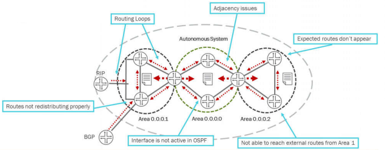
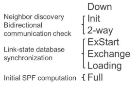
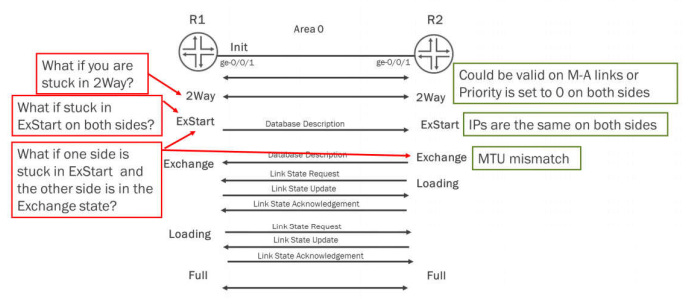
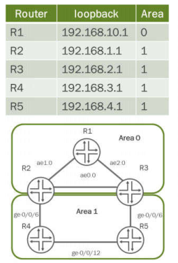
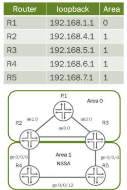
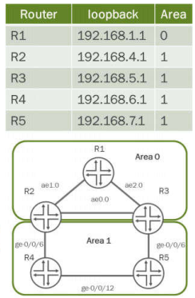

# Chapter 5: Troubleshooting OSPF

Chapter 5: Troubleshooting OSPF

- --

OSPF Issues

- OSPF issues can be divided into three basic areas

- Adjacency Issues
- LSDB Consistency Issues
- Routing Issues



Forming an OSPF Adjacency

```text
The OSPF neighbor state machine
```



```text
Moving from Down to Init State (Interface issues)
```

- Possible Interface Issues

- 1. Wrong interface configured.
- 2. Interface is down.
- 3. No IPv4 address configured on the interface.

```text
Moving from Down to Init State (Config issues)
```

- 7 Items must match

- Interface types (p2p or m-a)
- Network - (m-a only)
- Hello and dead intervals
- Area types
- Area numbers
- Authentication

- 1 Item cannot match

- Router IDs

- OTHER ISSUES

- Firewall Filters
- Interface marked as passive on one or both sides

```text
Moving from Down to Init State (State issues)
```

- Multi-Area Adjacency Configuration



OSPF Adjacency: Useful Commands

```text
show ospf neighbor
```

```text
user@router> show ospf neighbor
```

```text
Address Interface State ID Pri Dead
```

111. 127.0.55 ge-0/0/1.0 Full 111.127.255.1 128 28

111. 127.0.16 ge-0/0/2.0 2Way 111.127.255.5 0 22

111. 127.0.42 ge-0/0/3.0 ExStart 111.127.255.8 128 26

```text
Used with the **detail** option the command shows the adjacency age, and also DR and BDR (on a LAN interface) .
Remember that on a LAN, the state between two neighbors that are not DR or BDR is 2way, not Full
```

OSPF Adjacency: Useful Commands

```text
show ospf statistics
```

```text
Only displays error counters
```

```text
user@router> show ospf statistics | find errors
```

Receive errors:

803 area mismatches

1 netmask mismatches

29 stub area mismatches

15 nssa mismatches

213 mtu mismatches

```text
2 Hellos received with our router ID
```

```text
9 Hellos received on point-to-point LAN with DR/BDR elected
```

- Check for increasing counters

- This will not tell you which interface errors are coming from, but will give you an idea about the problem
- Use the clear ospf statistics command to verify that the issue has been resolved

OSPF Adjacency: Traceoptions (1 of 4)

```text
If error counters are increasing, you might need to enable traceoptions to find their cause
```

```text
The OSPF statistic will only give you error counters
```

[edit protocols ospf]

```text
user@router# show
```

traceoptions {

```text
file ospf.log size 10m files 3;
```

```text
flag error detail;
```

flag hello detail;

)

```text
Hellos are sent by default every 10 seconds on both a point-to-point and LAN interfaces
A good approach is to use flag error at first
```

- And especially in case of sporadic neighbor-down event - add flag hello when needed.

OSPF Adjacency: Traceoptions (2 of 4)

- Protocol configuration errors

Feb 28 15:17:02.216071 OSPF packet ignored: area mismatch (0.0.0.1) from 172.22.138.1 on intf ge-0/0/1.0 area 0.0.0.0

Feb 28 17:05:46.243212 OSPF packet ignored: area stubness mismatch from 172.22.138.1 on intf ge-0/0/1.0 area 0.0.0.1

Feb 28 17:09:24.716352 OSPF packet ignored: area nssaness mismatch from 172.22.138.1 on intf ge-0/0/1.0 area 0.0.0.1

Feb 28 17:11:30.583164 OSPF packet ignored: configuration mismatch from 172.22.138.1 on intf ge-0/0/1.0 area 0.0.0.1

```text
show log ospf.log | match mismatch
```

- Not all entries are easy to interpret.
- For example: The last log entry is an interface-type mismatch.

OSPF Adjacency: Traceoptions (3 of 4)

- Interface configuration problems

Feb 28 15:07:45.302191 OSPF packet ignored: MTU mismatch from 172.22.138.1 on intf ge-1/1/4.0 area 0.0.0.0

Feb 28 17:30:09.113675 OSPF packet ignored: netmask 255.255.255.252 mismatch from 172.22.138.1 on intf ge-1/1/4.0 area 0.0.0.1

```text
In case of interface problems, error messages are clear and easy to interpret
If you do not see anything in the logs, use traceoptions with flag hello send receive
```

- Verify that you are actually receiving hello packets from your neighbor (to rule out communication issues)

OSPF Adjacency: Traceoptions (4 of 4)

- OSPF traceoptions file naming

- If you name the OSPF traceoptions file as **ospf**, take care not to confuse these two commands:

```text
show log ospf: Displays the file named **ospf** from the **/var/log** directory
show ospf log: Is an internal command that displays some timing statistics about SPF runs;
```

- Typically, it is not a very useful command

OSPF Adjacency: Monitor Traffic Interface

- Fast and easy way to view OSPF adjacency messages.

```text
user@srx> monitor traffic interface ge-0/0/1.0 matching "dst 224.0.0.5"
```

```text
lab@R2# run monitor traffic interface ge-0/0/1 detail no-resolve
```

```text
18:18:48.441562 In lP (tos OxcO, ttl 1, id 37619, offset 0, flags [none], proto: OSPF (89), length: 76)
```

172. 20.66.1 > 224.0.0.5: OSPFv2, Hello, length 56 [len 44]

Router-ID 192.168.1.1 Backbone Area, Authentication Type: none (0)

Options [External, LLS]

Hello Timer 10s, Dead Timer 40s, Mask 255.255.255.0, Priority 128

```text
18:18:55.792647 Out IP (tos OxcO, ttl 1, id 55775, offset 0, flags [none], proto: OSPF (89), length: 80)
```

172. 20.66.2 > 224.0.0.5: OSPFv2, Hello, length 60 [len 48]

Router-ID 192.168.2.1 Backbone Area, Authentication Type: none (0)

Options [External, LLS]

Hello Timer 10s, Dead Timer 40s, Mask 255.255.255.0, Priority 128

Designated Router 172.20.66.2

Neighbor List:

192. 168.1.1

OSPF LSDB Integrity issues

- Duplicated Router ID’s

- The router-id is part of the OSPF packet header so the problem is easily detected between directly-connected neighbors

```text
Mar 5 10:43:20.192787 OSPF packet ignored: our router ID received from 172.22.138.2 on intf ge-1/0/4.0 area 0.0.0.0
```

- A more complex scenario is when the two routers with duplicated ID are not directly connected

- The results are usually disastrous for the whole OSPF domain

- Duplicate IDs can happen with anycast applications

- Setting the router-id under routing-options is always a good idea

- Broken area 0.0.0.0 or some areas not connected to area 0.0.0.0

- Can be resolved using virtual links
- Virtual links are considered temporary solutions

OSPF Routing Issues (1 of 2)

- OSPF routing issues

- A broader class of problems where the protocol does not seem to compute routes according to the expected behavior

- Missing routes or traffic blackholes
- Unexpected routing decisions, suboptimal routing
- Domain instability
- Others

- Routing issues are often the result of configuration or network design errors

- Some design weaknesses go unnoticed until an outage or a network change exposes them

* *Investigating**OSPF Routing Issues (2 of 2)

- Troubleshooting OSPF routing issues

- Troubleshooting OSPF routing issues can be complex because the range of potential issues is very broad

- Generally, there are no universal troubleshooting recipes
- Too many possible causes make an exhaustive approach impossible

- Still, it is possible to give the outline of a plan which can be used to troubleshoot most of the OSPF-specific routing issues

- To do this, we must become familiar with some additional OSPF-specific commands

OSPF Routing: Useful Commands (1 of 5)

- Some useful commands:

```text
show route protocol ospf
```

```text
Display OSPF-computed routes and their attributes
```

```text
show ospf route
```

- Will tell you the type (intra-area, inter-area, external type-1 and type-2, etc.) of each of the prefixes computed by OSPF

```text
show ospf database
```

```text
Allows you to check the content of the link-state database
```

Summarization Issues

- Summarize the loopbacks of Area 1 so they appear as a single route on R1



```text
lab@R2# show protocols ospf
```

area 0.0.0.0 {

interface ae1.0;

interface ae0.0;

}

area 0.0.0.1 {

area-range 192.168.0.0/22;

interface ge-0/0/6.0;

interface lo0.0;

}

```text
lab@R3# show protocols ospf
```

area 0.0.0.0 {

interface ae2.0;

interface ae0.0;

}

area 0.0.0.1 {

area-range 192.168.0.0/22;

interface ge-0/0/6.0;

interface lo0.0;

}

- The task has not been achieved with this configuration. Why?

- The area-range of 192.168.0.0/22 includes the Area 1 loopbacks 192.168.1.1 thru 192.168.3.1.but does not include the 192.168.4.1. This will cause the 192.168.4.1 summary LSA to be created on the ABR and passed to the R1 router.

Command Issues

- Summarize the loopbacks of area 1 so they appear as a single route on R1



```text
lab@R2# show protocols ospf
```

area 0.0.0.0 {

interface ae1.0;

interface ae0.0;

}

area 0.0.0.1 {

nssa {

area-range 192.168.4.0/22;

}

interface ge-0/0/6.0;

interface lo0.0;

}

```text
lab@R3# show protocols ospf
```

area 0.0.0.0 {

interface ae2.0;

interface ae0.0;

}

area 0.0.0.1 {

nssa {

area-range 192.168.4.0/22;

}

interface ge-0/0/6.0;

interface lo0.0;

}

- All loopbacks show up on R1 as individual T3 LSAs. Why?

- Using the area-range command after the nssa stanza will only summarize T7 LSAs. Loopbacks are T1 LSAs.

Functionality Issues

- R1 should be able to reach all loopbacks in Area 1 except for the loopback on R5



```text
lab@R2# show protocols ospf
```

area 0.0.0.0 {

interface ae1.0;

interface ae0.0;

}

area 0.0.0.1 {

area-range 192.168.4.0/22;

area-range 192.168.7.1/32 restrict;

interface ge-0/0/6.0;

interface lo0.0;

}

```text
lab@R3# show protocols ospf
```

area 0.0.0.0 {

interface ae2.0;

interface ae0.0;

}

area 0.0.0.1 {

area-range 192.168.4.0/22;

area-range 192.168.7.1/32 restrict;

interface ge-0/0/6.0;

interface lo0.0;

}

- R1 can still reach R5. Why?

- The restrict command does not override the summary area-range command.

Troubleshooting R5 Neighborship

```text
Check R5 Neighborship State
You begin with checking the R5 neighbors. The show ospf neighbor command indicates that the two neighbors are stuck in exchange start state.
Verify OSPF Interface Parameters
Use the show ospf interface command to check the interface parameters—the detail option is useful. In this case, the command displays mismatched MTU values on the R4 and R5 interfaces.
```

Troubleshooting R2 Neighborship

- Enable traceoptions

[edit protocols ospf]

user@R2t show

traceoptions (

```text
file ospf.log;
```

flag hello detail;

```text
flag error detail;
```

}

- • OSPF log file indicates authentication failure

```text
user@R2> show log ospf.log
```

Mar 13 23:51:28 srxA-1 clear-log[9348]: logfile cleared

Mar 13 23:51:30.029065 OSPF periodic xmit from 10.222.0.9 to 224.0.0.5 (IFL 78 area 0.0.0.0)

Mar 13 23:51:31.000899 OSPF hello from 10.222.0.6 (IFL 74, area 0.0.0.1) absorbed

Mar 13 23:51:31.429258 OSPF periodic xmit from 10.222.0.5 to 224.0.0.5 (IFL /4 area 0.0.0.1)

Mar 13 23:51:35.489116 OSPF packet ignored: authentication failure (bad cksum).

Mar 13 23:51:35.489914 OSPF packet ignored: authentication failure from 10.222.0.2

Troubleshooting R2 Neighborship (3 of 3)

```text
Collected data
• The previously active adjacencies failed all at one time
• Debugging reveals authentication issues
• Interfaces show a new authentication key rollover time
• Authentication issues began after the new key rollover
Solution
• Make sure that all authentication keys match
• Check neighborship
```
