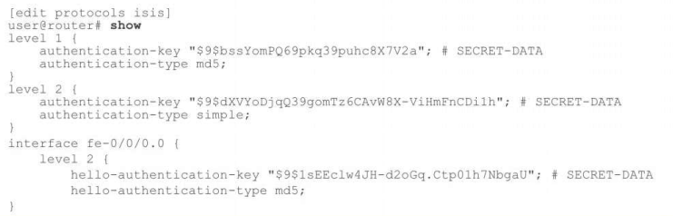
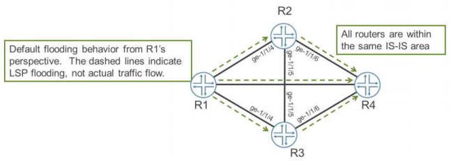
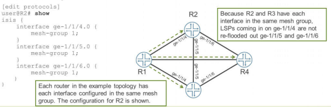

# Chapter 7: Advanced IS-IS Operations and Configuration Options

- --

Chapter 7: Advanced IS-IS Operations and Configuration Options

- --

LSP Flooding Scopes

- Level 1 link-state PDUs (LSPs) are generated within each area. Because these LSPs have a Level 1 flooding scope, they remain within their own particular area and are not seen in other areas.
- The L1/L2 router at the edge of the area places the routing information contained within the LSP into a Level 2 LSP and forwards it across the area boundary.
- All Level 2 LSPs are flooded across every contiguous Level 2 area. This flooding results in Level 2 LSPs within every area that represents all IS-IS routes.

Shortest-Path-First Algorithm

- Based on the Dijkstra algorithm

- LSDB
- Candidate database
- Tree database

- Runs on a per-level basis on each router

- Independent calculation of the topology

- Results are passed to the routing table

- Decision as to whether the route is marked active is made by the routing engine.

Controlling SPF Calculations

- Three consecutive SPF runs can occur before a mandatory hold-down occurs

- Keeps the network stable during change
- Holddown timer is configurable (Default is 5000 milliseconds = 5 seconds)

[edit protocols isis]

user@router# **show spf-options ?**

Possible completions:

delay                                Time to wait before running an SPF (50..1000 milliseconds)

holddown                            Time to hold down before running an SPF (2000..10000 milliseconds)

rapid-runs                          Number ot rapid SPF runs betore SPF holddown (1..5)

- A 200-millisecond delay is preconfigured between the back-to-back SPFs

- Altered with the spf-delay parameter
- Supports values that range from 50 to 1000 ms

[edit protocols isis]

user@router# set spf-delay 100

Partial Route Calculation

- Full SPF calculation is run in two stages:

- Build a shortest-path tree to each IS in the network
- Calculate the best path to the IP reachability information advertised by each IS

- Only recalculates the IP reachability information

- Received LSPs are examined for changes

- Automatically enabled and cannot be disabled

IS-IS Wide Metrics

- TLVs 2, 128, and 130 use 6 bits for metric values

- Maximum metric for an interface is 63
- Configured metrics larger than the maximum value are advertised as 63

- The largest value possible for this total metric cost is 1023

- These TLVs are sent by default

- TLVs 22 and 135 use larger metric spaces

- Maximum value for an interface is now 16,777,215
- Both TLVs are sent by default

- Router can be configured to only use the wide metrics of TLVs 22 and 135

- Configured for an entire level
- Only these TLVs are sent in the LSP

- Removes external route distinction; results in automatic leaking of redistributed routes from Level 1 to Level 2

[edit protocols isis]

user@router# **set level 2 wide-metrics-only**

- The default operation of IS-IS is to advertise both the small and wide metric TLVs in all LSPs

IS-IS Authentication

- Authentication can occur within multiple places

- Level 1
- Level 2

- Interface

- Authentication at the interface level secures only hello PDUs

- Three authentication types are supported

- None (default)
- Simple
- MD5

- MD5 includes an encrypted checksum with all packets

- Provides better security than simple type

Authentication Configuration

- Level authentication affects all IS-IS PDUs

- Link-state, sequence number, and hello

- Per-interface authentication affects hello PDUs only and takes precedence over per-level settings

Authentication Control

- Level 1 or Level 2 authentication can be disabled for specific PDUs

- Hello PDUs

- **no-hello-authentication**

- Complete sequence number PDUs

- **no-csnp-authentication**

- Partial sequence number PDUs

- **no-psnp-authentication**

- Stop verifying authentication on all PDUs with the **no-authentication-check** command

- Useful for migration purposes

Mesh Groups

- IS-IS floods LSPs to all neighbors by default
- Certain physical topologies make this flooding unnecessary

- R4 router will receive three copies of the same LSP

- Once configured, the group members do not reflood LSPs within the group

- Only LSPs received from outside the group membership are flooded within the group.

* *Mesh Group Configuration**

- Each interface is configured with a group number

- 32-bit numbers can be different on separate interfaces

- To prevent an interface from flooding any LSPs, you can use the **blocked** keyword

[edit protocols isis]

user@router# show

interface ge-0/0/1.0 {

mesh-group blocked;

}

Overload Bit

- Allows advertisement of routing information to neighbors while indicating the node should not be used for transit traffic

- Other routers ignore the LSP during SPF calculation
- Turns off the attached bit

- Can be set permanently or with a timeout value

- Timer is between 60 and 1800 seconds
- Timer only runs after rpd starts

CSNP Interval

- A DIS router sends CSNP packets on a LAN interface every 10 seconds
- Can be altered on a per-interface basis

- Value can be between 1 and 65,535 seconds

IS-IS Default Policies

- User-defined import policies are not allowed
- IS-IS route information in an LSP is populated from the configuration within the **[edit protocols isis]** hierarchy

- Subnets are placed into an LSP for advertisement into the network
- Can block internal and external subnets in export policy

- Different behavior than OSPF, export policy affects only external subnets

Redistributing Routes in IS-IS

- Route redistribution requires an export policy at the global IS-IS level

- Routes from other IGPs (RIP or OSPF)
- Routes from other protocols (static or aggregate)

- Beware of routing loops

- When multiple redistribution points exist

- Route table preference values can cause redistributed routes to be preferred

IS-IS Route Attributes on Export

- Change metric values for IS-IS routes

- Use the **metric** keyword in a policy
- Configured value placed in appropriate LSP for that level

- Administrative marking for policy matching

- Use the **tag** keyword in a policy
- Allows other routers to match on the defined value
- Useful for selective redistribution

Prefix Limits for External Routes

- Junos is built to handle a large number of external routes

- Internet routes are not normally imported into IS-IS
- Usually occurs because of a configuration mistake
- Can leave a portion of your network unusable

- Limit can be placed on the number of routes allowed using a routing policy

- When the limit is reached:

- External routing information no longer transmitted in LSPs
- Overload state initiated

- Requires a manual step to fix the problem

[edit protocols isis]

user@router# show

level 1 {

prefix-export-limit 400;

}

level 2 {

prefix-export-limit 600;

}
