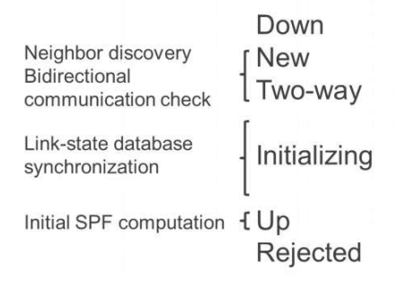

# Chapter 9: Troubleshooting IS-IS

- --

* *Chapter 8: Troubleshooting IS-IS**

- --

* *IS-IS Troubleshooting Checklist**

- Adjacency
- • Family ISO missing
- • Level 1 area mismatch
- • Level 1 versus Level 2 interface
- • IP subnet mismatch
- • Authentication parameters mismatch
- • Minimal MTU of 1492
- • MTU must match on both sides
- • Passive link is configured
- • Point-to-point versus Broadcast interface
- LSDB integrity
- • Unique NET must be configured at every router
- Routing
- •Metrics
- • Wide or narrow
- • lo0.0 interface
- • Route summarization
- • External versus internal
- • Route leaking
- • Export policy
- • Watch out for multiple redistribution points
- • Prefix export limit

* *IS-IS Adjacencies**

- An L1/L2 IS-IS

* *Useful IS-IS Operational Commands**

- An L1/L2 IS-I

* *Multilevel Operation**

- An L1/L2 IS-I

* *Multilevel Operation**

- An L1/L2 IS-I

* *Multilevel Operation**

- An L1/L2 IS-I

* *Multilevel Operation**

- An L1/L2 IS-I

* *Multilevel Operation**

- An L1/L2 IS-I

* *Multilevel Operation**

- An L1/L2 IS-I

* *Multilevel Operation**

- An L1/L2 IS-I

* *Multilevel Operation**

- An L1/L2 IS-I

* *Multilevel Operation**

- An L1/L2 IS-I

* *Multilevel Operation**

- An L1/L2 IS-I

* *Multilevel Operation**

- An L1/L2 IS-I

* *Multilevel Operation**

- An L1/L2 IS-I

- You want to check that IS-IS is operational

user@router> show isis interface

user@router> show isis statistics

- > pay attention to drop counter inscrease

You want to check IS-IS summary information

user@router> **show isis overview**

You want to check IS-IS adjacency status

user@router> **show isis adjacency**

You want to check that LSDB is consistent

user@router> **show isis database**

00 -> mean self-generated

0X -> Circuit-ID (generated by DIS - represents on a broadcast segment)

You want to check the LSDB details

to view detailed information about the router’s neighbors, the advertised IP subnets, and other parameters

user@router> **show isis database extensive | find TLVs**

For example, find out if a router is advertising a prefix

• Use the match operator for a fast answer

user@router> **show isis database level 1 R1.00 extensive | match 172.22.138.16/30**

user@router> show isis database level 2 R1.00 extensive | match 192.168.17.0/24

Quick shortcut to check if local or external routes are redistributed into a level

You want to check SPF events

user@router> **show isis spf log**

You want to check SPF results

user@router> **show isis route**

You want to check IS-IS routes in the routing table

user@router> **show route protocol isis**

For difficult problems you can perform a packet capture:

•monitor traffic interface also known as a tcpdump

user@router> monitor traffic interface ae0.0 no-resolve detail

Useful traceoptions when troubleshooting IS-IS adjacencies

[edit protocol isis]

user@router# show

traceoptions {

file isis size 10m files 2;

flag error detail;

flag hello send receive detail;

}

As for **OSPF,** start with **error detail,** then add **hello send receive,** if needed

The messages are sometimes less explicit than OSPF and require interpretation

- Level 1 area mismatch

show log isis | match ERROR

Mar 12 11:09:54.259879 ERROR: IIH from R2 with no matching areas, interface ge-1/0/4.0

- Can happen if Level 1 has been left enabled on a link to another area
- A Level 2 adjacency on the same link will come up

- Network mismatch

show log isis | match ERROR

Dec 6 10:42:46.769421 ERROR: IIH from R2 without matching addresses, interface ge-1/0/4.0

- Indicates a wrong interface configuration: no overlapping subnet means the link cannot be used for transit
- Note: different from OSPF, adjacencies are possible even in case of different netmasks—as long as there is a common subnet that can be used for transit

- MTU or interface type problem

Dec 6 10:37:50.283525 ISIS packet ignored: no matching interface

- A catch-all error which can be due to several problems:

- MTU mismatch
- Interface type mismatch (one side only set to point-to-point)

- The MTU mismatch causes these errors to be logged on one side only; the other side is stuck in Initializing state
- -> higher MTU raised log and smaller MTU stuck in Initializing

user@router> show isis adjacency

- No local system-id (that is, no ISO address)

show log isis | match ERROR

Dec 6 13:52:06.880845 ERROR: received IIH but have no local sysid

- Causes all adjacencies to be down because the router detects its neighbors’ hello packets, but cannot respond
- Rather uncommon initial configuration issue

- Check the R3 area information in L1 LSDB

user@R3> show isis database level 1 R3.00 extensive | match "Area address"

user@R3> show log isis.log | match ae0.0

user@R3> show log isis.log | match error

If all adjacencies do not appear, you can try the **clear isis adjacency all** command

IPv6 routing is enabled by default in IS-IS. IPv4 routing is also enabled by default on IS-IS.

IS-IS requires **family iso** on the interfaces participating in protocol communication.
