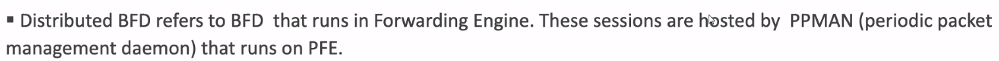
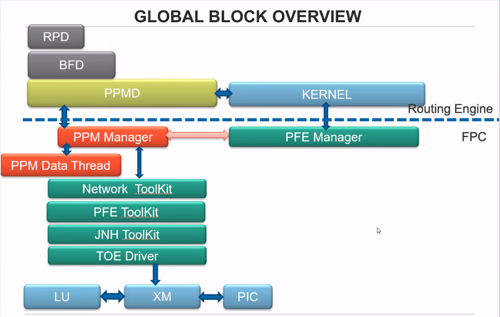
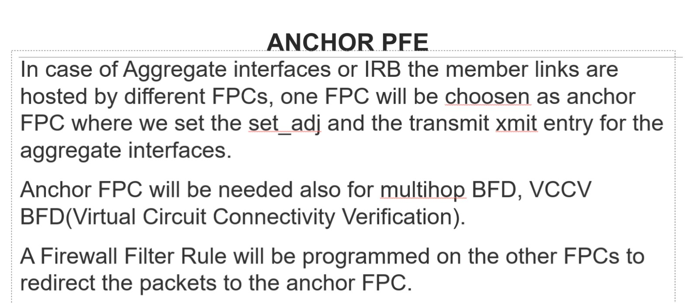
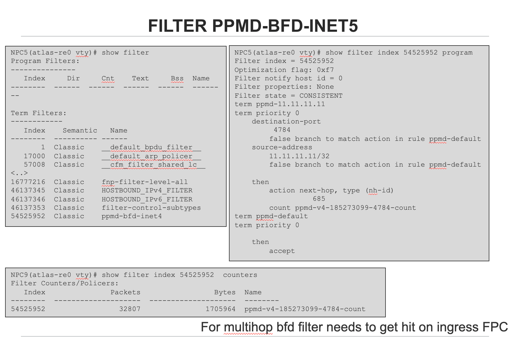
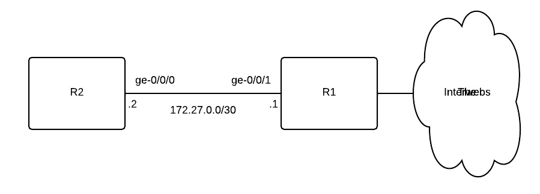
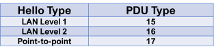

# Bidirectional Forwarding Detection (BFD)

The Bidirectional Forwarding Detection (BFD) protocol is a simple hello mechanism that detects failures in a network.

A pair of routing devices exchange BFD packets. The devices send hello packets at a specified, regular interval.

The device detects a neighbor failure when the routing device stops receiving a reply after a specified interval.

* *Types of BFD Sessions**

There are four types of BFD sessions based on the source from which BFD packets are sent to the neighbors. The different types of BFD sessions are:

|Type of BFD session                 |Description                                       |
|------------------------------------|--------------------------------------------------|
|Centralized (or non-distributed) BFD|BFD sessions run completely on the Routing Engine.|
|Distributed BFD                     |BFD sessions run completely on the FPC CPU.       |
|Inline BFD                          |BFD sessions run on the FPC software.             |
|Hardware-assisted inline BFD        |BFD sessions run on the ASIC firmware.            |

* *Single-hop and Multihop BFD**

- Single-hop BFD—Single-hop BFD in Junos OS runs in distributed mode by default.
    - The exceptions are OSPFv3 BFD and PIMv6 BFD, which only support non-distributed BFD.
    - Single-hop BFD control packets use UDP port 3784.
- Multihop BFD—One desirable application of BFD is to detect connectivity to routing devices that span multiple network hops and follow unpredictable paths.
    - This is known as a multihop session.
    - Multihop BFD control packets use UDP port 4784.

* *Consider the following when using multihop BFD:**

- Prior to Junos OS Release 12.3, multihop BFD is non-distributed and runs on the Routing Engine.
    - Starting in Junos OS Release 12.3, multihop BFD runs in distributed mode by default.
- In a multichassis link aggregation group (MC-LAG) setup, Inter-Chassis Control Protocol (ICCP) uses BFD in multihop mode.
    - Multihop BFD runs in centralized mode in this kind of setup.
- Starting in Junos OS Release 13.3R5, Junos OS does not execute firewall filters that you apply on a loopback interface for a multihop BFD session with a delegated anchor FPC.
    - There is an implicit filter on all ingress FPCs to forward packets to the anchor FPC. Therefore, the firewall filter on the loopback interface is not applied on these packets.
    - If you do not want these packets to be forwarded to the anchor FPC, you can configure the no-delegate-processing option.

## **Centralized BFD**

- In _centralized BFD_ mode (also called _non-distributed BFD_ mode), the Routing Engine handles BFD.
    - For both single-hop BFD and multihop BFD, you can run the BFD session in non-distributed mode by:
        - Configuring set routing-options ppm no-delegate-processing
        - And then running the clear bfd session command.
    - If the Routing Engine CPU goes too high, there is a chance that BFD will flap.
        - Even in cases where the Routing Engine CPU is normal, smaller values of minimum-interval can lead to BFD packets not being processed if other higher priority tasks are running.
        - You should select the minimum interval value based on proper testing.

## **Distributed BFD**

- The term _distributed BFD_ refers to BFD that runs on the FPC CPU.
    - The Routing Engine creates the BFD sessions and the FPC CPU processes them.

### **Benefits**

- The benefits of distributed BFD are mainly in the scaling and performance areas. Distributed BFD:
    - Allows for the creation of a larger number of BFD sessions.
    - Runs BFD sessions with a shorter transfer/receive timer interval, which can in turn be used to bring down the overall detection time.
    - Separates the functionality of BFD from that of the Routing Engine.
    - A BFD session can stay up during graceful restart, even with an aggressive interval.
        - The minimum interval for Routing Engine-based BFD sessions to survive _graceful Routing Engine switchover_ is 2500 ms.
        - Distributed BFD sessions have a minimum interval of less than a second.
    - Frees up the Routing Engine CPU, which improves scaling and performance for Routing Engine-based applications.
    - BFD protocol packets flow even when the Routing Engine CPU is congested.

### **Configuration and Support**

- To determine if a BFD peer is running distributed BFD:
    - run the **show bfd sessions extensive** command
    - And look for Remote is control-plane independent in the command output.
- For distributed BFD to work, you need to configure the lo0 interface with unit 0 and the appropriate family.

```
# set interfaces lo0 unit 0 family inet
# set interfaces lo0 unit 0 family inet6
# set interfaces lo0 unit 0 family mpls
```

- This is true for the following types of BFD sessions:
    - BFD over aggregated Ethernet logical interfaces, both IPv4 and IPv6
    - Multihop BFD, both IPv4 and IPv6
    - BFD over VLAN interfaces in EX Series switches, both IPv4 and IPv6
    - Virtual Circuit Connectivity Verification (VCCV) BFD (Layer 2 circuit, Layer 3 VPN, and VPLS) (MPLS)

## **Inline BFD**

- We support two types of inline BFD: inline BFD and hardware-assisted inline BFD.
    - _Inline BFD_ sessions run on the FPC software.
    - _Hardware-assisted inline BFD_ sessions run on the ASIC firmware.
- Support depends on your device and software version.

### **Benefits**

- Inline BFD sessions can have keepalive intervals of less than a second, so you can detect errors in milliseconds.
- If you are running inline BFD and the Routing Engine crashes, the inline BFD sessions will continue without interruption for 15 seconds.
- Inline BFD has many of the same benefits as distributed BFD since it also separates the functionality of BFD from the Routing Engine.
- The Packet Forwarding Engine software and the ASIC firmware process the packets more quickly than the FPC CPU
    - so inline BFD is faster than distributed BFD.

```
NOTE: Starting in Junos OS Release 13.3, the distribution of adjacency entry (the IP addresses of adjacent routers) and transmit entry (the IP address of transmitting routers) for a BFD session is asymmetric. This is because an adjacency entry that requires rules might or might not be distributed based on the redirect rule, and the distribution of transmit entries is not dependent on the redirect rule.
The term redirect rule here denotes the capability of an interface to send protocol redirect messages. See Disabling the Transmission of Redirect Messages on an Interface.
```

### **Inline BFD**

- _Inline BFD_ sessions run on the FPC software.
    - The Routing Engine creates the BFD sessions and the Packet Forwarding Engine software processes them.
    - Starting in Junos OS Release 16.1R1, integrated routing and bridging (IRB) interfaces support inline BFD sessions.
    - MX Series routers only support inline BFD if the router is static and has MPCs/MICs with enhanced-ip configured.

### **Hardware-Assisted Inline BFD**

- _Hardware-assisted inline BFD_ sessions run on the ASIC firmware.
    - Hardware-assisted inline BFD is a hardware implementation of the inline BFD protocol.
    - The Routing Engine creates BFD sessions and passes them to the ASIC firmware for processing.
    - The device uses existing paths to forward any BFD events that need to be processed by protocol processes.
- Regular inline BFD is a software approach. In hardware-assisted inline BFD, the firmware handles most of the BFD protocol processing.
    - The ASIC firmware processes the packets more quickly than the software, so hardware-assisted inline BFD is faster than regular inline BFD.
    - We support this feature for single-hop and multihop IPv4 and IPv6 BFD sessions.

#### **Limitations**

- If the Packet Forwarding Engine process restarts or the system reboots, the BFD sessions will go down.
- Hardware-assisted inline BFD:
    - Does not support micro BFD.
    - Is only supported on standalone devices.
    - Does not support BFD authentication.
    - Does not support IPv6 link local BFD sessions.
    - Cannot be used with VXLAN encapsulation of BFD packets.

### **Configuration**

- Devices support either regular inline BFD or hardware-assisted inline BFD.
    - Use the set routing-options ppm inline-processing-enable command to enable the type of inline BFD that your device supports.
    - To return BFD to the default mode, delete the configuration.

Release History Table

|Release    |Description                                                                                                                                                                                                                                                                             |
|-----------|----------------------------------------------------------------------------------------------------------------------------------------------------------------------------------------------------------------------------------------------------------------------------------------|
|16.1R1     |Starting in Junos OS Release 16.1R1, inline BFD sessions are supported on integrated routing and bridging (IRB) interfaces.                                                                                                                                                             |
|13.3R5     |Starting in Junos OS Release 13.3R5, if you apply a firewall filter on a loopback interface for a multihop BFD session with a delegated anchor FPC, Junos OS does not execute this filter, because there is an implicit filter on all ingress FPCs to forward packets to the anchor FPC.|
|13.3       |Starting in Junos OS Release 13.3, the distribution of adjacency entry (the IP addresses of adjacent routers) and transmit entry (the IP address of transmitting routers) for a BFD session is asymmetric.                                                                              |
|13.3       |Starting in Junos OS Release 13.3, inline BFD is supported only on static MX Series routers with MPCs/MICs that have configured enhanced-ip.                                                                                                                                            |

- --

View PR 1086674 [Confidential] - first pfe(anchor pfe) on FPC is key and we should enhance to use other pfes if the first pfe is wedged and action is disable-pfe. Note This sw changes are not active for MPC5E and MPC6E due to multi-center Chip and the inconsistent pfe-id mapping. Its due to the same reason why pfe-disable is not default action yet. PR/1208685 pfe disable not working on XL based cards

PR 1298369 [single-source-commit] - inline-bfd on irb will be broken after NSR switchover and subsequent offlining anchor FPC.

- --






Responsible for establish the sessions initiated by PPMD from RE execute all periodic packet processing events. absorb all packets and forward unabsorbed packets to the clients receive packets from clients and forward them out inform ppmd on RE if there are session flaps ppm data thread processes the received packets







- --




- --

[ August 10, 2023 09:12 ] ⁨Hung Le⁩: Luu y:

[ August 10, 2023 09:12 ] ⁨Hung Le⁩: hien best practice cho qfx bfd la 1000x3 nha

[ August 10, 2023 09:13 ] ⁨Hung Le⁩: https://supportportal.juniper.net/s/article/QFX-BFD-BGP-flaps-seen-continuously-between-devices-in-VXLAN-EVPN-overlay

BFD is dependent on unicast transmission of multi-hop BFD keep alives between the BGP peers.  In some instances, the ARP for the peer times out and cannot be resolved in a timely fashion and this will cause BFD to time out and drop, resulting in BGP going down.

Check the DDOS violating protocol and if the DDOS traffic is legitimate, then increase the DDOS violation limits for the respective protocol.

The minimum BFD timer supported for QFX5K series is 1 second.

[ August 10, 2023 09:13 ] ⁨Hung Le⁩: day la cua qfx5k

[ August 10, 2023 09:13 ] ⁨Hung Le⁩: còn config ma apstra apply xuong các platform là 1000x3

[ August 10, 2023 09:14 ] ⁨Hung Le⁩: bfd-liveness-detection {

                minimum-interval 1000;

                multiplier 3;

            }

- --

[28/08/2023 09:21:56] Thịnh Lê Văn: https://www.juniper.net/documentation/us/en/software/nce/sg-005-data-center-fabric/sg-005-data-center-fabric.pdf

[28/08/2023 10:48:05] HungLNM: A có 1 vài điểm sau khi đọc tài liệu trên:

[28/08/2023 10:48:21] HungLNM: - đang tìm tác giả vì này nguyên team viết

[28/08/2023 10:49:06] HungLNM: -bfd cho ibgp overlay dùng trong truong hợp bị failure đầu xa(về mặt sw hay bug)

[28/08/2023 10:50:07] HungLNM: -về template 350x3 trong tài liệu có nói, chỉ áp dụng cho các platform khác qfx5k, vì qfx5k chỉ sp min 1s(note trang 101)

[28/08/2023 10:50:41] HungLNM: Điều này hoàn toàn giống vơi các link public của jnpr và jtac có đề cập qua

[28/08/2023 10:51:10] HungLNM: -ngoài ra với qfx 10k thì có dùng micro bfd cho ae(qfx 5k chưa sp micro bfd)

[28/08/2023 11:26:42] HungLNM:


[28/08/2023 11:27:07] HungLNM: Đây là thông tin thêm về qfx5k có thể sp sub second

[28/08/2023 11:27:19] HungLNM: Phải confif thêm lệnh như hình

[28/08/2023 11:27:57] HungLNM: Ae nhìn thấy có sự thay đổi về BA của bfd qua từng junos

[28/08/2023 11:30:54] HungLNM:


[28/08/2023 11:31:05] HungLNM: Lí do dùng bfd trong ipfabric
