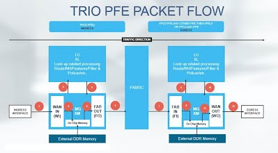

# Few notes about MX routers:

### **JUNIPER MX**

|**MX2020:**

MX2020 is by default operates in "enhanced-ip" mode and default indirect next hop config.

Its pay as you grow model for line cards and power supply. Chassis must need 7+(1 redundant) SFB for line rate support with fewer or fully loaded chassis. SFB is not part of pay as your grow.

Each SFB has 3 fabric planes(XF). With 8 SFBs, total of 24 fabric planes.

Each PFE on FPC is connected to each fabric plane.

RE-CB combo is a single card in MX2020.

SPMB manages the fabric initialization and maintenance (intended to off load work from RE).

* *Boot sequence:**

USB ---> compact-flash--->SSD

show system storage

show system boot-messages

show log inventory

* *Power zone in MX2020:**

Zone 0 provides power to Middle cage card(2 RE-CB and 8 SFB), Lower cage cards(10 line cards) and Fan tray 0,1 and 2.

Zone 1 provides power to Middle cage card(2 RE-CB and 8 SFB), upper cage cards (10 line cards) and Fan tray 0,2 and 3.

MX2020 has 18 power supply module and 4 power distribution module.

show chassis power

show chassis power sequence

show chassis environment

show chassis zones

* *MPC Types:**

Type 1 has  1 PFE made of LU and MQ (MICs)

Type 2 has  2 PFE each made of LU and MQ (MICs)

Type 3 has  4 PFE each made of LU and MQ (16x10G fixed)

Type 3E has 1 PFE made of one XM and 4LU

Type 4 has  2 PFE each made of one XM and 2 LU

Type 5 has  1 PFE each made of two XM and 1 XL (PFE number is based on XM chip)

Type 6 has  2 PFE each made of Two XM and 1 XL (PFE number is based on XM chip)

show log inventory

show chassis hardware

show chassis fps

* *SCBs:**

    SCB(SF)

    SCBE(XF)

    SCBE2(XF2)

    SFB(XF Chip) (MX20XX)

In case of SCB* in MX240 or MX480 or MX960, based on FPC and SCB* combination, you can have different bandwidth and fabric redundancy.

MX960 can have 3 SCBs, each SCB has 2 fabric planes

MX480 can have 2 SCBs, each SCB has 4 fabric planes

MX20XX can have 8 SCBs/SFB, each SCB/SFB has 3 fabric plane.

Filter and sampling config may cause traffic to go to fabric and come back even for traffic processing for interface local to PFE.

* *Fabric self healing:**

    It has 3 phase, performed on fault detection logic, next phase starts if execution of earlier phase didn't resolve the issue in 10 mins. If issue reoccurs after 10 mins of any executed phase, it may go back or start with previous phase.

    * *Phase1**: Offline and online fabric plane one by one

    * *Phase2**: Offline FPCs which are reporting destination error for PFE, then offline and online planes one by one starting with spare plane,    then bring offline FPCs online again.

    * *Phase3**: Turn of the FPC reporting black hole. If issue reported again after inlining FPC, then this phase will bring FPC offline again.

* *BFD:**

    Centralized-RE based

    Distributed-FPC Ukern based (PFE0 of anchor PFE to go out on wire and fabric path)

    Inline-processed by PFE

    Micro BFD: Sends & receives BFD packet on all AE member link of AE as opposed to traditional BFD.

* *Basic flow of traffic:**

Note: I might not be able to update site regularly so information/data might be old so please check [www.juniper.net](http://www.juniper.net) for more accurate, unto date and official information/data.

- ---

Distributed Mode is that Periodic packet management (ppmd) which is the daemon responsible for BFD is to be run on Routing Engine's CPU and line cards CPU , this is as opposed to centralized mode where it will be run on RE only.

Inline mode delegates the processing  to the forwarding ASIC (that is, to the hardware). By enabling inline mode the load on the CPU of the line-card is reduced and also  faster transmit and more aggressive detect time is achieved.

By default, PPM will ensure it handles the packet processing for it's client processes at the linecard level. Only if the linecard CPU is busy, Routing engine will come into the picture and handle packet processing.

_"The responsibility for PPM processing on the switch is distributed between the Routing Engine and the access interfaces for all protocols that use PPM by default. This distributed model provides a faster response time for protocols that use PPM than the response time provided by the nondistributed model."_

RE> show ppm transmissions detail protocol bfd

show ppm statistics protocol bfd

NPC11(R1 vty)# **show threads**

[...]

54 M asleep PPM Manager 4664/8200 0/0/2441 ms 0%

set routing-options ppm no-delegate-processing

set routing-options ppm no-inline-processing

* *Few notes about MX routers:**|
|----------------------------------------------------------------------------------------------------------------------------------------------------------------------------------------------------------------------------------------------------------------------------------------------------------------------------------------------------------------------------------------------------------------------------------------------------------------------------------------------------------------------------------------------------------------------------------------------------------------------------------------------------------------------------------------------------------------------------------------------------------------------------------------------------------------------------------------------------------------------------------------------------------------------------------------------------------------------------------------------------------------------------------------------------------------------------------------------------------------------------------------------------------------------------------------------------------------------------------------------------------------------------------------------------------------------------------------------------------------------------------------------------------------------------------------------------------------------------------------------------------------------------------------------------------------------------------------------------------------------------------------------------------------------------------------------------------------------------------------------------------------------------------------------------------------------------------------------------------------------------------------------------------------------------------------------------------------------------------------------------------------------------------------------------------------------------------------------------------------------------------------------------------------------------------------------------------------------------------------------------------------------------------------------------------------------------------------------------------------------------------------------------------------------------------------------------------------------------------------------------------------------------------------------------------------------------------------------------------------------------------------------------------------------------------------------------------------------------------------------------------------------------------------------------------------------------------------------------------------------------------------------------------------------------------------------------------------------------------------------------------------------------------------------------------------------------------------------------------------------------------------------------------------------------------------------------------------------------------------------------------------------------------------------------------------------------------------------------------------------------------------------------------------------------------------------------------------------------------------------------------------------------------------------------------------------------------------------------------------------------------------------------------------------------------------------------------------------------------------------------------------------------------------------------------------------------------------------------------------------------------------------------------------------------------------------------------------------------------------------------------------------------------------------------------------------------------------------------------------------------------------------------------------------------------------------------------------------------------------------------------------------------------------------------------------------------------------------------------------------------------------------------------------------------------------------------------------------------------------------------------------------------------------------------------------------------------------------------------------------------------------------------------------------------------------------------------------------------------------------------------------------------------------------------------------------------------------------|
