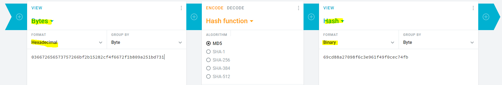

# Generate CHAP response string

I found example with pppd logs [here](https://serverfault.com/questions/80592/pppd-chap-authentication-failure-sometimes). ` [CHAP Challenge id=0x3 <bf2b15282cf4f6672f1b809a251bd731>, name = "HiPer"] [CHAP Response id=0x3 <69cd88a27098f6c3e961f49f0cec74fb>, name = "Sunrise"]` The password was 'freesurf'. Using [online hex to MD5 converter](https://cryptii.com/pipes/md5-hash) following string gave me the same response as in the logs: 036672656573757266bf2b15282cf4f6672f1b809a251bd731. So it seems pppd returns data in hex format. Thanks for the help!

- --

```
hashMD5(identifier.secret.challenge)

identifier  ~~~> convert to HEX
secret      ~~~> convert to HEX
challenge   ~~~> same to Challenge packet
```

```
id=0x3 <bf2b15282cf4f6672f1b809a251bd731>, name = "HiPer"] The password was 'freesurf'

03 6672656573757266 bf2b15282cf4f6672f1b809a251bd731 (byte - hex) ~~MD5~~>

[CHAP Response id=0x3 <69cd88a27098f6c3e961f49f0cec74fb>, name = "Sunrise"]`
```


