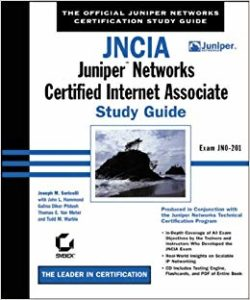
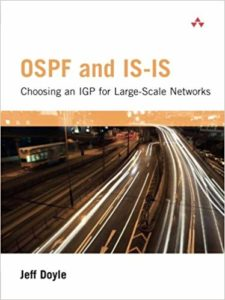
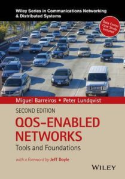
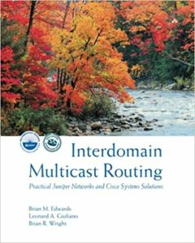
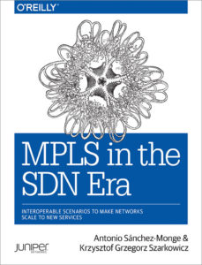

# JNCIE sources

## **What did I use to study?**

1. Juniper JNCIE-SP Self-Study Bundle
    - The most valuable source of all, jam-packed with examples, readings, and scenarios specific to the JNCIE-SP blueprint
2. MPLS in the SDN Era (Book)
    - I can’t say enough about this book, and thank you to Chris @ [networkfuntimes](https://next-hopself.net/First-Blog-Post/networkfuntimes.com) for originally mentioning it in one of his blog posts. It was and still is an amazing source of knowledge for IP/MPLS networks.
3. Day One: Deploying Basic QoS
4. Juniper Official Examples and TechLibrary
5. OSPF and IS-IS: Choosing an IGP for Large-scale Networks (Book)
6. All of the JNCIP-SP recommended trainings from Juniper
7. Day one: Deploying MPLS

- --

* *The theory**

IPv6

1. Day ONE – Exploring IPv6
2. Day ONE – Advanced IPv6 Config

IS-IS

1. Introduction
2. Multilevel Networks
3. Advanced Operations

Routing in General

1. Advanced Junos Service Provider Routing – official Juniper materials. There is Protocol Independent routing, OSPF, IS-IS, BGP and many other useful things. This one I went through very thoroughly.
2. Junos Enterprise Routing – mainly for class of service and multicast topics

VPN’s

1. MPLS VPNs – official Juniper course materials (3 part book) – this one I refreshed for certain topics – went through very thoroughly as well. Trust me it takes a lot of time to read and lab all of this.
2. This Week – Deploying MPLS – just to refresh and summarise some of the nuances.

CoS

1. Day ONE – Deploying Basic QoS
2. Juniper COS Guide
3. My all time favorite – Junos Enterprise Routing – Cos section

Multicast and NG-MVPN

1. MPLS VPNs – official Juniper course materials (3 part book)
2. Junos Enterprise Routing – Multicast section
3. Some of the blog post by Chris Parker from [https://www.networkfuntimes.com/](https://www.networkfuntimes.com/) – great read. I highly recommend it.
4. Some of the junos documentation

- --

* *USEFUL MULTI-TOPIC GUIDES**

* *BOOKS: The Sybex Series (**[JNCIA](https://www.amazon.co.uk/JNCIA-Networks-Certified-Internet-Associate-ebook/dp/B000TU3ULC/ref=sr_1_1?ie=UTF8&qid=1542022729&sr=8-1&)**) (**[JNCIS](https://www.amazon.co.uk/JNCIS-Networks-Certified-Internet-Specialist/dp/0782140726/ref=sr_1_cc_1?s=aps&ie=UTF8&qid=1542022754&sr=1-1-catcorr)**) (**[JNCIP](https://www.amazon.co.uk/JNCIP-Networks-Certified-Professional-CERT-JNCIP-M-ebook/dp/B000PY49TO/ref=sr_1_1?s=books&ie=UTF8&qid=1542022832&sr=1-1)**) (**[JNCIE](https://www.amazon.co.uk/Jncie-Juniper-Networks-Certified-Internet/dp/0782140696/ref=sr_1_5?s=books&ie=UTF8&qid=1542022935&sr=1-5)**)**

— These four books are old as heck. Like, over 75,000 (fifteen) years old. As such, there’s some topics in here that you don’t need to know about, and plenty of topics that are missing from the current syllabus. However, the topics that these books do cover are done brilliantly, and should absolutely, unquestionably be your first port of call when you’re hitting the JNCIP-SP exam. OSPF, IS-IS, MPLS, BGP, L3VPN, L2VPN, multicast, CoS: there’s tons of stuff in here that you *need* to read.

Don’t be fooled by the names of these four books: they were written back when the exams were very different, so the certification named on the front cover bears no resemblance to the current exam. For example, in the JNCIA book you’re actually going to find the guide to Multicast, which nowadays isn’t even covered until JNCIP level. And even the stuff that is covered in the so-called JNCIA level goes way beyond what you’d expect a JNCIA to know in 2018.

These books are all out of print now, but you can get a lot of them 2nd hand for about £20 on your favourite online bookstore of choice.

The JNCIA and JNCIS books explain the theory, in a lot of detail, with plenty of configuration examples, debugs, packet captures, and live analysis from various “monitor traffic extensive” style commands. The JNCIP book is dedicated to troubleshooting OSPF, IS-IS and BGP, so you’ll get a lot out of the stuff in that book too.

I haven’t read the JNCIE book (yet!), but it seems to take many JNCIP-SP topics to the next level – MPLS, multicast, CoS, etc – so again, well worth acquiring and devouring.

One bit of advice: the books include detailed packet breakdowns, header by header, which in theory is great, because it’s essential knowledge. But the way it’s laid out on the page is SO INCREDIBLY DIFFICULT TO UNDERSTAND. My advice: when the book starts explaining headers of PDUs, LSA, Hello messages etc, do a Wireshark packet capture of your own, or Google for one that someone else has done, and refer to that. It’s so infinitely easier to read a pretty colourful Wireshark capture than it is to follow the way they’re laid out in these books.

* *EBOOK:** [JUNIPER AMBASSADORS COOKBOOK 2017](https://www.juniper.net/us/en/training/jnbooks/day-one/networking-technologies-series/cookbook-2017/)

— Contains chapters on QoS, EVPN, Using OSPF in a L3VPN, and route reflectors. Leave this to the end of your studies – the chapters in this book are meant for people who know the basics, who already understand a technology, and want to learn a cool new thing about it. But definitely do come back to it – the Ambassadors Cookbooks are a rich and varied source of real-world problems and config examples.

* *OSPF and IS-IS**

* *WEB PAGE: My own three-part deep-dive into IS-IS, for JNCIS candidates. (**[Part 1](https://www.networkfuntimes.com/junos-is-is-study-notes-part-1-for-junipers-jncis-sp-and-jncis-ent-exams/)**), (**[Part 2](https://www.networkfuntimes.com/junos-is-is-study-notes-part-2-for-junipers-jncis-sp-and-jncis-ent-exams/)**), (**[Part 3](https://www.networkfuntimes.com/junos-is-is-study-notes-part-3-for-junipers-jncis-sp-and-jncis-ent-exams/)**)**

— Haha, a shameless plug! Give these three pages a read to find out how IS-IS functions, how it’s different from OSPF, what the packets are like, and the cool things you can do with it. I like to think it’s a good primer!

* *BOOK:** [OSPF and IS-IS: Choosing an IGP for Large-Scale Networks](https://www.oreilly.com/library/view/ospf-and-is-is/0321168798/)

— What a brilliant and readable book this is. You might remember Jeff Doyle as the man behind the mighty CCIE books, and boy does my guy Jeff know his stuff. Read this book cover to cover and you’ll be bullet-proof when it comes to IGPs.

The only caveat I’ll give to this book is this: as very readable as it is, I wouldn’t go into it knowing absolutely nothing about IS-IS. Give my primer a read first, and then buy and read this brilliant book.

* *BGP**

I actually used the old JNCIx books to learn the details that I needed, as well as ton of hands-on lab time of course! The JNCIx books really do a great job of explaining the concepts to a great level of detail.

If you’re lucky enough to have a CBT Nuggets subscription through your work, I found [Jeremy Cioara’s BGP guide](https://www.cbtnuggets.com/it-training/cisco-ccip-bgp-642-661) massively helpful when I was first learning it. It’s entirely Cisco focused, but the concepts are all the same.

And of course, [the Juniper website itself has extensive documentation on BGP](https://www.juniper.net/documentation/en_US/junos/topics/concept/bgp-routing-overview.html).

* *CLASS OF SERVICE (COS)**

* *EBOOK:** [Day One: Junos QoS for IOS Engineers](https://www.juniper.net/uk/en/training/jnbooks/day-one/fundamentals-series/junos-qos/)

— I don’t know how to do QoS on IOS, but still, I found this to be a very readable guide, and it definitely did a lot to help me get to grips with the various bits of the hierarchy, and how it all fits together. A must read, and a great place to start. (There is also a Day one guide to Cos and Qos, but I personally found it very difficult to understand. I’d recommend the Junos QoS For IOS Engineers as a good starting point!)

* *BOOK:** [QoS-Enabled Networks](https://www.wiley.com/en-us/QOS%2BEnabled%2BNetworks:%2BTools%2Band%2BFoundations%2C%2B2nd%2BEdition-p-9781119109129)

— Although I’ve not read 100% of this one, the pages I have read are incredibly clear and engaging. QoS is a famously dry topic, and still one I struggle with. But this book here seems like the real deal. Definitely worth a purchase, and one I will 100% be reading in prep for the JNCIE.

* *BOOK:** [Juniper Enterprise Routing](http://shop.oreilly.com/product/0636920015963.do)

— This O’Reilly book can also be a little tricky at times, but my advice to you is to take it slow, and to not be afraid to stop and google concepts as you go. if you do that, then I think you’ll find this chapter really rewarding and enriching.

* *EBOOK:** [Juniper’s Official Class of service feature guide for routing devices and EX9200 switches](https://www.juniper.net/documentation/en_US/junos/information-products/pathway-pages/cos/config-guide-cos.pdf)

— This is basically a PDF that collects every single article (I think) on Juniper’s website relating to class of service. Advantage: extremely thorough, and contains tons and tons of information. Disadvantage: even though this PDF looks like a book, it isn’t a book at all – it’s just a collection of all the articles on the Juniper Knowledge Base. As such, reading it in a linear fashion can be a bit jarring, because the chapters don’t flow – after all, they’re not chapters at all, just a collection of web pages in one massive 800 page PDF. If you didn’t know that, this PDF would be hella confusing. But now that you do know that, I think you’ll find it a really valuable resource for both CoS theory and CoS configuration.

* *IP MULTICAST**

* *BOOK:** [Interdomain Multicast Routing](https://www.oreilly.com/library/view/interdomain-multicast-routing/0201746123/)

— Pretty much the definitive guide to multicast. Contains both Juniper and Cisco examples, which is great for finding out those inter-vendor quirks. You’ll definitely be wanting a copy of this.

* *YOUTUBE:** [Decoding Packets: Deep-Dive Into Multicast](https://www.youtube.com/channel/UC2xDUkd_PuxDvhl4zQz67Aw)**.**

— This channel takes such a detailed look into multicast that it’s often at CCIE/JNCIE level. They build a big topology, talk you through debugs/traceoption and packet capture output, and thoroughly cover the various messages that go back and forth. Honestly, I’d watch this before anything else. A truly brilliant explanation of many – not all, but many – of the concepts you’ll be expected to know as a JNCIP-SP.

BOOK: [Juniper Enterprise Routing](http://shop.oreilly.com/product/0636920015963.do)

— There’s a whole chapter in this book dedicated to multicast. As I mentioned above in the CoS section, if you’re brand new to the topic then it can be quite tough to read. But if you already understand the basics, and want to get the full picture, then I think you’ll find this chapter really valuable.

* *ADVANCED MPLS / LAYER 3 VPNs / LAYER 2 VPNs**

“Advanced MPLS” isn’t on the [list of topics on the front page for the JNCIP-SP cert track](https://www.juniper.net/uk/en/training/certification/certification-tracks/sp-routing-switching-track?tab=jncip-sp), nor is it mentioned on the list of [Exam Objectives page for the JNCIP-SP](https://www.juniper.net/uk/en/training/certification/resources/jncip-sp-jn0-662/) – but scroll down and you’ll see it’s actually listed on the detailed exam objectives.

I suspect this is just an oversight, and that Advanced MPLS has in fact been removed. Having said that, whether or not it’s on the official syllabus, you’ll still want to be on top of your MPLS game for this exam, because the connection between LDP/RSVP and L3VPN/L2VPN is obviously very tight. And in any case, these books cover MPLS protocols, as well as the VPN side of things.

* *BOOK:** [JUNIPER THIS WEEK: DEPLOYING MPLS](https://forums.juniper.net/t5/Day-One-Books-Archive/This-Week-Deploying-MPLS/ba-p/87830)

— By far the best place to start for MPLS is the JNCIA and JNCIS books I mentioned above. But once you’ve read that, you absolutely HAVE to read this book. Not only does it explain all the concepts in a very clear way, but it fills in some of the things that the legacy JNCIA/JNCIS books don’t cover, like VPLS. Packed full of output of the results of many different versions of configuration.

* *BOOK:** [MPLS IN THE SDN ERA](http://shop.oreilly.com/product/0636920033905.do)

— We were lucky enough in my day job to get a free copy of this mighty tome, and it’s great. Another very readable book that covers a ton of topics related not only to MPLS, but MPLS applications, like multicast VPNs, EVPN, and so on. I definitely have a better understanding of layer 2 VPNs and EVPN thanks to this book.

The only thing you need to be aware of is that this book is extremely difficult to _dip_ into. If you want to skip straight to a particular topic of interest, then you’re going to find it confusing, and potentially frustrating, because the book often describes things assuming you have the knowledge of previous chapters. Please understand, this isn’t a criticism of the book in any way – after all, the book never claims to be one that you can read out of order – but I did find myself at times struggling with certain chapters, until I realised that I had to read it cover to cover (which admittedly I still haven’t – I’m about halfway through it so far). But once I worked that out, I found it all very easy to read, and very engaging.

This is an absolutely essential book. It’s even better because it covers both Junos and IOS-XR, despite being written by two Juniper engineers. Difficult to imagine many other vendors doing that! So you get to learn about potential interoperability issues too. A book full of personality and passion.

* *BOOK:** [MPLS-ENABLED APPLICATIONS](https://www.wiley.com/en-us/MPLS%2BEnabled%2BApplications:%2BEmerging%2BDevelopments%2Band%2BNew%2BTechnologies%2C%2B3rd%2BEdition-p-9780470665459)

— I’ll be honest, this is a big old book with some heavy concepts. But if you can take it slow, you’ll find a wealth of stuff in here, including some interesting insights on CoS over MPLS. Save this book until last. It’s not an essential book if you’ve read the rest, but if you’re committed to being on top of your game then it can’t hurt to add it to your collection!

* *E-BOOK:** [DAY ONE: USING ETHERNET VPNS FOR DATA CENTRE INTERCONNECT](https://www.juniper.net/uk/en/training/jnbooks/day-one/proof-concept-labs/using-ethernet-vpns/)

— Confession: this is one I’ve not yet read. But it’s about EVPN, and it looks fantastic. It would be silly to not include it when I’m attempting to make the most thorough collection of resources for the exam! I’ve had a flick through though, and it looks great. Definitely one I plan to return to.

* *WEB PAGES THAT COVER SPECIFIC THINGS ON THE SYLLABUS**

Finally, here’s a small selection of links I remember reading that explained specific concepts so brilliantly that they deserve to be included in a JNCIP-SP Ultimate Resource list. I may or may not have added one or two posts that I wrote myself on this list, too. 

If you have any extra links to add, please leave a comment or email me, and I’ll add it to the list!

* *OSPF**

- Area types and operations: [https://www.inetzero.com/which-area-type-do-you-prefer-normal-stub-totally-stub-nssa-or-totally-nssa/](https://www.inetzero.com/which-area-type-do-you-prefer-normal-stub-totally-stub-nssa-or-totally-nssa/)
- Stub areas vs stub networks: what is the difference? [https://www.networkfuntimes.com/ospf-stub-areas-vs-stub-networks-what-is-the-difference/](https://www.networkfuntimes.com/ospf-stub-areas-vs-stub-networks-what-is-the-difference/)
- Summarize and restrict routes: [https://www.inetzero.com/to-summarize-or-not-to-summarize-thats-the-question-tools-to-summarize-or-filter-routes-in-an-ospf-domain/](https://www.inetzero.com/to-summarize-or-not-to-summarize-thats-the-question-tools-to-summarize-or-filter-routes-in-an-ospf-domain/)
- Leaking routes between OSPF and IS-IS using RIB groups, Instance Imports, and Logical Tunnels: [http://matt.dinham.net/route-leaking-with-junos/](http://matt.dinham.net/route-leaking-with-junos/)
- The OSPFv3 database: [https://www.networkfuntimes.com/ospfv3-how-to-read-ipv6s-ospf-database/](https://www.networkfuntimes.com/ospfv3-how-to-read-ipv6s-ospf-database/) (Cisco examples)

* *BGP**

- Message types and peering states: [https://blog.marquis.co/border-gateway-protocol-bgp/](https://blog.marquis.co/border-gateway-protocol-bgp/)
- Route selection process: [https://www.inetzero.com/winner-takes-it-all-bgp-route-selection-in-junos-os-2/](https://www.inetzero.com/winner-takes-it-all-bgp-route-selection-in-junos-os-2/)
- Route reflection considerations with MPLS: [https://www.inetzero.com/junos-os-route-reflection-considerations/](https://www.inetzero.com/junos-os-route-reflection-considerations/)
- Peering considerations: [https://netquirks.co.uk/2018/01/23/the-friend-of-my-friend-is-my-enemy/](https://netquirks.co.uk/2018/01/23/the-friend-of-my-friend-is-my-enemy/)

* *CLASS OF SERVICE**

Class of Service was by far the thing I found the most difficult. If you have any other links that make any of the Junos-specific stuff clear, please do let me !

- Juniper’s Overview of CoS: [https://www.juniper.net/documentation/en_US/junos/topics/concept/cos-qfx-series-overview.html](https://www.juniper.net/documentation/en_US/junos/topics/concept/cos-qfx-series-overview.html) – This is the first of many pages about CoS on the Juniper page, and it’s well worth reading through them in as close to an order as makes sense to you.Below are a few articles I’ve also referred to recently:
- Packet Flow Through The Junos CoS Process: [https://www.juniper.net/documentation/en_US/junos/topics/concept/packet-flow-cos-process-cos-config-guide.html](https://www.juniper.net/documentation/en_US/junos/topics/concept/packet-flow-cos-process-cos-config-guide.html)
- Scheduler priority: [https://www.juniper.net/documentation/en_US/junos/topics/concept/schedulers-priority-overview-cos-config-guide.html](https://www.juniper.net/documentation/en_US/junos/topics/concept/schedulers-priority-overview-cos-config-guide.html)
- Scheduler transmission rates: [https://www.juniper.net/documentation/en_US/junos/topics/usage-guidelines/cos-configuring-scheduler-transmission-rate.html](https://www.juniper.net/documentation/en_US/junos/topics/usage-guidelines/cos-configuring-scheduler-transmission-rate.html)
- Two-rate, three colour policers: [https://www.juniper.net/documentation/en_US/junos/topics/concept/policer-two-rate-three-color-overview.html](https://www.juniper.net/documentation/en_US/junos/topics/concept/policer-two-rate-three-color-overview.html)
- Color-blind policers: [https://www.juniper.net/documentation/en_US/junos/topics/reference/configuration-statement/color-blind-three-color-policer.html](https://www.juniper.net/documentation/en_US/junos/topics/reference/configuration-statement/color-blind-three-color-policer.html)

* *MULTICAST**

- Anycast RP: [https://www.inetzero.com/pim-anycast-rp/](https://www.inetzero.com/pim-anycast-rp/)
- Next-Generation MVPN: [https://www.inetzero.com/understanding-ng-mvpn/](https://www.inetzero.com/understanding-ng-mvpn/) (Multicast VPN isn’t on the syllabus, but it’s still fun to know about)

* *ADVANCED MPLS**

- Intro to inet.3: [https://www.networkfuntimes.com/junos-routers-what-does-the-inet-3-table-actually-do/](https://www.networkfuntimes.com/junos-routers-what-does-the-inet-3-table-actually-do/)
- Mapping traffic to LSPs: [https://www.networkfuntimes.com/moving-lsps-between-inet-3-and-inet-0-on-a-juniper-router/](https://www.networkfuntimes.com/moving-lsps-between-inet-3-and-inet-0-on-a-juniper-router/)
- LDP: [https://www.inetzero.com/no-more-doubt-about-ldp/](https://www.inetzero.com/no-more-doubt-about-ldp/)
- RSVP: [https://www.inetzero.com/in-control-with-rsvp/](https://www.inetzero.com/in-control-with-rsvp/)
- Route distinguishers vs route targets: [https://www.networkfuntimes.com/route-distinguishers-vs-route-targets-what-are-they-why-do-we-need-them-both/](https://www.networkfuntimes.com/route-distinguishers-vs-route-targets-what-are-they-why-do-we-need-them-both/)

* *LAYER 3 VPNs**

- Site of origin: [https://www.juniper.net/documentation/en_US/junose15.1/topics/example/simple/mbgp-prevent-routing-loops.html](https://www.juniper.net/documentation/en_US/junose15.1/topics/example/simple/mbgp-prevent-routing-loops.html)
- vrf-table-label: [https://networkzblogger.com/2017/06/16/vrf-table-label-on-juniper-junos/](https://networkzblogger.com/2017/06/16/vrf-table-label-on-juniper-junos/)
- Interprovider option A: [https://www.juniper.net/documentation/en_US/junos/topics/example/mpls-vpn-option1-configuration.html](https://www.juniper.net/documentation/en_US/junos/topics/example/mpls-vpn-option1-configuration.html)
- Interprovider option B: [https://www.juniper.net/documentation/en_US/junos/topics/example/mpls-vpn-option2-configuration.html](https://www.juniper.net/documentation/en_US/junos/topics/example/mpls-vpn-option2-configuration.html)
- Interprovider option C: [https://www.inetzero.com/interprovider-layer-3-vpn-option-c-2/](https://www.inetzero.com/interprovider-layer-3-vpn-option-c-2/)
- Carrier of carriers, explanation: [https://www.juniper.net/documentation/en_US/junos/topics/concept/vpn-carrier-of-carriers-vpns.html](https://www.juniper.net/documentation/en_US/junos/topics/concept/vpn-carrier-of-carriers-vpns.html)
- Carrier of carriers, configuration: [https://www.juniper.net/documentation/en_US/junos/topics/example/vpn-carrier-of-carriers-customer-provides-internet-service.html](https://www.juniper.net/documentation/en_US/junos/topics/example/vpn-carrier-of-carriers-customer-provides-internet-service.html)

* *LAYER 2 VPNs**

- CCC, Kompella and Martini: [https://blog.marquis.co/layer-2-vpns-on-junos/](https://blog.marquis.co/layer-2-vpns-on-junos/)
- L2VPN – Label block operation: [https://www.juniper.net/documentation/en_US/junos/topics/concept/vpls-label-blocks-overview.html](https://www.juniper.net/documentation/en_US/junos/topics/concept/vpls-label-blocks-overview.html)
- VPLS – BGP vs LDP: [https://www.inetzero.com/vpls-some-simples-configurations/](https://www.inetzero.com/vpls-some-simples-configurations/)
- VPLS – BGP configuration: [https://www.inetzero.com/configuring-a-basic-bgp-signalled-vpls/](https://www.inetzero.com/configuring-a-basic-bgp-signalled-vpls/)
- VPLS – BGP verification: [https://www.inetzero.com/verifying-a-bgp-signaled-vpls/](https://www.inetzero.com/verifying-a-bgp-signaled-vpls/)
- EVPN – Multihoming, overview: [https://www.juniper.net/documentation/en_US/junos/topics/concept/evpn-bgp-multihoming-overview.html](https://www.juniper.net/documentation/en_US/junos/topics/concept/evpn-bgp-multihoming-overview.html)
- EVPN PBB: [https://netquirks.co.uk/2017/09/28/from-mpls-l3vpn-to-pbb-evpn/](https://netquirks.co.uk/2017/09/28/from-mpls-l3vpn-to-pbb-evpn/)
