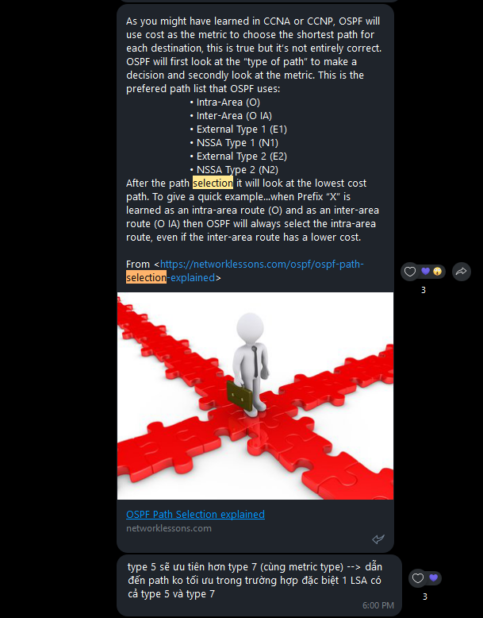

# OSPF route selection

[ Wednesday, July 14, 2021 5:59 PM ] ⁨SVT.Anh.VT⁩: Sau một hồi lab thì anh Huy, anh Minh, anh Thịnh, Thương, Hùng, Quân đã rút ra vầy các anh nhé

[ Wednesday, July 14, 2021 5:59 PM ] ⁨SVT.Anh.VT⁩: As you might have learned in CCNA or CCNP, OSPF will use cost as the metric to choose the shortest path for each destination, this is true but it’s not entirely correct. OSPF will first look at the “type of path” to make a decision and secondly look at the metric. This is the prefered path list that OSPF uses:

    • Intra-Area (O)

    • Inter-Area (O IA)

    • External Type 1 (E1)

    • NSSA Type 1 (N1)

    • External Type 2 (E2)

    • NSSA Type 2 (N2)

After the path selection it will look at the lowest cost path. To give a quick example…when Prefix “X” is learned as an intra-area route (O) and as an inter-area route (O IA) then OSPF will always select the intra-area route, even if the inter-area route has a lower cost.

From <[https://networklessons.com/ospf/ospf-path-selection-explained](https://networklessons.com/ospf/ospf-path-selection-explained)>

[ Wednesday, July 14, 2021 6:00 PM ] ⁨SVT.Anh.VT⁩: type 5 sẽ ưu tiên hơn type 7 (cùng metric type) --> dẫn đến path ko tối ưu trong trường hợp đặc biệt 1 LSA có cả type 5 và type 7

- --

