# BRAS Overview and Session Limits

> Generated deterministically from the approved grouping manifest.


## Source: `formatted/TS_notes/BRAS.md`

# BRAS

Làm rõ quy mô sự cố: số lượng bao nhiêu sự

Thời điểm phát sinh sự cố

Các khách hàng này trước đây có onl bình thường không?

có thay đổi gì liên quan đến:

các khách hàng này

Bras

Radius

Metro, access

khoanh vùng được lỗi ở khu vực nào? có thiết bị nào chung

đã xử lý gì chưa?

bị khi nào?

From Cli:

```text
user@host> show system subscriber-management statistics
```

```text
subscriber-management not enabled <-- System reports that Subscriber Management is "not enabled"
```

```text
command not supported
```

From RE Shell:

```text
% sysctl -a | grep enhance
```

```text
net.enhanced\_rpf\_debug: 0
```

```text
net.pfe.debug\_ae\_count\_lag\_enhanced: -1
```

```text
net.pfe.debug\_force\_lag\_enhanced: 0
```

```text
net.disable\_lag\_enhanced: 0
```

```text
net.enhanced\_bbe\_support: 2 <-- “2” indicates the system is not running Enhanced Subscriber Management
```

1. Kiểm tra sơ bộ

```text
show system subscriber-management statistics
sysctl -a | grep enhance
show pppoe statistics
show network-access aaa statistics radius
show network-access aaa statistics authentication
show network-access aaa terminate-code brief
show pppoe lockout
```

```text
show pppoe lockout | match "lockout: [^0]"
show pppoe lockout | match "Index|lockout: [^0]|[A-F0-9]{2}(:[A-F0-9]{2}){5}"
```

```text
show ddos-protection protocols pppoe statistics brief (xem queue có bị max k? mx960: max 300 subs/s)
show log pppoed\_era\_jpppoed\_era\_in\_progress.log (check cái log era xem nó ghi lần cuối khi nào)
show chassis alarm
show system alarm
show system core-dumps
show log messages | last
```

2. Nếu không thấy bất thường muốn phục hồi nhanh (hình bên dưới)

```text
restart smg-service
```

3. Nếu không thì debug sâu vào

```text
show /var/log/messages (đọc tất cả log message từ trước thời điểm bị lỗi)
show /var/log/interactive-commands (đọc log interactive command xem có thay đổi gì không)
monitor traffic interface ae3 extensive matching "ether host 4c:d9:8f:ff:c8:ed" (capture bắt gói bằng monitor traffic write-file với 1 user bị lỗi xem bị stuck đoạn nào)
```

```text
monitor traffic interface ae3 extensive matching "ether host 4c:d9:8f:ff:c8:ed" no-resolve extensive size 9000 /var/tmp/ECC-BDH2.pcap
```

- bật trace-option các tiến trình:

- general-authentication-service
- ppp
- dhcpd
- pppoe
- smg-service

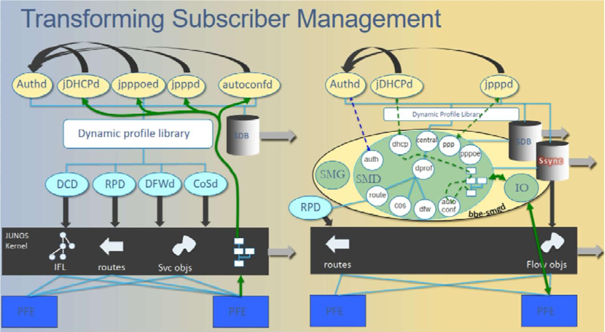

```text
show subscribers user-name student extensive | match session
```

```text
show dynamic-profile session client-id
```

```text
clear dhcp server binding all
```

```text
clear auto-configuration interfaces ge-0/0/8
```

```text
clear dhcp client binding all
```

```text
request dhcp client renew all
```

* *Trouble-shooting Subcribers Management**

• **Trouble-shooting AAA Service**

- test aaa authd-lite user team1 password lab123 profile my-profile (dùng tool radping)
- test aaa ppp username <> password <> (kiểm tra đã apply access-profile chưa?)  **<<< PR1759048**
- show network-access aaa subscribers
- show network-access aaa statistics authentication
- 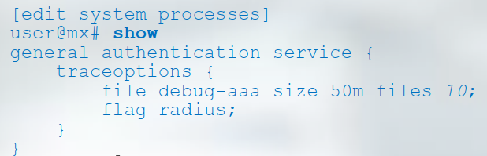
- user@mx# run show log debug-aaa | last

```text
Restart authd daemon: **restart general-authentication-service**
```

• **Monitoring Subscriber Addressing**

- show network-access address-assignment pool
- show subscribers
- 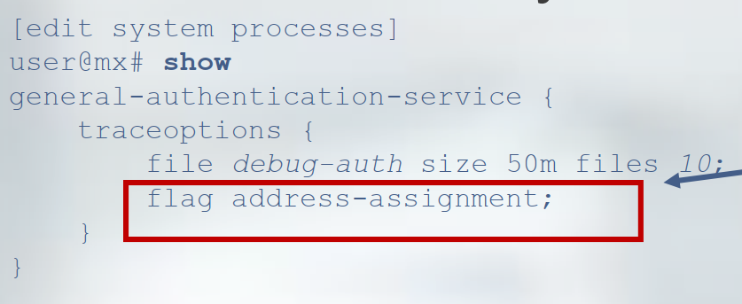
- user@mx> show log debug-auth | last

• **Trouble shooting PPPoE Service**

- 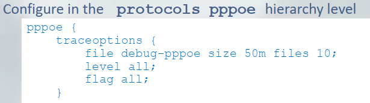
- **show log** ***debug-pppoe | last***
- Packet capture on interface downlink to check 4 packet type of PPPOE: Padi, Pado, Padr, Pads

```text
monitor traffic interface ae0 matching "ether host 00:1d:aa:9b:71:31" no-resolve detail|extensive
**monitor traffic interface xe-0/0/0 matching "ether host** **54:A6:78:CA:00:00" size 1500 extensive write-file PPPOE-capture.pcap**
```

• **Trouble shooting PPP Service**

- 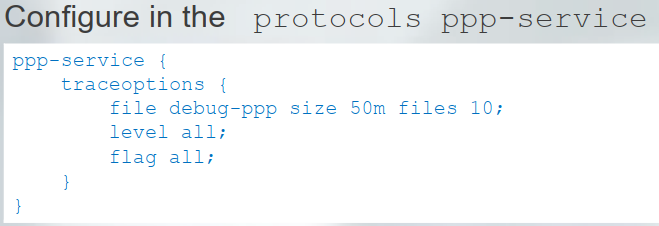
- **show log debug-ppp | last**
- Packet capture on interface downlink to check ppp packet

```text
> **monitor traffic interface xe-0/0/0 matching "ether host** **54:A6:78:CA:00:00"**
```

- 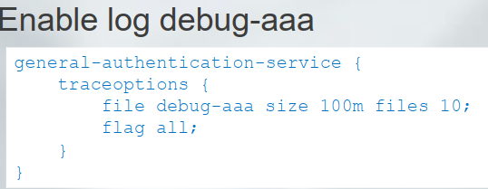
- show log debug-aaa | last 100 | find basic\_auth\_request | "Starting RADIUS authentication"
- show log debug-aaa | last 100 | find "Parsing RADIUS message for session-id:43209"

• **Trouble shooting DHCP Service**

- **show dhcpv6 server binding**
- **show dhcpv6 server statistics**
- **clear dhcpv6 server binding**
- **clear dhcpv6 server statistics**
- 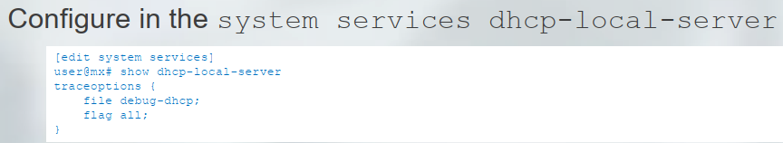
- **show log debug-dhcp | last**

```text
Restart jdhcpd daemon: **restart dhcp-service**
```

- wireshare capture file pppoe-capture.pcap

• **Case studies**

- **Ddos protection padi**

- Total padi, dhcpv6 solicit from subscribers send to BNG over default ddosprotection 500 pps

```text
> show log messages | match ddos
> show ddos-protection protocols pppoe padi
> show ddos-protection protocols dhcpv6 violations
```

- **Subscribers dial pppoe slowly to BNG**

- **by ddos and traceoption**

```text
> show ddos-protection statistics
# show | match traceoption | display set | display inheritance
```

- Action:

- Change configuration ddos protection about 1000 pps per protocols type
- Deactive traceoption configuration on devices

- **Radius authd queue over queue**

- Accounting message store on radius queue and may be over radius queue and auth queue

```text
>show system process extensive | except 0.0
>show network-access aaa statistics radius
>show network-access aaa statistics radius queue-info
>show subscribers summary
>show log debug-aaa
```

- Upgrade radius server system
- deactive accounting when this issue is happened

- **# deactivate access profile ftth accounting**

- **IANA mode IPv6 WAN**

- >show log debug-dhcp | match IA\_NA
- >show log debug-aaa | match IA\_NA
- >show subscribers summary
- 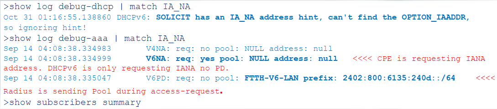
- Action:

```text
Request modem vendor change mode to RDNA for IPv6-WAN
Change configuration support both NDRA and IA\_NA mode
```

- **Statistic license key issue**

```text
>show subscribers summary
>show system license | match scale-subscriber
>show snmp mib walk 1.3.6.1.4.1.2636.3.63.1.1.1.2.1
Action:
```

- - Remove license key and add again

- **Subscribers not stable on MPC5E**

```text
show subscribers physical-interface xe-1/0/0 vlan-id 3035 count
Action:
```

```text
set chassis fpc 3 flexible-queuing-mode
```

- **Subs info issue**

```text
show log messages | match "Attempting to close SDB while DOWN"
Action:
```

- Upgrade junos version 15.1R7-S2 for Bras

- **RE not synchronizing**

- When upgrading Junos to 15.1R7-S2 before swap RE, RE backup not synchronize

- show system switchover
- 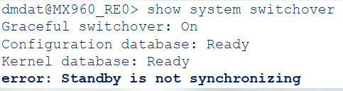

- Confirm the same hardware on both REs: **show chassis routing-engine**
- Reboot RE backup and wait sync

- **BNG not sent pado to modem**

- After upgrade junos to 15.1R7-S2, moderm send padi to Bras but bras not send pado return

- show log messages | match smg
- 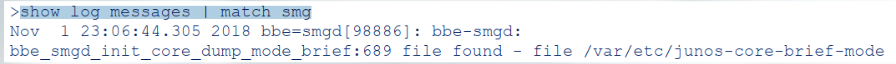

```text
Clear stuck process smg-service by command **restart smg-service**
```

- **User connected <> terninating liên tục:**

- Chưa cấu hình loopback int
- Attribute chưa được cấu hình trên hệ thống
- Sử dụng biến để bắt giá trị trả về nhưng không có biến trả về hoặc biến trả về null

* *restart auto-configuration**

* *restart ip-demux**

```text
restart snmp immediately
```

```text
restart mib-process immediately
```

* *OID for address-pool (access): 1.3.6.1.4.1.2636.3.51.1.1.4.1.1.1    name jnxUserAAAAccessPoolGeneral**

target-distribution

share-bandwidth-policer

short-cycle-protection

duplicate-protection

# revert-interval: 60 (default)

<https://www.juniper.net/documentation/us/en/software/junos/user-access/topics/ref/statement/revert-interval-edit-access.html>

hold-time up 10000 down 10000;

keepalive interval 30;

# RADIUS status

https://www.juniper.net/documentation/us/en/software/junos/subscriber-mgmt-sessions/topics/ref/command/show-network-access-aaa-radius-servers.html

# Description for RADIUS status

<https://www.juniper.net/documentation/en_US/junose15.1/topics/task/verify/radius-server-monitoring.html>

## DHCPv6 Duplicate Client DUIDs

<https://www.juniper.net/documentation/us/en/software/junos/subscriber-mgmt-access/topics/topic-map/dhcpv6-duplicate-client-management.html#id-dhcpv6-duplicate-client-duids>

kick-off users:

```text
> clear network-access aaa subscriber username
```

```text
> show subscribers user-name  extensive | match Session
```

```text
> dynamic-configuration session delete session-id <123>
```

1. Thay đổi IP trong pool public:

```text
> configure private
```

# delete services nat pool PUBLIC\_IP\_INTERNET\_GGHL10 address-range low 27.71.32.0 high 27.71.39.255    -> xóa range IP cũ

# set services nat pool PUBLIC\_IP\_INTERNET\_GGHL10 address-range low 12.12.12.0 high 12.12.12.255    -> cấu hình lại range IP mới

# commit      -> Cần thực hiện xóa và cấu hình lại range IP trong 1 pool cùng lúc, sau đó commit 1 lần – vì nat pool yêu cầu phải cấu hình IP

### Khi thực hiện commit thay đổi IP trong pool nat thì toàn bộ các session ăn vào các IP cũ sẽ bị clear và sau đó user request lại thì sẽ ăn theo nat pool IP mới

Khi đang có session có xóa term được ko?

```text
> Khi đang có session vẫn có thể xóa term có liên quan nat pool, nhưng với điều kiện nat rule phải có ít nhất 1 term đang tồn tại.
```

* *JunOS version for BRAS - (VTel):**

- **Đa số đang dùng 17.3**

- **Gặp 1 số PR**
- **Trên MPC7 - sử dụng nhiều logical-interface-policer (ngưỡng số lượng policer) - 2021-0127-0653**
- **18.3-S8 có PR liên quan SCB3**
- **MIB phục vụ giám sát - thu thập MIB hiện tại và test trên lab**
- **VNPT chạy 18 chưa ghi nhận bug liên quan BRAS**
- **19 còn long-term support còn 18, 17 sắp eos**

- **Xem xét wordwide xem có xài 19 không?**

- **Chốt chọn 19 để test lab(19.4 lastest)**

- **Juniper VN trao đổi với ATAC tìm hiểu thêm thông tin.**

- thông tin hiện có về 19.4R3 cho BRAS như sau.

- Có gì thêm chiều anh sẽ update tiếp
- ------------
- - có 2 khách hàng đang target đến version này, 1 khách hàng chạy VC với scale 400K per chassis. Không có info feature/config chi tiết.
- - chưa có khách hàng nào production
- - quan ngại: mình chỉ có 2 tháng để chuẩn bị thì sẽ ko đủ thời gian để test/pilot & fix lỗi trước khi production
- ------------
- - còn bản 18.4R3 thì theo Jtac chất lượng cho BRAS ko tốt. Anh đang hỏi thêm xem có info cụ thể gì ko.

* *Subject:** RE: SR#02221075/ VIETTEL/ Ngoài hợp đồng/ KIểm tra lỗi khi xóa cấu hình interface-mib theo khuyến nghị của SVTech

Dear anh Phóng,

1. Nên bỏ interface-mib trong dynamic-profile, đây là khuyến nghị của Juniper để đỡ tiêu tốn tài nguyên, tăng performance cho việc quản lý subscribers trên BRAS

Link tham khảo: <https://www.juniper.net/documentation/us/en/software/junos/subscriber-mgmt-sessions/topics/ref/statement/interface-mib-edit-dynamic-profiles-interfaces.html>

2. Do trên thiết bị đang không enable versioning nên không thể thực hiện tác động thêm sửa trong dynamic-profile khi có subscribers online

Các bước để remove được interface-mib trên BRAS này (với các BRAS khác có enable versioning thì có thể xóa như bình thường):

* *B1: Clear hết subscribers trên BRAS**

* *B2: Deactivate toàn bộ dynamic-profile + deactivate các interface có cấu hình dynamic-profile**

|  |
| --- |
| deactivate dynamic-profiles  deactivate interfaces |

* *B3: Bổ sung cấu hình versioning**

|  |
| --- |
| set system dynamic-profile-options versioning |

* *B4: xóa cấu hình interface-mib**

|  |
| --- |
| delete dynamic-profiles   dualstack-PPPoE-Profile interfaces pp0 interface-mib |

* *B5: Activate lại dynamic-profile và interface**

|  |
| --- |
| activate dynamic-profiles  activate interfaces |

- --

Khách hàng muốn gom chung nhiều physical-interface trong cùng 1 Bundle AE Downlink để chạy BRAS, mục đích là muốn dự phòng (redundancy ở mức MPC/MIC/PIC và load-balacing) => tính năng này đã chạy trên các version trước 15.1Rx. Tuy nhiên gặp vấn đề phát sinh như sau:

- Đó là việc traffic download/upload bị double-traffic do các interface vật lý thuộc AE nằm trên các PFE khác nhau.

Do đó để giải quyết vấn đề double-traffic cần dùng tính năng "targeted-distribution". Tính năng này được matured với các version 17.3Rx trở về sau. Tuy nhiên để đạt được việc redundancy và load-balacing subs thì phải đánh đổi về scale subscriber

Có một số trường hợp sau đây:

a. Trường hợp1: các port trên AE nằm cùng trên cùng 1 PFE:

- trường hợp này không có redundancy mức MIC và MPC

- vẫn đảm bảo maximum subscribers trên mỗi MPC. Ví dụ MPC5E có scaling hỗ trợ 64k dual-stack.

- Trường hợp này không cần sử dụng tính năng targeted-distribution do không bị vấn đề về policer và có thể sử dụng version 15.1Rx trở đi

b. Trường hợp 2: các port trên AE nằm trên 2 PFE khác nhau nhưng thuộc cùng một MPC

- Trường hợp này có redundancy mức MIC. Khi một MIC lỗi thuê bao tự động chuyển sang MIC còn lại, thuê bao không bị reconnect session

- Tổng thuê bao dual-stack trên MPC giảm 50%. Ví dụ MPC5E có scaling hỗ trợ 64k dual-stack. Trường hợp này maximum subscriber/AE chỉ còn 32k dual-stack.

- Trường hợp này MPC sử dụng 2 PFE nên cần sử dụng tính năng targeted-distribution để đảm bảo policer download chạy đúng và phải sử dụng version 17.3Rx trở đi.

c. Trường hợp 3: các port trên AE nằm trên 2 PFE khác nhau và mỗi FFE thuộc 1 MPC

- Trường hợp này có redundancy mức MIC, MPC. Khi một MIC,MPC lỗi thuê bao tự động chuyển sang MIC/MPC khác, thuê bao không bị reconnect session.

- Tổng thuê bao trên 2 MPC sẽ giảm 50% từ 64k dual-stack xuống 32k dual-stack trên 2 MPC.

Chú ý:

- Tính năng targeted chỉ có quản lý băng thông với egress IFL (tức chiều download)

- Với chiều ingress IFL ( upload) traffic có thể đi qua tất cả interface vật lý nên có thể có hiện tượng double BW upload.

- Để giải quyết vấn đề double traffic Upload, có thể dùng giải pháp shared-bandwidth-policer. Tuy nhiên trong thực tế traffic upload thực tế không nhiều và không cần phải chú ý nhiều lắm.

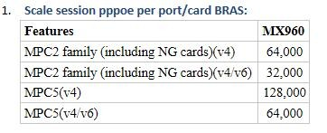

[ Thursday, June 10, 2021 4:13 PM ] ⁨SVT.Thái.NĐ⁩: đúng rồi Tùng, nãy meeting case BRAS30, thì anh cũng hỏi anh Long chỗ BRAS24 này => đều không có cấu hình target-distri...

[ Thursday, June 10, 2021 4:13 PM ] ⁨SVT.Thái.NĐ⁩: [13:52, 10/06/2021] LongDH1: {master}

pmgatepro@HHT9602BRA24\_RE1> show subscribers summary port

Interface           Count

ae3: et-1/1/0       20831

ae3: et-8/3/0       20831

ae4: et-1/3/0       14282

ae4: et-8/1/0       14282

xe-0/0/0            872

xe-0/0/1            260

[ Thursday, June 10, 2021 4:14 PM ] ⁨SVT.Thái.NĐ⁩: cái lủng thứ 2 -> đó là ở KV3 họ đang quy hoạch sai. Nghe Tân nói thì ở VT không quy hoạch AE khác linecard

[ Thursday, June 10, 2021 4:15 PM ] ⁨SVT.Thái.NĐ⁩: cái này mình biết nhưng đừng nói họ -> sợ ảnh hưởng đến KV3.

[ Thursday, June 10, 2021 4:16 PM ] ⁨SVT.Thái.NĐ⁩: để chắc ăn muốn xem subs có được backup trên interface khác hay không, thì Tùng kiểm tra thêm câu lệnh "show interface targeting"

[ Thursday, June 10, 2021 4:18 PM ] ⁨SVT.Thái.NĐ⁩: show interfaces targeting ae

[ Thursday, June 10, 2021 4:18 PM ] ⁨SVT.Tung.NT⁩: chỗ targeting hồi xưa có khai BRA37-38 thôi (2019) - các BRA về sau không có khai targeting em ah

[ Thursday, June 10, 2021 4:18 PM ] ⁨SVT.Tung.NT⁩: a Long báo vậy ạ

[ Thursday, June 10, 2021 4:20 PM ] ⁨SVT.Thái.NĐ⁩: rồi hiểu rồi. nếu họ không dùng targeting-distri, thì họ sẽ dùng AE thuộc chung 1 PFE (chứ quy hoạch port khác PFE như ở KV3 là không đúng theo thiết kế của tập đoàn)

[ Thursday, June 10, 2021 4:20 PM ] ⁨SVT.Thái.NĐ⁩: ae3: et-1/1/0       20831

[ Thursday, June 10, 2021 4:30 PM ] ⁨SVT.Tung.NT⁩: thế khác PFE có chỗ nào không tối ưu hay sao anh?

[ Thursday, June 10, 2021 4:33 PM ] ⁨SVT.Tung.NT⁩: hay mình không control được scale của từng FPC ạ?

[ Thursday, June 10, 2021 4:41 PM ] ⁨SVT.Thái.NĐ⁩: về nguyên tắc, nếu có nxPFE thì scale sẽ bị giảm đi n lần

[ Thursday, June 10, 2021 4:43 PM ] ⁨SVT.Thái.NĐ⁩: còn việc có target-distri: sẽ làm cho 1 thuê bao online ở 1 hướng primary, hướng còn lại sẽ là backup => tránh việc double BW ở chiều OUT interface (chiều download)

[ Thursday, June 10, 2021 4:44 PM ] ⁨SVT.Thái.NĐ⁩: nếu không có target-dsitri: các interface cùng 1 AE sẽ đều là primary => gây double BW.

[ Thursday, June 10, 2021 4:45 PM ] ⁨SVT.Thái.NĐ⁩: như vậy về mặt redundancy ở mức interface: thuê bao sẽ luôn dc redundancy ở mức interface.

[ Thursday, June 10, 2021 4:45 PM ] ⁨SVT.Tung.NT⁩: ae3: et-1/1/0       20831

[ Thursday, June 10, 2021 4:45 PM ] ⁨SVT.Tung.NT⁩: lấy output này làm ví dụ

[ Thursday, June 10, 2021 4:45 PM ] ⁨SVT.Tung.NT⁩: thì nếu như VTEL đang triển khai

[ Thursday, June 10, 2021 4:46 PM ] ⁨SVT.Tung.NT⁩: thfi FPC8 và FPC1 đều đang phải lưu thông tin của 35K subs

[ Thursday, June 10, 2021 4:46 PM ] ⁨SVT.Tung.NT⁩: còn nếu dùng ae chung FPC

[ Thursday, June 10, 2021 4:46 PM ] ⁨SVT.Tung.NT⁩: ví dụ PFC8 -> ae3

[ Thursday, June 10, 2021 4:46 PM ] ⁨SVT.Tung.NT⁩: FPC1 -> ae4

[ Thursday, June 10, 2021 4:47 PM ] ⁨SVT.Tung.NT⁩: thì FPC8 lưu 21K sub và FPC 1 lưu 14K sub

[ Thursday, June 10, 2021 4:47 PM ] ⁨SVT.Tung.NT⁩: khi fail cả fpc thì sẽ đẩy về bras backup để hứng traffic đúng hok anh?

[ Thursday, June 10, 2021 4:48 PM ] ⁨SVT.Thái.NĐ⁩: đúng rồi Tùng.

[ Thursday, June 10, 2021 4:50 PM ] ⁨SVT.Thái.NĐ⁩: nếu VT quy hoạch port chung AE cùng chung 1 PFE (FPC)=> khi fail card FPC, chỉ có cách là chuyển thuê bao lên BRAS backup trước, rồi mới reboot card để tránh ảnh hưởng thuê bao

[ Thursday, June 10, 2021 4:50 PM ] ⁨SVT.Tung.NT⁩: vậy case em đang làm chỗ BRA24 thì có thể reboot luôn

[ Thursday, June 10, 2021 4:51 PM ] ⁨SVT.Tung.NT⁩: và theo lý thuyết là không ảnh hưởng rớt thuê bao đúng hok ạ?

[ Thursday, June 10, 2021 4:51 PM ] ⁨SVT.Thái.NĐ⁩: uh Tùng, case của Tùng đang quy hoạch port khác PFE => nên khi 1 FPC fail => sẽ không rớt thuê bao.

Clearing Stuck Subscriber in Tomcat

Dynamic-configuration command is not recommended in next generation subscriber release to release the subscriber.

Instead of using dynamic-configuration command, you can use the “request system subscriber-management release-session id ” To use this command, you have to logout the subscriber hierarchy one by one:

```text
labroot@jtac-mx240-r2001> show subscribers extensive Type: VLAN
```

User Name: cccc

Logical System: default

Routing Instance: default Interface: demux0.3221225474 Interface type: Dynamic Underlying Interface: ge-2/0/3

Type: DHCP

IPv6 Address: 2a01:260:1::1 Logical System: default Routing Instance: default Interface: pp0.3221225476 Interface type: Static Underlying Interface: pp0.3221225476

```text
MAC Address: 00:54:01:00:00:01 State: Active
```

Radius Accounting ID: 8 Session ID: 8

```text
Dynamic Profile Dynamic Profile State: Active Session ID: 4
```

Name: IP

```text
Version: 1
```

Type: PPPoE

User Name: dddd

IP Address: 185.49.118.54

IP Netmask: 255.255.255.255

IPv6 Address: 2a01:260:1::1

Routing Instance: default

Interface: pp0.3221225476

Interface type: Dynamic

Underlying Interface: demux0.3221225474 Dynamic Profile Name: PPPOE

```text
State: Active
```

Radius Accounting ID: 7

Session ID: 7

```text
labroot@jtac-mx240-r2001> request system subscriber-management release-session id 8 Session will be forcibly released.
```

Do you want to continue ? [yes,no] (no) yes

```text
labroot@jtac-mx240-r2001> request system subscriber-management release-session id 7 Session will be forcibly released.
```

```text
labroot@jtac-mx240-r2001> request system subscriber-management release-session id 4 Session will be forcibly released.
```

Client-session ID 4 released

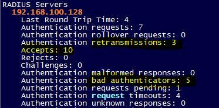

[ Wednesday, June 9, 2021 8:58 AM ] ⁨SVT.Tung.NT⁩: mới học được lỗi này

[ Wednesday, June 9, 2021 8:58 AM ] ⁨SVT.Tung.NT⁩: cấu hình secret không matching giữa client và server

[ Wednesday, June 9, 2021 8:59 AM ] ⁨SVT.Tung.NT⁩: gói trả về vẫn accept

[ Wednesday, June 9, 2021 8:59 AM ] ⁨SVT.Tung.NT⁩: nhưng tăng bad-authenticators

[ Wednesday, June 9, 2021 8:59 AM ] ⁨SVT.Tung.NT⁩: và tăng retransmissions

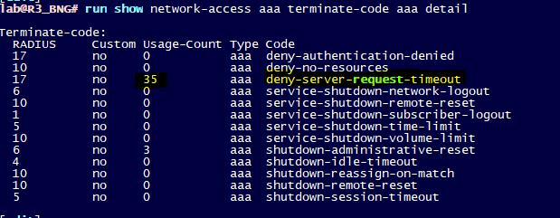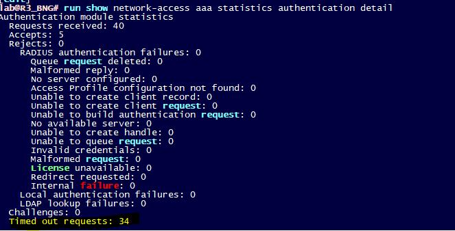

Please Consider testing/working on the 18.4 and above releases to make use of the multicore and multi thread features of the JSM daemons. ----> Có ý này sẽ khác biệt giữa BRAS chạy trước và từ 18.4 trở đi.

Em thấy trong CV SVTECH gửi sang có khuyến nghị tắt tính năng RTT để tăng năng lực xử lý useronline.

Vậy có thông tin cụ thể là tăng lên bao nhiêu không anh

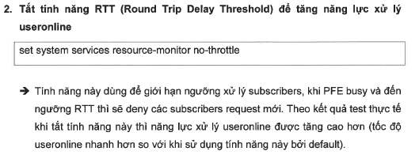

Liên quan đến tính năng RTT trên phiên bản Junos 18.4R3-S7, bên anh có thực hiện test và có logging kết quả như file đính kèm. Anh xin phép summarize lại như sau

Theo như kết quả test trên lab thì:

- Khi enable tính năng RTT (by default của version 18.4R3-S7): Bắn 32K thuê bao (Dual stacked) thì tổng thời gian thuê bao online và install route xuống FIB (IPv4 và IPv6) là khoảng 8 phút.
- Khi tắt tính năng RTT : Bắn 32K thuê bao (Dual stacked) thì tổng thời gian thuê bao online và install route xuống FIB (IPv4 và IPv6) là khoảng 6 phút.

Bên anh vẫn khuyến nghị tắt tính năng RTT này, và bên anh xin phép correct lại câu lệnh để tắt tính năng này như sau

```text
set system services resource-monitor no-load-throttle
```

Chỗ này chắc anh em đang hơi mismatch thông tin, anh xin phép summarize lại như sau:

* *Tính năng RTT**: Tính năng này cho phép Junos kiểm soát việc xử lý gói tin PPPoE ở mức PFE. Khi đến một ngưỡng nhất định, Junos sẽ lock các gói tin PPPoE lại, tập trung xử lý và hoàn thành các process còn lại cho các thuê bao trước đó. Anh ví dụ cùng 1 lúc có 10K PPPoE quay lên, thì Junos sẽ chỉ tập trung xử lý cho 5K (xử lý cho online phiên PPPoE, cấp phát DHCPv6, install các route có liên quan đến thuê bao xuống FIB, cấp phát tài nguyên cho firewall filter, policer…). Trong thời gian này, 5K thuê bao còn lại sẽ không thể online được.

* *Disable tính năng RTT:** Khi tính năng RTT được tắt, Junos sẽ cho phép PFE tiếp nhận toàn bộ các request PPPoE, ưu tiên xử lý để cho phép toàn bộ thuê bao được online trên RE trước, sau đấy mới tiếp tục xử lý các process còn lại cho từng thuê bao(install route xuống FIB).

Như file kết quả test mà SVT gửi thì có thể thấy:

- **Với trường hợp tắt RTT**: Total thời gian thuê bao online là rất nhanh (kiểm tra bằng câu lệnh show subscribers summary), tuy nhiên đây chỉ mới là online ở RE, lúc này ở FIB các route của thuê bao vẫn chưa được install xuống kịp. SVT thực hiện bơm traffic ngay khi thuê bao online đủ trên RE àPacket loss do các route chưa kịp install xuống FIB.
- **Với trường hợp bật RTT**: Total thời gian online của tổng các thuê bao đúng bằng thời gian các route của thuê bao được cài xuống FIB. Sau khi thuê bao online đủ (đồng nghĩa với việc các route cũng được install xuống FIB), lúc ấy SVT mới send traffic àPacket loss đương nhiên ít hơn so với trường hợp 1.

Nếu bật tính năng RTT, bên anh thấy có mấy issue như sau:

- Khi tổng số thuê bao chưa online đủ trên RE (kiểm tra bằng câu lệnh show subscribers summary), thì sẽ khó cho anh em vận hành là lỗi ở Metro layer 2 hay là do BRAS đang chưa xử lý gói tin PPPoE này.
- Có những thuê bao bị limit về số lượng gói tin PADI gửi lên, nếu bị lock hoặc không xử lý trên BNG, đồng nghĩa với việc modem phải gửi lại àCó thể quá số lần retry, dẫn đến phải reset modem ở phía khách hàng.

Trên đây là các nhận định của bên anh, nếu có chưa đúng nhờ Minh cùng anh em Viettel cho thêm ý kiến ạ.

Sau khi thuê bao online trên RE, để kiểm tra các route của thuê bao đã được install vào FIB hay chưa thì cần thực hiện câu lệnh ở mức FPC như dưới đây

|  |
| --- |
| root@BRAS\_18> show subscribers summary    Subscribers by State  Active: 6  Total: 6    Subscribers by Client Type  **DHCP: 2**  VLAN: 2  **PPPoE: 2**  Total: 6  èThuê bao đã online đủ trên RE |

àTruy xuất số lượng route IP+IPv6 của thuê bao đã cài đặt ở FIB

|  |
| --- |
| root@BRAS\_18> request pfe execute command "show vbf flow route summary" target fpc4  SENT: Ukern command: show vbf flow route summary    Flow Type       Count        Ifl's        Templ's  --------------  -----------  -----------  -----------  IP ROUTE                  6            0            0  --------------  -----------  -----------  -----------  Total                     6            0            0  // Ở đây anh có 02 thuê bao dual-stacked, như vậy tổng route (IPv4+IPv6) sẽ là 6. |

Trong trường hợp em muốn detail IPv4 và IPV6 có thể thêm các option

|  |
| --- |
| request pfe execute command "show vbf flow route ip summary" target fpc4  èIPv4 route  request pfe execute command "show vbf flow route inet6 summary" target fpc4  èIPv6 route |

Các câu lệnh này chỉ truy xuất total vbf flow, nên sẽ không ảnh hưởng đến tải của thiết bị nhé.

```text
When interface is moved to different ae with subscribers present on it, it may have resulted in unexpected behaviour and the authd module is internally terminated (not finding any process termination log though) and that is the reason behind this error: the general-authentication-service subsystem is not running whenever you ran the network-access related show commands. In RSI also, I don’t see the authd module under “show system processes extensive”. Please follow the below mentioned procedure while moving the interface to different ae to avoid any such unprecedented issues.
```

Aug 23 23:18:40.926 2021  HNM-BNG2-MX960\_RE0 kernel: iff\_request: ifl et-3/2/0.32767 still has 1 stacked ifls present. Please advise customer to follow the sequence like below when they move interface to a different ae.

1. Disable the interface and commit
2. Drain all the subscribers from the interface. Make sure there are no subscribers connected on the interface.
3. Move the interface to the other ae, enable the interface and commit.
4. Bring up the subscriber again on the interface.

Dear Hiệp,

Để khi có vấn đề kênh L2VPN, route static lo0 các BRAS qua kênh L2VPN down có thể down được phiên BGP giữa các BRAS, mình cần thực hiện thêm giải pháp như sau:

- Trên các BRAS RR tạo thêm các route static đến lo0 BRAS tỉnh với preference cao hơn route qua kênh L2VPN và route về discard:

```text
set routing-options static route  qualified-next-hop 169.254.254.254 preference
```

```text
set routing-options static route  qualified-next-hop 169.254.254.254
```

```text
set routing-options static route  resolve
```

```text
> Mỗi lo0 BRAS tỉnh tạo thêm 1 static route đến next-hop 169.254.254.254  với preference 8 > 5
```

```text
set routing-options static route [169.254.254.254/32](http://169.254.254.254/32) discard
```

```text
> chọn next-hop đến IP 169.254.254.254 discard vì IP này là IP dành riêng local tự tạo trên máy tính khi máy tính ko gán được IP -> nên sử dụng IP này sẽ không có liên quan đến IP dịch vụ nào có thể ảnh hưởng
```

Với giải pháp này, khi có vấn đề kênh L2VPN, route static lo0 BRAS tỉnh qua kênh L2VPN down thì route lo0 BRAS tỉnh sẽ active bằng route discard được tạo trên -> mất kết nối lo0 giữa BRAS tỉnh và BRAS RR -> phiên BGP giữa BRAS tỉnh và BRAS RR sẽ down

Anh xin phép update thêm thông tin về case này nhé

```text
Log “XL[0:0].cass\_ddr[2] CAE\_MCIF[1] Part 1 Uninitialized Read Error” cảnh báo với memory của khối xử lý XLCHIP trên card MPC
Triggers:
```

1. Trên box này đang có cấu hình chassis enhanced-policer + logical-interface-policer, với cấu hình enhanced-policer thiết bị sẽ thực hiện classify/statistics và hiển thị chi tiết hơn các loại packet đi qua mỗi policer, việc classify này không cần thiết trong khi làm tăng tải xử lý cho thiết bị (cụ thể là LUCHIP của card FPC)
2. Với thiết bị có chức năng BRAS do số lượng scale thuê bao lớn và mỗi thuê bao có 1 firewall policer gói cước do vậy việc bật cấu hình enhanced-policer sẽ làm tăng tải thiết bị không cần thiết
3. Lỗi này được mô tả trong PR1512844: Problem with dual stack PPPoE/DHCPv6 client connections at high scale using enhanced-policer with logical-interface-policer.
4. Card FPC0&2 vẫn còn xuất hiện log cảnh báo memory do số lượng subscribers vẫn còn khá lớn (~32K)

3. **Khuyến nghị**

1. Thực hiện remove cấu hình chassis enhanced-policer trên các box BNG chạy scale lớn với câu lệnh sau:

1. # delete chassis enhanced-policer
2. # commit
3. Note: Cấu hình này yêu cầu reboot all linecard mới affect hoặc reboot box.

Nhờ em sắp xếp kế hoạch thực hiện giúp anh nhé

* *================**

4. Mô tả kết quả show khi có cấu hình enhanced-policer và không có cấu hình enhanced-policer

Below is the CLI output WITHOUT enhanced-policer.

```text
labroot@mx480-r128> show firewall filter d-50m-pp0.3221225475-out detail
```

Jun 02 11:26:19

Filter: d-50m-pp0.3221225475-out

Policers:

Name                                                Bytes              Packets

d-50m-filter-pp0.3221225475-out                         0                    0

d-80m-filter-pp0.3221225475-out                         0                    0

The new feature enhanced-policer also introduced a new CLI parameter for firewall and policer.

```text
labroot@mx480-r128> show firewall ?
```

Jun 02 11:35:53

Possible completions:

<[Enter]>            Execute this command

application          Owner application

counter              Counter name

detail               Show filter statistics with enhanced policer statistics

```text
labroot@mx480-r128> show policer ?
```

Jun 02 12:24:21

Policer name

\_\_auto\_policer\_template\_1\_\_

\_\_auto\_policer\_template\_2\_\_

\_\_auto\_policer\_template\_3\_\_

\_\_auto\_policer\_template\_4\_\_

\_\_auto\_policer\_template\_5\_\_

\_\_auto\_policer\_template\_6\_\_

\_\_auto\_policer\_template\_7\_\_

\_\_auto\_policer\_template\_8\_\_

\_\_auto\_policer\_template\_\_

\_\_default\_arp\_policer\_\_

\_\_dhcpv6\_\_

\_\_jdhcpd\_\_

Below is the CLI output when enhanced-policer is enabled.

```text
labroot@mx480-r128> show firewall filter d-50m-pp0.3221225473-out detail
```

Jun 02 11:52:29

Filter: d-50m-pp0.3221225473-out

d-50m-filter-pp0.3221225473-out

OOS                                                 0                    0

Offered                                             0                    0

Transmitted                                         0                    0

d-80m-filter-pp0.3221225473-out

Offered                 - Number of Packets/Bytes of traffic subjected to policing.

OutofSpec          - Number of Packet/Bytes that are marked OOS by the policer.

All the packets that are  subjected to OOS actions configured for the policers like discard,

color marking, setting  forwarding-class will be accounted against this counter.

Transmitted       - Number of Packets/Bytes of  traffic that are not discarded by the policer.

When the policer action is  discard then represents the In-spec statistics and

when the policer action is non-discard (loss- priority/forwarding-class) then this will be equal to the offered stats.

Nhờ Hùng gửi lại giúp anh thông tin sau để a làm việc thêm với Jtac nhé

RSI + var/log mới nhất

=== Log pfe (yêu cầu account có quyền show ở mức shell pfe của linecard)

```text
show pfe statistics traffic | no-more
```

```text
show pfe statistics traffic detail | no-more
```

```text
show pfe statistics error | no-more
```

```text
request pfe execute command "show nvram" target fpc1 | no-more
```

```text
request pfe execute command "show syslog messages" target fpc1 | no-more
```

```text
request pfe execute command "show nvram" target fpc2 | no-more
```

```text
request pfe execute command "show syslog messages" target fpc2 | no-more
```

```text
request pfe execute command "show ttp statistics" target fpc2 | no-more
```

```text
request pfe execute command "show hsl2 statistics" target fpc2 | no-more
```

```text
request pfe execute command "show hsl2 statistics crc" target fpc2 | no-more
```

```text
request pfe execute command "show sched" target fpc2 | no-more
```

```text
request pfe execute command "show threads cpu" target fpc2 | no-more
```

```text
request pfe execute command "show jnh 0 exceptions" target fpc2 | no-more
```

=== Log shell bbe (yêu cầu account có quyền quyền show ở mức shell của RE)

```text
> start shell
```

```text
% vty -s 7208 128.0.0.1
```

vty-bbe# show ifl et-1/0/2.32767

vty-bbe# show ifl et-1/1/2.32767

vty-bbe# show ifl et-2/0/2.32767

vty-bbe# show ifl et-2/1/2.32767

vty-bbe# quit

vty-bbe#

```text
% exit
```

Exit

Bản 21.4 còn khá mới, vừa được cập nhật khuyến nghị vào quý 4 năm rồi và có thay đổi kiến trúc của JunOS có thay đổi về tính năng BNG để hỗ trợ cho dòng linecard ZT chip mới

* *Hi a Long, Hùng**

Nhờ anh bổ sung giúp em cấu hình chuyển mode hyper-mode về normal mode, tính năng này trước em cũng đã gửi khuyến nghị phải disable hypermode để chạy đc tính năng pppoe (em attach lại mail mô tả về tính năng này)

* *Các bước thực hiện**

1. Kiểm tra mode hypermode hiện tại trên Bras (đang ở mode hyper mode)

```text
> show forwarding-options hyper-mode
```

Current mode: hyper mode

Configured mode: hyper mode

2. Cấu hình disable hypermode

# set forwarding-options no-hyper-mode

# commit

3. reboot box để cấu hình no-hyper-mode được apply

```text
> request vmhost reboot routing-engine both
```

4. Kiểm tra lại mode hypermode trên Bras sau khi tác động (phải ở mode normal mode)

Current mode: normal mode

Configured mode: normal mode

5. Thực hiện quay số test thuê bao lên bras mới

Nhờ anh thực hiện và update kết quả giúp em ạ

* *Dear anh Chiến, Dương, Hùng**

Em xin phép note lại 1 số ý cho việc triển khai Bras của dự án này ạ

Vật tư dự án: MX240/RE-NG/SCBE3

1. By default card chuyển mạch SCBE3 sẽ enable mode hypermode, tuy nhiên khi enable hyper-mode sẽ không hỗ trợ PPPoE, do vậy với box triển khai chức năng BNG cần disable tính năng hyper-mode

- Hypermode là tính năng cho phép thiết bị tối ưu tốc độ xử lý packet khi đi qua thiết bị, tuy nhiên so sánh với normal mode thì hypermode chỉ tối ưu hơn với trường hợp traffic linerate qua card với packet size rất nhỏ 64 bytes, thực tế mạng production của mình chạy với packet size lớn hơn nên sẽ không có khác biệt gì khi disable tính năng này trên BNG.
- Câu lệnh disable hypermode

|  |
| --- |
| # set forwarding-options no-hyper-mode |

- Kiểm tra feature được disable

|  |
| --- |
| {master}    thonguyen@TEST\_OS\_VIETTEL\_BRAS\_RE0> show forwarding-options hyper-mode    Current mode: normal mode    Configured mode: normal mode |

- Hyper-mode is the default forwarding mode on the SCBE3-MX

<https://www.juniper.net/documentation/us/en/hardware/mx960/topics/concept/scbe3-desc.html>

<https://www.juniper.net/documentation/us/en/software/junos/sampling-forwarding-monitoring/topics/concept/hypermode-unsupported-commands.html>

- **Trên các box BNG sử dụng SCBE3 bắt buộc phải disable hypermode (trong template em gửi cho Hùng đã thêm lệnh disable hypermode này)**

2. **Tính năng RTT**

- RTT Load throttle là tính năng cho phép Routing-Engine monitor tải xử lý trên PFE linecard, khi có số lượng lớn user đồng thời request online lên Bras, user sẽ được xử lý và online trên RE, đồng thời sẽ được install xuống PFE, PFE xử lý đến 1 ngưỡng nào đó sẽ bị busy không xử lý kịp, lúc này RE sẽ deny các request của thuê bao mới để giảm tải cho PFE, khi PFE trở về normal RE sẽ tiếp tục xử lý các request của thuê bao mới và tiếp tục install xuống PFE bình thường.
- Tính năng này có từ junos 18.4 và trong lần test junos 18.4R3-S7 cho Bras Viettel lần trước T4/2021 SVtech cũng đã gửi thông tin về tính năng này
- Câu lệnh để disable tính năng RTT

|  |
| --- |
| # set system services resource-monitor no-load-throttle |

- Câu lệnh kiểm tra feature đã được enable hay disable

|  |
| --- |
| {master}[edit]    thonguyen@TEST\_OS\_VIETTEL\_BRAS\_RE0# run show system resource-monitor summary    Resource Usage Summary        Throttle                       : Enabled    Load Throttle                  : Disabled    Heap Mem Threshold             : 70  %    IFL Counter Threshold          : 95  %    Round Trip Delay Threshold(ms) : 1000    Filter Counter Threshold       : 100 %    Expansion Threshold            : 95  %    CoS Queue Threshold            : 100 %    MFS threshold                  : 70  %        Used : 0 |

- **Anh Chiến/Dương/Hùng review và xem có sử dụng hay tắt tính năng này cho các box Bras mới không nhé**

* *Em cảm ơn ạ**

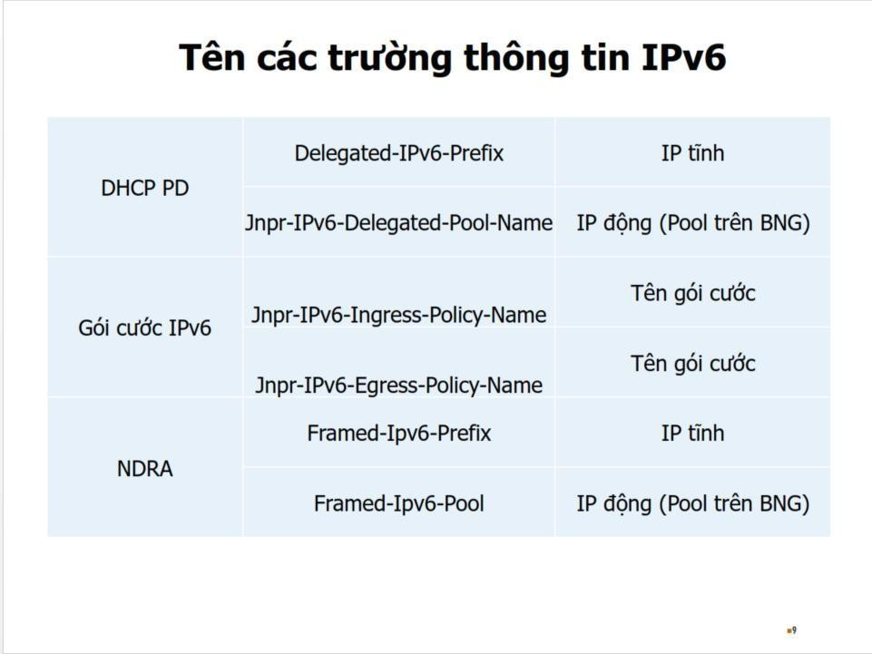

```text
show auto-configuration out-of-band debug
```

```text
show shmlog entries logname all | match BBE\_AUTOCONF\_I\_OOB\_SESSION\_INFLIGHT\_OR\_PENDING
```

https://supportportal.juniper.net/s/article/MX-Username-filtering-of-shmlog-entries-for-l2tp-subscribers?language=en\_US

With the following additional configuration:

```text
set system services subscriber-management overrides shmlog filtering enable
```

After reconnecting the L2TP session, the filtering based on username works:

```text
root@router> show shmlog entries logname all username test@j.net | count
```

```text
Count: 778 lines
```

```text
root@router>
```

* *KB34539** [Subscriber Management] Enhanced subscriber management failing to commit when configured for the first time

* *PR1732216** 'max-db-size' configuration is optional in routers having DRAM greater than or equals to 32GB

* *KB24107** [Subscriber Management] Troubleshooting High CPU spikes

* *KB83936** [Subscriber Management] How to calculate subscriber accounting statistics with Radius accounting packet

* *KB78723** Port mirror and analyzer configuration assistance subscriber management dynamic-profile.

* *KB78224** Juniper MX BNG: PPPoE Session Establishment Fails after CPE side power failure event

```text
[Subscriber Management]Subscriber login failure due to NACK from CoS sent for request, error code: 0x06010001
```

* *KB74250** [Subscriber Management]Subscriber login failure due to Cos resource is exhausted

Check if your system uses the Junos Subscriber Management (JSM) feature, ensure that the /var directory has at least 5GB of free space. Keeping 40% or more of the filesystem size available is recommended.

## Source: `formatted/Recommends/Giới hạn số lượng phiên của một khách hàng trên BRAS Juniper (session-limit-per-username).md`

# Giới hạn số lượng phiên của một khách hàng trên BRAS Juniper (session-limit-per-username)

Anh gửi CV chi tiết về lỗi này nhé. Liên quan đến lỗi này cũng như workaround anh xin phép summarize lại như sau

* *Điều kiện bị hit lỗi**

- Sử dụng Junos OS version 18.4R3-S7
- Có sử dụng tính năng limit session trên BRAS (session-limit-per-username)

* *Trigger:**

- Khi thực hiện bất kỳ thay đổi cấu hình nào liên quan đến BRAS (ví dụ khai báo pool, bật trace-options cho các process như authen hay dhcpv6), và có commit. Khi lỗi xảy ra thì BRAS sẽ không cấp được IPv6 cho các thuê bao mới.

* *Cách kiểm tra khi bị lỗi:**

- Để xác định box có bị hit lỗi hay không sau khi thực hiện commit, có thể sử dụng câu lệnh như sau

|  |
| --- |
| juniper@NAN-PE1\_RE0> show network-access aaa statistics  session-limit-per-username detail | last 5  Oct 11 17:20:06  vt9996                 local                0                      1  vt9997                 local                0                      1  vt9998                 local                0                      1  vt9999                 local                0                      1  **local               0                     1**          >>> Entry  này chỉ xuất hiện khi gặp lỗi |

* *Work around:**

- Để khôi phục lại việc cấp phát DHCPv6, có thể restart lại process smg bằng câu lệnh như dưới đây.

|  |
| --- |
| juniper@NAN-PE1\_RE0> restart smg-service gracefully |

Lưu ý: Sau khi restart smg-service, cần chờ khoảng 2-3 phút để thiết bị có thể cấp phát lại DHCPv6 như bình thường. SVT đã test thử nhiều lần trong lab với điều kiện khoảng 80K thuê bao, disable các trace-options, thì thời gian khoảng từ 45-70s. Quá trình restart smg service không thấy ảnh hưởng gì đến các thuê bao hiện tại.

* *Verify lại trạng thái của box**

|  |
| --- |
| juniper@NAN-PE1\_RE0> show network-access aaa statistics  session-limit-per-username detail | last 5  Oct 11 20:28:58  vt9995                 local                0                      1  vt9996                 local                0                      1  vt9997                 local                0                      1  vt9998                 local                0                      1  vt9999                 local                0                      1 |

Vậy bên anh báo lại để Minh cùng các anh chị Viettel trao đổi và xem xét thêm về WA này nhé.
