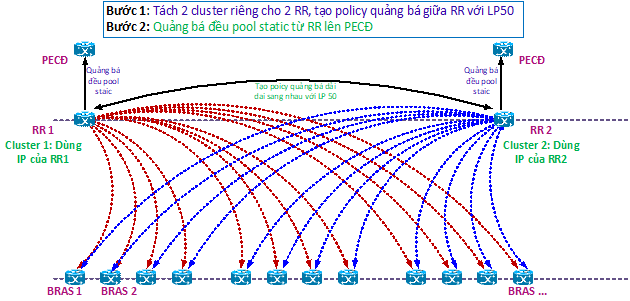

# BGP Route Reflector Case Study

> Generated deterministically from the approved grouping manifest.

## Source: `formatted/TS_notes/Tối ưu BRAS RR Juniper Viettel.md`

# Tối ưu BRAS RR Juniper Viettel

Hiện BRAS RR Viettel tại các KV đang gặp 2 vấn đề

- 1 BRAS tỉnh mất 1 trong 2 phiên tới RR sẽ gây mất dịch vụ cho các khách hàng IP tĩnh
- Chết 1 RR sẽ gây mất dịch vụ cho các khách hàng chưa được quảng bá đều Pool IP tĩnh từ 2 RR lên PECĐ

Các anh xem và đánh giá các đề xuất sau của Viettel có đảm bảo hệ thống sẽ hoạt động theo đúng đề xuất thiết kế ko ? các anh góp ý và phản hồi về sự ảnh hưởng đến hiệu năng, năng lực (nếu có) ? và cho đề xuất template triển khai

Đề nghị các anh phản hồi sớm trước 27/6 do đây là rủi ro tiềm ẩn bất cứ lúc nào sẽ ảnh hưởng dịch vụ của khách hàng FTTH, để Viettel lên kế hoạch khắc phục rủi ro sớm nhất

Cụ thể các nội dung đề xuất của Viettel như sau:

Vấn đề 1:

1 BRAS tỉnh mất 1 trong 2 phiên tới RR sẽ gây mất dịch vụ cho các khách hàng IP tĩnh

Đề xuất: Hiện các BRAS tỉnh đang có 2 phiên BGP lên 2 RR, 2 RR chạy chung 1 cluster => để 2 RR chạy trên 2 cluster khác nhau để học route, khi RR mất phiên BGP tới BRAS tỉnh thì RR sẽ học được route qua RR còn lại, đảm bảo traffic chiều về không bị ảnh hưởng.

Vấn đề 2:

Chết 1 RR sẽ gây mất dịch vụ cho các khách hàng chưa được quảng bá đều Pool IP tĩnh từ 2 RR lên PECĐ

Đề xuất xử lý:

Hiện 2 RR đang không quảng bá đều Pool IP tĩnh lên PECĐ, khi chết 1 RR sẽ gây mất dịch vụ cho các khách hàng thuộc Pool IP tĩnh chưa được quảng bá đều => quảng bá đều Pool IP tĩnh trên cả 2 RR

Mô hình đề xuất chung:

