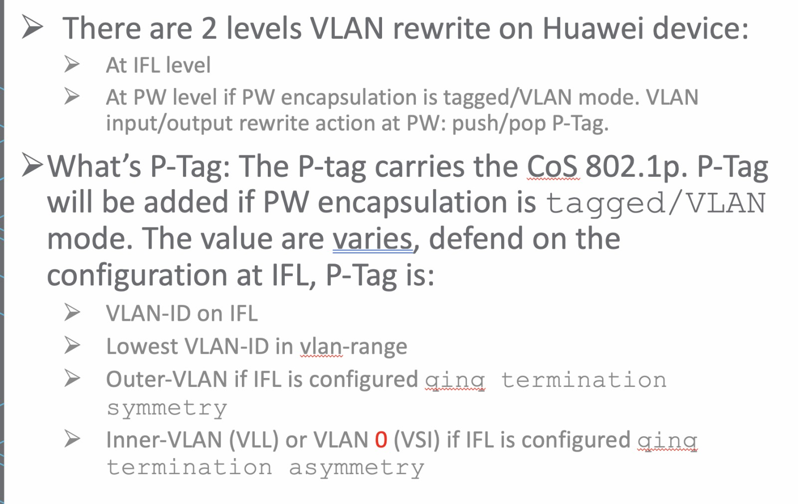

# Huawei VLAN Manipulation

## Source: `formatted/TS_notes/Huawei vlan manipulation.md`

## 1. Two Levels of VLAN Rewrite on Huawei Devices
- **At IFL (Logical Interface) Level**
- **At PW (Pseudowire) Level**: Applies when PW encapsulation is in tagged/VLAN mode.
  - **VLAN input/Output rewrite actions at PW**: push/pop P-Tag.

## 2. What is P-Tag?
The **P-Tag** carries the **CoS 802.1p** information. It is added when PW encapsulation is set to tagged/VLAN mode. 

The value of the P-Tag varies depending on the configuration at the IFL. The P-Tag can be:
- **VLAN-ID** on IFL
- **Lowest VLAN-ID** in `vlan-range`
- **Outer-VLAN** if IFL is configured with `qinq termination symmetry`
- **Inner-VLAN** (VLL) or **VLAN 0** (VSI) if IFL is configured with `qinq termination asymmetry`

---

