# MPLS LDP Fundamentals & Label Behavior

> Generated deterministically from the approved grouping manifest.


## Source: `formatted/Learning_Notes/LDP-tunnelling and hidden routes in inet.3.md`

# LDP-tunnelling and hidden routes in inet.3


## Source: `formatted/Learning_Notes/No more doubt with LDP.md`

# No more doubt with LDP

<https://www.inetzero.com/no-more-doubt-about-ldp/>

This article will focus on the LDP protocol. Although this protocol is quite simple, I often had some doubts about some LDP Junos commands and behaviours. This is the aim of this new article:  clarify basic LDP stuffs.

To speak about LDP configuration on Junos, we will use this very simple and atypical topology. The IGP is OSPF (a single area) and LDP is activated only on physical interfaces.

[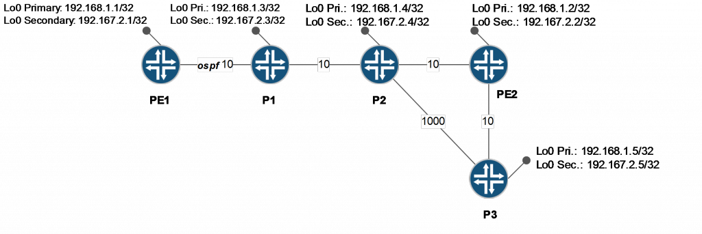](http://inetzero.com/wp-content/uploads/2014/06/ldp-1.png)

As you can see, each router has 2 loopback addresses. The basic configuration of each router is the following:

[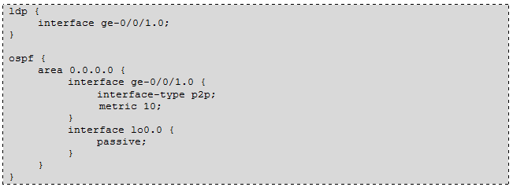](http://inetzero.com/wp-content/uploads/2014/06/ldp-2.png)The first analysis that we are going to cover is the LDP neighbour discovery and session establishment. On Point to Point links, I mean, between 2 adjacent routers, an LDP router discovers its neighbours by sending periodic multicast LDP Hello Discovery messages (based on UDP protocol port 646). Once 2 routers see each other as neighbour, they start to establish a TCP session (Port 646). This TCP session will be then used to exchange FEC/Label Mapping.

```text
By default on Junos, a router will only map a Label for its primary loopback Interface. It means that an LDP router is by default Egress PE only for its /32 primary lo0 address. Moreover, remember that by default LDP on Junos works in Downstream Unsolicited (DU) mode – Ordered Label (OL) distribution. OL means that a router allocates a Label to a specific FEC only if it received a Label mapping from the downstream node(s) before. Therefore only the Egress PE which own the FEC  will be the initiator of the first Label mapping for its FEC. Then, subsequently, other routers may allocate and map a Label to this FEC. A router sends a Label Mapping for a given FEC toward all its neighbours (even the downstream router that sent it the FEC – aka. there is no split horizon with LDP). On Junos the same Label is allocated for a FEC for all Interfaces.
```
[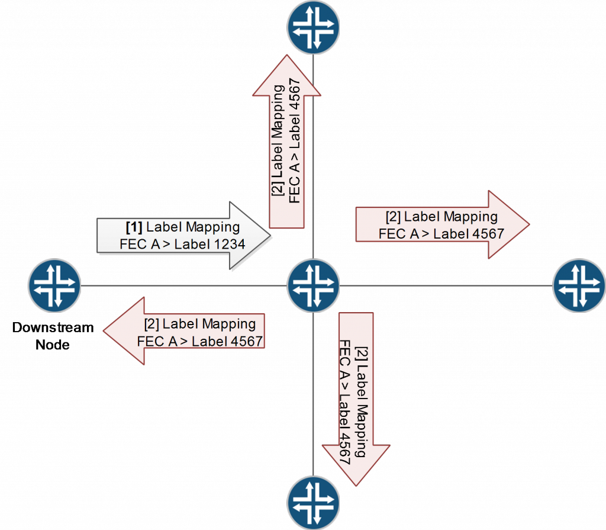](http://inetzero.com/wp-content/uploads/2014/06/ldp-22.png)Other important thing, LDP forwarding exactly follows IGP forwarding. With this constraint, an exact match of the IP address of the FEC will be needed in the IGP routing table. In other words, to allocate a label for a /32, this specific /32 should be known in the IGP routing table. A more specific prefix will be not allowed. The LDP specification is quite cleared about this last point:

An LSR receiving a Label Mapping message from a downstream LSR for a

Prefix SHOULD NOT use the label for forwarding unless its routing

table contains an entry that exactly matches the FEC Element.

Typically, in our topology, if P1 router receives a label mapping from PE1 lo0 address. It will accept it only if it knows the PE1 lo0 address (the exact /32 – not a smaller prefix) in its routing table. In our case it will accept the label mapping because lo0 addresses are well exchanged in our network via OSPF.

LDP session establishment:

We consider now that all LDP / OSPF adjacencies are UP and stables in our topology except one LDP relationship between PE1 and P1 which is still down. PE1 is a stub router so in this case it is not aware of any Label Mappings.

Now let’s set up the LDP protocol on PE1 interface and analyse on P1 the LDP packets:

[1] PE1 sends LDP Hello message in multicast. Its packet includes some configurable parameters as the LDP UDP neighbour Dead Timer: Hold time (by default 15s) and the IPv4 Transport Address (Default is lo0 primary address), the one used to establish the LDP TCP session.

P1 sends back its parameters in UDP multicast as well. And finally both routers consider that they are neighbours (LDP Discovery mechanism is a simple 2 way handshake).

[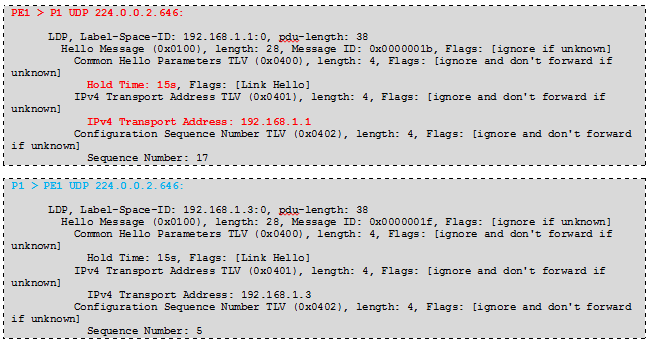](http://inetzero.com/wp-content/uploads/2014/06/ldp-3.png)Note: To override those default parameters you can use those following commands:

[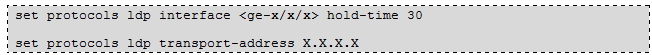](http://inetzero.com/wp-content/uploads/2014/06/ldp-9.png)

[2] PE1 and P1 establish between them a TCP session and start to exchange the LDP session parameters:

[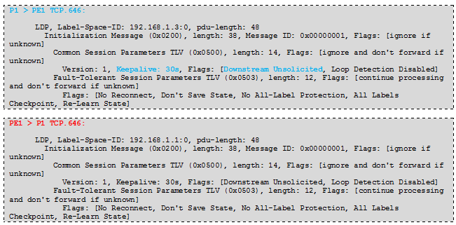](http://inetzero.com/wp-content/uploads/2014/06/ldp-4.png)

The both routers are configured by default in Downstream Unsolicited mode.The TCP session allows to exchange LDP Keepalive-timeout (30 seconds by default – so it means a keepalive every 9 seconds). This last parameter is also configurable in 2 ways:

[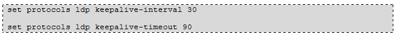](http://inetzero.com/wp-content/uploads/2014/06/ldp-10.png)

[3] PE1 starts to exchange Label Mapping. As it is a stub router with only this new LDP session UP it only advertises its FEC (by default only the primary Loopback Address). Moreover, it allocates the reserved label “3” to this FEC because PE1 is the Egress PE for its own lo0 address. “3” means Implicit Null Label which actually means to P1: you are the Penultimate Hop Popping (PHP) router for this FEC, if you need to forward MPLS to me (PE1 lo0), pop the top label before sending the frame. Implicit null label is the default behaviour on Junos router. We will see later how to override it.

[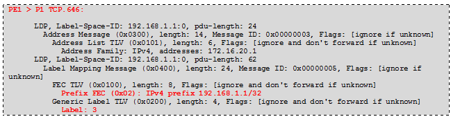](http://inetzero.com/wp-content/uploads/2014/06/ldp-5.png)

```text
[4] P1 sends also its Label Mapping. In this case P1 is not a stub router and it has already Label Mapping received from downstream nodes (P2, P3, PE2). It sends mapping for the P2, P3, PE2 FEC and also for the FEC for which it is the Egress PE, Its lo0 address (It also allocates implicit null label (3) for its own IP address).
```
[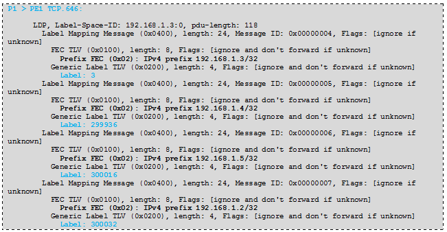](http://inetzero.com/wp-content/uploads/2014/06/ldp-6.png)

[5] PE1 can now send back to P1 Label Mapping for the FEC: P1, P2, P3 and PE2. Indeed, a downstream node sent to it a label mapping before. It can now do the same (remember the OL distribution):

[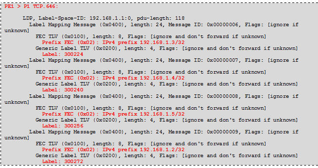](http://inetzero.com/wp-content/uploads/2014/06/ldp-7.png)

```text
[6] Finally P1 can also send back to PE1 a Label Mapping for the PE1 loopback Address as it previously received a label mapping for it coming from PE1 itself.
```
[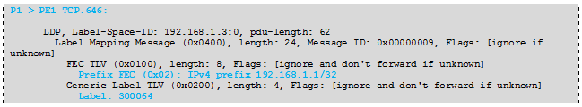](http://inetzero.com/wp-content/uploads/2014/06/ldp-8.png)Great! LDP is now synchronised between PE1 and P1. You can use the following commands to check all that we seen previously by analysing LDP packets:

Check LDP Discovery/Session on PE1:

[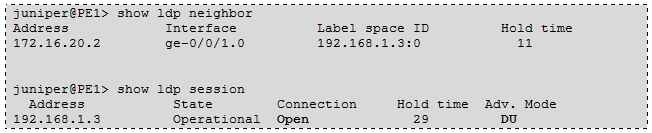](http://inetzero.com/wp-content/uploads/2014/06/ldp-11.png)Note: if the LDP neighbour comes down (UDP discovery phase,I mean.) the LDP session will be also shutdown automatically and all Label Mapping associated to this session will be released. In case of ECMP between 2 routers, you can have multiple UDP neighbours adjacencies (one per interface) but you will still have only one LDP TCP session. In case of ECMP, to shutdown automatically the TCP session the router wait to have lost all the neighbour discovery adjacencies before with the peer router.

Check LDP Database on PE1:

[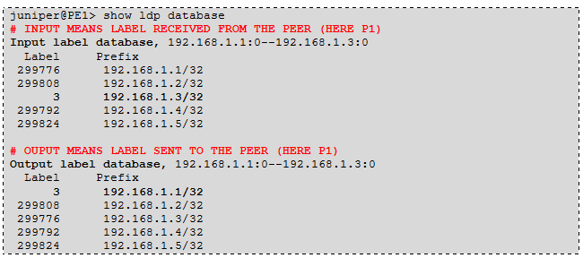](http://inetzero.com/wp-content/uploads/2014/06/ldp-12.png)And finally check LDP routes (remember LDP routes are put in the inet.3 table)

[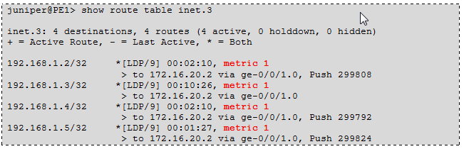](http://inetzero.com/wp-content/uploads/2014/06/ldp-13.png)

Track IGP Metric:

As you can see, the metric set for those LDP routes is always the same: 1. This is the default behaviour on Junos. To “keep” the IGP metric associated to the IP address of the FEC you need to configure this knob:

[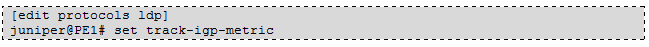](http://inetzero.com/wp-content/uploads/2014/06/ldp-142.png)Then call back the command to check the inet.3 routing table. Great! As you can see know LDP metrics are mapped to IGP metrics.

[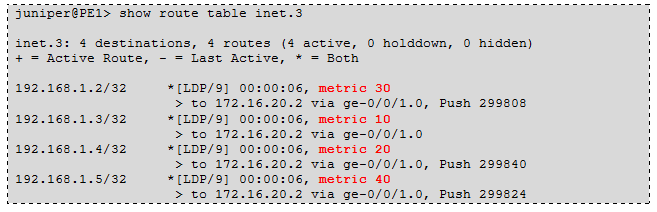](http://inetzero.com/wp-content/uploads/2014/06/ldp-151.png)

Egress Policy:

As we mentioned above, by default Junos triggers a label mapping only for its lo0 primary interface. Sometimes it could be interesting to have a kind of “dual control plane” with one IPv4 NH for inet.0 routes and one dedicated IPv4 NH for MPLS traffic. Usually to do that you use a separate lo0 address: the MPLS lo0 address. This is the case in our topology, we have assigned a secondary lo0 address to each routers.

Now, it’s time to modify the Egress-policy which manages what Egress routes will announce in LDP (Label Mapping). We simply create a policy-statement that matches only the secondary lo0 address and apply this policy as an LDP egress-policy. Let’s do the config on PE1:

[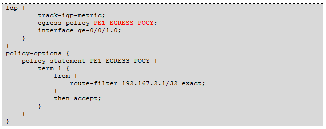](http://inetzero.com/wp-content/uploads/2014/06/ldp-183.png)Commit this and then check LDP Database of PE1:

[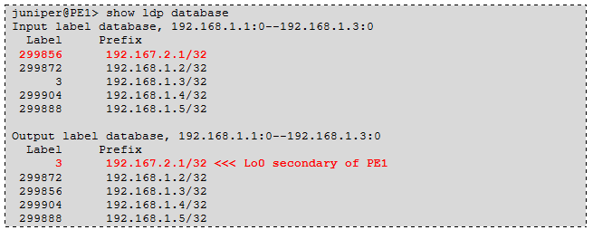](http://inetzero.com/wp-content/uploads/2014/06/ldp-23.png)Great! Now PE1 maps a label to its Secondary Lo0 address.

Note: P1 allocated also a label.

Export Policy:

You can also limit the global label Mapping of a given router to a specific range of IP addresses. In our case, if you want to use only Secondary addresses as MPLS loopback , you want to only allocate Label to this range of addresses. Let’s configure the PE1 export policy. We consider at this point that only PE1 is configure to advertise its Secondary Address. The other routers still advertise their primary address.

[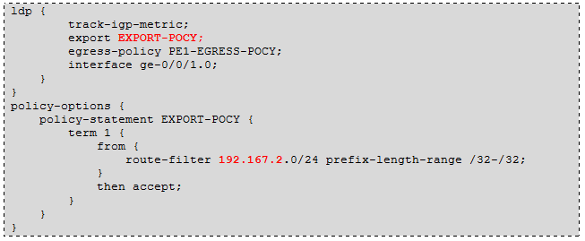](http://inetzero.com/wp-content/uploads/2014/06/ldp-205.png)So now, if all works fine, PE1 that receives Label Mapping from Downstream routers will “forward” Label Mapping to its neighbours only for IP Prefixes that match our EXPORT-POCY.  Nevertheless, PE1 still accepts the received label mapping and still installs them in inet.3. (Default LDP import policy is accept ALL)

Let’s check the PE1 LDP database:

[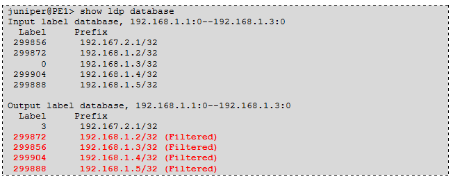](http://inetzero.com/wp-content/uploads/2014/06/ldp-218.png)This example explains well the usage of an LDP export policy. Even if PE1 still receives LDP Mapping from P1 and installs in inet.3, it stops to advertise, back, a Label for those FEC whose the IP address is not in the range of the EXPORT-POCY. Remember we have only modified the EGRESS policy on PE1 to force the router to advertise its Secondary instead of its primary address. This is why the Primary IP addresses of P1, P2, P3, PE2 are no more advertised by PE1.

Import Policy:

Now, let’s have a look to a knob not often used. By default the LDP import policy is accept all label mapping for all FEC (we only have the constraint of IP address of the FEC must but present as a specific route in the IGP routing table). If you want to filter some FEC coming from a remote neighbours you can use this import policy. Again we want to filter only FEC with IP address in the range of Secondary loopback addresses.

[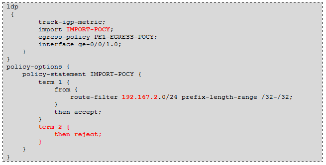](http://inetzero.com/wp-content/uploads/2014/06/ldp-24.png)The term2 reject all other routes that do not match the range 192.167.2.0/24 (remember the default import policy is accept all). No let’s commit this configuration on PE1 and check again the LDP database of this router:

[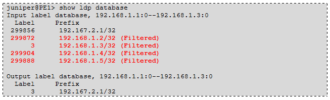](http://inetzero.com/wp-content/uploads/2014/06/ldp-25.png)The result is quite different with an Export policy. Indeed, as only PE1 advertises its Secondary address, the Label Mapping received from P1 concerns only Primary Addresses, except the PE1 label mapping sent back by P1. So, all those routes are filtered. This is also why PE1 sends only its Egress FEC. It can’t allocate a Label Mapping for a FEC that it didn’t receive and accept a Label mapping from a downstream router before. In this case the PE1 inet.3 routing table will be empty.

Let’s remove import and export policies and move on the next feature.

Deaggregate:

By default an Egress PE that advertises more than one Egress IP address aggregates those addresses in the same FEC. In other words it allocates a single label for all IP addresses. To illustrate this default behavior we configure PE1 to advertise both primary and secondary addresses. To do that we simply modify the EGRESS policy:

[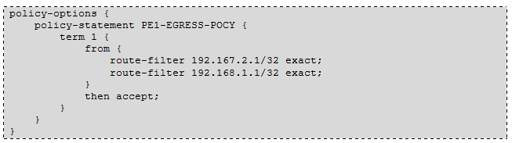](http://inetzero.com/wp-content/uploads/2014/06/ldp-26.png)By default, Junos aggregates in a single FEC. Let’s check on P1 its LDP database:

[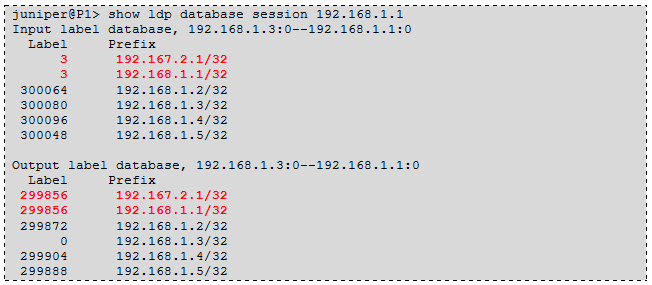](http://inetzero.com/wp-content/uploads/2014/06/ldp-27.png)As you can see, P1 receives from PE1 2 EGRESS IP addresses (map to implicit null label 3 because PE1 is egress PE for those 2 addresses), but the most interesting part is the label allocated back by P1 for those 2 addresses. As you can see, P1 “aggregates” the 2 IPs addresses in a single FEC and allocates the same label (299856).

Now let’s try to configure the deaggregate knob on P1 like that:

[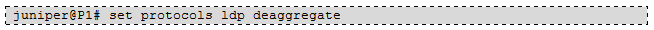](http://inetzero.com/wp-content/uploads/2014/06/ldp-28.png)and have a look gain on P1 LDP database:

[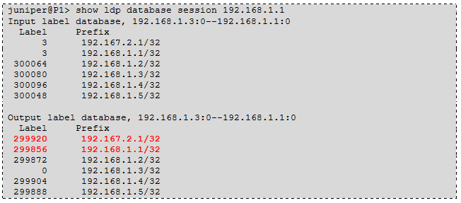](http://inetzero.com/wp-content/uploads/2014/06/ldp-29.png)

As you can see, P1 now advertises one label per PE1 IP prefix. It means that it allocates one FEC per PE1 IP addresses.

Explicit-Null Label:

As we mentioned previously an Egress PE sends by default its own FEC with an implicit Null label 3. This notifies its neighbours  that they are a PHP router for those FEC.  In some configuration you may want to keep MPLS Top label from Ingress PE to Egress PE (for example to keep end to end MPLS QoS marking (EXP field) of the MPLS transport layer). To do that an Egress PE can advertise an Explicit Null Label for its own FECs. This label has a reserved value of 0 and unlike the label 3 which implicitly “says” to the PHP router: PoP the top label, label 0 is a real Label push/swap by the PHP router (which is not a real PHP any more, with this explicit-null knob).

Let’s configure Explicit-null label on P1:

[](http://inetzero.com/wp-content/uploads/2014/06/ldp-30.png)Now, you can check on PE1 the LDP Database and the inet.3 table:

[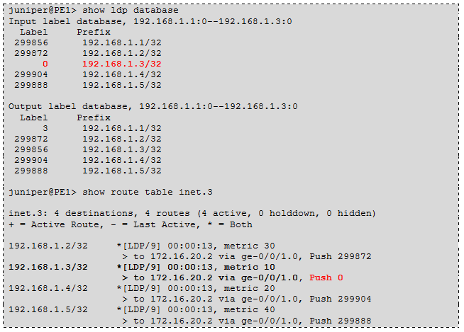](http://inetzero.com/wp-content/uploads/2014/06/ldp31-.png)Now P1 allocates a label of 0 for its primary loopback address. To reach the P1 Next-hop, PE1 will explicitly push the label 0.

LDP IGP Synchronization:

LDP/IGP Synchronization is a useful knob to minimize MPLS traffic Blackholing when LDP flaps without IGP or when IGP converges more quickly than LDP. LDP sync. is a local knob that automatically increases the IGP metric of the IGP adjacency until the LDP session is stable.  For Junos, a LDP session is stable when it has sent all its Label Mapping on this given LDP Session.  2 cases can be encountered:

- A single LDP discovery adjacency between 2 routers:  this case can be seen when there is a single link between those 2 routers or in case of LAG. If the LDP adjacency (UDP one) comes down, then the session will be closed and an infinite metric will be sent for the IGP adjacency through the IGP.
- ECMP between 2 routers. In this case there is one LDP discovery adjacency per interface and only one TCP session between the 2 neighbours. If one of the adjacencies comes down, the LDP session stays UP but Junos “removes”  automatically the faulty adjacency of the topology by sending an infinite metric for it.

Junos supports LDP synchronization for ISIS and OSPF. Let’s configure LDP / OSPF synchronization on P2 (on the P1/P2 link)

[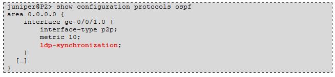](http://inetzero.com/wp-content/uploads/2014/06/ldp-32.png)Now we disable LDP on P1 but we keep OSPF UP. On P2 the LDP session comes down:

[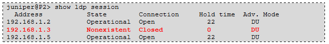](http://inetzero.com/wp-content/uploads/2014/06/ldp-33.png)Let’s check the P2 OSPF LSAs – you can see that the adjacency of P1 is now assigned to an infinite metric. The “show route ” confirms also the right behaviour:

[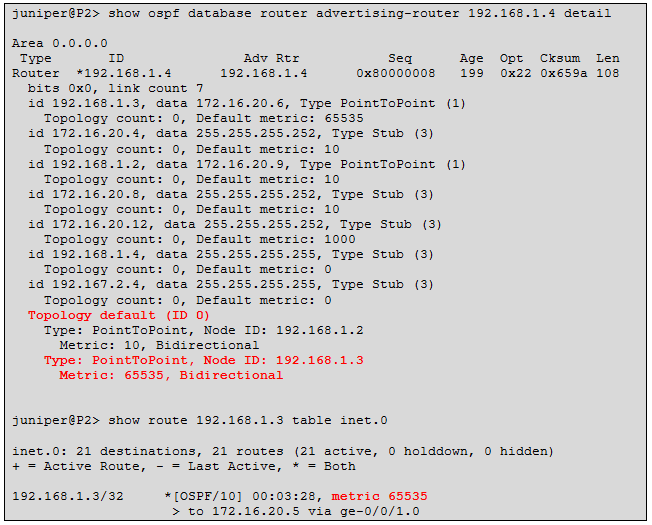](http://inetzero.com/wp-content/uploads/2014/06/ldp-34.png)

LDP Session Protection:

The last feature that we will cover in this article is the LDP Session Protection.

When LDP Discovery adjacency flaps between 2 routers (without ECMP) or when the physical path between 2 routers flaps, the LDP session and the Label mapping associated is reset. To keep the session UP and its associated Label mapping during link flaps or other network events that could affect the LDP session, you can configure the LDP session protection mechanism. This capability is negotiated between the LDP Session Establishment and allows to accelerate the LDP convergence time after a failure recovery.

```text
To activate LDP session protection just add this following knob but also add the lo0 interface within the ldp configuration. Indeed, by default LDP discovery phase uses IP packets with TTL=1. This does not allow to maintain the UDP discovery adjacency when the direct path/link between 2 routers failed. (Note: The TCP LDP session uses a TTL > 1 by default).
```
In our example we want to protect LDP session between P2 and PE2. We configure on both routers those 2 commands:

[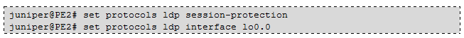](http://inetzero.com/wp-content/uploads/2014/06/ldp-35.png)Note: you can specify the number of seconds before the LDP session is torn down and resignaled. To do that, use the parameter “timeout” behind the session-protection knob.

Now we can check back the LDP Discovery adjacencies on PE2:

[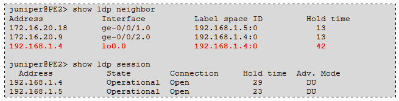](http://inetzero.com/wp-content/uploads/2014/06/ldp-36.png)

As you can see, PE2 has now 2 Classical LDP Discovery adjacencies with (P2 and P3) but also a specific LDP Discovery Adjacency with again P2 but in this last case the LDP Discovery adj. is established between loopback addresses to exchange “Targeted Hellos”. Moreover, you can notice that we keep only 2 LDP TCP sessions (one per neighbour).

Now, it’s time to shutdown the link between P2 and PE2. We shut down the link on P2:

[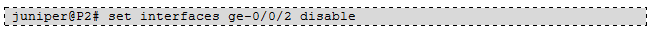](http://inetzero.com/wp-content/uploads/2014/06/ldp-37.png)Now, check back, LDP Discovery adj. LDP session and LDP database on PE2:

[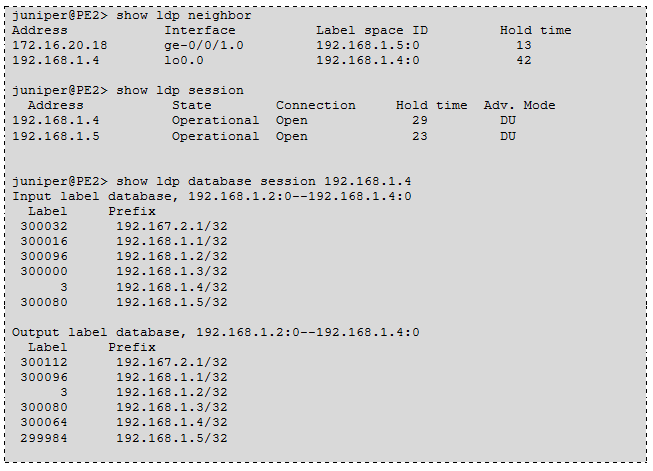](http://inetzero.com/wp-content/uploads/2014/06/ldp-38.png)Great, all works as expected. Only the classical/Direct Discovery adjacency between PE2 and P2 has disappeared. The Lo0 Discovery Adj stays up, because targeted hellos are sent through the “backup” path PE2P3P2 (possible because TTL is upper than 1 in this case). The LDP TCP session between PE2 and P2 is still up and the database has not been flushed. when link between PE2 / P2 will come back up only the direct discovery adj. will be re-established and that all, PE2 and P2 will be already synchronized.

Conclusion:

LDP is a very simple protocol and closely linked to the IGP. We do not cover all the features that allows Junos. For example this post did not mention LDP Fast ReRoute as well as LDP Shortcut… But the aim of this article was to cover basic LDP stuffs to really well understand how it works. Now, you have the skills to test more complex architectures and advanced LDP features with the Inetzero JNCIE-SP books and labs.

## Source: `formatted/TS_notes/LDP.md`

# LDP

* *show ldp database**

```text
show configuration protocols ldp | display inheritance no-comments
show isis adjacency
show ospf neighbor
show route <118.69.255.211>
run show mpls lsp name 118.69.255.254>
show ldp protection route <192.168.0.1> extensive
show l2circuit connections history
show l2circuit connections instance-history
```

## Source: `formatted/TS_notes/Label usage.md`

# Label usage

```text
show mpls label usage
show mpls label usage label-range 1 1048575
```

## Source: `formatted/TS_notes/ldp-tunneling or BGP-LU (swap label 0 behavior change from 19.x.md`

# ldp-tunneling or BGP-LU (swap label 0 behavior change from 19.x


