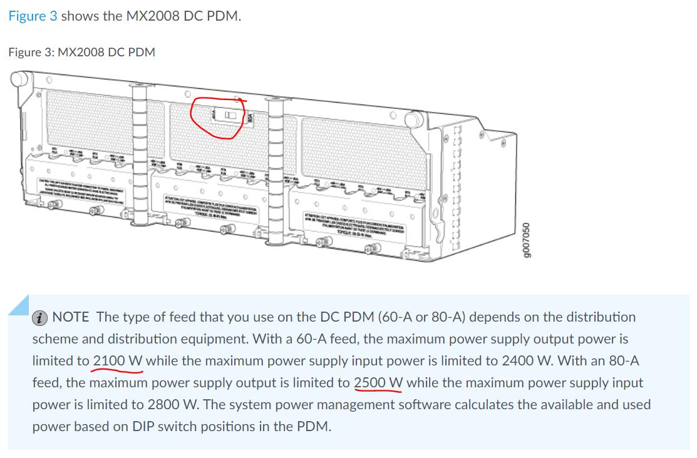

# MPC Insertion, Removal and Power Notes

> Generated deterministically from the approved grouping manifest.

## Source: `formatted/Best_Practise/MX2008.md`

# MX2008

Các box MX2008 mình cắm card MPC theo các slot ưu tiên là 2-4-6 nhé.

Ngoài quy tắc ưu tiên cắm card theo vị trí 2-4-6 ra, em note thêm là nếu cắm cả 2 card MIC trên cùng 1 FPC thì sẽ cắm MIC theo ưu tiên như sau:

- MIC công suất thấp sẽ cắm ở MIC 0 (MIC port 1Gig, MIC port 10Gig)

- MIC công suất cao sẽ cắm ở vị trí MIC 1 (MIC port 100Gig)

- Nếu chỉ có duy nhất 1 MIC được cắm trên 1 card FPC, thì sẽ ưu tiên cắm MIC ở vị trí MIC 1.

Lưu ý về nguồn cho MX2008,

- Để đảm bảo công suất tối đa của PSM (output 2500W), cần sử dụng input 80A & chỉnh DIP switch tương ứng trên PDM.

- input 60A chỉ cho ra công suất output 2100W, input 80A chỉ cho ra công suất output 2500W

==> cách chỉnh dipswitch trên MX2008, vui lòng theo hình/ link tham khảo

https://www.juniper.net/documentation/en\_US/release-independent/junos/topics/topic-map/mx2008-dc-power-system.html
