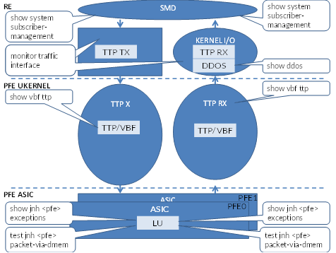

# BRAS PPPoE Subscriber Troubleshooting

> Generated deterministically from the approved grouping manifest.


## Source: `formatted/TS_notes/BRAS - TROUBLESHOOTING PPPoE in TOMCAT.md`

# BRAS - TROUBLESHOOTING PPPoE in TOMCAT

JunOS Troubleshooting Tools

```text
CLI commands
Traceoptions
Shmlogs
Tcpdump
Shell outputs
```
- should be used in case if other tools doesn’t give a clue about an issue

- Live core

```text
Non service-affecting
Contains s snapshot of the process state at the moment of creating
**Should be generated only on JTAC request**
```
CLI Commands (1/11)

```text
Basic Tomcat health check
show system subscriber-management summary
```
root@ams\_bng1\_re> show system subscriber-management summary

General:

Graceful Restart    Enabled

Mastership          Master

Database            Available

Standby              Resync (100%)

```text
Chassisd ISSU State  IDLE
ISSU State          IDLE
```
ISSU Wait            0

```text
show system subscriber-management status
```
- shows thread information

root@ams\_bng1\_re> show system subscriber-management status

Subscriber management enabled

BBE\_SMGD\_PARENT thread\_id = 0xa416080

BBE SMGD WORKER thread\_id = 0xa416300

BBE SMD WORKER  thread\_id = 0xa416580

BBE SCHEDULER  thread\_id = 0xa416800

BBE IO          thread\_id = 0xa416a80

last cli locker thread\_id = 0xa416580, lock count = 0

```text
show system subscriber-management info
hidden command
shows run-time configuration state
```
root@ams\_bng1\_re> show system subscriber-management info

Session Manager started @    Thu Mar  7 16:56:21 2019

Session Manager cleared @    Thu Mar  7 16:56:21 2019

```text
gres state enabled state                  1
commit sync enabled state                1
nsr state enabled state                  1
gratuitous arp disable state              0
gratuitous nd disable state              0
nd override preferred src enable state    0
force dynamic nd state                    0
unsolicted ra disabled state              0
force ra unicast dst enabled state        0
unsolicted mlr disabled state            0
shmlog disabled state                    0
vc backup member local switch state      0
```
cold start enabled                        0

```text
force show arp no resolve state          0
arp-ping liveness detection enabled state 0
ipv6-nud liveness detection enabled state 0
gratuitous arp recv proc enabled state    0
ipoe dynamic arp enabled state            0
```
CLI commands (2/11)

```text
show subscribers
```
- different filters to check subscriber’s status
- “summary” knob to check subscribers counter per chassis, slot, port, routing instance
- “extensive” knob gives subscriber’s RADIUS attributes and provides VBF flow ID:

```text
lab@BNG-01> show subscribers summary all
Subscribers by State
Active: 18
Total: 18
```
Subscribers by Client Type

```text
VLAN: 2
PPPoE: 16
Total: 18
```
Subscribers by LS:RI

```text
default: 2
```
default:VR-CGNAT: 16

```text
Total: 18
lab@BNG-01> show subscribers summary port
```
Interface          Count

ae5: xe-0/1/2      16

ae5: xe-0/1/5      16

ae5: xe-0/1/7      16

Total Subscribers: 16

```text
PPPoE statistics
```
- Aggregate statistics: show pppoe statistics
- Per underlying interface: show pppoe underlying-interfaces  extensive

```text
lab@BNG-01> show pppoe statistics
```
Active PPPoE sessions: 16

```text
PacketType                      Sent        Received
```
PADI                              0            3752

PADO                            112                0

PADR                              0              112

PADS                            112                0

PADT                            96                5

```text
Service name error                0                0
AC system error                  0                0
Generic error                    0                0
```
Malformed packets                0                0

Unknown packets                  0                0

```text
lab@BNG-01> show pppoe underlying-interfaces extensive
```
demux0.3221225686 Index 536871166

```text
State: Dynamic, Dynamic Profile: PPPoE-PROFILES,
```
Max Sessions: 32000, Max Sessions VSA Ignore: Off,

Active Sessions: 8,

Service Name Table: None,

Duplicate Protection: On, Short Cycle Protection: mac-address,

Direct Connect: Off,

AC Name: BNG-01,

```text
PacketType                      Sent        Received
```
PADI                              0            1855

PADO                            56                0

PADR                              0              56

PADS                            56                0

PADT                            48                2

Lockout Time (sec):  Min: 5, Max: 900

Total clients in lockout: 0

Total clients in lockout grace period: 0

```text
show pppoe interfaces brief
```
- Allows to obtain underlying interface name and PPPoE session ID
- Interface name can be an argument in the command

```text
lab@BNG-01> show pppoe interfaces brief
Interface      Underlying            State      Session    Remote
```
interface                        ID        MAC

pp0.3221225727  demux0.3221225686    Session Up  10        50:09:00:0A:00:02

pp0.3221225728  demux0.3221225687    Session Up  7          50:09:00:0E:00:03

pp0.3221225729  demux0.3221225687    Session Up  12        50:09:00:0E:00:06

pp0.3221225730  demux0.3221225687    Session Up  13        50:09:00:0E:00:04

pp0.3221225731  demux0.3221225686    Session Up  16        50:09:00:0A:00:07

pp0.3221225732  demux0.3221225686    Session Up  4          50:09:00:0A:00:03

pp0.3221225733  demux0.3221225686    Session Up  6          50:09:00:0A:00:00

pp0.3221225734  demux0.3221225687    Session Up  1          50:09:00:0E:00:01

pp0.3221225735  demux0.3221225687    Session Up  14        50:09:00:0E:00:07

pp0.3221225736  demux0.3221225686    Session Up  2          50:09:00:0A:00:05

pp0.3221225737  demux0.3221225686    Session Up  5          50:09:00:0A:00:04

pp0.3221225738  demux0.3221225687    Session Up  8          50:09:00:0E:00:05

pp0.3221225739  demux0.3221225687    Session Up  3          50:09:00:0E:00:02

pp0.3221225740  demux0.3221225686    Session Up  9          50:09:00:0A:00:01

pp0.3221225741  demux0.3221225687    Session Up  11        50:09:00:0E:00:00

pp0.3221225742  demux0.3221225686    Session Up  15        50:09:00:0A:00:06

```text
show pppoe lockout
```
- Underlying interface can be an argument in the command

root@ams\_bng1\_re> show subscribers user-name u1@orange.pl extensive | match PFE

PFE Flow ID: 112 <<<< VBF flow ID
- **show pppoe lockout | match "VLAN|lockout:"**

```text
lab@BNG-01> show pppoe lockout
```
demux0.3221225686 Index 536871166

Device: ae5, VLAN: 100

Short Cycle Protection: mac-address,

demux0.3221225687 Index 536871167

Device: ae5, VLAN: 200

```text
lab@BNG-01> show subscribers user-name MIK1-V\_100-HSI2 extensive | match PFE
```
PFE Flow ID: 308

CLI commands (3/11)

```text
lab@BNG-01> show system subscriber-management statistics ppp
```
Session Manager started @ Wed Jun 16 06:29:43 2021

Session Manager cleared @ Wed Jun 16 06:29:43 2021

- -------------------------------------------------------------

Packet Statistics

I/O Statistics:

Rx Statistics

packets                          : 77909

invalid ifls                    : 1

unsupported udp protocols        : 6914

Tx Statistics

packets                          : 1212

Layer 3 Statistics

packets                          : 47461

packets                          : 0

PPP Statistics:

network packets                  : 809

plugin packets                  : 809

lcp config requests              : 118

lcp config acks                  : 112

lcp termination requests        : 3

pap requests                    : 112

ipcp requests                    : 228

ipcp acks                        : 112

ipv6cp requests                  : 4

unknown protocols                : 120

packets                          : 892

lcp config requests              : 114

lcp config acks                  : 114

lcp config rejects              : 4

lcp termination requests        : 93

lcp termination acks            : 3

pap acks                        : 112

ipcp requests                    : 112

ipcp nacks                      : 112

ipcp config rejects              : 4

NET Statistics:

ARP Statistics

```text
request packets                  : 0
```
reply packets                    : 0

invalid iffs                    : 64

reply packets                    : 0

```text
request packets                  : 0
```
CLI commands (4/11)

```text
show ppp interface
```
- Gives brief information about states of different phases
- “extensive” knob gives more information:

```text
lab@BNG-01> show ppp interface pp0.3221225736 extensive
```
Session pp0.3221225736, Type: PPP, Phase: Network

Keepalive settings: Interval 60 seconds, Up-count 1, Down-count 3

Magic-Number validation: enable

LCP

```text
State: Opened
```
Last started: 2021-06-16 11:53:41 UTC

Last completed: 2021-06-16 11:53:41 UTC

Negotiated options:

Authentication protocol: pap, Magic number: 301491486, Initial Advertised MRU: 1492, Local MRU: 1492, Peer MRU: 1480

Authentication: PAP

```text
State: Grant
```
Last started: 2021-06-16 11:53:41 UTC

IPCP

Local address: 10.126.0.1, Remote address: 10.126.0.107

Negotiation mode: Passive

CLI command (5/11)

```text
show interface
lab@BNG-01> show interfaces pp0.3221225736
```
Logical interface pp0.3221225736 (Index 536871216) (SNMP ifIndex 200000304)

Flags: Up Point-To-Point Encapsulation: PPPoE

PPPoE:

```text
State: SessionUp, Session ID: 2,
```
Session AC name: BNG-01, Remote MAC address: 50:09:00:0a:00:05,

Underlying interface: demux0.3221225686 (Index 536871166)

Ignore End-Of-List tag: Disable

Link:

xe-0/1/2.32767

xe-0/1/5.32767

xe-0/1/7.32767

Input packets : 968

Output packets: 845

Keepalive settings: Interval 60 seconds, Up-count 3, Down-count 3

```text
LCP state: Opened
NCP state: inet: Opened, inet6: Not-configured, iso: Not-configured, mpls: Not-configured
CHAP state: Closed
PAP state: Success
```
Protocol inet, MTU: 1480

Max nh cache: 0, New hold nh limit: 0, Curr nh cnt: 0, Curr new hold cnt: 0, NH drop cnt: 0

Flags: Unnumbered

Donor interface: lo0.13 (Index 71)

Addresses, Flags: Is-Primary

```text
Local: 10.126.0.1
```
CLI commands (6/11)

```text
show network-access aaa statistics
```
- Brief stats about RADIUS communication
- “detail” knob gives more information about reasons of failures:

```text
lab@BNG-01> show network-access aaa statistics authentication detail
```
Authentication module statistics

```text
Requests received: 0
Accepts: 0
Rejects: 0
```
RADIUS authentication failures: 0

Queue request deleted: 0

Malformed reply: 0

No server configured: 0

Access Profile configuration not found: 0

Unable to create client record: 0

Unable to create client request: 0

Unable to build authentication request: 0

No available server: 0

Unable to create handle: 0

Unable to queue request: 0

Invalid credentials: 0

Malformed request: 0

License unavailable: 0

Redirect requested: 0

Internal failure: 0

Local authentication failures: 0

LDAP lookup failures: 0

```text
Challenges: 0
```
Timed out requests: 0

```text
lab@BNG-01> show network-access aaa statistics accounting detail
```
Accounting module statistics

```text
Requests received: 0
```
Accounting request failures: 0

Accounting request success: 0

Account on requests: 0

Accounting start requests: 0

Accounting interim requests: 0

Accounting stop requests: 0

Timed out requests: 0

Accounting response failures: 0

Accounting response success: 0

Account on responses: 0

Accounting start responses: 0

Accounting interim responses: 0

Accounting stop responses: 0

Accounting rollover requests: 0

Accounting unknown responses: 0

Accounting radius pending requests: 0

Accounting malformed responses: 0

Accounting retransmissions: 0

Accounting bad authenticators: 0

```text
Accounting packets dropped: 0
```
Accounting backup record creation requests: 0

Accounting backup request replay success: 0

Accounting backup request failures: 0

Accounting backup request success: 0

Accounting backup timeouts: 0

Accounting backup in-flight requests: 0

Accounting backup responses success: 0

Accounting backup radius requests: 0

Accounting backup radius responses: 0

Accounting backup radius timeouts: 0

Accounting backup radius pending requests: 0

Accounting backup radius retransmissions: 0

Accounting backup malformed responses: 0

Accounting backup bad authenticators: 0

```text
Accounting backup responses dropped: 0
```
Accounting backup rollover requests: 0

Accounting backup unknown responses: 0

CLI commands (7/11)

```text
show network-access aaa terminate-code brief
```
- Shows aggregate counters explaining subscribers’ disconnect reasons
- Most popular codes: https://kb.juniper.net/InfoCenter/index?page=content&id=KB33598

|  |  |  |
| --- | --- | --- |
| Event | Type | Code |
| CLI command "clear pppoe sessions" | ppp | lower-interface-down |
| CLI command "clear network access aaa username" | aaa | shutdown-admin-reset |
| CPE sent PADT | ppp | lower-interface-down |
| CPE sent LCP TermReq | ppp | lcp-peer-terminate-term-req |
| No response received for LCP keepalive requests sent by MX | ppp | lcp-keepalive-failure |

root@ams\_bng1\_re> show network-access aaa terminate-code brief

Terminate-code:

RADIUS    Custom Usage-Count Type Code

5          no    3          aaa  shutdown-session-timeout

1          no    62          ppp  lcp-peer-terminate-protocol-reject

1          no    10          ppp  lcp-peer-terminate-term-req

2          no    3          ppp  lower-interface-down

CLI Commands (8/11)

- Subscriber’s route has “Private Unicast Next-Hop” in ‘show route’ output:

```text
lab@BNG-01> show route 10.126.0.102
VR-CGNAT.inet.0: 22 destinations, 22 routes (22 active, 0 holddown, 0 hidden)
```
+ = Active Route, - = Last Active, \* = Both

10. 126.0.102/32    \*[Access-internal/12] 02:11:44

Private unicast

- To define physical next-hop, use ‘show system subscriber-management route’ command

```text
lab@BNG-01> show system subscriber-management route prefix 10.126.0.102
Route:  10.126.0.102/32
```
Routing-instance:        default:VR-CGNAT

Kernel rt-table id :      5

Family:                  AF\_INET

Route Type:              Access-internal

Protocol Type:            Unspecified

Interface:                pp0.3221225731

Interface index:          299

Internal Interface index: 299

Route index:              101

Next-Hop index:          616

```text
Reference-count:          1
```
L2 Address:              50:09:00:0a:00:07

```text
Flags:                    0x0
```
CLI Commands (9/11)

```text
Show class-of-service scheduler-hierarchy interface
Shows actual programming of CoS on the subscriber’s interface
```
root@ams\_bng2\_re> show class-of-service scheduler-hierarchy interface pp0.3221941191

Interface/                        Shaping Guaranteed Guaranteed/  Queue  Excess

```text
Resource name                      rate      rate        Excess  weight  weight
```
kbits    kbits        priority          high/low

xe-0/0/5:0                        10000000

xe-0/0/5:0 RTP                  10000000        0                  1    1

best-effort                    10000000        0      Low  Low          95

network-control                10000000        0      Low  Low            5

pp0.3221941191                  2000            0                    500  500

business                      2000            0      Low  Low          95

network-control                2000            0      High High            5

CLI Commands (10/11)

```text
show dynamic-configuration session information session-id
display detailed information about dynamic variables and Radius-Returned values
```
root@ams\_bng1\_re> show dynamic-configuration session information session-id 79

Session info:

Accounting session ID: 79

IP address: 10.0.0.1

IP netmask: 255.255.255.255

Logical system name: default

Profile name: DP-PPPOE-NEO$$02

Session version: 3

Physical IFD name of the interface: ae2

MAC address: 56:58:2d:8b:00:00

NAS port type: 15

Routing instance: VR-NEO

Access Profile: ACP-CUA

User name: u1@orange.pl

Interface IFD Name: pp0

Interface name: pp0.3221225550

Unit number of the interface: 3221225550

```text
Dynamic-configuration state: 2
```
Client session type: 64

IFL type: 2

Accounting type: 2

Accounting interval: 0

Underlying logical-interface: demux0.1021001

Client login time: 2019-03-14 07:55:45 CET

Session start time: 572480.690062

VLAN tag: 1001

Service Type: 2

Framed Protocol: 1

Calling station id: cbr\_bng101#

```text
Advisory options upstream rate: 0
Advisory options downstream rate: 0
```
NAS port: 1001

Interface set: ae2-1001

Next Hop MAC address: 56:58:2d:8b:00:00

Next Hop Ipv6 MAC address: 56:58:2d:8b:00:00

Configuration bits: 0xff 0xc0

Dynamic configuration:

TCP-NEO-QOS-GENERIC-PROFILE: TCP-NEO-QOS-GENERIC-PROFILE\_UID1013

```text
dyn\_TCP-NEO-QOS-GENERIC-PROFILE: 0795e8c9c6fae9746bba5052d36dca02
```
junos-cos-scheduler-map: SCM-B2B-DATA-ONLY

```text
junos-cos-shaping-rate: 2M
junos-cos-shaping-rate-burst: 2M
```
junos-input-filter: FF-V4-NEO-DSL-50M-IN

junos-output-filter: FF-V4-NEO-32K-VOIP-OUT

junos-routing-instance: VR-NEO

junos-tagged-vlan-interface-set-name: ae2-1001

junos-underlying-interface: demux0.1021001

CLI Commands (11/11)

```text
show dynamic-profile session client-id
lab@BNG-01> show dynamic-profile session client-id 1
```
SINGLE-VLAN {

routing-instances {

default {

interface demux0.3221225472;

}

interfaces {

demux0 {

no-traps;

unit 3221225472 {

vlan-id 100;

demux-options {

underlying-interface ae5;

family {

```text
pppoe {
```
access-concentrator BNG-01;

duplicate-protection;

dynamic-profile PPPoE-PROFILES;

short-cycle-protection {

lockout-time-min 5;

lockout-time-max 900;

- --

Traceoptions

- In vast majority of the situation bbe-smgd logs are needed together with protocol logs:

```text
set system processes general-authentication-service traceoptions file debug\_gauthd
set system processes general-authentication-service traceoptions file size 10m
set system processes general-authentication-service traceoptions file files 10
set system processes general-authentication-service traceoptions flag all
set system processes smg-service traceoptions file debug\_bbe-smgd
set system processes smg-service traceoptions file size 10m
set system processes smg-service traceoptions file files 10
set system processes smg-service traceoptions level all
set system processes smg-service traceoptions flag all
set protocols ppp-service traceoptions file debug\_ppp
set protocols ppp-service traceoptions file size 10m
set protocols ppp-service traceoptions file files 10
set protocols ppp-service traceoptions level all
set protocols ppp-service traceoptions flag all
set protocols pppoe traceoptions file debug\_pppoe
set protocols pppoe traceoptions file size 10m
set protocols pppoe traceoptions file files 10
set protocols pppoe traceoptions level all
set protocols pppoe traceoptions flag all
set system services dhcp-local-server traceoptions file debug\_dhcp
set system services dhcp-local-server traceoptions file size 10m
set system services dhcp-local-server traceoptions file files 10
set system services dhcp-local-server traceoptions flag all
```
- -

### DHCP new traceoption

```text
set system processes dhcp-service traceoptions file debug\_dhcp
set system processes dhcp-service traceoptions file size 10m
set system processes dhcp-service traceoptions file files 10
set system processes dhcp-service traceoptions flag all
```
- --

```text
clear log debug\_gauthd all
clear log debug\_bbe-smgd all
clear log debug\_ppp all
clear log debug\_pppoe all
clear log debug\_dhcp all
```
- That’s possible to filter events related to only one subscriber using “filter user” knob

- Example: set system processes general-authentication-service traceoptions filter user [u1@orange.pl](mailto:u1@orange.pl)
- Useful for initial analyze of the issue
- Normally CFTS will ask level all/flag all without filter

Shmlogs (1/3)

- Junos OS uses a shared memory space to store log entries for subscriber service daemons, such as:

- bbe-smgd
- jpppd
- authd
- cosd,
- dfwd.

- Enabled by default
- Contains similar information as daemon traceoptions

- Key advantage is that all daemon logs are present by default whereas traceoptions must be explicitly enabled
- Writing shmlogs in memory does not slow down the system compared to writing traceoptions files to disk

Shmlogs (2/3)

- Can be displayed from CLI

root@ams\_bng1\_re> show shmlog entries logname

- Shmlogs entries filtering functionality is subscriber centric i.e. filter per subscriber specific logs.

```text
> show shmlog entries logname all | match "session\_id=1"
```
- Events can be filtered for particular daemon log

- Example: logname jpppd\* or logname authd\*

- If interested in the events happened in a specific time entries may be filtered as:

root@ams\_bng1\_re> show shmlog entries logname all start-from-latest-?

start-from-latest-days  Show entries starting with specified duration from latest(1..1000000000)

start-from-latest-hours  Show entries starting with specified duration from latest (1..1000000000)

start-from-latest-minutes  Show entries starting with specified duration from latest (1..1000000000)

start-from-latest-seconds  Show entries starting with specified duration from latest (1..1000000000)

Shmlogs (3/3)

- Shmlogs statistics can be displayed from CLI

```text
> show shmlog statistics logname
```
- Stores aggregated statistics about events happened on the router
- Contains information about events, number of occurrence the particular event and timestamp of last event

- root@ams\_bng1\_re> show shmlog statistics logname all

bbe-debug            statistics... (wrapped count =          0)

id id name                                                              last\_log\_date\_time          log\_cnt      notlog\_cnt        total\_cnt

4 BBE\_MESSAGE\_ENQUEUE                                                                                    0              12

6 BBE\_MESSAGE\_DEQUEUE                                                                                    0              12

- Important source of information about abnormalities during troubleshooting process

Subscriber’s HOST RECEIVE/TRANSMIT PATH



Capture subscriber’s control packets on RE level

root@ams\_bng1\_re> monitor traffic interface demux0.1021001 matching "ether host 56:58:2d:8b:00:00"

verbose output suppressed, use  or  for full protocol decode

Address resolution is ON. Use  to avoid any reverse lookup delay.

Address resolution timeout is 4s.

Listening on demux0.1021001, capture size 96 bytes

```text
15:23:15.666304  In PPPoE PADI
15:23:15.667966 Out PPPoE PADO [AC-Name "ams\_bng1\_re"] [Service-Name] [AC-Cookie UTF8]
15:23:15.731384  In PPPoE PADR [Service-Name] [AC-Cookie UTF8]
15:23:15.734075 Out PPPoE PADS [ses 1] [Service-Name] [AC-Name "ams\_bng1\_re"] [AC-Cookie UTF8]
15:23:15.803997 Out PPPoE  [ses 1]LCP, Conf-Request (0x01), id 54, length 21
15:23:15.810060  In PPPoE  [ses 1]LCP, Conf-Request (0x01), id 0, length 16
15:23:15.810626 Out PPPoE  [ses 1]LCP, Conf-Ack (0x02), id 0, length 16
15:23:15.843885  In PPPoE  [ses 1]LCP, Conf-Nack (0x03), id 54, length 10
15:23:15.844520 Out PPPoE  [ses 1]LCP, Conf-Request (0x01), id 55, length 21
15:23:15.953335  In PPPoE  [ses 1]LCP, Conf-Ack (0x02), id 55, length 21
15:23:15.954706 Out PPPoE  [ses 1]CHAP, Challenge (0x01), id 163, Value cc121a30f59566e5c03924d37c249f234372b4b45b0ccbd190, Name JUNOS
15:23:16.036460  In PPPoE  [ses 1]CHAP, Response (0x02), id 163, Value 9edf1d25a67432569e9b35458c4e2d6d, Name u1@orange.pl
15:23:16.158802 Out PPPoE  [ses 1]CHAP, Success (0x03), id 163, Msg
15:23:16.187564  In PPPoE  [ses 1]IPCP, Conf-Request (0x01), id 0, length 12
15:23:16.188347 Out PPPoE  [ses 1]IPCP, Conf-Request (0x01), id 242, length 12
15:23:16.188461 Out PPPoE  [ses 1]IPCP, Conf-Nack (0x03), id 0, length 12
15:23:16.190952  In PPPoE  [ses 1]IPCP, Conf-Ack (0x02), id 242, length 12
15:23:16.190957  In PPPoE  [ses 1]IPCP, Conf-Request (0x01), id 1, length 12
15:23:16.348215 Out PPPoE  [ses 1]IPCP, Conf-Ack (0x02), id 1, length 12
```
- Packet capture on interface downlink

```text
monitor traffic interface ae0 matching "ether host 00:1d:aa:9b:71:31" no-resolve detail|extensive
monitor traffic interface xe-0/0/0 matching "ether host 54:A6:78:CA:00:00" size 1500 extensive write-file PPPOE-capture.pcap
monitor traffic interface ae3 extensive matching "ether host 4c:d9:8f:ff:c8:ed" no-resolve extensive size 9000 /var/tmp/ECC-BDH2.pcap
```
capture SUBSCRIBERS’S PACKET on PFE level

- PFE complex number based on the physical interface and MPC Type
- Do it in production with caution only if it is absolutely necessary
- Pattern can be any string uniquely identify the packet (subscriber’s MAC address in that case)
- By default pattern searched in the first 32 bytes
- If pattern locates after that value, offset must be defined
- Do not forget to turn feature off after capturing

```text
test jnh 0 packet-via-dmem disable
```
VMX-0(ams\_bng1\_re vty)# test jnh 0 packet-via-dmem disable

VMX-0(ams\_bng1\_re vty)# test jnh 0 packet-via-dmem enable 16000

VMX-0(ams\_bng1\_re vty)# test jnh 0 packet-via-dmem capture 0x3 0x56582d8b0000 0

VMX-0(ams\_bng1\_re vty)# test jnh 0 packet-via-dmem capture 0

VMX-0(ams\_bng1\_re vty)# test jnh 0 packet-via-dmem dump

```text
Wallclock: 0x47859a3c
Received 74 byte parcel:
```
Dispatch cookie: 0x004a000000000000

0x00 0x00 0xc0 0x30 0x14 0x08 0xff 0xff

0xff 0xff 0xff 0xff 0x56 0x58 0x2d 0x8b

0x00 0x00 0x81 0x00 0x23 0xe9 0x88 0x63

0x11 0x09 0x00 0x00 0x00 0x04 0x01 0x01

0x00 0x00 0x00 0x00 0x00 0x00 0x00 0x00

0x00 0x00

VMX-0(ams\_bng1\_re vty)# test jnh 0 packet-via-dmem disable

High CPU utilization of the bbe-smgd process

- It might happens a situation that bbe-smgd process has 100% of CPU utilization

root@ams\_bng1\_re> show system processes extensive | match bbe-smgd

89544 root          8  46    0  957M  504M uwait  2  1:24 100.00% bbe-smgd

- Usually caused by software bug and service-affecting
- Better to engage JTAC for live troubleshooting
- If live troubleshooting is not possible and service needs to be restored quickly please collect from RE shell as root user

root@ams\_bng1\_re:~ # vty -s 7208 128.0.0.1

```text
show smd throttle ###collect output at least 3 times with 1 minute time interval
```
- from RE shell as a root user collect bbe-smgd live core at least two times with 1 minute interval

# gcore -s -c bbesmgd.live.core.0 `cat /var/run/bbe-smgd.pid`

- From CLI collect twice with 1 minute interval:

```text
> show shmlog statistics logname all | save /var/log/jtac-shmlog-stats.log.0
> show shmlog entries logname all | save /var/log/jtac-shmlog-entries.log
```
- Normally issue resolves after restarting bbe-smgd:

root@ams\_bng1\_re> restart smg-service

Wrong CHAP Password Configured on CPE

```text
Step 1: check for amount of Access Reject received from RADIUS:
```
root@ams\_bng1\_re> show network-access aaa statistics authentication

Authentication module statistics

```text
Requests received: 99
Accepts: 89
Rejects: 10
Challenges: 0
```
Timed out requests: 0

- Alternatively can be found in shmlogs:

root@ams\_bng1\_re> show shmlog statistics logname all | match Fail

148 chapTxFailure                                    Mar 14 16:41:47.624765              15                0

256 authNotifySessionResponseFail                    Mar 14 16:41:47.624527              15                0

- Step 2: Check authd to confirm that it is related to problematic subscriber:

root@ams\_bng1\_re> show log debug\_gauthd | match "username|reject"

Mar 14 16:42:59.605918 authd\_radius\_build\_basic\_auth\_request: session-id:123 profile=ACP-CUA, username=u2@orange.pl

Mar 14 16:43:00.608711 authd\_radius\_callback: RADIUS server sent an ACCESS\_REJECT, failing login for session-id:123

```text
Wrong FIREWALL PARAMETERS received from Radius
```
- Step 1: check shmlogs statistics for any uncommon amount failures. Failures related to this situation are:

109 BBE\_DPROF\_GET\_SERVICE\_FLAG\_FAILED                                Mar 14 17:00:44.251969                8                0

296 dynProfActNakFail                                                Mar 14 17:00:44.346802                8                0

392 sesSubscriberActivateFailed                                      Mar 14 17:00:44.346954                8                0

- Step 2: check shmlogs entries:

root@ams\_bng1\_re> show shmlog entries logname bbe-dfw-\* start-from-latest-minutes 5 | match ERR

bbe-dfw-prio            254 Mar 14 17:00:44.251891 BBE\_DFW\_DYN\_PROF\_ERR\_STR      session\_id=167: Can't find filter template named FF-V4-NEO-32K-VOIP-OU.

```text
bbe-dfw-prio            255 Mar 14 17:00:44.251898 BBE\_DFW\_DYN\_PROF\_ERR\_CODE  session\_id=167: Error code 13 (config err TRUE): Filter template not found.
```
- Step 3: confirm that logs belong to the problematic subscriber:

root@ams\_bng1\_re> show log jtac-authd.log | match "session-id:167" | match username

Mar 14 17:00:43.604816 authd\_radius\_build\_basic\_auth\_request: session-id:167 profile=ACP-CUA, username=u1@orange.pl

Mar 14 17:00:44.194294 authd\_radius\_send\_acctg\_msg: session-id:167 profile=ACP-CUA username=u1@orange.pl acctg\_id=(167), ls=default, lr=default

```text
Clear Subscriber’s Session
clear pppoe session interface
clear network-access aaa subscriber username
request system subscriber-management release-session id
```
- Hidden command of last resort to clear stuck session
- Forcibly clears the client session

- Pre-installed op script to collect information about stuck session

- Usage: op url /usr/libexec/scripts/op/bbe\_debug.slax sessionid
- Stores collected information at /var/tmp/subscribers\_debug\_sid\_session\_id\_cleanup.tar.gz
- Forcibly clears the client session

```text
show route 203.113.131.2 | no-more
show route 203.113.131.2 extensive | no-more
show route forwarding-table destination 203.113.131.2 | no-more
show route forwarding-table destination 203.113.131.2 extensive | no-more
```
- --

1. First test is to validate the PADI packet capture on PFE for GOOD connection on ae81.

```text
>start shell pfe network FPC2
test jnh 0 packet-via-dmem disable
test jnh 0 packet-via-dmem enable
test jnh 0 packet-via-dmem capture 0x3 0x  20
test jnh 0 packet-via-dmem capture 0x0
test jnh 0 packet-via-dmem dump
test jnh 0 packet-via-dmem disable
```
- --

flow-detection

global {

flow-detection;

```text
flow-report-rate 100;
```
flow-detection-mode off;  ###GLOBAL OFF

protocols {  #### ON FOR SPECIFIC PROTOCOLS

icmp {

aggregate {

flow-detection-mode automatic;

flow-level-control {

subscriber keep;  ### KEEP FOR AVOID BUG AND NOT DROP BY POLICY

logical-interface keep;

physical-interface keep;

```text
lab@batman-re0> show configuration groups debug
```
system {

kernel-replication {

traceoptions {

```text
file ksyncd size 100m;
```
level detail;

flag all;

services {

subscriber-management-helper {

```text
file subshelper.log;
```
flag all;

subscriber-management {

```text
file subs.log;
```
flag all;

flag database;

flag session-db;

flag general;

auto-configuration {

```text
file autoconfd.log size 10m;
```
flag all;

processes {

general-authentication-service {

```text
file authd.log size 100m files 2;
```
flag all;

dhcp-service {

```text
file jdhcpd.log size 150m files 2;
```
flag all;

```text
file dcd.log size 100m files 2;
```
flag all;

```text
lab@batman-re0> show configuration apply-groups
```
## Last commit: 2012-06-13 13:45:24 EST by lab

apply-groups [ anz-defaults member0-re0 member0-re1 member1-re0 member1-re1 debug ];    <------ apply the debug group here

## Source: `formatted/TS_notes/BRAS - command ouputs.md`

# BRAS - command ouputs

Dạ anh Tú,

Em xin summary case này như sau:

+ khoảng chục thuê bao có hiện trạng online chậm, ghi nhận vào thời điểm 20h-21h

Nhờ anh Tú gửi thêm giúp em các thông tin dưới đây anh nhé:

+ Các output: (thực hiện trước khi lấy varlog)

```text
show shmlog entries logname all | save  /var/log/shmentries1.txt
show shmlog statistics logname all | save /var/log/shmstatistics1.txt
```
+ RSI brief, varlog của box.

+ Graph CPU, memory của RE, linecard 1 ngày trở lại đây.

Bên em có thể sẽ cần onsite **vào thời điểm lỗi** này ngày mai để lấy thông tin, các thông tin cần lấy theo các bước dưới đây:

1. **Xác định thuê bao lỗi.**

2. **Traceoptions of authd/pppoe/ppp/smgd trong vòng 10 phút**

```text
set system processes general-authentication-service traceoptions file trace\_general-authentication
set system processes general-authentication-service traceoptions file size 50m
set system processes general-authentication-service traceoptions file files 10
set system processes general-authentication-service traceoptions flag all
set system processes smg-service traceoptions file trace\_smg-service
set system processes smg-service traceoptions file size 100m
set system processes smg-service traceoptions file files 10
set system processes smg-service traceoptions level all
set system processes smg-service traceoptions flag all
set protocols ppp-service traceoptions file trace\_ppp-service
set protocols ppp-service traceoptions file size 50m
set protocols ppp-service traceoptions file files 10
set protocols ppp-service traceoptions flag all
set protocols ppp-service traceoptions level all
set protocols pppoe traceoptions file trace\_pppoe
set protocols pppoe traceoptions file size 50m
set protocols pppoe traceoptions file files 10
set protocols pppoe traceoptions flag all
set protocols pppoe traceoptions level all
```
3. **Monitor traffic**

```text
monitor traffic interface *interface\_name* matching "ether host *subscriber\_mac*" extensive
```
4. **Các log dưới shell, linecard nếu cần thiết**

5. **Shmlogs atleast for 2 iterations.**

Command to collect shmlogs :

```text
show shmlog entries logname all | save  /var/tmp/shmentries1.txt
show shmlog statistics logname all | save /var/tmp/shmstatistics1.txt
```
wait for a 2 minutes and collect

```text
show shmlog entries logname all | save  /var/tmp/shmentries2.txt
show shmlog statistics logname all | save /var/tmp/shmstatistics2.txt
```
6. **CLI logs :  ( the logging could change based on the issue) here are logs to start with.**

```text
set cli timestamp
show subscribers summary | no-more
show subscribers summary port | no-more
show subscribers summary slot | no-more
show subscribers summary all | no-more
show system alarms | no-more
show chassis fpc |no-more
show chassis fpc detail | no-more
show chassis alarms | no-more
show chassis routing-engine | no-more
show system subscriber-management info  | no-more
show system subscriber-management summary | no-more
show system subscriber-management detail | no-more
show system subscriber-management statistics all extensive | no-more
show system configuration database usage | no-more
show shm-ipc statistics | no-more
show shmlog statistics logname all | match fail | no-more
show shmlog statistics logname all | match err | no-more
show system resource-monitor summary | no-more
show system process extensive |no-more
show pppoe statistics | no-more
show pppoe statistics | no-more
show ddos-protection protocols violations | no-more
show ddos-protection protocols statistics terse | no-more
show ddos-protection protocols pppoe padi | no-more
show ddos-protection protocols pppoe | no-more
clear pppoe statistics
show pppoe statistics | no-more
show pppoe statistics | no-more
show subscribers summary | no-more
show subscribers summary port | no-more
show subscribers summary slot | no-more
show subscribers summary | no-more
show system subscriber-management statistics all extensive | no-more
show shm-ipc statistics | no-more
```
start shell csh command "vty -c 'show smd throttle' -s 7208 128.0.0.1"

```text
show system subscriber-management statistics all extensive | no-more
show network-access aaa terminate-code brief | no-more
show network-access aaa terminate-code detail | no-more
show network-access aaa statistics address-assignment pool ftth\_private routing-instance VRF\_CGNAT | no-more
show network-access aaa statistics authentication detail | no-more
show network-access aaa statistics radius queue-info | no-more
show network-access aaa statistics radius detail | no-more
show network-access aaa statistics accounting detail | no-more
show network-access aaa statistics authentication detail | no-more
show network-access memory-pools | no-more
show subscribers summary | no-more
show pppoe statistics | no-more
show ppp statistics detail | no-more
show pppoe statistics | no-more
show ppp statistics detail | no-more
show shmlog statistics logname all | match fail | no-more
show shmlog statistics logname all | match err | no-more
show subscribers summary | no-more
show subscribers summary port | no-more
show subscribers summary slot | no-more
show subscribers summary | no-more
show system subscriber-management statistics all extensive | no-more
show shm-ipc statistics | no-more
show system process extensive |no-more
show ddos-protection protocols statistics terse | no-more
```
start shell csh command "vty -c 'show smd throttle' -s 7208 128.0.0.1"

```text
show network-access aaa statistics address-assignment pool ftth\_private routing-instance VRF\_CGNAT | no-more
show network-access aaa statistics authentication detail | no-more
show network-access aaa statistics radius queue-info | no-more
show network-access aaa statistics radius detail | no-more
show network-access aaa statistics accounting detail | no-more
show network-access aaa statistics authentication detail | no-more
show accounting pending-accounting-stops brief | no-more
```
* *Clear the stats and collect again for 2 iterations.**

```text
clear shmlog entries logname all
clear shmlog statistics logname all
clear network-access aaa statistics radius
clear network-access aaa statistics accounting
clear network-access aaa statistics authentication
clear network-access aaa statistics terminate-code
clear ppp statistics
clear pppoe statistics
```

## Source: `formatted/TS_notes/Command check user bras pppoe stuck.md`

# Command check user bras pppoe stuck

Kịch bản công việc xử lý lỗi một số thuê bao không cutout được trên BPC8003BRA01

###### ###############################

1. Thực hiện thu thập thông tin các user bị treo:

```text
show subscribers physical-interface ae14 vlan-id 2036
show subscribers summary routing-instance
show subscribers username b651\_ipp\_hungcttxms extensive
show subscribers username b651\_ipp\_namcttcv1 extensive
show subscribers username b651\_gftth\_phuoccncttnmtv4 extensive
show subscribers username b651\_gftth\_doicnvbptdvtq90 extensive
show subscribers username b651\_gftth\_vietteltctcpbc16 extensive
show subscribers username b651\_gftth\_doivbpcntdcntq extensive
```
###### ###############################

2. Thực hiện thu thập baseline thiết bị:

```text
set cli timestamp
set cli screen-width 300
```
/\* Lưu thông tin cấu hình và RSI \*/

```text
request support information brief | no-more | save /var/log/rsi\_before\_BPC8003BRA01\_20210415
show configuration |  no-more | save /var/tmp/configuration\_BPC8003BRA01\_20210415
```
/\* Lưu thông tin alarm/core \*/

```text
show version detail  | no-more
show version invoke-on all-routing-engines | no-more
show version invoke-on all-routing-engines | match "Junos:|RE" | no-more
show system core-dumps no-forwarding  | no-more
show chassis alarms no-forwarding  | no-more
show system processes extensive no-forwarding  | no-more
show pfe statistics error  | no-more
show chassis routing-engine no-forwarding  | no-more
show chassis environment no-forwarding  | no-more
show chassis fpc detail  | no-more
show chassis fabric summary  | no-more
show chassis fabric fpcs  | no-more
show chassis fabric plan  | no-more
```
/\* Lưu thông tin về OSPF  version 2 \*/

```text
show ospf interface  | no-more
show ospf interface | count  | no-more
show ospf hostname | no-more
show ospf adjacency  | no-more
show ospf adjacency | count  | no-more
```
/\* Lưu thông tin về OSPF version 3 \*/

```text
show ospf3 interface  | no-more
show ospf3 interface | count  | no-more
show ospf3 hostname | no-more
show ospf3 adjacency  | no-more
show ospf3 adjacency | count | no-more
```
/\* Lưu thông tin về MPLS/LDP/RSVP \*/ -> không chạy MPLS

/\* Lưu thông tin về BGP \*/

```text
show bgp summary  | no-more
show bgp neighbor  | no-more
show route summary | no-more
```
/\* Lưu thông tin về Multicast \*/ -> không chạy Multicast

/\* Lưu thông tin LLDP/BFD \*/

```text
show lldp neighbors  | no-more
show bfd session detail  | no-more
```
/\* Lưu thông tin hardware/fabric/fpc \*/

```text
show chassis hardware  | no-more
show chassis fabric fpcs  | no-more
show chassis fabric summary extended  | no-more
show chassis fabric plane  | no-more
```
/\* Lưu thông tin đồng bộ GRES and NSR - KB32931  \*/

```text
> Go to the Backup RE:
request routing-engine login backup
show system switchover | no-more
show task replication  | no-more
show database-replication summary | no-more
> Nhớ thoát để trở về RE master (RE0)
```
exit

```text
show system switchover | no-more
show task replication  | no-more
show database-replication summary | no-more
request chassis routing-engine master switch check | no-more
show system subscriber-management summary | no-more
show chassis routing-engine | no-more
```
###### ###############################

3. Thực hiện thực hiện thu thập các thông tin liên quan đến user đang bị treo:

Debugging the stale pppoe sessions at the pfe.

```text
> show subscribers user-name  extensive
> start shell
```
Important Note: use the fpc number on which the problematic subscriber is active. Based on the subscriber extensive output that you shared, it is on ae4 which uses xe-8/x/x i.e fpc8. However, please verify this once

```text
% cprod -A fpc8 -c "show vbf flow" | grep ""
% cprod -A fpc8 -c "show vbf flow "
% cprod -A fpc8 -c "show jnh inline-ka session 0 ppp 1073751809" // thực hiện 10 lần
% cprod -A fpc8 -c "show jnh inline-ka session 1 ppp 1073751809" // thực hiện 10 lần
```
Repeat the commands 3) and 4) multiple times (say about 10 times) with a time gap of 10 seconds between each iteration.

```text
Run Commands 1) to 4) for few of the problematic pppoe sessions and share it with us.
```
- ---------------------------------------------------------------

Also, run the following commands for 2 iterations and share it with us. These are not specific to per subscriber.

```text
% cprod -A fpc8 -c "show jnh 0 exceptions terse"
% cprod -A fpc8 -c "show jnh 1 exceptions terse"
% cprod -A fpc8 -c "show jnh 0 ucode-vars"
% cprod -A fpc8 -c "show jnh 1 ucode-vars"
% cprod -A fpc8 -c "show jnh inline-ka summary"
% cprod -A fpc8 -c "show jnh inline-ka mgmt"
% cprod -A fpc8 -c "show jnh inline-ka session 0 ppp global-stats"
% cprod -A fpc8 -c "show jnh inline-ka session 1 ppp global-stats"
% cprod -A fpc8 -c "show jnh inline-ka session 0 ppp host-outbound-info"
% cprod -A fpc8 -c "show jnh inline-ka session 1 ppp host-outbound-info"
% cprod -A fpc8 -c "show jnh inline-ka pfe 0 steering stats”
% cprod -A fpc8 -c "show jnh inline-ka pfe 1 steering stats”
% cprod -A fpc8 -c "show jnh inline-ka pfe 0 ae-info”
% cprod -A fpc8 -c "show jnh inline-ka pfe 1 ae-info”
% cprod -A fpc8 -c "show vbf pfe-events"
% cprod -A fpc8 -c "show jnh host-path-stats"
% cprod -A fpc8 -c "show vbf flow pppoe summary"
```
###### ###############################

4. Bật traceoptions để thu thập log của các tiến trình liên quan:

```text
set system processes smg-service traceoptions file trace\_bbesmgd
set system processes smg-service traceoptions file size 10m
set system processes smg-service traceoptions file files 10
set system processes smg-service traceoptions level all
set system processes smg-service traceoptions flag all
set system processes general-authentication-service traceoptions file trace\_gauthd
set system processes general-authentication-service traceoptions file size 10m
set system processes general-authentication-service traceoptions file files 10
set system processes general-authentication-service traceoptions flag all
```
## set system processes general-authentication-service traceoptions filter user b651\_ipp\_namcttcv1

```text
set protocols ppp-service traceoptions file trace\_ppp-service
set protocols ppp-service traceoptions file size 10m
set protocols ppp-service traceoptions file files 10
set protocols ppp-service traceoptions flag all
```
## set protocols ppp-service traceoptions filter user b651\_ipp\_namcttcv1

```text
set protocols ppp traceoptions file trace\_ppp
set protocols ppp traceoptions file size 10m
set protocols ppp traceoptions file files 10
set protocols ppp traceoptions flag all
set protocols pppoe traceoptions file trace\_pppoe
set protocols pppoe traceoptions file size 10m
set protocols pppoe traceoptions file files 10
set protocols pppoe traceoptions flag all
```
## set protocols pppoe traceoptions filter user b651\_ipp\_namcttcv1

5. Thực hiện cutout user bị treo bằng lệnh ẩn sau:

```text
request system subscriber-management release-session id
```
## kiểm tra thông tin user

```text
show subscribers extensive username b651\_ipp\_namcttcv1
```
###### ###############################

6. Nếu bước trên không cutout được thuê bao, tiếp tục thực hiện khởi động lại tiến trình quản lý thuê bao trên thiết bị:

6. 1 Thực thi lệnh khởi động lại tiến trình:

```text
restart smg-service immediately
```
6. 2 Kiểm tra thông tin log để xác định việc restart có phát sinh bất thường:

```text
show log messages | find "restarting.\*Enhanced.\*Management"
```
6. 3 Thực thi lệnh cutout user bị treo:

```text
clear network-access aaa subscriber username
clear network-access aaa subscriber session-id
request system subscriber-management release-session id
```
## kiểm tra thông tin user

8. Thu thập các session output và thông tin log trên thiết bị để phục vụ cho công việc phân tích về sau:

```text
show shmlog entries logname all | save /var/log/shmlog\_BPC8003BRA01\_20210415
request support information brief | no-more | save /var/log/rsi\_after\_BPC8003BRA01\_20210415
file archive source /var/log/\* destination /tmp/LOG\_BPC8003BRA01\_20210415
```
###### ###############################

9. Tắt các traceoption đã bật trên thiết bị:

```text
deactivate system processes smg-service traceoptions
deactivate system processes general-authentication-service traceoptions
deactivate protocols ppp-service traceoptions
deactivate protocols ppp traceoptions
deactivate protocols pppoe traceoptions
```
###### ###############################

###### ####################################################################


## Source: `formatted/TS_notes/How to disable PFE inline PPP keepalive messages.md`

# How to disable PFE inline PPP keepalive messages

<https://www.configrouter.com/disable-pfe-inline-ppp-keepalive-messages-5823/>

This article outlines how to disable PFE inline PPP keepalive messages, periodic messages sent at predefined intervals to determine whether the underlying TCP connection is still up.

Thanks to Release Line Item 6162 (RLI6162), the PFE can now handle client-initiated PPP LCP Echo Request/Reply packets.

The PFE can now receive and process the client Echo Request and generate a Reply automatically.

Using the PFE this way instead of the RE saves CPU cycles on the processor and exception queue resources, allowing for increased subscriber scale and improved system stability.

One side effect of having the PFE handle the PPP Echo Requests instead of the RE: When the interface is monitored via the command monitor traffic, the packets are not displayed because the RE does not see or process them.

This situation begs the questions below:

- Can PFE keepalive processing be disabled so that logs can be collected?
- Or, Can PFE involvement be disabled to help troubleshoot problems arising from how inline keepalive messages are processed?

If, for whatever reason, you do not want the packets to be processed by the PFE, you can toggle a sysctl, an interface for examining and dynamically changing parameters in the operating system.

The sysctl requires root access to the shell of the RE. The default value of ‘6’ indicates that the PFE will handle the keepalive messages. Changing it to ‘4’ causes all packets to be exceptioned to the RE:

```text
root@MX240% sysctl net.link.ppp.ppp\_dist\_ka=4
net.link.ppp.ppp\_dist\_ka: 6 -> 4
```
Notes:

- The change takes effect only for new PPP interfaces that come up after the sysctl is modified.
- Care should be taken to make the modification only to a system that can handle the increased volume of exception packets that will be sent to the RE.

Below are sample logs with the sysctl set to disable PFE keepalive messages:

```text
lab@MX240> show subscribers
```
Interface IP Address/VLAN ID User Name LS:RI

pp0.1073746225 123.123.123.123 [kc@kc.com](mailto:kc@kc.com) default:internet

```text
lab@MX240> show interfaces pp0.1073746225 | match Underlying
```
Underlying interface: demux0.100 (Index 373)

```text
lab@MX240> monitor traffic interface demux0.100 extensive no-resolve
```
Address resolution is OFF.

Listening on demux0.100, capture size 1514 bytes

```text
18:11:34.163752 In
```
Juniper PCAP Flags [Ext, In], PCAP Extension(s) total length 22

Device Media Type Extension TLV #3, length 1, value: Unspecified (0)

Logical Interface Encapsulation Extension TLV #6, length 1, value: Ethernet (14)

Device Interface Index Extension TLV #1, length 2, value: 160

Logical Interface Index Extension TLV #4, length 4, value: 373

Logical Unit Number Extension TLV #5, length 4, value: 100

- ----original packet-----

```text
00:00:69:03:01:02 > 88:e0:f3:84:a7:c1, ethertype 802.1Q (0x8100), length 34: vlan 100, p 0, ethertype PPPoE S, PPPoE [ses 1]LCP (0xc021), length 10: LCP, Echo-Request (0x09), id 58, length 10
```
encoded length 8 (=Option(s) length 4)

0x0000: c021 093a 0008

Magic-Num 0x0f47d4f8

```text
18:11:34.163766 Out
```
Juniper PCAP Flags [Ext], PCAP Extension(s) total length 22

88:e0:f3:84:a7:c1 > 00:00:69:03:01:02, ethertype 802.1Q (0x8100), length 34: vlan 100, p 6, ethertype PPPoE S, PPPoE [ses 1]LCP (0xc021), length 10: LCP, Echo-Reply (0x0a), id 58, length 10

encoded length 8 (=Option(s) length 4)

0x0000: c021 0a3a 0008

Magic-Num 0x70fd8b2d

^C

```text
2 packets received by filter
0 packets dropped by kernel
```
And, as a final check, if all interfaces on a given PFE are logged in after you have changed to the sysctl, the PFE inline keepalive statistics should no longer increment:

NPC1(MX240 vty)# show jnh inline-ka session 0 ppp global-stats

PPP Inline keepalive Global Stats:

Total Rx PPP Echo Request pkts : 12881

Total Rx PPP Echo Reply pkts : 0

Total Tx PPP Echo Request pkts : 0

Total Tx PPP Echo Reply pkts : 12881

Total PPP Magic Number Mismatch pkts : 0

## Source: `formatted/TS_notes/KA LCP PPP command checks.md`

# KA LCP PPP command checks

* *KA LCP PPP command checks**

- Kiểm tra health check thiết bị

- Cấu hình

```text
user@host> show configuration interfaces ae104
user@host> show configuration interfaces ae104 | display inheritance
user@host> show configuration interfaces ae104 | display inheritance no-comments
user@host> show configuration dynamic-profiles
user@host> show configuration dynamic-profiles | display inheritance no-comments
user@host> show configuration dynamic-profiles | display inheritance no-comments | match dualstack-pppox-remote
user@host> show configuration dynamic-profiles | display inheritance no-comments | display set | match dualstack-pppox-remote
```
- Thông tin tổng quan về thuê bao

tailc@QNI-PE4-MX960\_RE0> show chassis hardware

tailc@QNI-PE4-MX960\_RE0> show chassis hardware | match fpc

tailc@QNI-PE4-MX960\_RE0> show chassis fpc detail

```text
user@host> show subscribers summary port
user@host> show subscribers summary port
```
tailc@QNI-PE4-MX960\_RE0> show subscribers summary port | refresh 1

```text
user@host> show network-access aaa terminate-code summary
user@host> show network-access aaa terminate-code summary
```
tailc@QNI-PE4-MX960\_RE0> show network-access aaa terminate-code brief

tailc@QNI-PE4-MX960\_RE0> show network-access aaa terminate-code brief

```text
user@host> show subscribers summary port
user@host> show subscribers summary port
```
tailc@QNI-PE4-MX960\_RE0> show system subscriber-management statistics all

tailc@QNI-PE4-MX960\_RE0> show system subscriber-management statistics all extensive

tailc@QNI-PE4-MX960\_RE0> show system subscriber-management statistics all extensive | match drop

tailc@QNI-PE4-MX960\_RE0> show network-access aaa radius-servers brief

tailc@QNI-PE4-MX960\_RE0> show network-access aaa statistics radius queue-info

tailc@QNI-PE4-MX960\_RE0> show network-access aaa statistics authentication

tailc@QNI-PE4-MX960\_RE0> show pppoe statistics

tailc@QNI-PE4-MX960\_RE0> show system resource-monitor summary

tailc@QNI-PE4-MX960\_RE0> show ddos-protection protocols statistics terse

- Reset counter terminal-code để dễ theo dõi

tailc@QNI-PE4-MX960\_RE0> clear network-access aaa statistics terminate-code

- Kiểm tra dưới linecard

tailc@QNI-PE4-MX960\_RE0> start shell pfe network fpc3

NGMPC3(QNI-PE4-MX960\_RE0 vty)# show jnh 0 exceptions terse

NGMPC3(QNI-PE4-MX960\_RE0 vty)# show jnh inline-ka summary

NGMPC3(QNI-PE4-MX960\_RE0 vty)# show jnh inline-ka session 0 ppp global-stats

NGMPC3(QNI-PE4-MX960\_RE0 vty)# show jnh inline-ka pfe 0 steering stats

NGMPC3(QNI-PE4-MX960\_RE0 vty)# show jnh inline-ka pfe 0 ae-info

NGMPC2(QNI-PE4-MX960\_RE0 vty)# show jnh inline-ka mgmt

NGMPC2(QNI-PE4-MX960\_RE0 vty)# show jnh inline-ka session 0 ppp host-outbound-info

- Reset counter exceptions trên linecard để dễ theo dõi

NGMPC3(QNI-PE4-MX960\_RE0 vty)# clear jnh 0 exceptions

NGMPC2(QNI-PE4-MX960\_RE0 vty)# show vbf pfe-events

NGMPC3(QNI-PE4-MX960\_RE0 vty)# show vbf flow summary

NGMPC2(QNI-PE4-MX960\_RE0 vty)# show vbf ttp

NGMPC2(QNI-PE4-MX960\_RE0 vty)# show jnh host-path-stats

tailc@QNI-PE4-MX960\_RE0> show subscribers user-name ngocduongqlat extensive

tailc@QNI-PE4-MX960\_RE0> show interfaces demux0.3222222329

- Kiểm tra KA cho user cụ thể

- Mặc định inline-ka ppp Stats không được enabled trên từng session. Cần thực hiện bật thủ công cho từng session

tailc@QNI-PE4-MX960\_RE0> show subscribers user-name ngocduongqlat extensive | match "PFE Flow ID:"

NGMPC3(QNI-PE4-MX960\_RE0 vty)# show vbf flow 211683

Template  :

.pp.124 1073741948 Single

NGMPC3(QNI-PE4-MX960\_RE0 vty)# show jnh 0 inline-ka ppp 1073741948

NGMPC3(QNI-PE4-MX960\_RE0 vty)# show jnh 0 inline-ka ppp 1073741948 stat

NGMPC3(QNI-PE4-MX960\_RE0 vty)# show jnh 0 inline-ka ppp 1073741948 stat lcp-echo-req-rep stats

NGMPC3(QNI-PE4-MX960\_RE0 vty)# test jnh inline-ka session change ppp 1073741948 debug stats

NGMPC3(QNI-PE4-MX960\_RE0 vty)# show jnh 0 inline-ka

NGMPC3(QNI-PE4-MX960\_RE0 vty)# show jnh inline-ka session ppp debug-stats

NGMPC3(QNI-PE4-MX960\_RE0 vty)# show jnh 0 ucode-vars

NGMPC3(QNI-PE4-MX960\_RE0 vty)# show jspec cli

- Dùng lệnh **request pfe execute command** để dễ thao tác và track được **set cli timestamp**

tailc@QNI-PE4-MX960\_RE0> request pfe execute command "show jnh 0 ex ter" target fpc7

tailc@QNI-PE4-MX960\_RE0> request pfe execute command "show jnh 0 ex ter" target fpc8

tailc@QNI-PE4-MX960\_RE0> request pfe execute command "show jnh 0 ex ter" target fpc3

- Dùng lệnh **shell mode** để thao tác và track **timestamp**

tailc@QNI-PE4-MX960\_RE0> start shell

```text
% cprod -A fpc7 -c "show jnh inline-ka session 0 ppp global-stats" ; date
% cprod -A fpc5 -c "show jnh inline-ka session 0 ppp global-stats" ; date
% cprod -A fpc3 -c "show jnh inline-ka session 0 ppp global-stats" ; date
```
- Archive shmlog thành file

tailc@QNI-PE4-MX960\_RE0> show shmlog statistics logname all | save /var/tmp/shmlog-stats0916a.txt

tailc@QNI-PE4-MX960\_RE0> show shmlog entries logname all | save /var/tmp/shmlog-entries0916a.txt

- CMD from Mr.Hưng

[ October 21, 2023 11:40 ] ⁨Hung Le⁩: nếu nghi ngờ là KA có vấn dề thì cần show các lệnh này trên các pfe có sub

```text
show jnh  exception terse
show jnh  ucode-vars
show jnh inline-ka summary
show jnh inline-ka mgmt    Note:  This is before enqueue, if pkt validation failed stats are updated here.
show jnh inline-ka session  ppp global-stats
show jnh inline-ka session   ppp host-outbound-info
show jnh inline-ka pfe
show jnh inline-ka pfe  steering stats
show jnh inline-ka pfe  ae-info
show vbf pfe-events
show jnh host-path-stats
show vbf flow pppoe summary
```
[ October 21, 2023 22:23 ] ⁨Hung Le⁩: bngss@BRMJ00> show subscribers id 6067970

Nov 10 11:20:19

Total subscribers: 0, Active Subscribers: 0

{master}

```text
bngss@BRMJ00> show subscribers id 7911013
```
Nov 10 11:20:22

Interface            IP Address/VLAN ID                      User Name LS:RI

ge-2/1/2.3221261020    138 L2BSA@dt.net default:L2RIID-4

[ October 21, 2023 22:23 ] ⁨Hung Le⁩: đây là 2 session của 1 user

[ October 21, 2023 22:23 ] ⁨Hung Le⁩: 1 cũ trước khi sw và 1 mới sau khi kết nối lại

[ October 21, 2023 22:23 ] ⁨Hung Le⁩: 02:57:56 Uhr: ServiceStop für jnpr ge-2/1/2:6067970:6067971-1603943628 -> AcctResponse

```text
02:57:56 Uhr: ServiceStart für jnpr ge-2/1/2:6067970:7819259-1604973426 -> AcctResponse
```
[ October 21, 2023 22:24 ] ⁨Hung Le⁩: session cũ vẫn gửi acct sau khi sw

[ October 21, 2023 22:24 ] ⁨Hung Le⁩: bngss@BRMJ00> show network-access aaa subscribers session-id 6067970

Nov 10 11:17:34

Logical system/Routing instance  Client type    Session-ID    Session uptime    Accounting

default:L2RIID-4                  vlan-oob      6067970        1w5d 06:23        on/volume+time

Service name              Service type  Quota          Accounting

L2BSA\_QOS(0,0,L2-Voice,low,Voice,low,L2-Voice,low,Voice,low) -na- -na- on/volume+time

L2BSA\_QOS(0,0,L2-LowLoss,low,LowLoss,low,L2-LowLoss,low,LowLoss,low) -na- -na- on/volume+time

L2BSA\_QOS(0,0,L2-LowDelay,low,LowDelay,low,L2-LowDelay,low,LowDelay,low) -na- -na- on/volume+time

L2BSA\_SRL(10305,32587)    -na-          -na-            on/volume+time

[ October 21, 2023 22:24 ] ⁨Hung Le⁩: show lệnh này vẫn thấy thông tin session cũ

```text
[ October 21, 2023 22:26 ] ⁨Hung Le⁩: Checked the authd core, for sub 6067970 state is active (AUTH\_DONE\_STATE) and logout is not triggered from client.
```
This is the reason AST has the entry, and with this SDB entry should not have been deleted either. Client (autoconf plugin) should delete SDB entry only after logout/terminate ACK from authd, and clearly is misbehavior from client as earlier mentioned

[ October 21, 2023 22:27 ] ⁨Hung Le⁩: bật traceoption authen mới thấy lỗi

[ October 21, 2023 22:27 ] ⁨Hung Le⁩: Nov 10 12:21:25.510 2020  BRMJ00 mgd[53913]: UI\_CMDLINE\_READ\_LINE: User 'J-apnbng', command 'set system processes general-authentication-service traceoptions file jtac-authd.log '

```text
Nov 10 12:21:32.033 2020  BRMJ00 authd[20689]: ../../../../../../../src/junos/usr.sbin/authd/plugin/radius/authd\_plugin\_radius\_module.cc:2332 Failed to get SDB snapshot for session-id:6709955
Nov 10 12:21:51.505 2020  BRMJ00 authd[20689]: NACK received for profile request with id=0x17fd3c58 from bbe-smgd daemon: No more resources retry FALSE result 0x00000020
Nov 10 12:21:51.505 2020  BRMJ00 authd[20689]: NACK received for profile request with id=0x17fd3c74 from bbe-smgd daemon: No more resources retry FALSE result 0x00000020
Nov 10 12:21:51.505 2020  BRMJ00 authd[20689]: NACK received for profile request with id=0x17fd3c90 from bbe-smgd daemon: No more resources retry FALSE result 0x00000020
Nov 10 12:21:51.506 2020  BRMJ00 authd[20689]: NACK received for profile request with id=0x17fd3cac from bbe-smgd daemon: No more resources retry FALSE result 0x00000020
```
[ October 21, 2023 22:29 ] ⁨Hung Le⁩: ======Thử với user stuck==== gửi CoA activate 1 cái service gì đó

[ October 21, 2023 22:29 ] ⁨Hung Le⁩: ./BRMJ00-var-log-shmlog.txt:bbe-ljbase-hi        1755903 Nov 10 03:54:41.499135 jauthd: rx: trap                                            session\_id=6067970 trap-type=2 req-id=0x00000946 ch=0x00000002

```text
./BRMJ00-var-log-shmlog.txt:bbe-autoconf-info    1755904 Nov 10 03:54:41.499138 BBE\_AUTOCONF\_I\_RX\_AUTH\_TRAP                                  auth trap 2 received for session session\_id=6067970
```
./BRMJ00-var-log-shmlog.txt:bbe-ljbase-hi        1755905 Nov 10 03:54:41.499166 jauthd: tx: trap response queued                            session\_id=6067970 trap-type=2 req-id=0x00000946 result=ifd-1 ch=0x00000002 >>>>> Result=1 indicates autoconf could not find client session

jtac-bbesmgd.log.7.gz:Nov 10 12:54:41 couldn't find client from auth dynamic request  6067970

[ October 21, 2023 22:29 ] ⁨Hung Le⁩: thì trong shmlog sẽ có như vậy=> để chứng minh là phần autoconffig ko có gì

## Source: `formatted/TS_notes/The subscribers cannot online on AE interface.md`

# The subscribers cannot online on AE interface

The problem is caused by a flag in bbe-smgd, where the control interface xe-4/0/0.32767 is showing as down. We checked all other interfaces in the ae80 and ae82 lags, and only interface xe-4/0/0 is affected. We believe this may have been triggered when the interface flapped:

hoanganh@CBG-PE1-MX2008\_RE0> **show interfaces xe-4/0/0 extensive**

Physical interface: xe-4/0/0, Enabled, Physical link is Up

Interface index: 245, SNMP ifIndex: 1303, Generation: 318

```text
Description: 10G-CBG-PE1-4/0/0:CBG00TTM-2/2/2:06-Downlink-BNG
Link-level type: Flexible-Ethernet, MTU: 9192, MRU: 9200, LAN-PHY mode, Speed: 10Gbps, BPDU Error: None, Loop Detect PDU Error: None, MAC-REWRITE Error: None, Loopback: None, Source filtering: Disabled, Flow control: Disabled,
```
Speed Configuration: Auto

Pad to minimum frame size: Disabled

Device flags   : Present Running

Interface flags: SNMP-Traps Internal: 0x4000

CoS queues     : 8 supported, 8 maximum usable queues

Schedulers     : 0

Hold-times     : Up 0 ms, Down 0 ms

```text
Damping        : half-life: 0 sec, max-suppress: 0 sec, reuse: 0, suppress: 0, state: unsuppressed
```
Current address: f6:bf:a8:79:89:97, Hardware address: f4:bf:a8:79:8c:98

* *Last flapped   : 2021-06-26 04:47:39 ICT (5w6d 19:00 ago)**

```text
This problem will cause the PADI to be dropped when a dynamic vlan must be created. As long as the dynamic vlan remains present on ae80, subscribers can establish PPPoE sessions at any time. With this problem, if all subscribers log out of a dynamic vlan, and that dynamic vlan is removed, it will not be recreated.
```
We are working to reproduce the issue in the JTAC lab, and will let you know once we have more information to share

```text
To recover this issue, we need to correct the flag stats in bbe-smgd. Below is what you can expect to see in the problem state and what you should see once ethe issue is corrected.
To view the bbe-smgd ifl state, you can use the following command from CLI:
```
* *start shell csh command "vty -c 'show ifl xe-4/0/0.32767' -s 7208 128.0.0.1"**

```text
*Current Problem state:**
```
hoanganh@CBG-PE1-MX2008\_RE0>  **start shell csh command "vty -c 'show ifl xe-4/0/0.32767' -s 7208 128.0.0.1"**

IFL handle:              0x9e2f750

IFL Name:                xe-4/0/0.32767

IFL Type:                RTSOCK

IFL Index:               910

IFL BBE Index:           502231

IFL Seq num:             2292

IFL Gen num:             1551

IFL RefCnt:              1

IFL Nexthop Total:       0

Installed on PFE:        True

```text
*IFL Flags:               0x10800  ß INCORRECT STATE**
```
IFL Local Flags:         0x0

```text
*Correct state:**
```
hoanganh@CBG-PE1-MX2008\_RE0>  **start shell csh command "vty -c 'show ifl xe-4/0/0.32767' -s 7208 128.0.0.1"**

```text
*IFL Flags:               0x10000  ß CORRECT STATE**
```
IFL Local Flags:         0x0Detailed IFL Info

* *Suggested Recovery Steps:**

To clear and correct the bbe-smgd ifl flag, we suggest trying the following actions. As we have not reproduced this issue in the JTAC lab yet, we can not be certain which of these steps will correct the problem, so we request that you verify if the flag is corrected after each step. Once you see “IFL Flags: 0x10000”,  then the issue should be solved and the subscribers from vlans 1131 and 514 should be able to establish sessions on ae80 again.

```text
Deactivate / then activate interface **xe-4/0/0**
```
1. Check if flag is corrected

```text
Delete and then re-add interface **xe-4/0/0**
```
1. First, check active subscribers are cleared from xe-4/0/0 in the output of ‘show interfaces targeting ae80’” (it should be from step 1)
2. If not, deactivate interface xe-4/0/0 again and verify all the subscribers are cleared from xe-4/0/0
3. Once cleared, delete interface xe-4/0/0
4. Wait for 2 minutes, then add interface xe-4/0/0 back
5. Check if flag is corrected

```text
Restart bbe-smgd process
```
1. Issue command “restart smg-service” from cli
2. Wait 5 minutes and check if flag is corrected

4. Perform an RE mastership switchover

1. Check if flag is corrected

We believe that one of the above actions will clear the flag and restore normal operations. If not, a system reboot would be required.
