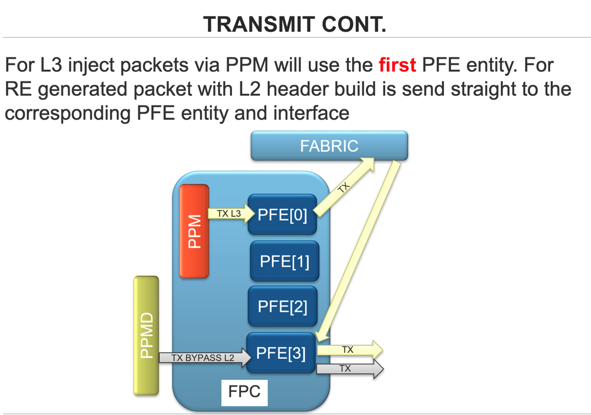
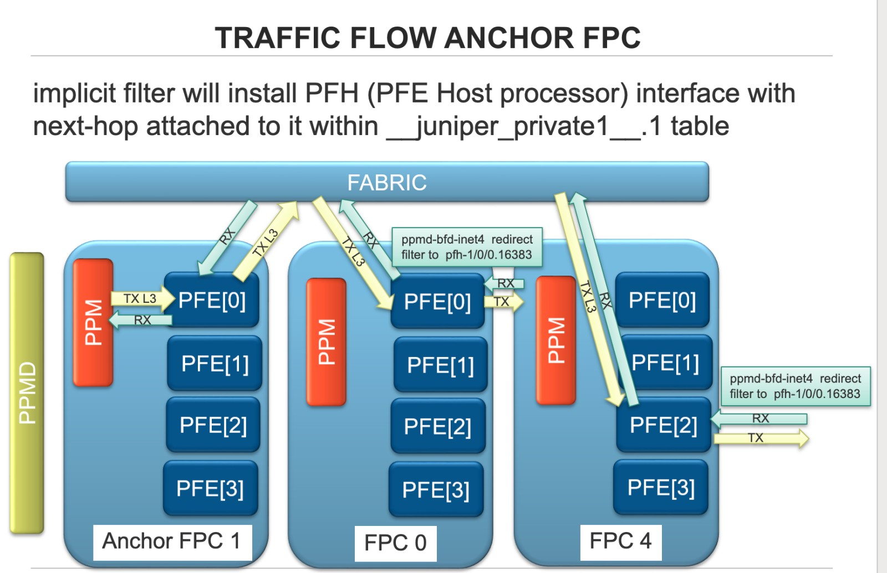
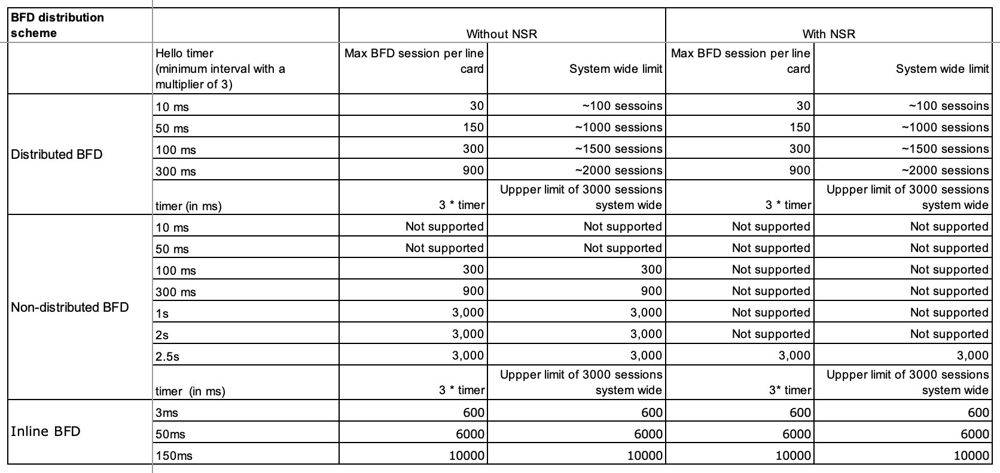
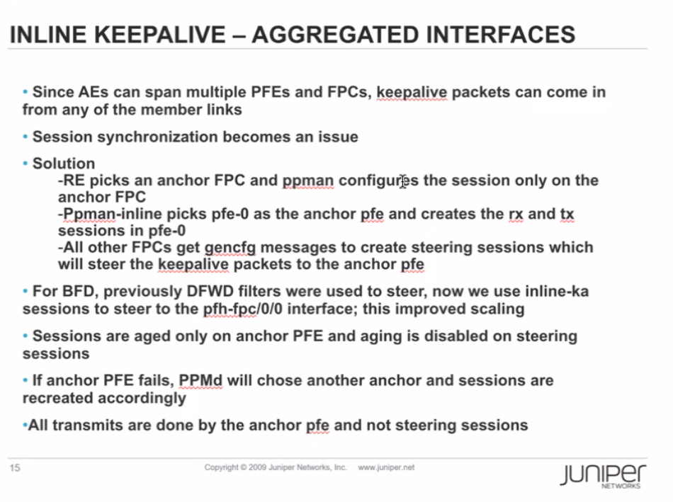
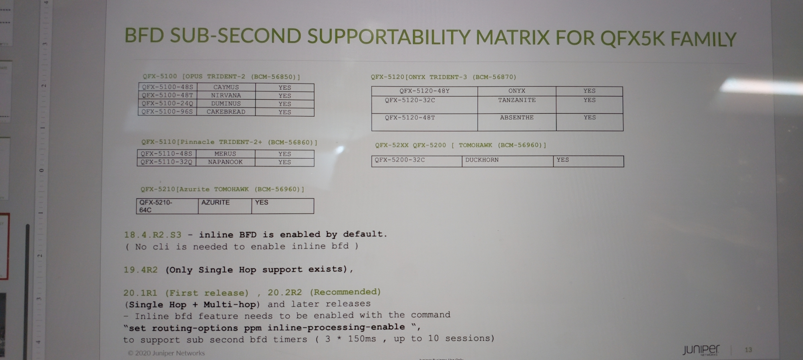
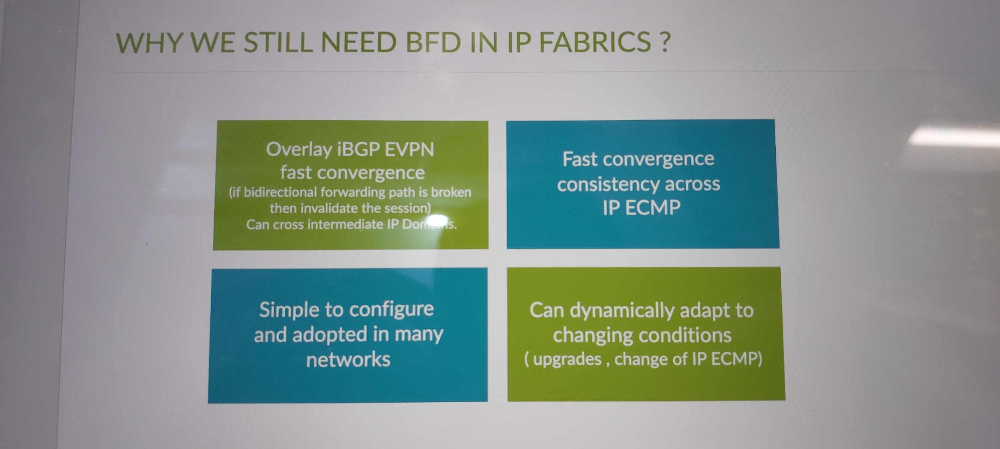

# BFD Theory and Scaling

> Generated deterministically from the approved grouping manifest.


## Source: `formatted/Learning_Notes/Bidirectional Forwarding Detection (BFD).md`

# Bidirectional Forwarding Detection (BFD)

The Bidirectional Forwarding Detection (BFD) protocol is a simple hello mechanism that detects failures in a network.

A pair of routing devices exchange BFD packets. The devices send hello packets at a specified, regular interval.

The device detects a neighbor failure when the routing device stops receiving a reply after a specified interval.

* *Types of BFD Sessions**

There are four types of BFD sessions based on the source from which BFD packets are sent to the neighbors. The different types of BFD sessions are:

|  |  |
| --- | --- |
| Type of BFD session | Description |
| Centralized (or non-distributed) BFD | BFD sessions run completely on the Routing Engine. |
| Distributed BFD | BFD sessions run completely on the FPC CPU. |
| Inline BFD | BFD sessions run on the FPC software. |
| Hardware-assisted inline BFD | BFD sessions run on the ASIC firmware. |

* *Single-hop and Multihop BFD**

- Single-hop BFD—Single-hop BFD in Junos OS runs in distributed mode by default.

- The exceptions are OSPFv3 BFD and PIMv6 BFD, which only support non-distributed BFD.
- Single-hop BFD control packets use UDP port 3784.

- Multihop BFD—One desirable application of BFD is to detect connectivity to routing devices that span multiple network hops and follow unpredictable paths.

- This is known as a multihop session.
- Multihop BFD control packets use UDP port 4784.

* *Consider the following when using multihop BFD:**

- Prior to Junos OS Release 12.3, multihop BFD is non-distributed and runs on the Routing Engine.

- Starting in Junos OS Release 12.3, multihop BFD runs in distributed mode by default.

- In a multichassis link aggregation group (MC-LAG) setup, Inter-Chassis Control Protocol (ICCP) uses BFD in multihop mode.

- Multihop BFD runs in centralized mode in this kind of setup.

- Starting in Junos OS Release 13.3R5, Junos OS does not execute firewall filters that you apply on a loopback interface for a multihop BFD session with a delegated anchor FPC.

- There is an implicit filter on all ingress FPCs to forward packets to the anchor FPC. Therefore, the firewall filter on the loopback interface is not applied on these packets.
- If you do not want these packets to be forwarded to the anchor FPC, you can configure the no-delegate-processing option.

## **Centralized BFD**

- In *centralized BFD* mode (also called *non-distributed BFD* mode), the Routing Engine handles BFD.

- For both single-hop BFD and multihop BFD, you can run the BFD session in non-distributed mode by:

- Configuring set routing-options ppm no-delegate-processing
- And then running the clear bfd session command.

- If the Routing Engine CPU goes too high, there is a chance that BFD will flap.

- Even in cases where the Routing Engine CPU is normal, smaller values of minimum-interval can lead to BFD packets not being processed if other higher priority tasks are running.
- You should select the minimum interval value based on proper testing.

## **Distributed BFD**

- The term *distributed BFD* refers to BFD that runs on the FPC CPU.

- The Routing Engine creates the BFD sessions and the FPC CPU processes them.

### **Benefits**

- The benefits of distributed BFD are mainly in the scaling and performance areas. Distributed BFD:

- Allows for the creation of a larger number of BFD sessions.
- Runs BFD sessions with a shorter transfer/receive timer interval, which can in turn be used to bring down the overall detection time.
- Separates the functionality of BFD from that of the Routing Engine.
- A BFD session can stay up during graceful restart, even with an aggressive interval.

- The minimum interval for Routing Engine-based BFD sessions to survive *graceful Routing Engine switchover* is 2500 ms.
- Distributed BFD sessions have a minimum interval of less than a second.

- Frees up the Routing Engine CPU, which improves scaling and performance for Routing Engine-based applications.
- BFD protocol packets flow even when the Routing Engine CPU is congested.

### **Configuration and Support**

- To determine if a BFD peer is running distributed BFD:

```text
run the **show bfd sessions extensive** command
And look for Remote is control-plane independent in the command output.
```
- For distributed BFD to work, you need to configure the lo0 interface with unit 0 and the appropriate family.

# set interfaces lo0 unit 0 family inet

# set interfaces lo0 unit 0 family inet6

# set interfaces lo0 unit 0 family mpls

- This is true for the following types of BFD sessions:

- BFD over aggregated Ethernet logical interfaces, both IPv4 and IPv6
- Multihop BFD, both IPv4 and IPv6
- BFD over VLAN interfaces in EX Series switches, both IPv4 and IPv6
- Virtual Circuit Connectivity Verification (VCCV) BFD (Layer 2 circuit, Layer 3 VPN, and VPLS) (MPLS)

## **Inline BFD**

- We support two types of inline BFD: inline BFD and hardware-assisted inline BFD.

- *Inline BFD* sessions run on the FPC software.
- *Hardware-assisted inline BFD* sessions run on the ASIC firmware.

- Support depends on your device and software version.

- Inline BFD sessions can have keepalive intervals of less than a second, so you can detect errors in milliseconds.
- If you are running inline BFD and the Routing Engine crashes, the inline BFD sessions will continue without interruption for 15 seconds.
- Inline BFD has many of the same benefits as distributed BFD since it also separates the functionality of BFD from the Routing Engine.
- The Packet Forwarding Engine software and the ASIC firmware process the packets more quickly than the FPC CPU

- so inline BFD is faster than distributed BFD.

NOTE: Starting in Junos OS Release 13.3, the distribution of adjacency entry (the IP addresses of adjacent routers) and transmit entry (the IP address of transmitting routers) for a BFD session is asymmetric. This is because an adjacency entry that requires rules might or might not be distributed based on the redirect rule, and the distribution of transmit entries is not dependent on the redirect rule.

The term redirect rule here denotes the capability of an interface to send protocol redirect messages. See Disabling the Transmission of Redirect Messages on an Interface.

### **Inline BFD**

- *Inline BFD* sessions run on the FPC software.

- The Routing Engine creates the BFD sessions and the Packet Forwarding Engine software processes them.
- Starting in Junos OS Release 16.1R1, integrated routing and bridging (IRB) interfaces support inline BFD sessions.
- MX Series routers only support inline BFD if the router is static and has MPCs/MICs with enhanced-ip configured.

### **Hardware-Assisted Inline BFD**

- *Hardware-assisted inline BFD* sessions run on the ASIC firmware.

- Hardware-assisted inline BFD is a hardware implementation of the inline BFD protocol.
- The Routing Engine creates BFD sessions and passes them to the ASIC firmware for processing.
- The device uses existing paths to forward any BFD events that need to be processed by protocol processes.

- Regular inline BFD is a software approach. In hardware-assisted inline BFD, the firmware handles most of the BFD protocol processing.

- The ASIC firmware processes the packets more quickly than the software, so hardware-assisted inline BFD is faster than regular inline BFD.
- We support this feature for single-hop and multihop IPv4 and IPv6 BFD sessions.

#### **Limitations**

- If the Packet Forwarding Engine process restarts or the system reboots, the BFD sessions will go down.
- Hardware-assisted inline BFD:

- Does not support micro BFD.
- Is only supported on standalone devices.
- Does not support BFD authentication.
- Does not support IPv6 link local BFD sessions.
- Cannot be used with VXLAN encapsulation of BFD packets.

### **Configuration**

- Devices support either regular inline BFD or hardware-assisted inline BFD.

- Use the set routing-options ppm inline-processing-enable command to enable the type of inline BFD that your device supports.
- To return BFD to the default mode, delete the configuration.

Release History Table

|  |  |
| --- | --- |
| Release | Description |
| 16.1R1 | Starting in Junos OS Release 16.1R1, inline BFD sessions are supported on integrated routing and bridging (IRB) interfaces. |
| 13.3R5 | Starting in Junos OS Release 13.3R5, if you apply a firewall filter on a loopback interface for a multihop BFD session with a delegated anchor FPC, Junos OS does not execute this filter, because there is an implicit filter on all ingress FPCs to forward packets to the anchor FPC. |
| 13.3 | Starting in Junos OS Release 13.3, the distribution of adjacency entry (the IP addresses of adjacent routers) and transmit entry (the IP address of transmitting routers) for a BFD session is asymmetric. |
| 13.3 | Starting in Junos OS Release 13.3, inline BFD is supported only on static MX Series routers with MPCs/MICs that have configured enhanced-ip. |

- --

View PR 1086674 [Confidential] - first pfe(anchor pfe) on FPC is key and we should enhance to use other pfes if the first pfe is wedged and action is disable-pfe. Note This sw changes are not active for MPC5E and MPC6E due to multi-center Chip and the inconsistent pfe-id mapping. Its due to the same reason why pfe-disable is not default action yet. PR/1208685 pfe disable not working on XL based cards

PR 1298369 [single-source-commit] - inline-bfd on irb will be broken after NSR switchover and subsequent offlining anchor FPC.


```text
Responsible for establish the sessions initiated by PPMD from RE execute all periodic packet processing events. absorb all packets and forward unabsorbed packets to the clients receive packets from clients and forward them out inform ppmd on RE if there are session flaps ppm data thread processes the received packets
```




[ August 10, 2023 09:12 ] ⁨Hung Le⁩: Luu y:

[ August 10, 2023 09:12 ] ⁨Hung Le⁩: hien best practice cho qfx bfd la 1000x3 nha

[ August 10, 2023 09:13 ] ⁨Hung Le⁩: https://supportportal.juniper.net/s/article/QFX-BFD-BGP-flaps-seen-continuously-between-devices-in-VXLAN-EVPN-overlay

BFD is dependent on unicast transmission of multi-hop BFD keep alives between the BGP peers.  In some instances, the ARP for the peer times out and cannot be resolved in a timely fashion and this will cause BFD to time out and drop, resulting in BGP going down.

Check the DDOS violating protocol and if the DDOS traffic is legitimate, then increase the DDOS violation limits for the respective protocol.

The minimum BFD timer supported for QFX5K series is 1 second.

[ August 10, 2023 09:13 ] ⁨Hung Le⁩: day la cua qfx5k

[ August 10, 2023 09:13 ] ⁨Hung Le⁩: còn config ma apstra apply xuong các platform là 1000x3

[ August 10, 2023 09:14 ] ⁨Hung Le⁩: bfd-liveness-detection {

minimum-interval 1000;

multiplier 3;

}

[28/08/2023 09:21:56] Thịnh Lê Văn: https://www.juniper.net/documentation/us/en/software/nce/sg-005-data-center-fabric/sg-005-data-center-fabric.pdf

[28/08/2023 10:48:05] HungLNM: A có 1 vài điểm sau khi đọc tài liệu trên:

[28/08/2023 10:48:21] HungLNM: - đang tìm tác giả vì này nguyên team viết

[28/08/2023 10:49:06] HungLNM: -bfd cho ibgp overlay dùng trong truong hợp bị failure đầu xa(về mặt sw hay bug)

[28/08/2023 10:50:07] HungLNM: -về template 350x3 trong tài liệu có nói, chỉ áp dụng cho các platform khác qfx5k, vì qfx5k chỉ sp min 1s(note trang 101)

[28/08/2023 10:50:41] HungLNM: Điều này hoàn toàn giống vơi các link public của jnpr và jtac có đề cập qua

[28/08/2023 10:51:10] HungLNM: -ngoài ra với qfx 10k thì có dùng micro bfd cho ae(qfx 5k chưa sp micro bfd)

[28/08/2023 11:26:42] HungLNM:



[28/08/2023 11:27:07] HungLNM: Đây là thông tin thêm về qfx5k có thể sp sub second

[28/08/2023 11:27:19] HungLNM: Phải confif thêm lệnh như hình

[28/08/2023 11:27:57] HungLNM: Ae nhìn thấy có sự thay đổi về BA của bfd qua từng junos

[28/08/2023 11:30:54] HungLNM:



[28/08/2023 11:31:05] HungLNM: Lí do dùng bfd trong ipfabric

## Source: `formatted/Recommends/BFD scales.md`

# BFD scales


## Source: `formatted/Case_notes/pr1523537 nay chu yeu giai thich ve behaviour cua bfd session id.md`

# pr1523537 nay chu yeu giai thich ve behaviour cua bfd session id

[ June 21, 2023 20:54 ] ⁨Hung Le⁩: 1523537 - unilist nexthop is getting set to 65535 due to session mismatch between Anchor FPC and other peers==> pr nay chu yeu giai thich ve behaviour cua bfd session id

```text
[ June 21, 2023 20:55 ] ⁨Hung Le⁩: When panic is triggered on anchor fpc(or reboot), down event is sent to non-anchor fpcs. Non-anchor fpcs set the pfe bfd session state to "down". When anchor fpc comes up, as part of pfe bfd session obj creation, session status is set to "up" locally. Ppman sends "bfd up" event to pfeman. But it is ignored as the status is already up(set by pfeman as part of init, done to avoid unwanted processing). So pfeman does not send session "up" event to other fpcs. Due to this session status remains down at non-anchor fpc even though bfd session is up.
```
[ June 21, 2023 20:55 ] ⁨Hung Le⁩: viec keep session id cua bfd la do phat trien tinh nang bfd session dc frr qua lsp

[ June 21, 2023 20:56 ] ⁨Hung Le⁩: khi phat trien rli cho tinh nang nay thi bfd frr default lun duoc enable

[ June 21, 2023 20:57 ] ⁨Hung Le⁩: do đó viec bfd ở pfe anchor down nhung ppm adj cho bfd đó vẫn giữ session

[ June 21, 2023 20:58 ] ⁨Hung Le⁩: từ đó dẫn đến mismatch thông tin nhdb cua PR 1568879

[ June 21, 2023 20:58 ] ⁨Hung Le⁩: sau đây la 1 ví dụ để ae hình dung tại sao có flow chết có flow không chết do bfd này

[ June 21, 2023 20:59 ] ⁨Hung Le⁩: ======working====ipv4

[ June 21, 2023 20:59 ] ⁨Hung Le⁩: show nhdb id 1048578 extensive

ID      Type      Interface    Next Hop Addr    Protocol       Encap     MTU               Flags  PFE internal Flags

- ----  --------  -------------  ---------------  ----------  ------------  ----  ------------------  ------------------

1048578   Unilist  ae55.0         -                      IPv4      Ethernet     0  0x0000000000000000  0x0000000000000000

<...>

ECMP : YES

614   Unicast  ae55.0         -                IPv4->MPLS      Ethernet  9178  0x0000000000000005  0x0000002000000002

607   Unicast  ae56.0         -                IPv4->MPLS      Ethernet  9178  0x0000000000000005  0x0000002000000002

[ June 21, 2023 21:01 ] ⁨Hung Le⁩: ===non working====

RMPC1(DIS01.LD5-RE0 vty)# show nhdb id 1048585 extensive

1048585   Unilist  ae55.0         -                      IPv4      Ethernet     0  0x0000000000000000  0x0000000000000000

621   Unicast  ae55.0         -                 CCC->MPLS      Ethernet  9178  0x0000000000000005  0x0000002000000012

622   Unicast  ae56.0         -                 CCC->MPLS      Ethernet  9178  0x0000000000000005  0x0000002000000012

[ June 21, 2023 21:01 ] ⁨Hung Le⁩: kq nay ta thay mac du unicast list cuoi cung đều đc réolve qua ae55.0

[ June 21, 2023 21:01 ] ⁨Hung Le⁩: tuy nhien nh id cho ecmp của 2 services này khác nhau

[ June 21, 2023 21:03 ] ⁨Hung Le⁩: ====bfdsesion ban dau====

[labroot@DIS01.LD](mailto:labroot@DIS01.LD)5-RE0> show bfd session address 81.201.103.92 extensive

Detect   Transmit

```text
Address                  State     Interface      Time     Interval  Multiplier
```
81. 201.103.92            Up        ae55.0         0.150     0.050        3

Client OSPF realm ospf-v2 Area 0.0.0.0, TX interval 0.050, RX interval 0.050

Session up time 00:57:05

Local diagnostic None, remote diagnostic None

```text
Remote state Up, version 1
```
Session type: Single hop BFD

Min async interval 0.050, min slow interval 1.000

Adaptive async TX interval 0.050, RX interval 0.050

Local min TX interval 0.050, minimum RX interval 0.050, multiplier 3

Remote min TX interval 0.050, min RX interval 0.050, multiplier 3

Local discriminator 21, remote discriminator 361

Echo mode disabled/inactive

Remote is control-plane independent

Session ID: 0x140 ======================>320

RMPC0(DIS01.LD5-RE0 vty)# show pfe bfd id 320 extensive

- ------------------ =====> lets check 320

SESSION ID: 320

- ------------------

Session Status : UP

Session Version : 0xfffffffe

NHID list : 632 629 627 626 625 624

622 621 619 613

===>moi nguoi nhin thay nhid list o day 614 va 607 cua truong hop working đã được release ra khoi session bfd nay

622 va 621 van bi giu lai

[ June 21, 2023 21:04 ] ⁨Hung Le⁩: do đó dẫn đới mismatch giữa control plane và data plane

[ June 21, 2023 21:07 ] ⁨SVT.Khương.TQ⁩: Dạ em cảm ơn anh Hưng. Để em đọc và suy ngẫm thêm ạ.

[ June 21, 2023 21:07 ] ⁨Hung Le⁩: pr nay phải chpwf phát triển 1 tính năng mới ở 21.4R thi moi thay đổi behaviour này được

[ June 21, 2023 21:08 ] ⁨Hung Le⁩: do đó để hạn chế lỗi phải WA bằng cách set routing-options no-bfd-triggered-local-repair

[ June 21, 2023 21:08 ] ⁨Hung Le⁩: để session id sẽ ko giữ lại phiên với nh đầu tiên mà bfd up

[ June 21, 2023 21:13 ] ⁨Hung Le⁩: 1 cai wa nữa là dung micro bfd cung ko bi

[ June 21, 2023 21:13 ] ⁨Hung Le⁩: clarification from Engineering, remove BFD/OSPF just keep AE BFD (microBFD) will not trigger  “persistent” traffic black holing issue.

[ June 21, 2023 21:13 ] ⁨Hung Le⁩: vi micro bfd ko co tinh nang local-repair nhu bfd inline

[ June 21, 2023 21:14 ] ⁨Hung Le⁩: Just checked 21.4R1 would had the fix of the issue:

<https://www.juniper.net/documentation/us/en/software/junos/release-notes/21.4/junos-release-notes-21.4r1/junos-release-notes-21.4r1.pdf>

######

Enhancements to BFD-triggered FRR for unicast next hops and forwarding-table session-id-changelimiter-indirect to address issue of |r-Lc being silently discarded (MX150, MX204, MX240, MX304, MX480, MX960, MX2008, MX2010, MX2020, MX10003, MX10008, MX10016, PTX1000,PTX3000, PTX5000, PTX10001, PTX10002, PTX10016, QFX10002-60C, QFX10002, QFX10008, QFX10016, and vMX)—In Junos OS Release 21.4R1, we've enhanced the BFD-triggered fast reroute (FRR) for unicast next hops and forwarding-table session-id-change-limiter-indirect to address the issue of |r-Lc being silently discarded because of a session mismatch between the control plane and data plane. To align the |r-Lc by cr;-ঞn] session-id-change-limiter indirect next hop, set the set routing-options forwarding-table session-id-change-limiter-indirect conC]†r-ঞon statement at the [edit routing-options forwarding-table] hierarchy level.

[ June 21, 2023 21:14 ] ⁨Hung Le⁩: còn đây là thông tin mà 21.4 sẽ thay đổi

[ June 21, 2023 21:15 ] ⁨Hung Le⁩: có 1 case của kh tương tự như CMC: jtac cũng tách thành 2 lỗi

[ June 21, 2023 21:15 ] ⁨Hung Le⁩: 1 RMA FPC

[ June 21, 2023 21:15 ] ⁨Hung Le⁩: 2 la nói về PR này

[ June 21, 2023 21:16 ] ⁨Hung Le⁩: Thanks TA đã cung cấp PR

[ June 21, 2023 21:34 ] ⁨SVT.Anh.VT⁩: PR này 2 tuần trc em có view mà lúc đó đọc ko kĩ anh ạ, em thấy bfd with ae (em tưởng micro bfd) với cái wa ko liên quan đến tính năng kh đang chạy. Nên bỏ qua :D

[ June 21, 2023 21:36 ] ⁨SVT.Anh.VT⁩: Thanks thông tin của anh Hưng nhé, để bọn em đọc kĩ xem anh nhé. Chỗ micro bfd + bỏ protocol bfd anh em cũng có trong plan khuyến nghị rồi anh ạ.

[ June 21, 2023 21:37 ] ⁨Hung Le⁩: Micro bfd m dễ bị vướn chỗ interop

[ June 21, 2023 21:37 ] ⁨Hung Le⁩: Nếu jnpr ko thì ok

[ June 21, 2023 21:37 ] ⁨Hung Le⁩: A nhớ mấy lần interop cisco và hw toàn bỏ đi

[ June 21, 2023 21:37 ] ⁨SVT.Anh.VT⁩: Dạ, cái box này của CMC thì OK, còn mấy box khác thì cần xem anh ạ.

[ June 21, 2023 21:38 ] ⁨Hung Le⁩: Isp nhỏ hay dùng nhiều vendor

[ June 21, 2023 21:39 ] ⁨SVT.Khương.TQ⁩: Nếu ko qua truyền dẫn hoặc sw thì có thể bỏ qua BFD được ko anh?

[ June 21, 2023 21:39 ] ⁨Hung Le⁩: Đc

[ June 21, 2023 21:39 ] ⁨Hung Le⁩: Cái này a nhớ hồi làm mane hcm có nói

[ June 21, 2023 21:40 ] ⁨Hung Le⁩: Dùng bfd là do ko đấu trực tiếp

[ June 21, 2023 21:43 ] ⁨Hung Le⁩: Coi như giờ case cmc cũng có hướng sáng

[ June 21, 2023 21:43 ] ⁨Hung Le⁩: Ngủ ngon đêm nay

```text
>>>>>>>>>>>>>>>>>>>>>>>
```
[ June 21, 2023 20:36 ] ⁨Hung Le⁩: If FPC0 PFE0 has the AE membership port, FPC1 also has the AE membership port:

- PFE0 disabe can cause max weight on both FPCs.

- FPC0 reboot will make the anchor FPC switch to FPC1, and BFD session ID on FPC1 will change to a new ID. FPC1 nh weight will move back to 1.

- Problem can be resovled by FPC0 reboot.

If FPC0 PFE0 doesn't have the AE membership port, and FPC1 also has the AE membership port:

```text
PFE0 disable will \*not\* cause the max weight issue, even the BFD remains in Down state and BFD session ID remains in Down state on FPC.
```
- Issue is not seen in this scenario - I can't explain the reason.

If FPC0 PFE0 doesn't have the AE membership port, and FPC0 PFEx have the membership port:

- FPC0 reboot will \*not\* make the anchor FPC switch to FPC1, but the BFD session ID on FPC1 will remain. Hence max weight on FPC1 will also remain.

- Problem can be resolved by restarting all FPCs....

[ June 21, 2023 21:20 ] ⁨Hung Le⁩: từ đó dẫn đến mismatch thông tin nhdb cua PR 1568879

[ June 21, 2023 21:20 ] ⁨Hung Le⁩: Khả năng phải xem xét vì mô hình triển khai của mình lqf bfd ospf hoặc bfd isis

[ June 21, 2023 21:54 ] ⁨SVT.Hoà.Nguyễn⁩: cái PR này ko thấy bản fix anh nhỉ ?

[ June 21, 2023 21:55 ] ⁨Hung Le⁩: Xem như là behaviour đến khi 21.4r1 ra đời

[ June 21, 2023 21:55 ] ⁨Hung Le⁩: Just checked 21.4R1 would had the fix of the issue:

[ June 21, 2023 21:56 ] ⁨SVT.Hoà.Nguyễn⁩: vâng anh

[ June 21, 2023 21:56 ] ⁨SVT.Hoà.Nguyễn⁩: để tụi em xem thêm

[ June 21, 2023 21:56 ] ⁨Hung Le⁩: do đó để hạn chế lỗi phải WA bằng cách set routing-options no-bfd-triggered-local-repair

[ June 21, 2023 21:56 ] ⁨Hung Le⁩: Hoặc dùng micro bfd

[ June 21, 2023 22:09 ] ⁨SVT.Hoà.Nguyễn⁩: hôm trước anh @⁨Hung Le⁩ có nói là lên Junos nào là có nhiều cái behavior thay đổi anh nhỉ ?
