# OSPF PE-CE Deep Dive and Fundamentals

> Generated deterministically from the approved grouping manifest.

## Source: `formatted/Learning_Notes/OSPF SUMMARY.md`

# OSPF SUMMARY

Source: <https://momcanfixanything.com/ospf-summary/>

* *OSPF PACKET TYPES**

* *HELLO PACKETS**

* *Adjacencies formation:**

An adjacency could fail if there is a mismatch of any of the following parameters:

- MTU (stuck in exstart)
- Network address
- Subnet mask
- Hello interval and/or dead interval
- Area type
- Authentication
- Area id
- Interface type (broadcast, ptp, ptmp…)

OR if there is a Duplicate RID or IP address

* *DR ELECTION**

- Highest priority wins
- Default priority is 128
- Priority = 0 means ineligible
- Highest RID if same priority
- Election NOT deterministic

- Election occurs within the first 40 sec of OSPF coming up

- No preemption
- point-to-point link (**set protocols ospf area  interface  interface-type p2p**) => no DR

* *LSA TYPES:**

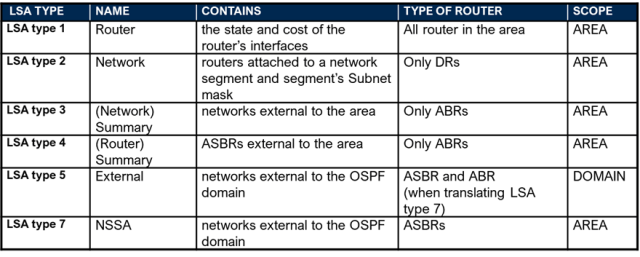

- **ONLY LSA with domain scope = LSA type 5!!!**

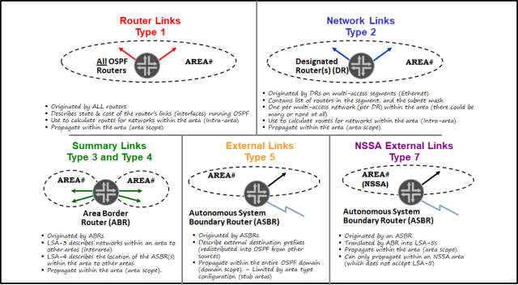

* *LSA TYPES AND AREA TYPE:**

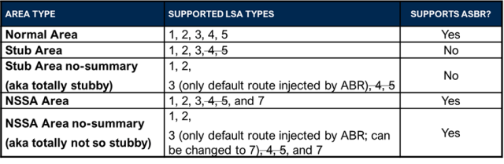

* *LSAs HEADER:**

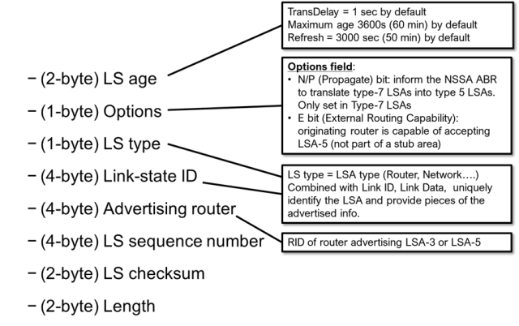

* *LINK STATE TYPE AND LINK STATE ID:**

Meaning of **LINK STATE ID** field in the **LSA HEADER** depends on the LSA type:

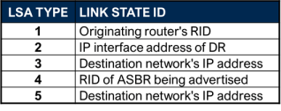

* *LSA TYPE 1**

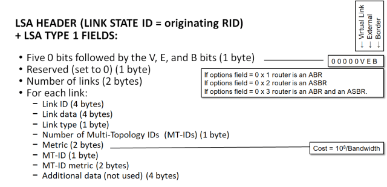

Meaning of **LINK ID** and **LINK DATA** fields, within the **ROUTER LSA** (TYPE 1), depends on the **LINK TYPE**:

How to remember? For Link Types 1, 2, and 4 Link ID = neighbors info, Link Data = Local info.

* *NOTE**: A point to point link is advertised with TWO LSAs Type 1 (Link type 1 and link type 3):

* *LSA TYPE 2**

Network LSA does NOT contain any prefix information, though it advertises the subnet mask for the network.

* *LSA TYPE 3**

For **LSAs type 3**, the **advertised prefix** is in the **LINK STATE ID** (in the **LSA HEADER**).

* *LSA TYPE 4**

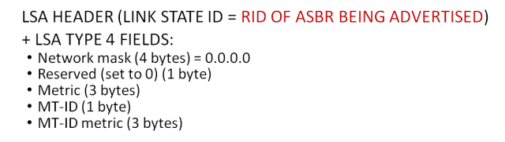

For **LSAs type** **4,** the **advertised ASBR RID** is in the **LINK STATE ID** (in the **LSA HEADER**).

* *LSA TYPE 5**

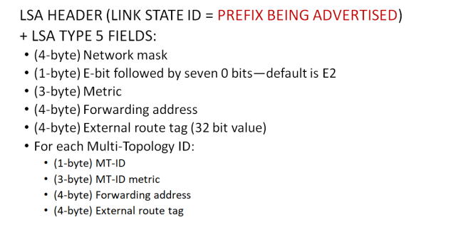

External LSAs header E-bit:

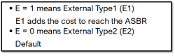

* *LSA TYPE 7**

Same format as LSA Type 5

Translated into an AS external LSA (Type 5) by the ABR at the NSSA border. This CANNOT be disabled!

If more than one ABR exists the one with the highest RID does the translation.

* *Other LSAs supported by Junos:**

- Type 9: used for graceful restart capability
- Type 10: used for MPLS traffic engineering

* *ADVERTISEMENT OF DEFAULT ROUTE INTO AREAS**

* *Default route not advertised into NSSA area or stub area by default**. Use **default-metric** command.

* *Default-route** advertised as an **LSA type 3 for a STUB area**; as an **LSA type 7 or type 3 on NSSA** depending on configuration.

* *ROUTE SUMMARIZATION**

Only an ABR can summarize prefixes.

You **CANNOT summarize LSAs type 1 and type 2**, but an ABR can summarize prefixes learned from LSAs type 1 and type 2 and place the summary into LSAs type 3, instead of the specific prefixes.

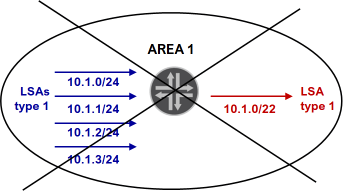

This is NOT possible!

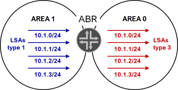

Default behavior.

Also, just like LSAs type 1 and type 2 cannot be summarized, LSAs type 5 cannot be summarize. However, an ABR that is translating LSAs type 7 into LSAs type 5 can summarize prefixes, within the LSA type 5.

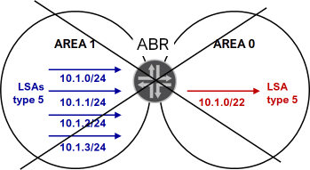

* *Regular area:**

* *set area  area-range**  **[restrict]**

- Configured on the ABR only!!!
- Summarizes prefixes injected by the ABR, into an area (within LSAs type 3.
- ABR learns about these prefixes from **LSAs type 1 and type 2**.
- Specific prefixes are suppressed automatically
- Restrict option can be used to filter prefixes.

* *EXAMPLE:**

* *set area 1 area-range 10.1.0/22**

Summarizes all prefixes within the 10.1.0/22 range.

* *set area 1 area-range 10.1.0/22** **[restrict]**

Because all specific prefixes are suppressed automatically, and the restrict suppresses the summary, this effectively filters LSAs type 3.

The example summarizes all prefixes within the 10.1.0/22 range, but the restrict action suppresses the update.

* *NSSA area:**

* *set area  nssa default-lsa** **area-range**  **[restrict]**

- Configured on the ABR only!!!
- Summarizes prefixes injected by the ABR, into an area (within LSAs type 5) when translating from LSAs type 7 into LSAs type 5..
- ABR learns about these prefixes from **LSAs type 7**
- Specific prefixes are suppressed automatically
- Restrict option can be used to filter prefixes.

* *set area 1 nssa default-lsa** **area-range 10.1.0/22**

Because all specific prefixes are suppressed automatically, and the restrict suppresses the summary, this effectively filters LSAs type 5 (translated from type 7) within the range.

* *OSPF ROUTE FILTERING / ROUTING POLICIES and REDISTRIBUTION**

LSAs filtering is NOT possible. The database of ALL routers within an area must be identical. You can limit propagation of some LSAs by converting the area into a stub, nssa, or stub/nssa no-summaries.

Routing policies can be used to control creation and propagation of LSAs type 3 and LSAs type 5.

LSAs 1 and 2 cannot controlled with any routing policies policies.

* *JUNOS <=> IOS**

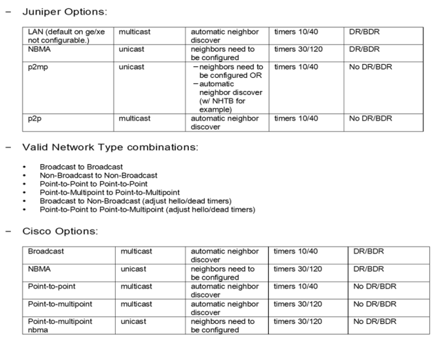

- --

As we can see in the above output, R1 prefers LSAs Type-7 from R2. This is because we are following RFC 3101, which has the following path calculation preference

1. A Type-7 LSA with the P-bit set.

2. A Type-5 LSA.

3. The LSA with the higher router ID.

Note: Please be aware that the following path calculation preference is applicable if the current LSA is functionally the same as an installed LSA. We can verify that the forwarding metric for both LSAs are the same looking at Type-1 LSA of R1.

## Source: `formatted/Learning_Notes/ospf as routing protocol for CE-PE.md`

# ospf as routing protocol for CE-PE

> > it is possible to break a few ospf 'rules' and have it 'work'
>
> First thing is no OSPF rules are being broken nor can be broken in regards to L3VPN because (outside of sham-links) the superbackbone between the PEs are not necessarily treated as directly connected. As they are not treated as such, OSPF's rules do not particularly apply.
>
> By default these are still BGP redistributed routes with logic to properly redistribute them in the LSDB via the use of BGP communities such as rte-type and domain-id. This allows for easy creation and imports of type 3/5 LSAs in the local LSDB. However, the BGP routes are lacking most of the LSA attributes and a PE would not be able to properly add the LSAs required to build the full LSDB.
>
> In order for PEs to have true OSPF adjacency, sham-links are required. When enabled, the PEs exchange OSPF messages tunneled directly over the LSP. This allows for full adjacency and LSDB hence then will follow the full OSPF rules for adj. (P2P anyway) but not for area rules. But this adj. only pertains to the LSDB, not routing. This is a key point in this scenario.
>
> However, in either scenario the BGP routes are still the end-all in the decision process. The received BGP routes and their community along with sham-link adj. are used to build this "pseudo" LSDB. I call this pseudo because OSPF routes received via BGP from a remote PE which are added to the LSDB are not locally significant to the PE (AKA not involved in routing, SFP, etc). The remote routes will only exist as BGP routes and just imported into the LSDB. A local PE only uses the LSDB for local CE routes.
>
> You can try this for yourself by not exporting OSPF VRF routes and building a sham-link. You'll have the full OSFP database at either PE/CE but no routing functionality because this is again reliant on BGP.
>
> When you think the PEs in a L3VPN can break OSPF rules, they are not actually breaking any rules because "OSPF is not really involved" between the PEs.
>
> Also you can have these insane OSPF designs that appear to work but in reality do not because of the explanations above. Since the PEs are simply importing these OSPF routes into the LSDB yet not using them for routing between VRFs, this means routing can appear fine a lot of the time at the PE, but the downstreams CEs can run SPF and improperly select best paths for particular routes because the database is not always equal to the actual BGP routes in the PE's table. This is primarily a concern when backdoor-links are involved.
>
> Summary, yes, you can have some wild and standard breaking OSPF area configurations at each PE and they can still work but when it comes to the CE's LSDB and if there are backdoor-links, routing can break at various points. This is because L3VPN and OSPF is not as interconnected as you think.
>
> ---
>
> L3VPN lets you connect different areas (acting as a superbackbone 'area 0')

First thing is while the L3VPN fabric acts as an OSPF superbackbone and has some analogies to area 0, it's more akin in practice to a standard inter-AS interconnect. AKA, by default, there would little difference in a scenario where no L3VPN was used and the PEs were simply redistributing OSPF into BGP and the inverse.

The route tables and OSPF database would be near identical, albeit it not being a VPN. This is because in either scenario it's still standard redistribution. The only difference is with L3VPN is it provides more control on the OSPF LSDB when routes are redistributed so the proper LSAs are created.

Even with sham-links though, the L3VPN fabric is more analogous to a standard area neighborship because it's actually creating a neighborship.

Essentially, while it lets you connect different areas and type that are not normally possible, it's due to redistribution. The limitation on functionality is down to redistribution and the area types, ex. if one area is a stub, you cannot redistribute because of Type-5 but can make use of the domain-ID tag so they are injected as a Type-3 instead.

> \*Initially I jumped on changing the domain-id however not sure it is required....The 'DOWN' bit (Junos calls this DN bit ), also the domain-id (which is different to the DN bit) and finally automatic tagging. (Junos does it for us but you can see it doing it).

Correct, there are 3 primary mechanisms that are used with L3VPN and OSPF. Each are independent and used simultaneously. There are actually a few more knobs that really let you incorporate overly complex designs too.

> DOWN BIT:

This is simply a loop prevention for redistribution, very important when backdoors are involved. When the PE redistributes the VPN BGP prefix into OSPF, it sets the DN bit flag so that there is not potential of the remote PE from redistributing it again. Type-3/5/7 LSAs support this bit.

> VPN Tag:

If the DN bit is not supported on the device, you can use the VPN Tag instead. This is essentially a fallback when DN bit cannot be used reliably and has the purpose/use.

> Domain ID community:

This is probably the most important when it comes to dealing with different areas or route manipulation. This simple tag ensure routes are redistributed with the correct LSA types. Summed up to if the domain-ids match, it's treated as a Type-3, else it's a Type-5.

> IE: we are using the L3VPN as an induced Superbackbone to seperate the non (NSSA) compatible areas.

So back to the primary scenario. By default (with proper export configurations), this should work for the most part but there may be instances on the CE side in their OSPF LSDB that would result in non-optimal routing or blackholing of traffic.

Again, remember that the key is the PE's are simply constructing their LSAs to build an LSDB. It's uses the BGP redistributed routes for this and when it comes to routing traffic only the BGP routes are used. The PEs are basically advertising this "pseudo" network.

Lưu ý: Trong mô hình hub-spoke, nếu routing giữa hub-PE và hub-CE là OSPF, khi đó hub-downstream-vrf sẽ có hành xử bên dưới khi flooding LSA đến hub-CE:

Đối với LSA Type3: set DN bit (Down bit).

Đối với LSA Type5: set DN bit và VPN-Tag

By default, all LSAs originated by the hub PE router in the spoke routing instance have the DN bit set.  Also, all externally originated LSAs have the VPN route tag set.

For Type 3 summary LSAs, routing loops are not a concern because the hub CE router, as an area border router (ABR), reoriginates the LSAs with the DN bit clear and sends them back to the hub PE router.

However, the hub CE router does not reoriginate external LSAs, because they have an AS flooding scope.

Đây là tính năng chống loop mặc định của giao thức OSPF trong L3VPN. Khi hub-upstream-vrf nhận được các LSA này sẽ xem là bất hợp lệ và không xử lý. Để tránh việc này, thực hiện tắt hành xử này tại vị trí hub-downstream-vrf bằng cách chuyển toàn bộ LSA Type3 sang LSA Type 5 và tắt DN bit khi flooding LSA đến hub-CE bằng cấu hình bên dưới:

domain-id disable;

domain-vpn-tag 0;

domain-id disable; ->> vì dù không set dn bit và vpn-tag là không nhưng HUB VRF cũng không học route này do nghĩ disjoint backbone area. Khi tắt thì PE ở HUB VRF sẽ hành xử như non-ABR.

Lệnh này  có tác dụng với LSA Type 3, convert sang LSA T5

domain-vpn-tag 0; or no-domain-vpn-tag; ->> lệnh này tắt DN bit và set vpn-tag là 0 cho route được advertise từ SPOKE VRF to CE. Lệnh này set ở SPOKE VRF

>- có tác dụng với LSA Type 5

For Type 3 summary LSAs, routing loops are not a concern because the hub CE router, as an area border router (ABR), reoriginates the LSAs with the DN bit clear and sends them back to the hub PE router. However, the hub CE router does not reoriginate external LSAs, because they have an AS flooding scope.

Khi sử dụng vrf-target thì extended community rte-type được tự dộng add vào route quảng bá sang MP-BGP

Khi sử dụng vrf-import/export thì extended community rte-type không được tự dộng add vào route quảng bá sang MP-BGP

>>> Khi sử dụng vrf-import/export thì tất cả route sẽ được remote PE được xem là external (do không có rte-type)

>>> Khi sử dụng vrf-target thì route LSA T 1,2,3 sẽ được remote PE adv theo LSA type 3 (tái tạo từ rte-type)

To get these routes advertised as hub-routes to spoke sites, I have 2 options:

Option 1:

1a. Put CE1's vpnA-dowstream interface in another area, so the Type-3

LSAs will be re-originated at ABR CE1 with DN-bit cleared.

1b. Configure "domain-id disable" in vpnA-downstream instance, to

allow these Type-3 LSAs(DN-bit cleared) to be considered in SPF

algorithm.

(set ref#1)

1c. Configure "domain-vpn-tag 0" in vpnA-upstream instance, to allow

Type-5 LSAs to be considered in SPF algorithm.

Option 2:

2a. Both of the CE's vpnA-upstream/downstream interfaces are in the same area.

2b. Configure "domain-id disable" in vpnA-upstream instance, to flood

Type-3 LSAs with DN-bit cleared. (I found that these LSAs will be

converted to Type-5 LSAs)

2c. Configure "domain-vpn-tag 0" in vpnA-upstream instance, to allow

The only difference between Options 1&2 is the route type of remote

OSPF internal spoke routes.

Option 1 will consider them as OSPF/10(Type-3 LSAs)

Option 2 will consider them as OSPF/150(Type-5 LSAs)

Q1: What is the best practice? Option 1, 2 or another approach?

Q2: What are the side effects of "domain-id disable"?

Different domain-ids will make PEs convert remote Type-3 LSAs to

Type-5 LSAs. And "domain-id disable" will clear the DN-bit in Type-3

LSAs.

But I cannot find whether "domain-id disable" makes PEs convert Type-3

LSAs to Type-5 LSAs or not. (According to my test, it will.)

Q3: What are the side effects of "domain-vpn-tag 0"? It will clear the

DN-bit in Type-5 LSAs and set vpn-tag to 0. Anything else?

Q4: In this case, will sham-links help?

Q5: I cannot find usage guidelines of "domain-id disable" and

"domain-vpn-tag 0" for versions after JunOS 12.2. Do these behaviors

change in later versions?

- -

'domain-vpn-tag 0' have the side effect of "remove the DN bit from Type 5 and Type 7 LSAs"

<https://supportportal.juniper.net/s/article/How-to-install-LSA-type-3-LSA-type-5-and-LSA-type-7-OSPF-routes-in-the-VRF-routing-table?language=en_US>

#### Hub-and-Spoke Layer 3 VPNs and OSPF Domain IDs

The default behavior of an OSPF domain ID causes some problems for hub-and-spoke Layer 3 VPNs configured with OSPF between the hub PE router and the hub CE router when the routes are not aggregated. A hub-and-spoke configuration has a hub PE router with direct links to a hub CE router. The hub PE router receives Layer 3 BGP updates from the other remote spoke PE routers, and these are imported into the spoke routing instance. From the spoke routing instance, the OSPF LSAs are originated and sent to the hub CE router.

The hub CE router typically aggregates these routes, and then sends these newly originated LSAs back to the hub PE router. The hub PE router exports the BGP updates to the remote spoke PE routers containing the aggregated prefixes. However, if there are nonaggregated Type 3 summary LSAs or external LSAs, two issues arise with regard to how the hub PE router originates and sends LSAs to the hub CE router, and how the hub PE router processes LSAs received from the hub CE router:

- By default, all LSAs originated by the hub PE router in the spoke routing instance have the DN bit set. Also, all externally originated LSAs have the VPN route tag set. These settings help prevent routing loops. For Type 3 summary LSAs, routing loops are not a concern because the hub CE router, as an area border router (ABR), reoriginates the LSAs with the DN bit clear and sends them back to the hub PE router. However, the hub CE router does not reoriginate external LSAs, because they have an AS flooding scope.

You can originate the external LSAs (before sending them to the hub CE router) with the DN bit clear and the VPN route tag set to 0 by altering the hub PE router’s routing instance configuration. To clear the DN bit and set the VPN route tag to zero on external LSAs originated by a PE router, configure 0 for the domain-vpn-tag statement at the [edit routing-instances routing-instance-name protocols ospf] hierarchy level. You should include this configuration in the routing instance on the hub PE router facing the hub CE router where the LSAs are sent. When the hub CE router receives external LSAs from the hub PE router and then forwards them back to the hub PE router, the hub PE router can use the LSAs in its OSPF route calculation.
- When LSAs flooded by the hub CE router arrive at the hub PE router’s routing instance, the hub PE router, acting as an ABR, does not consider these LSAs in its OSPF route calculations, even though the LSAs do not have the DN bits set and the external LSAs do not have a VPN route tag set. The LSAs are assumed to be from a disjoint backbone area.

You can change the configuration of the PE router’s routing instance to cause the PE router to act as a non-ABR by including the disable statement at the [edit routing-instances routing-instance-name protocols ospf domain-id] hierarchy level. You make this configuration change to the hub PE router that receives the LSAs from the hub CE router.

By making this configuration change, the PE router’s routing instance acts as a non-ABR. The PE router then considers the LSAs arriving from the hub CE router as if they were coming from a contiguous nonbackbone area.

<https://github.com/rendoaw/notes/blob/master/juniper/junos.ospf.domain-id.md>

## Source: `formatted/Learning_Notes/Untitled Note_5.md`

# Untitled Note

# OSPF AS THE PE-CE ROUTING PROTOCOLS DEEP DIVE – PART 1 OF 3 – REDISTRIBUTION

[JANUARY 3, 2014](http://web.archive.org/web/20140706180615/http://mellowd.co.uk/ccie/?p=4697) [DARREN](http://web.archive.org/web/20140706180615/http://mellowd.co.uk/ccie/?author=1) [4 COMMENTS](http://web.archive.org/web/20140706180615/http://mellowd.co.uk/ccie/?p=4697#comments "Comment on OSPF as the PE-CE routing protocols deep dive – Part 1 of 3 – Redistribution")

[Read part 1](http://web.archive.org/web/20140706180615/http://mellowd.co.uk/ccie/?p=4697)

[Read part 2](http://web.archive.org/web/20140706180615/http://mellowd.co.uk/ccie/?p=4741)

[Read part 3](http://web.archive.org/web/20140706180615/http://mellowd.co.uk/ccie/?p=4814)

When doing L3VPN, using OSPF is actually one of the more complicated options. Vector-based protocols like RIP, EIGRP, and BGP are comparatively simple.

[RFC4577 is a great RFC that goes over how OSPF and BGP should operate when it comes to using OSPF as the PE-CE routing protocol.](http://web.archive.org/web/20140706180615/http://tools.ietf.org/html/rfc4577)

I wanted to go into detail some of what is noted on the RFC to see just how both IOS and IOS-XR interpret the RFC. Also it makes it a bit fun by purposely trying to break the RFC and seeing what happens.

First, a quick refresh of how PE-CE protocols work when not using BGP as the PE-CE routing protocol. I’m going to brush very lightly over this.

Consider the following network. R2, R3, and R3 are ISP routers in which R2 and R4 are PE routers. R7, R5, and R6 belong to the customer. R7 and R5 are both connected to the same PE while R6 is connected to another PE.

The CE routers are running OSPF with the PE routers. The PE routers redistribute these OSPF routes into BGP and then converts them to VPNv4 NLRI. These VPNv4 NLRIare advetised to other PE routers via BGP. The PE also converts these VPNv4 routes back into OSPF and then off to the CE router:

## LSA Translation

Taking the above image as an example. R7 is running OSPF with R2. R2 is also running OSPF with R5 and so any LSA updates are sent to R5 from R7 as per standard OSPF rules. When R2 needs to advertise the route over to R4, that LSA needs to be converted to a VPNv4 route. R4 will then convert that VPNv4 route back to an OSPF route on the other side. So how does the RFC state this LSA must be translated?

Section 4.2.6 of the RFC states:

> For every address prefix that was installed in the VRF by one of its associated OSPF instances, the PE must create a VPN-IPv4 route in BGP. Each such route will have some of the
>
> following Extended Communities attributes:
>
> - The OSPF Domain Identifier Extended Communities attribute. If the OSPF instance that installed the route has a non-NULL primary Domain Identifier, this MUST be present; if that OSPF instance has only a NULL Domain Identifier, it MAY be omitted. This attribute is encoded with a two-byte type field, and its type is 0005, 0105, or 0205. For backward compatibility, the type 8005 MAY be used as well and is treated as if it were 0005. If the OSPF instance has a NULL Domain Identifier, and the OSPF Domain Identifier Extended Communities attribute is present, then the attribute’s value field must be all zeroes, and its type field may be any of 0005, 0105, 0205, or 8005.
>
> - OSPF Route Type Extended Communities Attribute. This attribute MUST be present. It is encoded with a two-byte type field, and its type is 0306. To ensure backward compatibility, the type 8000 SHOULD be accepted as well and treated as if it were type 0306. The remaining six bytes of the Attribute are encoded as follows:
>
> Area Number – Route Type – Options

In the test network I have already configured mutual redistribution between OSPF and BGP on both PE routers. Let’s see if the VPNv4 routes match what we expect from the RFC. R7 is advertising it’s loopback into OSPF. R2 converts this to a VPNv4 route. Let’s dig into the VPNv4 route itself:

R2#show bgp vpnv4 un all 7.7.7.7

BGP routing table entry for 2.2.2.2:1:7.7.7.7/32, version 28

Paths: (1 available, best #1, table A)

Advertised to update-groups:

1

Local

10. 0.27.7 from 0.0.0.0 (2.2.2.2)

Origin incomplete, metric 2, localpref 100, weight 32768, valid, sourced, best

Extended Community: RT:1:1 OSPF DOMAIN ID:0x0005:0x000000010200

OSPF RT:0.0.0.0:2:0 OSPF ROUTER ID:2.2.2.2:0

mpls labels in/out 26/nolabel

The route has a number of extended communities. The first one we’ll look at is the domain id value of

OSPF DOMAIN ID:0x0005:0x000000010200

IOS has encoded a type 005 domain ID with a value of 000000010200. This is interesting as I have not hard-coded a domain ID. Section 4.2.4 of the RFC states:

> Each OSPF instance MUST be associated with one or more Domain Identifiers. This MUST be configurable, and the default value (if none is configured) SHOULD be NULL.

I have not configured one yet there is one. This means IOS is configuring one automatically even though it SHOULD be null.

The second community we’ll look at is the Route Type Extended Communities Attribute:

OSPF RT:0.0.0.0:2:0

The RFC states that the RT is broken up as follows:

1. 32-bit Area number
2. Route-type
3. Options

From our value above we can see that the original OSPF LSA is from area 0. Our RT says that this route comes from a type-2 LSA, but that’s incorrect as 7.7.7.7 is coming in via a type-1 LSA so that is a bit odd (as we shall see in a bit, it doesn’t actually matter whether this value is 1, 2, or 3 at the end of day). The final byte is the Options byte which is currently zero.

This VPNv4 update is now sent over to R4, who needs to take that information and create a new OSPF LSA and advertise it to R6. What does the RFC say about how the PE needs to do this?

## VPNv4 routes received via BGP

Sescion 4.2.8.1 of the RFC states:

> With respect to a particular OSPF instance associated with a VRF, a VPN-IPv4 route that is installed in the VRF and then selected as the preferred route is treated as an External Route if one of the following conditions holds:
>
> - The route type field of the OSPF Route Type Extended Community has an OSPF route type of “external”
>
> - The route is from a different domain from the domain of the OSPF instance

What this means is that if a route comes into a PE as an External or NSSA-External , it will always be so. It can never change. If a route comes in with a type of 1, 2, or 3; and the domain-id matches – then the local PE will originate a new type-3 LSA. i.e. the route will appear inter-area on the other customer sites.

If a route comes in with a type of 1, 2, or 3; and the domain-id does not match, then it becomes an external route.

All my routers are currently running IOS and OSPF process ID 100. This means currently all the domain-ids match. This means that R4 should be originating a new type-3 LSA. We can verify this on R6:

R6#sh ip ospf database summary 7.7.7.7

OSPF Router with ID (6.6.6.6) (Process ID 1)

Summary Net Link States (Area 0)

Routing Bit Set on this LSA in topology Base with MTID 0

LS age: 638

Options: (No TOS-capability, DC, Downward)

LS Type: Summary Links(Network)

Link State ID: 7.7.7.7 (summary Network Number)

Advertising Router: 4.4.4.4

LS Seq Number: 80000001

Checksum: 0x1EDF

Length: 28

Network Mask: /32

MTID: 0 Metric: 2

We see the 7.7.7.7/32 LSA coming from 4.4.4.4. This means the OSPF route should be inter area:

R6#sh ip route 7.7.7.7

Routing entry for 7.7.7.7/32

Known via "ospf 1", distance 110, metric 3, type inter area

Last update from 10.0.46.4 on FastEthernet1/0, 00:11:25 ago

Routing Descriptor Blocks:

\* 10.0.46.4, from 4.4.4.4, 00:11:25 ago, via FastEthernet1/0

Route metric is 3, traffic share count is 1

Let’s change the domain-id on R4 to Null to see if this will change the route-type:

R4#conf t

Enter configuration commands, one per line. End with CNTL/Z.

R4(config)#router ospf 1

R4(config-router)#domain-id Null

R4(config-router)#end

Verify:

Known via "ospf 1", distance 110, metric 2

Tag Complete, Path Length == 1, AS 100, , type extern 2, forward metric 1

Last update from 10.0.46.4 on FastEthernet1/0, 00:00:08 ago

\* 10.0.46.4, from 4.4.4.4, 00:00:08 ago, via FastEthernet1/0

Route metric is 2, traffic share count is 1

Route tag 3489661028

R6#sh ip ospf database external 7.7.7.7

Type-5 AS External Link States

LS age: 69

Options: (No TOS-capability, DC)

LS Type: AS External Link

Link State ID: 7.7.7.7 (External Network Number )

Checksum: 0x863A

Length: 36

Metric Type: 2 (Larger than any link state path)

MTID: 0

Metric: 2

Forward Address: 0.0.0.0

External Route Tag: 3489661028

As expected, the route is now external.

## IOS-XR

I’ve swapped out R4 with an IOS-XR box and configured it the same. How has R6′s loopback been converted into a VPNv4 route?

R2#show bgp vpnv4 un all 6.6.6.6

BGP routing table entry for 1:1:6.6.6.6/32, version 4

Not advertised to any peer

4. 4.4.4 (metric 4) from 4.4.4.4 (4.4.4.4)

Origin incomplete, metric 2, localpref 100, valid, internal, best

Extended Community: RT:1:1 OSPF RT:0.0.0.0:2:0 OSPF ROUTER ID:4.4.4.4:0

mpls labels in/out nolabel/16012

What’s interesting here is that IOS-XR follows the RFC a little bit more closely in that there is no implicit default Domain-ID. This means a L3VPN where some of your routers are IOS and some are IOS-XR, their Domain-IDs are not going to match unless you change the defaults. This should also mean on R6 I should be seeing external routes from R7 and R5:

RP/0/3/CPU0:R6#sho route ipv4 7.7.7.7

Thu Jan 2 17:05:59.526 UTC

Tag 3489661028, type extern 2

Installed Jan 2 17:01:21.626 for 00:04:38

Routing Descriptor Blocks

10. 19.20.19, from 4.4.4.4, via POS0/7/0/0

Route metric is 2

No advertising protos.

RP/0/3/CPU0:R6#sho route ipv4 5.5.5.5

Thu Jan 2 17:06:05.378 UTC

Routing entry for 5.5.5.5/32

Installed Jan 2 17:01:21.625 for 00:04:43

Let’s hard-code the Domain-ID on R4 to ensure they now match:

RP/0/0/CPU0:R4#conf

Thu Jan 2 17:06:40.703 UTC

RP/0/0/CPU0:R4(config)#router ospf 100 vrf A domain-id type 0005 value 0000006$

RP/0/0/CPU0:R4(config)#end

Uncommitted changes found, commit them before exiting(yes/no/cancel)? [cancel]:yes

Thu Jan 2 17:08:01.164 UTC

Installed Jan 2 17:07:33.737 for 00:00:27

Route metric is 3

Knowing the implicit defaults on both platforms can certainly save you from headaches.

## Multiple Domain-IDs

IOS gives you the option to have secondary domain-IDs. The configuration guide doesn’t give all that information on what exactly it does, so it’s time to break out Wireshark. First I’ll configure multiple secondary domain-ids on R2:

R2#sh run | sec router ospf

router ospf 1 vrf A

domain-id type 0005 value 000000010200

domain-id type 0005 value 000000020200 secondary

domain-id type 0005 value 000000030200 secondary

domain-id type 0005 value 000000040200 secondary

log-adjacency-changes

redistribute bgp 100 subnets

Will this make R2 generate VPNv3 update with multiple extended OSPF communities? I’m capturing BGP traffic on R4′s core interface and done a route refresh:

No. The VPNv4 update still only has a single domain-id. Secondary domain-ids are for a receiving PE to look at. If it receives OSPF updates from multiple different domain-id’s, if the ID matches any of the local secondary IDs, then it is considered a match. In order for this to work, all sides will need to match multiple IDs to consider everything internal as each PE can only originate a single ID outbound.

## Source: `formatted/Learning_Notes/Untitled Note_6.md`

# OSPF AS THE PE-CE ROUTING PROTOCOLS DEEP DIVE – PART 2 OF 3 – THE SHAM LINK

[JANUARY 6, 2014](http://web.archive.org/web/20140706194319/http://mellowd.co.uk/ccie/?p=4741) [DARREN](http://web.archive.org/web/20140706194319/http://mellowd.co.uk/ccie/?author=1) [1 COMMENT](http://web.archive.org/web/20140706194319/http://mellowd.co.uk/ccie/?p=4741#comments "Comment on OSPF as the PE-CE routing protocols deep dive – Part 2 of 3 – The SHAM Link")

[Read part 1](http://web.archive.org/web/20140706194319/http://mellowd.co.uk/ccie/?p=4697)

[Read part 2](http://web.archive.org/web/20140706194319/http://mellowd.co.uk/ccie/?p=4741)

[Read part 3](http://web.archive.org/web/20140706194319/http://mellowd.co.uk/ccie/?p=4814)

In order to understand the purpose of the sham link, you first need to understand the problem it is trying to fix. If we look at the topology used last time again for a refresh:

## The Problem

From the previous post it was clear that it did not matter if the LSA received by a PE from a CE was type1, type2, or type3. That LSA would always be either type3 or type5 on the remote side. While this is perfectly fine most of the time, there are times when this is less than ideal. I’ll add a low-speed serial link between R5 and R6 and enable regular OSPF over the link like so:

R5 config:

interface Serial2/0

ip address 10.0.56.5 255.255.255.0

ip ospf 1 area 0

If I check the route to R6′s loopback, it’ll be going over the slow serial link:

R5#sh ip route 6.6.6.6

Routing entry for 6.6.6.6/32

Known via "ospf 1", distance 110, metric 65, type intra area

Last update from 10.0.56.6 on Serial2/0, 00:01:26 ago

\* 10.0.56.6, from 6.6.6.6, 00:01:26 ago, via Serial2/0

Route metric is 65, traffic share count is 1

Changing the metric of the link will have no effect whatsoever:

R5#conf t

R5(config)#int s2/0

R5(config-if)#ip ospf cost 50000

R5(config-if)#end

R5#

\*Jan 6 12:01:52.747: %SYS-5-CONFIG\_I: Configured from console by console

Known via "ospf 1", distance 110, metric 50001, type intra area

Last update from 10.0.56.6 on Serial2/0, 00:00:01 ago

\* 10.0.56.6, from 6.6.6.6, 00:00:01 ago, via Serial2/0

Route metric is 50001, traffic share count is 1

OSPF has it’s own internal route-selection decision. Intra-area routes from type1 LSAs are always preferred over summaries from type3 LSAs. Summaries are also preferred over E1s, then E2, then N1, then finally N2 OSPF routes.

R5 and R6 are in the same area, hence they are currently learning each others prefixes through the type1 LSAs between then. Regardless of metric, this route will always be preferred over the type3 learned over the MPLS cloud.

## The Sham Link

[RFC 4577 Section 4.2.7](http://web.archive.org/web/20140706194319/http://tools.ietf.org/html/rfc4577#section-4.2.7) gives us one option to fix this problem. The sham-link essentially allows the PE routers to share OSPF routes via type1 LSAs. When this LSA reaches the PE on the other side, it is still a type1 LSA. That LSA is flooded to the connected PE. This means all internal OSPF routes at one site can appear internal on the other side. The sham-link cost can be adjusted to be lower than the backdoor OSPF link and therefore traffic will prefer going over the MPLS core first.

[Unlike the previous post in which IOS and IOS-XR had minor differences in interpreting the RFC](http://web.archive.org/web/20140706194319/http://mellowd.co.uk/ccie/?p=4697), for this second part they are very different indeed.

## IOS Sham-Link

Sham-links can be placed into any area you wish. As the CE’s are all in area 0 we’ll just stick to area 0. Both PEs will create a sham-link to each other. Both PEs need to be able to send packets to the other PE over the MPLS cloud. These end-points need to be in the customer’s VRF. Generally the easiest way to do this is to create a new loopback on both PEs in the VRF, and then advertise those addresses via BGP in a VPNv4 address.

R2:

interface Loopback20

vrf forwarding A

ip address 20.20.20.20 255.255.255.255

!

router bgp 100

address-family ipv4 vrf A

network 20.20.20.20 mask 255.255.255.255

From R2 we should be able to reach the new loopback on R4 through the VRF:

R2#traceroute vrf A 40.40.40.40 so lo20

Type escape sequence to abort.

Tracing the route to 40.40.40.40

1 10.0.23.3 [MPLS: Labels 16/21 Exp 0] 40 msec 48 msec 44 msec

2 40.40.40.40 72 msec 64 msec 40 msec

Now that they have connectivity via a label-switched-path we can create the sham-link:

R2#conf t

R2(config)#router ospf 1 vrf A

R2(config-router)#area 0 sham-link 20.20.20.20 40.40.40.40

R2(config-router)#end

Once both sides are configured we can see the sham-link up:

R2#sh ip ospf 1 sham-links

Sham Link OSPF\_SL0 to address 40.40.40.40 is up

Area 0 source address 20.20.20.20

Run as demand circuit

DoNotAge LSA allowed. Cost of using 1 State POINT\_TO\_POINT,

Timer intervals configured, Hello 10, Dead 40, Wait 40,

Hello due in 00:00:04

Adjacency State FULL (Hello suppressed)

Index 3/3, retransmission queue length 0, number of retransmission 0

First 0x0(0)/0x0(0) Next 0x0(0)/0x0(0)

Last retransmission scan length is 0, maximum is 0

Last retransmission scan time is 0 msec, maximum is 0 msec

Before we continue with the verification of the sham-link, I want you to take a step back and think about how each router in the path learns and forwards traffic from R5 to R6. This is essential when dealing with the differences between IOS and IOS-XR.

#### No Sham-link

- R6 originates it’s loopback in a type-1 LSA to R4
- R4 installs a route to R6 via the type1 LSA in the VRF
- R4 redistributes that route into BGP, converts it to VPNv4 and advertises it over to R2
- R2 redistributes the VPNv4 route into OSPF and originates a type3 LSA to R5

#### Sham-link

- R6 originates it’s loopback in a type-1 LSA to R4
- R4 installs a route to R6 via the type1 LSA in the VRF
- R4 advertises the LSA over the sham-link to R2
- R2 installs a route based on the LSA and forwards that LSA to R5

What’s interesting about the sham-link here is that there is no redistribution between BGP and OSPF. So do we need to redistribute at all? It’s an interesting question as we shall soon see. Let’s remove all redistribution on R2 and R4 to see what happens.

R2(config-router)#no redi bgp 100

R2(config-router)#router bgp 100

R2(config-router)#add ipv4 vrf A

R2(config-router-af)#no red ospf 1

R2(config-router-af)#end

This has been completed on both PEs. Do we see the route to R6′s loopback as a intra-area OSPF route over the MPLS cloud on R5?

Known via "ospf 1", distance 110, metric 4, type intra area

Last update from 10.0.25.2 on FastEthernet1/0, 00:00:04 ago

\* 10.0.25.2, from 6.6.6.6, 00:00:04 ago, via FastEthernet1/0

Route metric is 4, traffic share count is 1

So our control-plane is working, but as we shall see next the data-plane will not work:

R5#ping 6.6.6.6 so lo0 re 3

Sending 3, 100-byte ICMP Echos to 6.6.6.6, timeout is 2 seconds:

Packet sent with a source address of 5.5.5.5

...

Success rate is 0 percent (0/3)

Section 4.2.7.4 of the RFC tells us why this is happening:

> Any other route advertised in an LSA that is transmitted over a sham link MUST also be redistributed (by the PE flooding the LSA over the sham link) into BGP. This means that if the preferred (OSPF) route for a given address prefix has the sham link as its next hop interface, then there will also be a “corresponding BGP route”, for that same address prefix, installed in the VRF. Per Section 4.1.2, the OSPF route is preferred. However, when forwarding a packet, if the preferred route for that packet has the sham link as its next hop interface, then the packet MUST be forwarded according to the corresponding BGP route. That is, it will be forwarded as if the corresponding BGP route had been the preferred route. The “corresponding BGP route” is always a VPN-IPv4 route; the procedure for forwarding a packet over a VPN-IPv4 route is described in [VPN].

The part of section 4.1.2 reffered to in the section above states:

> If a VRF contains both an OSPF-distributed route and a VPN-IPv4 route for the same IPv4 prefix, then the OSPF-distributed route is preferred. In general, this means that forwarding is done according to the OSPF route. The one exception to this rule has to do with the “sham link”. If the next hop interface for an installed (OSPFdistributed) route is the sham link, forwarding is done according to a corresponding BGP route. This is detailed in Section 4.2.7.4.

So while R2 has an OSPF-learned route through the sham-link, it does NOT have a BGP-learned route to actually do the forwarding on. R2 and R4 will have to redistribute the OSPF routes into BGP. They do NOT however have to move those BGP routes back into OSPF on the other side.

While it may be a little confusing it makes perfect sense. If R2 needs to send a packet to a VPN attached to R4 it needs two labels. The top-most label is the transport label needed to get the packet through the ISP core. The second label is the VPN label needed to let R4 know which VPN that packet belongs to. MP-BGP is able to advertise a VPN label with it’s VPNv4 NLRI update. OSPF does not have the same capibility. Therefore the BGP route is needed on the PEs so they know which labels to impose on ingress through the core.

If we look at the current CEF table on R2 to get to R6, we’ll see it is doesn’t know how to handle it:

R2#show ip cef vrf A 6.6.6.6/32 detail

6. 6.6.6/32, epoch 0

recursive via 40.40.40.40 unusable: no label, unresolved

The RFC states that the next-hops need to be resolved via BGP, so I’ll ensure both routers are redistributing OSPF routes into BGP. I won’t, however, redistributes BGP routes back into OSPF as it’s not required:

R2(config)#router bgp 100

R2(config-router-af)#red ospf 1

From R2′s perspective, the route to 6.6.6.6/32 will be an OSPF route through the sham-link, but will be forwarded via the BGP link.

- OSPF Route:

R2#sh ip route vrf A 6.6.6.6

Routing Table: A

Known via "ospf 1", distance 110, metric 3, type intra area

Redistributing via bgp 100

Last update from 4.4.4.4 00:01:34 ago

\* 4.4.4.4 (default), from 6.6.6.6, 00:01:34 ago

MPLS label: 23

MPLS Flags: MPLS Required

- Forwarding BGP route:

R2#show bgp vpnv4 un rd 4.4.4.4:1 6.6.6.6

BGP routing table entry for 4.4.4.4:1:6.6.6.6/32, version 48

Paths: (1 available, best #1, no table)

4. 4.4.4 (metric 30) from 4.4.4.4 (4.4.4.4)

Extended Community: RT:1:1 OSPF DOMAIN ID:0x0005:0x000000030200

OSPF RT:0.0.0.0:2:0 OSPF ROUTER ID:40.40.40.40:0

mpls labels in/out nolabel/23

- CEF entry showing two label imposition:

6. 6.6.6/32, epoch 0, flags rib defined all labels

recursive via 4.4.4.4 label 23

nexthop 10.0.23.3 GigabitEthernet1/0 label 16

- Finally we should now be able to get from R5 to R6:

R5#traceroute 6.6.6.6 so lo0

Tracing the route to 6.6.6.6

1 10.0.25.2 24 msec 8 msec 44 msec

2 10.0.23.3 [MPLS: Labels 16/23 Exp 0] 64 msec 88 msec 60 msec

3 10.0.46.4 [MPLS: Label 23 Exp 0] 56 msec 88 msec 12 msec

4 10.0.46.6 152 msec 76 msec 128 msec

It does raise a question though. If OSPF had the ability to advertise VPN labels in it’s LSAs, it might be possible to do away with BGP in this specific type of topology. It may be that OSPFv3 and IS-IS, both easily extended, would be able to do this. That will have to be another post for another day.

## IOS-XR Sham-Link

IOS-XR, at least in version 3.9.1, has an odd behaviour when it comes to an OSPF sham link. Note that I have only tested version 3.9.1 so if this behaviour changes in newer versions I’m not aware of them yet.

Like the first post in this series, I’ll swap out R4 for an IOS-XR box. R2 will continue to run regular IOS.

I’m going to configure the sham-link between R2 and R4. I’ll also redistribute from OSPF into BGP, but not the other way around. This will match the working configuration on IOS. I’ll show the XR config of R4 for this:

RP/0/0/CPU0:R4#sh run router ospf 100

Mon Jan 6 16:35:46.369 UTC

router ospf 100

vrf A

domain-id type 0005 value 000000640200

area 0

sham-link 40.40.40.40 20.20.20.20

interface POS0/6/0/0

RP/0/0/CPU0:R4#sh run router bgp

Mon Jan 6 16:36:04.374 UTC

address-family vpnv4 unicast

neighbor 2.2.2.2

remote-as 100

update-source Loopback0

rd 1:1

address-family ipv4 unicast

network 40.40.40.40/32

redistribute ospf 100

So now the sham-link should come up. But it doesn’t… It never comes up. Doing a debug on R2 shows something interesting:

R2#debug ip ospf hello

OSPF hello events debugging is on

OSPF: Send hello to 40.40.40.40 area 0 on OSPF\_SL0 from 20.20.20.20

R2 is sending OSPF hellos to R4, but R4 is simply not responding. It can also be a bit cryptic as R2 considers the sham-link ‘up’ – but there is no neighbourship:

R2#sh ip ospf sham-links

Hello due in 00:00:02

R2#

R2#sh ip ospf 100 neigh

Neighbor ID Pri State Dead Time Address Interface

7. 7.7.7 1 FULL/DR 00:00:38 10.1.2.1 FastEthernet1/0

5. 5.5.5 1 FULL/DR 00:00:33 20.2.4.4 FastEthernet0/0.24

On R4 we see the following:

RP/0/0/CPU0:R4# show ospf 100 vrf A sham-links

Mon Jan 6 16:39:41.808 UTC

Sham Links for OSPF 100, VRF A

Sham Link OSPF\_SL0 to address 20.20.20.20 is down

Area 0, source address 40.40.40.40

IfIndex = 2

DoNotAge LSA allowed., Cost of using 1

Transmit Delay is 1 sec, State DOWN,

Timer intervals configured, Hello 10, Dead 40, Wait 40, Retransmit 5

RP/0/0/CPU0:R4# show ospf 100 vrf A neighbor

Mon Jan 6 16:39:51.085 UTC

\* Indicates MADJ interface

Neighbors for OSPF 100, VRF A

6. 6.6.6 1 FULL/ - 00:00:31 10.19.20.20 POS0/6/0/0

Neighbor is up for 00:30:14

Total neighbor count: 1

Each PE only has their neighbourships to their directly connected CEs as fully up. They are not adjacent on the sham-link.

The only way to get the sham-link up on IOS-XR, is to redistribute the VPNv4 routes back into OSPF on the XR side. This makes little sense considering what I have covered above in the IOS-only side.

P/0/0/CPU0:R4#conf

Mon Jan 6 16:42:09.978 UTC

RP/0/0/CPU0:R4(config)#router ospf 100 vrf A

RP/0/0/CPU0:R4(config-ospf-vrf)#redistribute bgp 100

RP/0/0/CPU0:R4(config-ospf-vrf)#end

RP/0/0/CPU0:Jan 6 16:42:29.374 : ospf[482]: %ROUTING-OSPF-5-ADJCHG :

Process 100, Nbr 20.20.20.20 on OSPF\_SL0 in area 0 from LOADING to FULL, Loading Done,vrf A vrfid 0x60000012

As you can see, the sham-link comes up straight away as soon as this is done.

We can confirm from the CE’s perspective that the route is intra-area over the MPLS cloud and is label-switched that way:

R5#show ip route 6.6.6.6

Last update from 20.2.4.2 on FastEthernet0/0.24, 00:01:37 ago

\* 20.2.4.2, from 6.6.6.6, 00:01:37 ago, via FastEthernet0/0.24

R5#traceroute 6.6.6.6

1 20.2.4.2 0 msec 4 msec 0 msec

2 20.2.3.3 [MPLS: Labels 21/16028 Exp 0] 0 msec 4 msec 0 msec

3 20.3.6.6 [MPLS: Labels 22/16028 Exp 0] 0 msec 4 msec 0 msec

4 20.6.19.19 [MPLS: Label 16028 Exp 0] 4 msec 0 msec 4 msec

5 10.19.20.20 4 msec \* 4 msec

So why does IOS-XR have this behaviour? I’m not entirely sure, but checking the route table on both PE does give us a hint. Let’s go over the RFC statements once again:

The RFC states that each PE should be learning a BGP and OSPF route. The OSPF route should be installed into the RIB, while the BGP route is used for the actual forwarding thanks to it’s label carrying capability. What we see on IOS-XR is different.

- IOS:

R2#sho ip route vrf A 6.6.6.6

Known via "ospf 100", distance 110, metric 3, type intra area

Advertised by bgp 100 match internal external 1 & 2

Last update from 4.4.4.4 00:04:28 ago

\* 4.4.4.4 (default), from 6.6.6.6, 00:04:28 ago

MPLS label: 16028

The active route on R2 is the OSPF sham-link route as expected.

- IOS-XR:

RP/0/0/CPU0:R4#sh route vrf A 5.5.5.5

Mon Jan 6 16:47:44.109 UTC

Known via "bgp 100", distance 200, metric 2, type internal

Installed Jan 6 16:42:29.984 for 00:05:14

2. 2.2.2, from 2.2.2.2

Nexthop in Vrf: "default", Table: "default", IPv4 Unicast, Table Id: 0xe0000000

The active route on R4 is the BGP route, not the OSPF route as the RFC tells us it should be. Even if R4 uses the BGP route as an active route and forwarding route, it still makes no sense for it to have to redistribute into OSPF first. The PE router already has the VPNv4 update. It has no need to share that information with it’s directly connected CEs.

From R6′s perspective, it still has a type 1 intra-area route to R5:

P/0/3/CPU0:R6#show route ipv4 5.5.5.5

Mon Jan 6 16:51:22.808 UTC

Installed Jan 6 16:42:29.798 for 00:08:53

10. 19.20.19, from 5.5.5.5, via POS0/7/0/0

Route metric is 4

R4 has two valid routes to 5.5.5.5/32, an OSPF route and a BGP route. Both prefix-lengths are the same. OSPF has a lower AD than BGP, so I would expect to see the OSPF route in the VRF table as the active route.

What’s even more odd is that R4 simply needs to redistribute. But it doesn’t have to redistribute an actual route. As an example I’ll create a policy that blocks everything and use that :

route-policy BLOCK

drop

end-policy

redistribute bgp 100 route-policy BLOCK

end

RP/0/0/CPU0:R4#clear ospf 100 process

Mon Jan 6 17:08:20.284 UTC

Reset OSPF process 100? [no]: yes

RP/0/0/CPU0:R4#show ospf 100 vrf A neigh

Mon Jan 6 17:10:20.440 UTC

20. 20.20.20 1 FULL/ - - 20.20.20.20 OSPF\_SL0

Neighbor is up for 00:04:37

6. 6.6.6 1 FULL/ - 00:00:36 10.19.20.20 POS0/6/0/0

Neighbor is up for 01:00:44

Total neighbor count: 2

IOS-XR seems to simply want the redistribute command configured, regardless of whether its doing anything…

Regardless of all of that, the sham-link now works in both directions and boths CEs are forwarding over the MPLS cloud.

## Sham-link conclusions

- Know the difference between the behaviour of IOS and IOS-XR
- Sham-links are point-to-point. If you had to create sham-links between four PEs you are going to need six sham-links
- A loopback in a VRf can be the end-point for multiple sham-links
- Avoid sham-links if you can! Might be easier to just give a VPLS solution and let the customer run OSPF directly between their CE’s over the VPLS

## Source: `formatted/Learning_Notes/Untitled Note_7.md`

# OSPF AS THE PE-CE ROUTING PROTOCOLS DEEP DIVE – PART 3 OF 3 – LOOP PREVENTION

[FEBRUARY 27, 2014](http://web.archive.org/web/20140706205847/http://mellowd.co.uk/ccie/?p=4814) [DARREN](http://web.archive.org/web/20140706205847/http://mellowd.co.uk/ccie/?author=1) [1 COMMENT](http://web.archive.org/web/20140706205847/http://mellowd.co.uk/ccie/?p=4814#comments "Comment on OSPF as the PE-CE routing protocols deep dive – Part 3 of 3 – Loop Prevention")

[Read part 1](http://web.archive.org/web/20140706205847/http://mellowd.co.uk/ccie/?p=4697)

[Read part 2](http://web.archive.org/web/20140706205847/http://mellowd.co.uk/ccie/?p=4741)

[Read part 3](http://web.archive.org/web/20140706205847/http://mellowd.co.uk/ccie/?p=4814)

When customer sites are single-homed, there is no possibility of a loop forming, unless of course your customer decides to set up a bunch of GRE tunnels and run OSPF over that, but I digress. If a site is multi-homed, or two sites have a back-door between them, it’s essential that route from BGP going into OSPF, do not go back into BGP.

Let’s create a slightly different diagram for this one. R3 is now also a PE router:

The loop prevention used ultimately depends on whether a prefix comes in as internal or external. If a sham-link is configured and all OSPF routes are intra-area, no loop prevention is needed. Standard SPF is run everything is fine. This is because everything is seen in area 0, and SPF can run with full knowledge of the entire area.

As soon as type3s and type5s are used, OSPF becomes a little more distance vector like. ABRs/ASBRs originate new LSAs and other OSPF router believe what is told to them. This makes is possible for loops to appear when multual redistribution is occuring.

## The down bit

Let’s go back to RFC 4577, specifically [section 4.2.5.1](http://web.archive.org/web/20140706205847/http://tools.ietf.org/html/rfc4577#section-4.2.5.1)

> When a type 3 LSA is sent from a PE router to a CE router, the DN bit [OSPF-DN] in the LSA Options field MUST be set. This is used to ensure that if any CE router sends this type 3 LSA to a PE router, the PE router will not redistribute it further.
>
> When a PE router needs to distribute to a CE router a route that comes from a site outside the latter’s OSPF domain, the PE router presents itself as an ASBR (Autonomous System Border Router), and distributes the route in a type 5 LSA. The DN bit [OSPF-DN] MUST be set in these LSAs to ensure that they will be ignored by any other PE routers that receive them.
>
> There are deployed implementations that do not set the DN bit, but instead use OSPF route tagging to ensure that a type 5 LSA generated by a PE router will be ignored by any other PE router that may receive it. A special OSPF route tag, which we will call the VPN Route Tag (see Section 4.2.5.2), is used for this purpose. To ensure backward compatibility, all implementations adhering to this specification MUST by default support the VPN Route Tag procedures specified in Sections 4.2.5.2, 4.2.8.1, and 4.2.8.2. When it is no longer necessary to use the VPN Route Tag in a particular deployment, its use (both sending and receiving) may be disabled by configuration.

Essentially, if an LSA arrives at a PE with the down bit set, that will never be redistributed into BGP. This prevents the route from leaking in from one PE back into another PE.

## Down Bit – IOS

R7 is advertising it’s loopback address. No sham-links are used and so R4 will originate a type3 LSA to R6:

R6#show ip ospf database summary 7.7.7.7 adv-router 4.4.4.4

LS age: 441

LS Seq Number: 80000003

Checksum: 0x5636

Options state ‘Downward’ – This LSA is flooded to R6 -> R5 -> R3. R3, another PE, will have the LSA (all databases need to match remember) but it will not use the LSA. The routing bit will not be set, and it will not redistribute that into BGP either:

R3# show ip ospf database summary 7.7.7.7 adv-router 4.4.4.4

OSPF Router with ID (10.0.35.3) (Process ID 1)

LS age: 597

The same happens vice-versa. Any LSA originated by R3 to R5, will be received but not used by R4.

## Down Bit – IOS-XR

No change in IOS-XR behaviour. You need to be sure your domain-ids match to get a type3 between IOS and IOS-XE:

R6#sh ip ospf database summary 7.7.7.7 adv-router 4.4.4.4

LS age: 20

Checksum: 0x5A34

Down bit set on the type3.

## Route tags – IOS

Let’s go back to the RFC to see what this is all about. [Section 4.2.5.2](http://web.archive.org/web/20140706205847/http://tools.ietf.org/html/rfc4577#section-4.2.5.2)

> If a particular VRF in a PE is associated with an instance of OSPF, then by default it MUST be configured with a special OSPF route tag value, which we call the VPN Route Tag. By default, this route tag MUST be included in the Type 5 LSAs that the PE originates (as the result of receiving a BGP-distributed VPN-IPv4 route, see Section 4.2.8) and sends to any of the attached CEs.
>
> The configuration and inclusion of the VPN Route Tag is required for backward compatibility with deployed implementations that do not set the DN bit in type 5 LSAs. The inclusion of the VPN Route Tag may be disabled by configuration if it has been determined that it is no longer needed for backward compatibility.
>
> The value of the VPN Route Tag is arbitrary but must be distinct from any OSPF Route Tag being used within the OSPF domain. Its value MUST therefore be configurable. If the Autonomous System number of the VPN backbone is two bytes long, the default value SHOULD be an automatically computed tag based on that Autonomous System number
>
> If the Autonomous System number is four bytes long, then a Route Tag value MUST be configured, and it MUST be distinct from any Route Tag used within the VPN itself.
>
> If a PE router needs to use OSPF to distribute to a CE router a route that comes from a site outside the CE router’s OSPF domain, the PE router SHOULD present itself to the CE router as an Autonomous System Border Router (ASBR) and SHOULD report such routes as AS-external routes. That is, these PE routers originate Type 5 LSAs reporting the extra-domain routes as AS-external routes. Each such Type 5 LSA MUST contain an OSPF route tag whose value is that of the VPN Route Tag. This tag identifies the route as having come from a PE router. The VPN Route Tag MUST be used to ensure that a Type 5 LSA originated by a PE router is not redistributed through the OSPF area to another PE router.

Note that it says the OSPF should set a route-tag when the implementation doesn’t support setting the down bit in type5 LSAs. Also note in the previous RFC quote that it did note an implementation could set the down bit in type5s if desired. At this point I’ve stopped advertising R7′s loopback directly into OSPF and simply redistributed the loopback. This ensures that the LSA is external.

Usually when an ASBR originates a type5, that type5 remains unchanged in the domain. i.e. the originating router is the same. However according to the quote above, the PE need to originate a new type5 to the attached CE. This we see on R6:

R6#show ip ospf database external 7.7.7.7 adv-router 4.4.4.4

LS age: 38

Checksum: 0x77C7

Metric: 20

Notice no down bit. Also note the originator of this type5 is R4 itself. Finally the route has an external route tag of 3489661028

Much like the down bit, if a PE router receives an external LSA with a domain tag that matches it’s own, that LSA will not be used or redistributed

R3#show ip ospf 1 database external 7.7.7.7 adv-router 4.4.4.4

LS age: 744

No routing bit set, no redistribution happening.

## Route tags – IOS-XR

R6#sh ip ospf database external 7.7.7.7 adv-router 4.4.4.4

LS age: 11

Checksum: 0xEFCE

IOS-XR and IOS have the same behaviour.

## IOS – 32bit AS number – Route-tag

The RFC states that when using 16bit AS numbers, the domain tag is automatically derived. When using a 32bit AS number, it should be manually configured. You are able to manually set this even when using a 16bit number with the [domain-tag command.](http://web.archive.org/web/20140706205847/http://www.cisco.com/c/en/us/td/docs/ios-xml/ios/iproute_ospf/command/iro-cr-book/ospf-a1.html#wp3874038465) You can see above that when using a 16bit number it was automatic. Let’s move to a 32bit number and see what we see.

A quick change of the BGP sessions:

R4#sh run | sec router bgp

router bgp 4294967295

no bgp default ipv4-unicast

bgp log-neighbor-changes

neighbor 2.2.2.2 remote-as 4294967295

neighbor 2.2.2.2 update-source Loopback0

neighbor 3.3.3.3 remote-as 4294967295

neighbor 3.3.3.3 update-source Loopback0

Take a look at the type5 on R6. The domain-tag matches the 32bit AS number directly. This is not 100% confirming to the RFC which states it should be manually set:

LS age: 76

Checksum: 0x2C48

External Route Tag: 4294967295

Of course, R3 will not use that LSA as it’s domain-tag matches.

Considering the domain-tag matches, it stands to reason that any inter-AS VPN using OSPF would be susceptible to routing loops as each SP will have a different domain-tag. One of them could manually set it to match the other.

## 32bit AS number – Route-tag – IOS-XR

IOS-XR’s 32bit external behaviour is identical to IOS:

Checksum: 0xA44F

Once again, IOS and IOS-XR have the same behaviour.

## Notes

- Unlike parts 1 and 2 of this blog, IOS and IOS-XR finally show identical behaviour when it comes to loop prevention.

## Source: `formatted/Learning_Notes/OSPF Back Door Links_ A Case Study.md`

# OSPF Back Door Links: A Case Study

