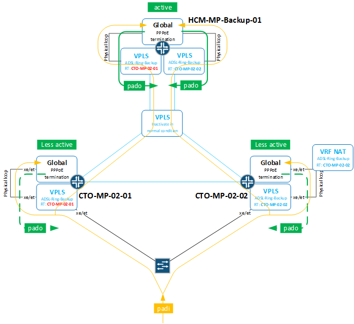

# HCM-MP-Backup VPLS up chậm, dial rate thấp

---

**Hiện tượng ghi nhận**

---

**Khách hàng mô tả**

- Khi mở backup về MP-Backup thì kênh VPLS up chậm
- Kênh sau khi up thì thuê bao kết nối với rate chậm

**Rà soát trên mạng**

- Theo thiết kế MP-Backup chỉ dùng trong tình huống ngắn hạn, để ứng cứu cho các tỉnh. Trong điều kiện bình thường thì kênh VPLS từ MP về MP-backup sẽ không up

- Anh em FTEL xác nhận là do sau ứng cứu chưa ngắt kênh

- Có 2 Box thực hiện chức năng MP-Backup, mỗi miền 1 thiết bị
- Cơ chế hoạt động được mô tả như hình bên dưới

- Health-check trên thiết bị HCM-MP-Backup-01 ghi nhận:

- DDoS violation liên quan protocol PADI, rate ~250-300 pps (config 250pps)
- Kiểm tra PADI từ các site có kết nối về MP-Backup ~ 50pps PADI

{master}

noc-net@HCM-MP-Backup-01> show ddos-protection protocols pppoe statistics brief

Packet types: 8, Received traffic: 4, Currently violated: 1

Protocol    Packet      Received        Dropped        Rate    Violation State

group      type        (packets)      (packets)      (pps)    counts

pppoe      aggregate  36342529308    23623567470    281      683      ok

pppoe      padi        34945520620    23621899139    262      14879    viol

pppoe      pado        0              0              0        0        ok

pppoe      padr        738759485      1472513        9        194      ok

pppoe      pads        0              0              0        0        ok

pppoe      padt        658249203      195818        6        2251      ok

pppoe      padm        0              0              0        0        ok

pppoe      padn        0              0              0        0        ok

{master}

noc-net@HCM-MP-Backup-01> show vpls connections up | match "Remote PE:"

Remote PE: 183.81.85.190, Negotiated control-word: No

Remote PE: 118.69.255.61, Negotiated control-word: No

Remote PE: 118.69.255.86, Negotiated control-word: No

Remote PE: 118.70.0.218, Negotiated control-word: No

Remote PE: 113.22.0.114, Negotiated control-word: No

Remote PE: 118.69.255.81, Negotiated control-word: No

Remote PE: 113.22.0.110, Negotiated control-word: No

Remote PE: 113.22.0.108, Negotiated control-word: No

Remote PE: 113.22.0.95, Negotiated control-word: No

Remote PE: 183.81.85.191, Negotiated control-word: No

Remote PE: 118.69.255.87, Negotiated control-word: No

Remote PE: 183.81.85.173, Negotiated control-word: No

Remote PE: 118.69.255.201, Negotiated control-word: No

Remote PE: 113.22.0.50, Negotiated control-word: No

Remote PE: 118.69.255.82, Negotiated control-word: No

Remote PE: 113.22.0.109, Negotiated control-word: No

Remote PE: 113.22.0.92, Negotiated control-word: No

Remote PE: 113.22.0.96, Negotiated control-word: No

- Có log Dead/Alive liên tục với 2 radius

Nov  9 19:57:58.249  HCM-MP-Backup-01 authd[28458]: AUTHD\_RADIUS\_SERVER\_STATUS\_CHANGE: Status of radius server 172.20.19.26 set to ALIVE (profile BRAS0)

Nov  9 21:01:11.290  HCM-MP-Backup-01 authd[28458]: AUTHD\_RADIUS\_SERVER\_STATUS\_CHANGE: Status of radius server 172.20.19.28 set to UNREACHABLE (profile BRAS0)

Nov  9 21:01:11.291  HCM-MP-Backup-01 authd[28458]: AUTHD\_RADIUS\_SERVER\_STATUS\_CHANGE: Status of radius server 172.20.19.25 set to UNREACHABLE (profile BRAS0)

Nov  9 21:01:11.291  HCM-MP-Backup-01 authd[28458]: AUTHD\_RADIUS\_SERVER\_STATUS\_CHANGE: Status of radius server 172.20.19.26 set to UNREACHABLE (profile BRAS0)

Nov  9 21:01:11.291  HCM-MP-Backup-01 authd[28458]: AUTHD\_RADIUS\_SERVER\_STATUS\_CHANGE: Status of radius server 172.20.19.27 set to UNREACHABLE (profile BRAS0)

Nov  9 21:01:41.292  HCM-MP-Backup-01 authd[28458]: AUTHD\_RADIUS\_SERVER\_STATUS\_CHANGE: Status of radius server 172.20.19.27 set to ALIVE (profile BRAS0)

Nov  9 21:01:41.292  HCM-MP-Backup-01 authd[28458]: AUTHD\_RADIUS\_SERVER\_STATUS\_CHANGE: Status of radius server 172.20.19.26 set to ALIVE (profile BRAS0)

Nov  9 21:01:41.292  HCM-MP-Backup-01 authd[28458]: AUTHD\_RADIUS\_SERVER\_STATUS\_CHANGE: Status of radius server 172.20.19.25 set to ALIVE (profile BRAS0)

Nov  9 21:01:41.292  HCM-MP-Backup-01 authd[28458]: AUTHD\_RADIUS\_SERVER\_STATUS\_CHANGE: Status of radius server 172.20.19.28 set to ALIVE (profile BRAS0)

Nov  9 21:02:52.248  HCM-MP-Backup-01 authd[28458]: AUTHD\_RADIUS\_SERVER\_STATUS\_CHANGE: Status of radius server 172.20.19.28 set to DEAD (profile BRAS0)

Nov  9 21:03:52.249  HCM-MP-Backup-01 authd[28458]: AUTHD\_RADIUS\_SERVER\_STATUS\_CHANGE: Status of radius server 172.20.19.28 set to ALIVE (profile BRAS0)

Nov  9 22:01:45.953  HCM-MP-Backup-01 authd[28458]: AUTHD\_RADIUS\_SERVER\_STATUS\_CHANGE: Status of radius server 172.20.19.26 set to DEAD (profile BRAS0)

Nov  9 22:02:45.954  HCM-MP-Backup-01 authd[28458]: AUTHD\_RADIUS\_SERVER\_STATUS\_CHANGE: Status of radius server 172.20.19.26 set to ALIVE (profile BRAS0)

- Có log lỗi memory với FPC4
- system-monitor fpc

noc-net@HCM-MP-Backup-01> show system resource-monitor fpc

FPC Resource Usage Summary

Free Heap Mem Watermark        : 20  %

Free NH Mem Watermark          : 20  %

Free Filter Mem Watermark      : 20  %

\* - Watermark reached

Heap              ENCAP mem      NH mem          FW mem

Slot #        % Free    PFE #        % Free      % Free          % Free

0            77        0            NA          81              99

1            NA          83              99

1            78        0            NA          83              99

1            NA          83              99

2            81        0            NA          82              99

3            88        0            NA          86              97

4            89        0            NA          86              98

5            87        0            NA          85              95

- Số lượng thuê bao hiện tại trên box

{master}

noc-net@HCM-MP-Backup-01> show subscribers summary port

Interface          Count

et-3/1/0            1227

et-5/1/0            2117

xe-0/0/1            34

xe-0/1/1            993

xe-0/2/1            218

xe-0/3/1            47

xe-1/0/1            244

xe-1/1/1            22

xe-1/2/1            334

xe-1/3/1            44

- Trạng thái với Radius

{master}

noc-net@HCM-MP-Backup-01> show network-access aaa statistics radius

Outstanding Requests

RADIUS Server    Profile              Configured  Current  Peak  Exceeded

118.69.241.7      Default                    1000        0      0          0

bras1                      1000        0      0          0

BRAS0                      1000        0      0          0

118.69.241.14    Default                    1000        0      0          0

bras1                      1000        0      0          0

BRAS0                      1000        0      0          0

210.245.31.143    Default                    1000        0      0          0

bras1                      1000        0      0          0

BRAS0                      1000        0      0          0

118.69.241.44    Default                    1000        0      0          0

bras1                      1000        0      0          0

BRAS0                      1000        0    24          0

118.69.241.42    Default                    1000        0      0          0

bras1                      1000        0      0          0

BRAS0                      1000        0    61          0

118.69.241.46    Default                    1000        0      0          0

bras1                      1000        0      0          0

BRAS0                      1000        0    24          0

118.69.241.48    Default                    1000        0      0          0

bras1                      1000        0      0          0

BRAS0                      1000        0    24          0

118.69.241.18    Default                    1000        0      0          0

bras1                      1000        0      0          0

BRAS0                      1000        0      0          0

172.20.17.14      Default                    1000        0      0          0

bras1                      1000        0      0          0

BRAS0                      1000        0      0          0

172.20.16.41      Default                    1000        0      0          0

bras1                      1000        0      0          0

BRAS0                      1000        0      0          0

172.20.17.40      Default                    1000        0      0          0

bras1                      1000        0      0          0

BRAS0                      1000        0      0          0

172.20.17.41      Default                    1000        0      0          0

bras1                      1000        0      0          0

BRAS0                      1000        0      0          0

172.20.16.42      Default                    1000        0      0          0

bras1                      1000        0      0          0

BRAS0                      1000        0      0          0

172.20.16.43      Default                    1000        0      0          0

bras1                      1000        0      0          0

BRAS0                      1000        0      0          0

172.20.19.21      Default                    1000        0      0          0

bras1                      1000        0      0          0

BRAS0                      1000        0    24          0

172.20.19.22      Default                    1000        0      0          0

bras1                      1000        0      0          0

BRAS0                      1000        0    24          0

172.20.19.23      Default                    1000        0      0          0

bras1                      1000        0      0          0

BRAS0                      1000        0    24          0

172.20.19.24      Default                    1000        0      0          0

bras1                      1000        0      0          0

BRAS0                      1000        0    25          0

172.20.19.25      Default                    1000        0      0          0

bras1                      1000        0      0          0

BRAS0                      1000        0  1000      2715

172.20.19.26      Default                    1000        0      0          0

bras1                      1000        0      0          0

BRAS0                      1000        0  1000      3331

172.20.19.27      Default                    1000        0      0          0

bras1                      1000        0      0          0

BRAS0                      1000        0  1000      2256

172.20.19.28      Default                    1000        0      0          0

bras1                      1000        0      0          0

BRAS0                      1000        0  1000      2516

- Thuê bao đang login fail do **deny-authentication-denied**

{master}

noc-net@HCM-MP-Backup-01> show network-access aaa terminate-code brief

Terminate-code:

RADIUS    Custom Usage-Count Type Code

17        no    79317772    aaa  deny-authentication-denied

10        no    7814        aaa  shutdown-remote-reset

5          no    4368        aaa  shutdown-session-timeout

1          no    166421      dhcp client-request

15        no    127070      dhcp nak

10        no    323561      dhcp nas-logout

4          no    445194      dhcp no-offers

10        no    2642        ppp  admin-logout

10        no    6          ppp  ip-no-peer-ip-address

10        no    2          ppp  ipv6-no-local-ipv6-interface-id

10        no    408242      ppp  lcp-keepalive-failure

10        no    2055        ppp  lcp-negotiation-timeout

1          no    2526571    ppp  lcp-peer-renegotiate-rx-conf-ack

1          no    206775      ppp  lcp-peer-renegotiate-rx-conf-req

1          no    88684      ppp  lcp-peer-terminate-term-req

2          no    10233      ppp  lower-interface-down

9          no    591        ppp  no-upper-interface

9          no    3          ppp  subscriber-mgr-activation-failed

{master}

noc-net@HCM-MP-Backup-01> show network-access aaa terminate-code brief

Terminate-code:

RADIUS    Custom Usage-Count Type Code

17        no    79317856    aaa  deny-authentication-denied

10        no    7814        aaa  shutdown-remote-reset

5          no    4368        aaa  shutdown-session-timeout

1          no    166421      dhcp client-request

15        no    127070      dhcp nak

10        no    323561      dhcp nas-logout

4          no    445194      dhcp no-offers

10        no    2642        ppp  admin-logout

10        no    6          ppp  ip-no-peer-ip-address

10        no    2          ppp  ipv6-no-local-ipv6-interface-id

10        no    408242      ppp  lcp-keepalive-failure

10        no    2055        ppp  lcp-negotiation-timeout

1          no    2526571    ppp  lcp-peer-renegotiate-rx-conf-ack

1          no    206775      ppp  lcp-peer-renegotiate-rx-conf-req

1          no    88684      ppp  lcp-peer-terminate-term-req

2          no    10233      ppp  lower-interface-down

9          no    591        ppp  no-upper-interface

9          no    3          ppp  subscriber-mgr-activation-failed

- s

Case studies

\* Ddos protection padi

\* Total padi, dhcpv6 solicit from subscribers send to BNG over default ddosprotection 500 pps

\* > show log messages | match ddos

\* > show ddos-protection protocols pppoe padi

\* > show ddos-protection protocols dhcpv6 violations

\* Subscribers dial pppoe slowly to BNG

\* by ddos and traceoption

\* > show ddos-protection statistics

\* # show | match traceoption | display set | display inheritance

\* Action:

\* Change configuration ddos protection about 1000 pps per protocols type

\* Deactive traceoption configuration on devices

\* Subscribers not stable on MPC5E

\* show subscribers physical-interface xe-1/0/0 vlan-id 3035 count

\* Action:

\* set chassis fpc 3 flexible-queuing-mode

- Bên anh vẫn khuyến nghị tắt tính năng RTT này, và bên anh xin phép correct lại câu lệnh để tắt tính năng này như sau

set system services resource-monitor no-load-throttle

- s

bbe-dfw-prio            246 Nov  8 23:22:57.877561 BBE\_DFW\_DYN\_PROF\_ERR\_CODE                                    session\_id=8976791743: Error code 59 (config err FALSE): The IFL does not have the required IFF.

bbe-dfw-prio            247 Nov  9 14:45:55.273732 BBE\_DFW\_DYN\_PROF\_ERR\_CODE                                    session\_id=8987383320: Error code 59 (config err FALSE): The IFL does not have the required IFF.

bbe-dfw-prio            248 Nov  9 17:12:54.574108 BBE\_DFW\_DYN\_PROF\_ERR\_CODE                                    session\_id=8989084520: Error code 59 (config err FALSE): The IFL does not have the required IFF.

bbe-dfw-prio            249 Nov  9 18:42:05.972787 BBE\_DFW\_DYN\_PROF\_ERR\_CODE                                    session\_id=8990111971: Error code 59 (config err FALSE): The IFL does not have the required IFF.

- s

{master}

noc-net@HCM-MP-Backup-01> show system processes extensive | except 0.0

241 processes: 6 running, 206 sleeping, 29 waiting

Mem: 1747M Active, 5161M Inact, 2126M Wired, 1521M Buf, 6859M Free

Swap: 8192M Total, 8192M Free

PID USERNAME    PRI NICE  SIZE    RES STATE  C  TIME    WCPU COMMAND

10 root        155 ki31    0K    64K RUN    0    ???  99.37% idle{idle: cpu0}

10 root        155 ki31    0K    64K RUN    1    ???  93.55% idle{idle: cpu1}

10 root        155 ki31    0K    64K CPU3    3    ???  92.58% idle{idle: cpu3}

10 root        155 ki31    0K    64K CPU2    2    ???  92.38% idle{idle: cpu2}

4479 root          24    0  445M 45888K nanslp  2 922.3H  6.69% chassisd{chassisd}

28459 root          23    0  1425M  852M select  2 165.9H  6.40% bbe-smgd{bbe-smgd}

4553 root          21    0  754M  299M select  1 204.0H  2.29% jdhcpd{jdhcpd}

28458 root          21    0  881M  435M select  1  54.3H  2.20% authd

11 root        -72    -    0K  480K CPU2    2 572.4H  1.76% intr{swi1: netisr 0}

4944 root          21    0  557M  180M select  2 492.0H  1.27% l2ald

27965 root          20    0  777M  333M select  3  28.5H  1.07% jpppd{jpppd}

28459 root          20    0  1425M  852M select  0 894:39  0.20% bbe-smgd{bbe-smgd}

- Health-check trên thiết bị HNI-MP-Backup-01 thì không ghi nhận tình trạng tương tự

{master}

noc-net@HNI-MP-Backup-01> show ddos-protection protocols pppoe statistics brief

Packet types: 8, Received traffic: 4, Currently violated: 0

Protocol    Packet      Received        Dropped        Rate    Violation State

group      type        (packets)      (packets)      (pps)    counts

pppoe      aggregate  9177232702      680477088      18      434      ok

pppoe      padi        8384140733      667773003      17      4428      ok

pppoe      pado        0              0              0        0        ok

pppoe      padr        140857951      825            0        2        ok

pppoe      pads        0              0              0        0        ok

pppoe      padt        478715717      12715826      0        1972      ok

pppoe      padm        0              0              0        0        ok

pppoe      padn        0              0              0        0        ok

{master}

noc-net@HNI-MP-Backup-01> show vpls connections up | match "Remote PE:"

Remote PE: 118.70.0.234, Negotiated control-word: No

Remote PE: 118.70.0.133, Negotiated control-word: No

Remote PE: 118.70.0.180, Negotiated control-word: No

Remote PE: 118.70.0.67, Negotiated control-word: No

Remote PE: 118.70.0.44, Negotiated control-word: No

Remote PE: 118.70.0.207, Negotiated control-word: No

Remote PE: 118.70.0.252, Negotiated control-word: No

Remote PE: 118.70.0.235, Negotiated control-word: No

Remote PE: 118.70.0.134, Negotiated control-word: No

Remote PE: 118.70.0.96, Negotiated control-word: No

Remote PE: 118.70.0.75, Negotiated control-word: No

Remote PE: 118.70.0.68, Negotiated control-word: No

Remote PE: 118.70.0.208, Negotiated control-word: No

Remote PE: 118.70.0.253, Negotiated control-word: No

Remote PE: 113.22.0.24, Negotiated control-word: No

---

**Phân tích**

---

**P**

- Em cập nhật kết quả health check thiết bị HCM-MP-Backup-01. Sơ bộ ghi nhận 2 vấn đề sau:
- 1. Trên thiết bị có nhiều log log lỗi liên quan FPC4, ngoài ra không ghi nhận thuê bao online trên cổng thuộc FPC4 >>> Đề nghị reseat lại FPC4 để khôi phục lại, nếu không thành công thì thay thế bằng vật tư dự phòng.
- 2. Với 2 VPLS instance phục vụ mô hình dự phòng BRAS tỉnh (ADSL-Backup-1/ADSL-Backup-2), hiện trạng đang dùng 11 cặp cổng loop vật lý để kết cuối VPLS từ MP tỉnh và trả lại lưu lượng để quay số PPPoE nên 1 PADI từ tỉnh gửi lên sẽ được nhân bản và gửi ra các cổng loop làm tăng lượng PADI nhận trên MP-Backup nhiều lần. Đây có thể là nguyên nhân việc thuê bao online lên chậm. Vấn đề này sẽ thực hiện test lại để đánh giá chính xác.
- ---> next actions:
- 1. Thực hiện test và tìm nguyên nhân thời gian up VPLS chậm giữa MP-Backup và MP ở tỉnh. Dự kiến test giữa MP chưa dịch vụ ở BDG và HCM-MP-Backup-01.
- 2. Thực hiện test trên BRAS-Backup:
- a. Mô hình tương tự MP-Backup để kiểm chứng lại vấn đề thuê bao online chậm có phải do đang loop vật lý nhiều cổng vào cùng VPLS.
- b. Test tính năng liên quan PWHT.

**P**

- 1. Thực hiện test và tìm nguyên nhân thời gian up VPLS chậm giữa MP-Backup và MP ở tỉnh. Dự kiến test giữa MP chưa dịch vụ ở BDG và HCM-MP-Backup-01.
- >>> Chỗ này em có rà soát và test trên lab thì hiện trạng MP đang nhận ~ 650K route L2vpn
- Table bgp.l2vpn.0 Bit: 40004
- RIB State: BGP restart is complete
- RIB State: VPN restart is complete
- Send state: in sync
- Active prefixes:              26
- Received prefixes:            26
- Accepted prefixes:            26
- Suppressed due to damping:    0
- Advertised prefixes:          654930
- Trên MP-Backup mặc định sẽ remove các route mà RT không được accept trong import policy, khi bật active term để up vpls thì MP-Backup sẽ gửi refesh về RR để update lại route
- >>> Thời gian up VPLS khi đổi policy test lab ghi nhận ~ 7s, chưa thực hiện test được trên mạng thực tế
- 2. Thực hiện test trên BRAS-Backup:
- a. Mô hình tương tự MP-Backup để kiểm chứng lại vấn đề thuê bao online chậm có phải do đang loop vật lý nhiều cổng vào cùng VPLS.
- >>> Chưa thực hiện
- b. Test tính năng liên quan PWHT.
- >>> hiện đã cấu hình PWHT trên VPLS để test

**z**

- 1. Thực hiện test up kênh VPLS trên mạng production ghi nhận ~7s - trùng với kết quả test trên lab
- 2. a.Test mô hình tương tự MP-Backup (với 13 cặp loop vật lý) ghi nhận:
- Bắn 100 sub:
- Lần 1-với 13 cặp loop vật lý: online 5 sub
- Lần 2-với 13 cặp loop vật lý: online 42 sub
- Lần 3-với 1 cặp loop vật lý: thì 100 sub onl ngay
- b. Test tính năng PWHT:
- Cấu hình trên BRAS-Backup, thuê bao chỉ online được với cấu hình ifl tĩnh
- Cấu hình tương tự trên LAB SVTECH ghi nhận thuê bao online với dynamic ifl vẫn OK
- -> Dự kiến reboot lại BRAS-Backup và test lại
- ---
- Kết luận đến thời điểm hiện tại:
- **1. Hiện kênh VPLS up chậm là do có nhiều route L2VPN từ RR adv xuống MP-Backup** mỗi lần BGP gửi update lại khi thay đổi policy để up VPLS - Hiện trạng ghi nhận ~ 7s mới up kênh VPLS sau khi commit change policy
- **2. CPS thấp là do trên MP-Backup đang dùng nhiều b2b dẫn đến số lượng PADI bị nhân bản lên nhiều lần** gây violation DDoS protection nên bị drop. CPS ghi nhận ~ 40 subs/giây

---

**Actions**

---

**Pzz**

- Mạng hiện hữu cung cấp cho nhiều dịch vụ
